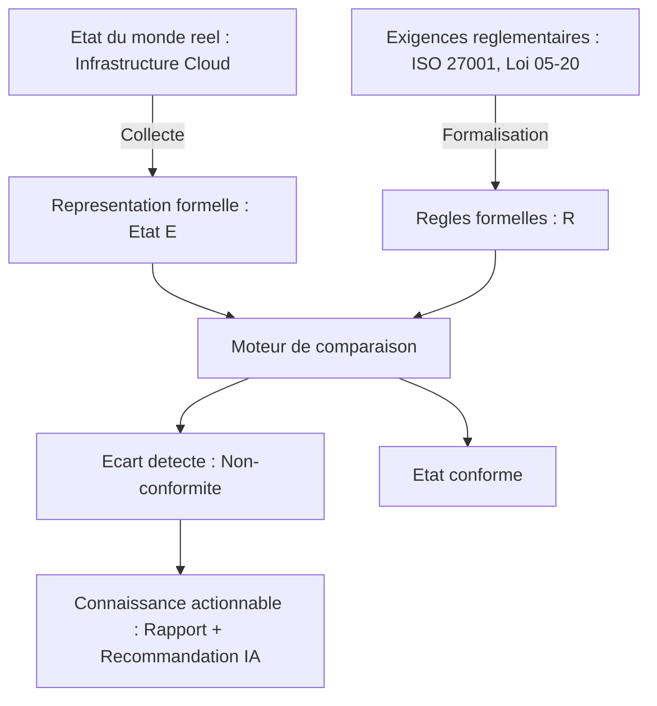

# PARTIE I — FONDATIONS DE L'INFORMATIQUE

# Chapitre 1 : Le Problème de la Conformité Cloud et les Fondations du Calcul

> *« On ne peut sécuriser, auditer ou automatiser que ce que l'on peut représenter formellement. »*

---

## 1. Objectifs pédagogiques

À la fin de ce chapitre, vous serez capable de :

- Expliquer pourquoi la conformité cloud est fondamentalement un **problème informatique de représentation d'état**, avant d'être un problème juridique.
- Définir précisément les notions de **donnée**, **état**, **algorithme**, **abstraction** et **modèle**, et les relier à l'architecture de ComplianceIQ.
- Justifier pourquoi une plateforme comme ComplianceIQ doit être pensée comme un **système de calcul sur un graphe d'état distribué**, et non comme un simple script de vérification.
- Distinguer les notions de **complexité algorithmique**, **déterminisme** et **idempotence**, indispensables pour comprendre plus tard le scan de conformité (Partie XX) et le moteur de règles (Partie XXI).
- Construire l'intuition mathématique qui sera réutilisée dans les chapitres sur les systèmes distribués (Partie V), le risk scoring (Partie XXII) et les embeddings (Partie XXVI).

---

## 2. Problème du monde réel

Imaginez une banque marocaine qui exploite 40 000 ressources cloud réparties entre AWS, Azure et GCP : machines virtuelles, buckets de stockage, bases de données, règles de pare-feu, rôles IAM. Un régulateur (Bank Al-Maghrib, ou un auditeur ISO/IEC 27001) demande : *« Prouvez-moi qu'aucun bucket de stockage contenant des données clients n'est accessible publiquement. »*

Cette question, en apparence simple, cache un problème informatique redoutable :

- L'état du système change en continu (des ressources sont créées, modifiées, supprimées à chaque seconde).
- L'état est **distribué** sur trois fournisseurs cloud, chacun avec son propre modèle de données, son propre vocabulaire, sa propre API.
- La preuve exigée doit être **reproductible**, **datée**, et **traçable** — pas une simple affirmation humaine.

Sans un système formel capable de **collecter**, **normaliser**, **interroger** et **raisonner** sur cet état, la conformité devient une activité manuelle, lente, sujette à l'erreur humaine, et impossible à auditer à l'échelle de l'entreprise. C'est exactement le problème que ComplianceIQ est conçu pour résoudre.

---

## 3. Évolution historique

| Période | Approche de la conformité | Limite majeure |
|---|---|---|
| 1970–1990 | Audits papier, revues manuelles annuelles | Aucune traçabilité continue, coût humain énorme |
| 1990–2005 | Scripts shell ad hoc, checklists Excel | Non reproductible, dépend de la mémoire de l'auditeur |
| 2005–2013 | Outils GRC (Governance, Risk & Compliance) sur site | Conçus pour des data centers statiques, pas pour le cloud élastique |
| 2013–2018 | Premiers scanners cloud natifs (AWS Config, 2014) | Mono-cloud, pas de raisonnement sémantique |
| 2018–2023 | Policy as Code (OPA, Sentinel) | Puissant mais nécessite une expertise en langage de règles |
| 2023–aujourd'hui | Compliance augmentée par l'IA (RAG, LLM) | C'est ici que se positionne ComplianceIQ |

Cette évolution illustre un principe fondamental que nous retrouverons dans tout le livre : **chaque génération d'outils a résolu la limite technique de la précédente, mais a introduit une nouvelle limite** — c'est le moteur de l'innovation en ingénierie.

---

## 4. Pourquoi les solutions précédentes ont échoué

1. **Les audits manuels** ne peuvent pas suivre le rythme de changement du cloud (des milliers de modifications d'infrastructure par jour).
2. **Les checklists statiques** ne capturent pas les relations entre ressources (ex. : un bucket privé mais accessible via un rôle IAM mal configuré reste un risque, invisible sur une checklist plate).
3. **Les outils mono-cloud** (AWS Config, Azure Policy, GCP Asset Inventory) ne permettent pas une vue consolidée pour une entreprise multi-cloud — ils créent des **silos de conformité**.
4. **Le Policy as Code pur** (Rego/OPA) est puissant mais illisible pour un responsable conformité non technique ; il ne répond pas à la question « pourquoi cette règle existe-t-elle dans ISO 27001 ? ».

> **Note d'architecture** : ComplianceIQ existe précisément à l'intersection de ces quatre échecs — il unifie le multi-cloud, capture les relations entre ressources, et ajoute une couche de langage naturel (RAG + Claude API) pour rendre le résultat compréhensible par un humain non technique.

---

## 5. Pourquoi cette « technologie » a été inventée

Avant de parler de Terraform, d'IAM ou de RAG, il faut comprendre que **toute l'informatique moderne repose sur une idée unique** : représenter un problème du monde réel par une **structure de données formelle**, puis appliquer des **algorithmes** dessus pour produire une réponse fiable et reproductible.

La conformité cloud n'échappe pas à cette règle. Elle nécessite :

- Une **représentation** de l'infrastructure (état).
- Une **représentation** des exigences réglementaires (règles).
- Un **algorithme de comparaison** entre les deux (le moteur de conformité).

Ce triptyque — **état, règles, comparaison** — est le fil rouge de tout le livre.

---

## 6. Concepts fondamentaux

### 6.1 Donnée vs Information vs Connaissance

| Niveau | Définition | Exemple ComplianceIQ |
|---|---|---|
| Donnée | Fait brut, sans contexte | `"public_access": true` |
| Information | Donnée contextualisée | « Le bucket `s3-clients-ma` est accessible publiquement » |
| Connaissance | Information reliée à une règle | « Ceci viole l'Article 23 de la Loi 05-20 sur la protection des données personnelles » |

ComplianceIQ transforme des **données** (issues des API cloud) en **connaissance actionnable** (issue du moteur de règles + RAG). C'est la définition même de sa proposition de valeur.

### 6.2 État (State)

Un **état** est une capture, à un instant *t*, de toutes les valeurs des variables d'un système. En cloud, l'état est la configuration exacte de chaque ressource (type d'instance, règles réseau, politiques IAM, chiffrement activé ou non).

> **Définition formelle** : Soit un système S composé de ressources `r1, r2, ..., rn`. L'état de S à l'instant t est la fonction `E(t) = {r1: config1(t), r2: config2(t), ..., rn: confign(t)}`.

### 6.3 Algorithme

Un algorithme est une **suite finie et non ambiguë d'instructions** permettant de résoudre un problème. En conformité, l'algorithme central est : *« Pour chaque ressource, pour chaque règle applicable, vérifier si la configuration satisfait la règle ; sinon, produire une non-conformité. »*

### 6.4 Abstraction

L'abstraction consiste à **masquer les détails non pertinents** pour raisonner à un niveau supérieur. C'est ce qui permet à ComplianceIQ de traiter un rôle IAM AWS, un rôle IAM Azure (Azure AD) et un rôle IAM GCP comme des instances d'un même concept abstrait : « identité avec permissions ».

---

## 7. Fondations scientifiques

La théorie derrière ComplianceIQ s'appuie sur plusieurs branches établies de l'informatique :

- **Théorie des ensembles** : une politique de conformité peut être vue comme un ensemble de contraintes que l'état du système doit satisfaire.
- **Logique propositionnelle et logique du premier ordre** : les règles de conformité (« SI chiffrement = faux ET donnée = sensible ALORS non-conforme ») sont des expressions logiques évaluables automatiquement — fondement du moteur de règles (Partie XXI).
- **Théorie des graphes** : l'infrastructure cloud est un **graphe** où les nœuds sont des ressources et les arêtes sont des relations (appartenance, permission, connectivité réseau). Cette représentation est cruciale pour Azure Resource Graph et AWS Config (Partie XX).
- **Théorie de la complexité algorithmique** : évaluer chaque règle sur chaque ressource a un coût. Sur 40 000 ressources et 500 règles, une évaluation naïve est en `O(n × m)`. Comprendre cette complexité justifie le choix d'architectures optimisées plus tard (indexation, mise en cache, évaluation incrémentale).

---

## 8. Architecture interne (vision conceptuelle)



Ce schéma est la **base conceptuelle** de toute l'architecture de ComplianceIQ qui sera détaillée progressivement dans les parties suivantes (collecte = Partie XX, règles = Parties XVIII-XXI, IA = Parties XXIII-XXIX).

---

## 9. Flux interne (workflow conceptuel)

1. Observation de l'état réel du cloud (donnée brute).
2. Normalisation dans un modèle canonique indépendant du fournisseur.
3. Application des règles formelles sur ce modèle.
4. Détection des écarts (deltas).
5. Enrichissement sémantique par IA (explication en langage naturel, priorisation par risque).
6. Restitution à l'utilisateur (dashboard, rapport, alerte).

---

## 10. Décomposition en composants

| Composant conceptuel | Rôle | Partie du livre associée |
|---|---|---|
| Collecteur d'état | Interroger les APIs cloud | Partie XX |
| Modèle canonique | Représentation unifiée multi-cloud | Partie VII |
| Moteur de règles | Comparer état et exigences | Partie XXI |
| Moteur de risque | Prioriser les non-conformités | Partie XXII |
| Copilote IA (RAG) | Expliquer et recommander | Parties XXV-XXIX |
| API et Backend | Exposer les résultats | Parties XXX-XXXI |
| Persistance | Stocker historique et preuves | Partie XXXII |

---

## 11. Flux de données

```
[APIs Cloud] --(JSON brut)--> [Normalisation] --(Modèle canonique)--> [Moteur de règles]
        --(Résultats structurés)--> [Base de données] --(requête)--> [RAG + LLM]
        --(texte enrichi)--> [API REST] --(HTTPS)--> [Dashboard utilisateur]
```

À chaque flèche correspond une **transformation de données**, et chaque transformation doit préserver l'intégrité et la traçabilité — un principe central en conformité (on doit toujours pouvoir remonter du résultat final à la donnée brute source).

---

## 12. Cycle de vie

Une conformité n'est jamais figée. Elle suit un cycle continu :

1. **Détection** (scan de l'état).
2. **Évaluation** (application des règles).
3. **Notification** (alerte aux parties prenantes).
4. **Remédiation** (correction, manuelle ou automatisée).
5. **Vérification** (re-scan pour confirmer la correction).
6. **Archivage** (preuve horodatée pour audit futur).

Ce cycle est identique, conceptuellement, au **cycle de contrôle** (control loop) que l'on retrouve en systèmes distribués (Partie V) et en Kubernetes (Partie XXXIV) — un parallèle que nous approfondirons plus tard.

---

## 13. Perspective architecture d'entreprise

Dans une grande organisation, la conformité n'est pas un outil isolé : elle s'intègre dans un **écosystème** comprenant la gouvernance des risques (GRC), le SOC (Security Operations Center), les équipes DevOps, et les organes de direction. ComplianceIQ doit donc être pensé comme un **système d'intégration**, capable de s'interfacer avec des SIEM, des ITSM (tickets), et des tableaux de bord de direction — un rôle qui sera détaillé en Partie XXXVII.

---

## 14. Perspective sécurité

Un système qui **lit** la configuration de toute l'infrastructure d'une entreprise est lui-même une cible de choix. Les identifiants utilisés par ComplianceIQ pour interroger AWS/Azure/GCP doivent suivre le principe du **moindre privilège** (accès en lecture seule), et les résultats (souvent sensibles : failles de sécurité identifiées) doivent être chiffrés au repos et en transit.

> **Note de sécurité** : un scanner de conformité compromis devient une carte au trésor pour un attaquant — il révèle exactement où se trouvent les faiblesses du système. La sécurité du scanner lui-même est donc un prérequis, pas une option.

---

## 15. Perspective performance

Scanner 40 000 ressources avec 500 règles de manière naïve est coûteux. Les notions de **complexité algorithmique** (section 7) justifient des optimisations comme l'évaluation incrémentale (ne réévaluer que ce qui a changé) et l'indexation des ressources par type.

---

## 16. Scalabilité

Un système conçu pour 100 ressources ne fonctionnera pas nécessairement pour 100 000. La scalabilité impose de penser dès la conception à des architectures **horizontalement extensibles** (traitement parallèle par lots), un thème repris en Partie V et Partie XXXIV (Kubernetes).

---

## 17. Haute disponibilité

Un audit de conformité pour un régulateur ne peut pas échouer parce que « le service était en panne ». La haute disponibilité (réplication, tolérance aux pannes) sera étudiée en détail dans la Partie V (Systèmes Distribués).

---

## 18. Bonnes pratiques

- Toujours séparer la **collecte** de l'**évaluation** (couplage faible).
- Toujours conserver un historique immuable des scans (preuve d'audit).
- Toujours documenter la provenance de chaque règle (traçabilité réglementaire).

---

## 19. Erreurs courantes

- Confondre **absence de donnée** avec **conformité** (ne pas trouver une ressource n'est pas une preuve qu'elle est conforme).
- Évaluer les règles sans tenir compte du **contexte** (une base de données de test n'a pas les mêmes exigences qu'une base de production).

---

## 20. Anti-patterns

- **Le script monolithique** : un unique script qui collecte, évalue et notifie sans séparation des responsabilités — impossible à maintenir à l'échelle de trois clouds.
- **La règle codée en dur** : une règle de conformité écrite directement dans le code applicatif plutôt que représentée comme une donnée configurable.

---

## 21. Alternatives

| Alternative | Description | Limite |
|---|---|---|
| Audit manuel | Revue humaine périodique | Non scalable |
| Outils natifs mono-cloud | AWS Config, Azure Policy | Pas de vue unifiée |
| GRC traditionnel (Archer, ServiceNow GRC) | Suite complète mais lourde | Peu adapté à l'élasticité cloud |
| ComplianceIQ | Multi-cloud, augmenté par IA | Nécessite une architecture plus complexe |

---

## 22. Tableau comparatif

| Critère | Audit manuel | Outils natifs | ComplianceIQ |
|---|---|---|---|
| Fréquence | Annuelle | Continue | Continue |
| Multi-cloud | Non | Non | Oui |
| Explication en langage naturel | Non | Non | Oui (RAG + Claude) |
| Coût humain | Très élevé | Faible | Faible |
| Traçabilité réglementaire (Loi 05-20, ISO 42001) | Faible | Moyenne | Élevée |

---

## 23. Implémentation AWS (fondations)

Sur AWS, la « donnée » d'état est exposée via des services comme **AWS Config** (historique de configuration) et l'API **Resource Groups Tagging**. Ces services seront étudiés en profondeur en Partie XX.

## 24. Implémentation Azure (fondations)

Sur Azure, l'équivalent conceptuel est **Azure Resource Graph**, qui permet d'interroger l'ensemble des ressources via un langage de requête (KQL). C'est la cible officielle du MVP de ComplianceIQ (Partie IX).

## 25. Implémentation Google Cloud (fondations)

Sur GCP, **Cloud Asset Inventory** joue ce rôle, en exposant un instantané et un historique des ressources.

---

## 26. Études de cas en entreprise

**Cas 1 — Institution financière multi-cloud** : une banque exploitant AWS pour son core banking et Azure pour ses outils collaboratifs a dû unifier sa vision de conformité pour répondre à un audit Bank Al-Maghrib unique — illustrant exactement le besoin auquel répond ComplianceIQ.

**Cas 2 — Scale-up e-commerce** : une entreprise en forte croissance a vu son nombre de ressources cloud multiplié par 10 en un an ; ses processus d'audit manuels sont devenus intenables, forçant l'adoption d'un scan automatisé continu.

---

## 27. Comment ComplianceIQ utilise ces concepts

ComplianceIQ applique directement chaque concept de ce chapitre :

- **État** → capturé par la couche de collecte (Terraform state + APIs cloud natives).
- **Règles formelles** → encodées dans le moteur Policy as Code (Partie XIX).
- **Graphe de ressources** → modélisé pour représenter les relations IAM, réseau, stockage.
- **Connaissance actionnable** → produite par le pipeline RAG + Claude API, qui traduit un écart technique en explication compréhensible et en recommandation priorisée.

---

## 28. Diagramme d'architecture (ASCII)

```
+------------------+     +------------------+     +------------------+
|   AWS / Azure /   | --> |  Modele Canonique | --> |  Moteur de Regles |
|   GCP (Etat brut)  |     |  (Etat unifie E)  |     |  (Regles R)        |
+------------------+     +------------------+     +------------------+
                                                          |
                                                          v
                                                 +------------------+
                                                 |  Ecarts detectes  |
                                                 +------------------+
                                                          |
                                                          v
                                                 +------------------+
                                                 |  RAG + Claude API |
                                                 |  (Explication IA) |
                                                 +------------------+
                                                          |
                                                          v
                                                 +------------------+
                                                 |  Dashboard / API  |
                                                 +------------------+
```

---

## 29. Résumé

Ce chapitre a posé les fondations conceptuelles indispensables avant d'aborder toute technologie spécifique : la conformité cloud est un problème de **représentation formelle de l'état**, de **formalisation des règles**, et de **comparaison algorithmique** entre les deux. ComplianceIQ est l'incarnation architecturale de ce triptyque, enrichie par l'intelligence artificielle pour rendre le résultat exploitable par des humains non techniques.

---

## 30. Vocabulaire clé

| Terme | Définition |
|---|---|
| État (State) | Capture des valeurs de configuration d'un système à un instant donné |
| Algorithme | Suite finie d'instructions résolvant un problème |
| Abstraction | Masquage des détails non pertinents pour raisonner à un niveau supérieur |
| Modèle canonique | Représentation unifiée indépendante du fournisseur cloud |
| Policy as Code | Représentation des règles de conformité sous forme de code exécutable |
| Idempotence | Propriété d'une opération produisant le même résultat peu importe le nombre de fois qu'elle est exécutée |

---

## 31. Questions de réflexion

1. Pourquoi la conformité manuelle échoue-t-elle structurellement à l'échelle du cloud élastique ?
2. En quoi la notion d'« abstraction » permet-elle de traiter AWS, Azure et GCP de manière unifiée ?
3. Quelle est la différence fondamentale entre une donnée, une information et une connaissance dans le contexte de ComplianceIQ ?

---

## 32. Questions d'entretien (jury / recruteur)

1. Comment définiriez-vous formellement l'état d'un système cloud ?
2. Pourquoi un scanner de conformité représente-t-il lui-même un risque de sécurité ?
3. Quelle est la complexité algorithmique d'une évaluation naïve de règles sur un parc de ressources, et comment l'optimiser ?

---

## 33. Références

- Lamport, L. — *Time, Clocks, and the Ordering of Events in a Distributed System*, 1978.
- Cormen, Leiserson, Rivest, Stein — *Introduction to Algorithms*, MIT Press.
- NIST SP 800-53 — *Security and Privacy Controls for Information Systems*.

## 34. Documentation officielle

- AWS Config : docs.aws.amazon.com/config
- Azure Resource Graph : learn.microsoft.com/azure/governance/resource-graph
- Google Cloud Asset Inventory : cloud.google.com/asset-inventory/docs

## 35. Lectures complémentaires

- Newman, S. — *Building Microservices*, O'Reilly.
- Kleppmann, M. — *Designing Data-Intensive Applications*, O'Reilly.

---

*Fin du Chapitre 1. En attente de votre validation avant de rédiger le Chapitre 2 (Partie I, suite — Structures de données et modèles de représentation appliqués à l'infrastructure cloud).*
