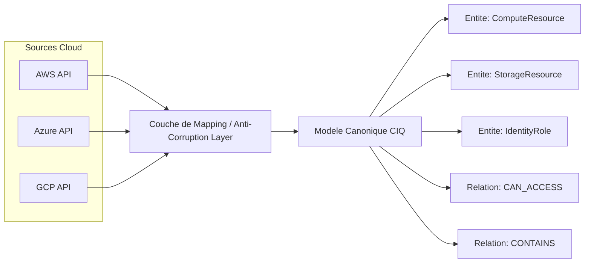

# PARTIE I — FONDATIONS DE L'INFORMATIQUE

# Chapitre 2 : Structures de Données et Modèles de Représentation de l'Infrastructure Cloud

> *« Une structure de données mal choisie transforme un problème simple en cauchemar de performance ; un modèle mal choisi transforme une plateforme multi-cloud en trois plateformes mono-cloud déguisées. »*

---

## 1. Objectifs pédagogiques

À la fin de ce chapitre, vous serez capable de :

- Choisir et justifier une structure de données pour représenter une ressource cloud, une relation entre ressources, ou une politique de sécurité.
- Expliquer pourquoi un **graphe** est la structure de données naturelle pour modéliser une infrastructure cloud, alors qu'une **liste plate** ou un **tableau** ne suffisent pas.
- Définir précisément les notions de **modèle de données**, **schéma**, **modèle canonique**, et **modèle du domaine** (domain model).
- Comprendre les compromis entre **normalisation** et **dénormalisation** des données, appliqués au stockage des résultats de scan dans ComplianceIQ.
- Relier ces structures aux futurs chapitres sur PostgreSQL (Partie XXXII), les graphes de ressources cloud (Partie XX) et les embeddings vectoriels (Partie XXVI).

---

## 2. Problème du monde réel

Reprenons l'exemple de la banque marocaine du Chapitre 1. Elle possède :

- 12 000 instances de calcul (EC2, VM Azure, Compute Engine).
- 8 000 rôles et politiques IAM.
- 5 000 règles réseau (Security Groups, NSG, Firewall Rules).
- 3 000 buckets et disques de stockage.

La question n'est plus seulement « comment représenter une ressource individuelle ? » mais **« comment représenter les relations entre elles ? »**. Un bucket de stockage privé (isolé) devient un risque majeur s'il est accessible par un rôle IAM mal restreint, lui-même assumable par une instance de calcul exposée sur Internet. **Le risque n'existe pas dans les ressources individuelles — il existe dans leurs relations.** Aucune structure de données « plate » (liste, tableau, dictionnaire simple) ne peut capturer cela efficacement. Il faut une structure capable de représenter des **entités et leurs relations** : un **graphe**.

---

## 3. Évolution historique

| Période | Structure dominante | Contexte |
|---|---|---|
| 1960–1970 | Fichiers séquentiels plats | Mainframes, traitement par lots |
| 1970–1990 | Modèle relationnel (Codd, 1970) | Bases de données transactionnelles |
| 1990–2000 | Modèle objet | Programmation orientée objet, ORM |
| 2000–2010 | Modèle document (NoSQL, JSON) | Web à grande échelle, données semi-structurées |
| 2010–aujourd'hui | Modèle graphe | Réseaux sociaux, infrastructures cloud, détection de fraude |
| 2020–aujourd'hui | Modèle vectoriel (embeddings) | IA générative, recherche sémantique |

Chaque modèle n'a pas « remplacé » le précédent — ComplianceIQ, comme la plupart des systèmes modernes, **combine plusieurs modèles simultanément** : relationnel (PostgreSQL) pour les données transactionnelles, graphe (conceptuel, via requêtes Resource Graph) pour les relations d'infrastructure, et vectoriel (ChromaDB/pgvector) pour la recherche sémantique documentaire.

---

## 4. Pourquoi les solutions précédentes ont échoué

1. **Le modèle relationnel pur** impose un schéma rigide (tables et colonnes fixes). Or, chaque fournisseur cloud (AWS, Azure, GCP) expose des attributs différents pour des ressources conceptuellement similaires — un schéma relationnel strict nécessiterait une table différente par type de ressource par fournisseur, soit potentiellement des centaines de tables.
2. **Le modèle document seul** (JSON brut stocké tel quel) est flexible mais rend les requêtes relationnelles (« quelles ressources sont accessibles par ce rôle ? ») lentes et complexes, car les relations ne sont pas premières classes.
3. **L'absence de modèle canonique** oblige à écrire une logique de règles différente pour chaque fournisseur cloud, ce qui viole le principe DRY (*Don't Repeat Yourself*) et rend le moteur de règles impossible à maintenir à trois fournisseurs.

---

## 5. Pourquoi cette approche a été inventée

La nécessité d'un **modèle canonique multi-cloud** vient d'un principe fondamental de l'ingénierie logicielle : **séparer la représentation du domaine de la représentation des fournisseurs externes**. C'est l'application directe du patron **Anti-Corruption Layer** (Evans, *Domain-Driven Design*, 2003) : ComplianceIQ ne doit jamais laisser le vocabulaire propre à AWS (« Security Group ») ou à Azure (« Network Security Group ») contaminer son moteur de règles interne. À la place, un concept unique — par exemple `NetworkAccessControl` — représente les deux, avec un mapping de traduction à la frontière du système.

---

## 6. Concepts fondamentaux

### 6.1 Structure de données vs Modèle de données

- Une **structure de données** est une organisation logique pour stocker et manipuler des données en mémoire ou sur disque (tableau, liste chaînée, arbre, graphe, table de hachage).
- Un **modèle de données** est une abstraction de plus haut niveau qui définit **quels types d'entités existent**, **quels attributs elles possèdent**, et **quelles relations les lient** — indépendamment de la structure de données utilisée pour les implémenter.

### 6.2 Graphe

> **Définition formelle** : un graphe `G = (V, E)` est composé d'un ensemble de sommets (*vertices*) `V` et d'un ensemble d'arêtes (*edges*) `E ⊆ V × V`. Une arête peut être **dirigée** (relation asymétrique, ex. : « le rôle R peut accéder à la ressource S ») ou **non dirigée**.

Dans ComplianceIQ, `V` = ressources cloud (instances, buckets, rôles), `E` = relations (« assume », « autorise », « contient », « communique avec »).

### 6.3 Modèle canonique (Canonical Data Model)

Un modèle canonique est une représentation **unique et normalisée** utilisée en interne, vers laquelle chaque source externe (AWS, Azure, GCP) est traduite à l'entrée du système, et depuis laquelle chaque sortie (rapport, dashboard) est produite.

### 6.4 Schéma

Un schéma définit la **forme attendue** des données : types, contraintes, relations obligatoires. Un schéma peut être **strict** (relationnel) ou **souple** (schema-on-read, typique du NoSQL).

---

## 7. Fondations scientifiques

- **Théorie des graphes** (Euler, 1736 — problème des sept ponts de Königsberg) : fondement mathématique de toute représentation de relations.
- **Algèbre relationnelle** (Codd, 1970) : fondement mathématique des bases de données relationnelles et du langage SQL, utilisé par PostgreSQL (Partie XXXII).
- **Théorie des types** : justifie pourquoi un modèle canonique fortement typé réduit les erreurs de mapping entre fournisseurs cloud.
- **Complexité des algorithmes de graphes** : parcourir un graphe de `n` sommets et `m` arêtes coûte `O(n + m)` pour un parcours simple (BFS/DFS), mais certaines requêtes de conformité (« trouver tous les chemins d'accès possibles vers une ressource sensible ») relèvent de problèmes bien plus coûteux (recherche de chemins, potentiellement exponentielle sans optimisation).

---

## 8. Architecture interne (modèle canonique de ComplianceIQ)



---

## 9. Flux interne

1. Réception d'un objet JSON brut spécifique au fournisseur (ex. : description d'une instance EC2).
2. Application d'un **mapper** qui traduit les champs spécifiques vers le modèle canonique (`instance_type` AWS → `compute_size` canonique).
3. Insertion de l'entité canonique dans le graphe de ressources (nœuds + relations).
4. Le moteur de règles n'interagit **jamais** directement avec le format brut — uniquement avec le modèle canonique.

---

## 10. Décomposition en composants

| Composant | Rôle |
|---|---|
| Extracteurs par fournisseur | Interrogent les API natives (AWS SDK, Azure SDK, GCP SDK) |
| Mappers (Anti-Corruption Layer) | Traduisent le format brut vers le modèle canonique |
| Modèle canonique | Définit les entités et relations universelles |
| Graphe de ressources | Structure en mémoire ou en base représentant l'état global |
| Sérialiseur | Convertit le modèle canonique en JSON pour l'API REST |

---

## 11. Flux de données

```
[JSON brut AWS]   --mapper AWS-->   +----------------------+
[JSON brut Azure] --mapper Azure--> | Modele Canonique CIQ | --> [Graphe de ressources]
[JSON brut GCP]   --mapper GCP-->   +----------------------+
```

---

## 12. Cycle de vie

1. **Ingestion** du format brut.
2. **Traduction** vers le modèle canonique.
3. **Intégration** dans le graphe global (ajout de nœuds/arêtes, mise à jour, suppression).
4. **Consultation** par le moteur de règles et l'API.
5. **Archivage versionné** pour permettre une comparaison temporelle (« qu'est-ce qui a changé depuis hier ? »).

---

## 13. Perspective architecture d'entreprise

Le choix d'un modèle canonique est une décision architecturale majeure et coûteuse à changer *a posteriori* — c'est un **investissement structurant**. Les grandes entreprises multi-cloud consacrent souvent des mois à définir ce modèle avant même d'écrire du code métier, car toute erreur de conception se propage à l'ensemble du système (règles, dashboard, API).

---

## 14. Perspective sécurité

Un modèle canonique mal conçu peut **masquer** un risque de sécurité réel s'il simplifie excessivement les différences entre fournisseurs. Par exemple, si le modèle canonique traite « accès public » comme un simple booléen, il pourrait ignorer une nuance importante d'Azure (accès conditionnel via Azure AD Conditional Access) qui existe différemment sur AWS. La conception du modèle doit donc être guidée par des experts sécurité de chaque plateforme, pas uniquement par des architectes logiciels.

---

## 15. Perspective performance

Un graphe de ressources représentant des dizaines de milliers de nœuds doit être interrogé efficacement. Charger l'intégralité du graphe en mémoire pour chaque requête est coûteux — d'où l'intérêt des **index** (structures de données auxiliaires accélérant la recherche, étudiées formellement en Partie XXXII avec PostgreSQL).

---

## 16. Scalabilité

Le modèle canonique doit être conçu pour supporter l'ajout d'un **quatrième fournisseur cloud** (ex. : OCI, mentionné dans une version antérieure du cahier des charges) sans réécrire le moteur de règles — c'est le test ultime de la qualité d'une abstraction.

---

## 17. Haute disponibilité

La représentation du graphe de ressources doit pouvoir être répliquée et reconstruite à partir des sources brutes en cas de panne — le graphe est une **vue dérivée**, jamais la source de vérité (qui reste l'état réel du cloud).

---

## 18. Bonnes pratiques

- Toujours versionner le modèle canonique (schema versioning) pour permettre son évolution sans casser les règles existantes.
- Toujours documenter le mapping entre chaque attribut natif et son équivalent canonique.
- Préférer des relations explicites (`CAN_ACCESS`, `CONTAINS`) à des champs implicites cachés dans des identifiants.

---

## 19. Erreurs courantes

- Coder en dur le format spécifique d'un fournisseur cloud dans le moteur de règles (violation du modèle canonique).
- Oublier de modéliser une relation critique (ex. : ne pas capturer la relation entre un rôle IAM et les ressources qu'il peut assumer).

---

## 20. Anti-patterns

- **Le modèle « fourre-tout »** : stocker toutes les données brutes de tous les fournisseurs dans un unique champ JSON non typé, en reportant toute la complexité de traduction au moment de la lecture — ceci annule tout l'intérêt d'un modèle canonique.

---

## 21. Alternatives

| Alternative | Description | Limite |
|---|---|---|
| Pas de modèle canonique (règles dupliquées par fournisseur) | Simplicité initiale | Explosion de la dette technique dès le 2ème fournisseur |
| Modèle relationnel strict | Fort typage, requêtes SQL puissantes | Rigide face à l'hétérogénéité cloud |
| Modèle document pur (JSON) | Flexible | Relations peu naturelles à interroger |
| Modèle graphe canonique (choix de ComplianceIQ) | Relations natives, extensible | Complexité de conception initiale plus élevée |

---

## 22. Tableau comparatif

| Critère | Relationnel strict | Document (NoSQL) | Graphe canonique |
|---|---|---|---|
| Flexibilité multi-fournisseur | Faible | Élevée | Élevée |
| Requêtes de relations complexes | Moyenne | Faible | Élevée |
| Facilité de raisonnement pour le moteur de règles | Moyenne | Faible | Élevée |
| Maturité des outils (PostgreSQL) | Très élevée | Élevée | Moyenne (dépend de l'implémentation) |

---

## 23. Implémentation AWS

Les ressources AWS exposent leurs relations principalement via **IAM policy documents** (JSON) et **AWS Config relationships**, qui listent explicitement les ressources liées à une ressource donnée (ex. : une instance EC2 liée à son Security Group).

## 24. Implémentation Azure

**Azure Resource Graph** expose nativement un modèle proche du graphe, interrogeable en KQL, incluant les relations de type « appartenance à un groupe de ressources » ou « attribution de rôle ».

## 25. Implémentation Google Cloud

**Cloud Asset Inventory** expose les relations via des « IAM policies » attachées à chaque ressource, et le **Cloud Asset Relationship** pour certaines ressources.

---

## 26. Études de cas en entreprise

**Cas 1** : une entreprise ayant conçu son scanner de conformité sans modèle canonique a dû, lors de l'ajout d'un deuxième fournisseur cloud, réécrire entièrement son moteur de règles — un coût estimé à plusieurs mois-ingénieur, entièrement évitable avec une architecture canonique dès le départ.

**Cas 2** : une équipe de sécurité utilisant un graphe de relations a pu détecter un chemin d'attaque caché (rôle IAM trop permissif → instance exposée → bucket sensible) qu'aucune checklist plate n'aurait révélé.

---

## 27. Comment ComplianceIQ utilise ces concepts

ComplianceIQ implémente une couche de mapping (Anti-Corruption Layer) pour chaque fournisseur, alimentant un **modèle canonique unique** stocké de façon relationnelle dans PostgreSQL (pour la persistance et les requêtes transactionnelles) tout en exposant une vue en graphe pour l'analyse des relations d'accès — combinant ainsi les forces du modèle relationnel et du modèle graphe, comme évoqué en section 3.

---

## 28. Diagramme d'architecture (ASCII)

```
AWS SDK  --+
           |
Azure SDK--+--> [ Mappers / Anti-Corruption Layer ] --> [ Modele Canonique ]
           |                                                    |
GCP SDK  --+                                                    v
                                                    +--------------------------+
                                                    | PostgreSQL (persistance) |
                                                    | + Vue Graphe (relations) |
                                                    +--------------------------+
```

---

## 29. Résumé

Ce chapitre a établi pourquoi une infrastructure cloud multi-fournisseur doit être représentée par un **modèle canonique** appuyé sur une structure de **graphe**, capable de capturer non seulement les ressources mais surtout leurs **relations**, sources réelles du risque de conformité. Ce choix architectural conditionne toute la suite du livre.

---

## 30. Vocabulaire clé

| Terme | Définition |
|---|---|
| Graphe | Structure `(V, E)` représentant sommets et relations |
| Modèle canonique | Représentation interne unique, indépendante des fournisseurs |
| Anti-Corruption Layer | Couche traduisant les formats externes vers le modèle interne |
| Schéma | Définition formelle de la forme attendue des données |
| Normalisation | Élimination de la redondance dans un modèle de données |

---

## 31. Questions de réflexion

1. Pourquoi une checklist plate est-elle insuffisante pour représenter le risque cloud ?
2. En quoi l'Anti-Corruption Layer protège-t-elle le moteur de règles des changements d'API des fournisseurs cloud ?
3. Quel est le compromis entre stockage relationnel et stockage en graphe pour ComplianceIQ ?

---

## 32. Questions d'entretien

1. Comment concevriez-vous un modèle canonique multi-cloud pour représenter des ressources IAM ?
2. Pourquoi la relation est-elle plus importante que l'entité elle-même dans l'analyse de risque cloud ?
3. Quelle structure de données choisiriez-vous pour détecter un chemin d'accès non conforme entre un rôle et une ressource sensible, et pourquoi ?

---

## 33. Références

- Codd, E. F. — *A Relational Model of Data for Large Shared Data Banks*, 1970.
- Evans, E. — *Domain-Driven Design*, Addison-Wesley, 2003.
- Cormen, Leiserson, Rivest, Stein — *Introduction to Algorithms* (chapitres sur les graphes).

## 34. Documentation officielle

- AWS Config Relationships : docs.aws.amazon.com/config
- Azure Resource Graph Query Language : learn.microsoft.com/azure/governance/resource-graph/concepts/query-language
- Google Cloud Asset Inventory : cloud.google.com/asset-inventory/docs

## 35. Lectures complémentaires

- Robinson, Webber, Eifrem — *Graph Databases*, O'Reilly.
- Kleppmann, M. — *Designing Data-Intensive Applications*, chapitre 2 (Data Models and Query Languages).

---

*Fin du Chapitre 2. En attente de votre validation avant de rédiger le Chapitre 3 (Partie I, suite — Algorithmique et complexité appliquées à l'évaluation de conformité).*
