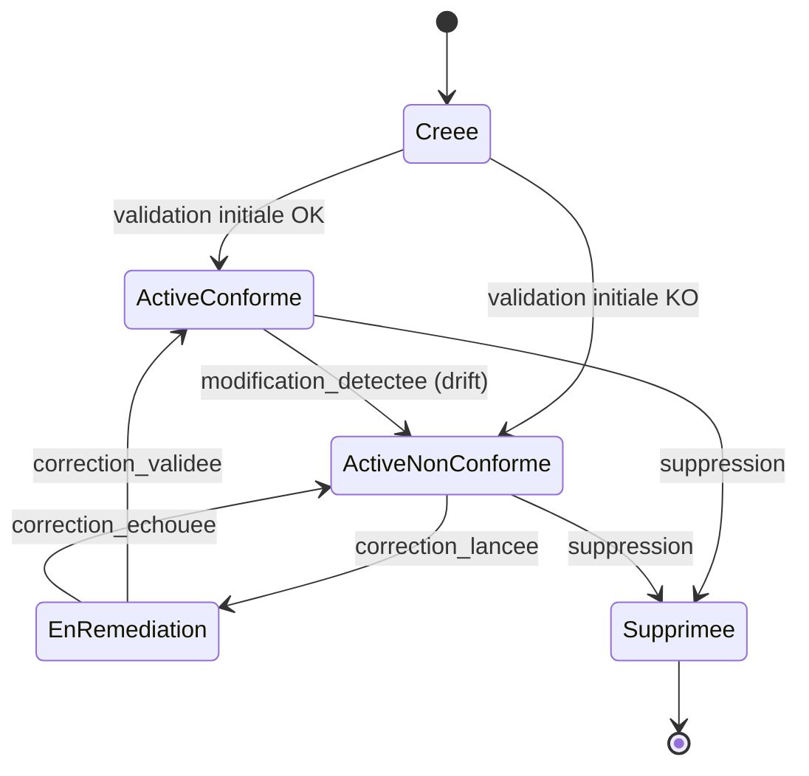

# PARTIE I — FONDATIONS DE L'INFORMATIQUE

# Chapitre 4 : Machines à États, Boucles de Contrôle et Théorie de l'État Appliquées à l'Infrastructure Cloud

> *« Terraform, Kubernetes et ComplianceIQ résolvent, sous trois habillages différents, exactement le même problème mathématique : faire converger un état réel vers un état désiré. »*

---

## 1. Objectifs pédagogiques

À la fin de ce chapitre, vous serez capable de :

- Définir formellement une **machine à états finis** (Finite State Machine, FSM) et l'appliquer à la modélisation du cycle de vie d'une ressource cloud.
- Expliquer la distinction fondamentale entre **état désiré** (*desired state*) et **état réel** (*actual state*), et pourquoi cette distinction est le cœur conceptuel de Terraform (Partie XII), Kubernetes (Partie XXXIV), et ComplianceIQ lui-même.
- Comprendre le fonctionnement théorique d'une **boucle de contrôle** (control loop) et son lien avec la théorie des systèmes asservis (control theory).
- Justifier pourquoi la conformité peut être reformulée comme un problème de **convergence d'état** plutôt que comme une simple vérification ponctuelle.
- Distinguer les notions de **transition d'état**, **état transitoire**, **état stable** et **état divergent**, indispensables pour comprendre les écarts de conformité persistants versus temporaires.
- Relier ces notions aux chapitres à venir sur l'Infrastructure as Code (Partie XI), Terraform (Partie XII) et Kubernetes (Partie XXXIV), qui sont tous des implémentations concrètes de la théorie exposée ici.

---

## 2. Problème du monde réel

Considérons une ressource cloud simple : un bucket de stockage. Son cycle de vie n'est pas binaire (« existe » / « n'existe pas ») — il traverse de multiples états : **création en cours**, **actif et conforme**, **actif mais non conforme** (par exemple, chiffrement désactivé par erreur humaine), **en cours de remédiation**, **supprimé**. Une plateforme de conformité qui ne modélise pas explicitement ces états risque de commettre des erreurs graves : par exemple, signaler comme « non conforme définitivement » une ressource en réalité en cours de création (état transitoire normal), générant une alerte inutile (faux positif) qui érode la confiance des équipes dans l'outil — un problème appelé **fatigue d'alerte** (*alert fatigue*), bien documenté en cybersécurité opérationnelle.

Le problème du monde réel est donc double : (1) comment représenter formellement les états possibles d'une ressource et les transitions valides entre eux, et (2) comment garantir que le système global **converge** vers un état conforme malgré des perturbations constantes (changements manuels, pannes, dérive de configuration).

---

## 3. Évolution historique

| Période | Approche | Limite |
|---|---|---|
| 1960s-1970s | Théorie des automates (Moore, Mealy) pour circuits et compilateurs | Pensée pour des systèmes fermés et déterministes, pas pour des systèmes distribués ouverts |
| 1970s-1980s | Théorie des systèmes asservis (control theory) en automatisation industrielle | Conçue pour des grandeurs physiques continues (température, vitesse), pas pour des configurations discrètes |
| 2000s | Scripts de provisioning impératifs (« faire ceci puis cela ») | Aucune notion d'état désiré, aucune idempotence garantie |
| 2010s | Infrastructure as Code déclarative (Terraform, 2014 ; Kubernetes, 2014) | Introduit formellement le modèle « état désiré vs état réel » en infrastructure |
| 2020s | Compliance as Code et GitOps | Étend ce modèle à la conformité continue — c'est le territoire de ComplianceIQ |

L'histoire montre un glissement progressif d'une pensée **impérative** (« exécute ces étapes ») vers une pensée **déclarative** (« voici l'état que je veux, débrouille-toi pour y arriver et y rester »). ComplianceIQ s'inscrit dans ce même glissement : au lieu de dire « vérifie ces dix points un par un », on déclare « voici l'état conforme attendu », et le système est responsable de détecter et signaler toute divergence.

---

## 4. Pourquoi les solutions précédentes ont échoué

1. **Les scripts impératifs** ne garantissent pas l'**idempotence** (Chapitre 3, section 6.2) : exécuter deux fois le même script de provisioning peut produire des ressources dupliquées ou des erreurs, car ils décrivent des actions, pas un état cible.
2. **La théorie des automates classique** (Moore/Mealy) suppose un nombre fini et connu à l'avance d'états et de transitions, alors qu'une infrastructure cloud réelle possède un espace d'états quasi-infini (combinaisons de milliers d'attributs de configuration) — une modélisation FSM naïve et exhaustive est donc impraticable telle quelle.
3. **Les vérifications ponctuelles sans notion de convergence** (un simple script qui teste l'état à l'instant t) ne peuvent pas distinguer un écart **transitoire** (normal, en cours de résolution) d'un écart **persistant** (véritable non-conformité), provoquant soit des faux positifs, soit — pire — des faux négatifs si l'écart n'est vérifié qu'une seule fois avant de se reproduire.

---

## 5. Pourquoi cette approche a été inventée

Le modèle **état désiré / état réel / boucle de contrôle** a été formalisé en ingénierie logicielle moderne pour répondre précisément à cette difficulté : au lieu de modéliser exhaustivement chaque état possible (impraticable), on modélise une **fonction de comparaison** entre deux représentations de haut niveau (l'état désiré, exprimé déclarativement, et l'état réel, observé) et une **fonction de réconciliation** qui tente de réduire l'écart entre les deux. Ce modèle, popularisé par Kubernetes sous le nom de **reconciliation loop**, trouve ses racines directes dans la **théorie des systèmes asservis** (control theory), où un régulateur (par exemple un thermostat) compare en continu une valeur mesurée à une valeur de consigne, et agit pour réduire l'écart.

> **Note d'architecture** : ComplianceIQ n'est pas un simple vérificateur ponctuel — il doit être pensé comme un **système asservi** dont la « consigne » est l'ensemble des règles de conformité, la « mesure » est l'état réel du cloud, et « l'écart » est la non-conformité elle-même. Cette reformulation change profondément la manière de concevoir son architecture (Partie XXXVII).

---

## 6. Concepts fondamentaux

### 6.1 Machine à états finis (FSM)

> **Définition formelle** : une machine à états finis est un quintuplet `(Q, Σ, δ, q₀, F)` où `Q` est un ensemble fini d'états, `Σ` est un ensemble fini de symboles d'entrée (l'alphabet), `δ : Q × Σ → Q` est la fonction de transition, `q₀ ∈ Q` est l'état initial, et `F ⊆ Q` est l'ensemble des états acceptants (finaux).

Appliqué à une ressource cloud simplifiée : `Q = {Créée, Active-Conforme, Active-NonConforme, EnRemédiation, Supprimée}`, `Σ` = les événements possibles (`modification_détectée`, `correction_appliquée`, `suppression_demandée`), et `δ` définit par exemple que l'événement `modification_détectée` transforme l'état `Active-Conforme` en `Active-NonConforme`.

### 6.2 État désiré vs État réel

- **État désiré (Desired State)** : la configuration cible, exprimée de manière déclarative (« ce bucket doit avoir le chiffrement activé et aucun accès public »).
- **État réel (Actual State)** : la configuration effectivement observée sur le fournisseur cloud à un instant donné.
- **Écart (Drift)** : la différence entre l'état désiré et l'état réel — c'est précisément ce que ComplianceIQ doit détecter et exposer.

### 6.3 Boucle de contrôle (Control Loop)

Une boucle de contrôle est un cycle perpétuel comportant quatre phases : **Observer** (mesurer l'état réel), **Comparer** (calculer l'écart avec l'état désiré), **Décider** (déterminer l'action corrective, si applicable), **Agir** (appliquer l'action ou, dans le cas de ComplianceIQ, notifier l'écart plutôt que le corriger automatiquement — une distinction importante détaillée en section 14).

### 6.4 État transitoire vs État stable vs État divergent

- Un **état transitoire** est un état temporaire normal dans le cycle de vie (ex. : « en cours de création »).
- Un **état stable** est un état qui persiste tant qu'aucun événement externe ne survient (ex. : « actif et conforme »).
- Un **état divergent** est une situation où le système ne parvient jamais à atteindre l'état désiré malgré des tentatives répétées de réconciliation (ex. : une règle de conformité mal configurée qui entre en conflit avec une contrainte technique, empêchant toute convergence) — un signal d'alerte architecturale important.

---

## 7. Fondations scientifiques

- **Théorie des automates** (Moore, 1956 ; Mealy, 1955) : fondement mathématique des machines à états, largement enseignée en théorie des langages formels et en conception de compilateurs.
- **Théorie des systèmes asservis** (control theory, Norbert Wiener, *Cybernetics*, 1948) : fondement conceptuel de la notion de rétroaction (feedback) et de convergence vers une consigne, transposée du monde physique (mécanique, électronique) au monde logiciel.
- **Théorie de la stabilité** (Lyapunov, 1892, redécouverte en informatique moderne) : permet de raisonner formellement sur la question « ce système de réconciliation va-t-il converger, et en combien d'itérations ? » — pertinent pour ComplianceIQ lorsqu'il s'agit de garantir qu'un cycle de remédiation ne boucle pas indéfiniment sans jamais atteindre la conformité.
- **Algèbre des processus (CSP, π-calcul)** : cadre plus avancé permettant de modéliser formellement des systèmes avec un très grand nombre d'états concurrents, pertinent lorsque l'espace d'états d'une infrastructure cloud réelle dépasse ce qu'une FSM exhaustive peut représenter.

### 7.1 Formalisation de la boucle de contrôle de ComplianceIQ

Soit `D` l'état désiré (l'ensemble des règles de conformité applicables) et `R(t)` l'état réel à l'instant `t`. On définit une fonction d'écart `Δ(t) = Compare(D, R(t))`, qui retourne l'ensemble des non-conformités détectées. La boucle de contrôle de ComplianceIQ peut alors s'écrire formellement :

```
tant que systeme actif:
    R(t) ← Observer(infrastructure_cloud)
    Δ(t) ← Compare(D, R(t))
    si Δ(t) non vide:
        Notifier(Δ(t))
        # Note : contrairement a Terraform/Kubernetes, ComplianceIQ
        # ne modifie generalement PAS R(t) automatiquement (voir section 14)
    attendre(intervalle_ou_evenement)
```

Cette formalisation rend explicite une différence architecturale majeure entre ComplianceIQ et des outils comme Terraform ou Kubernetes : **ComplianceIQ observe et notifie, il ne réconcilie pas automatiquement** (sauf configuration explicite de remédiation automatisée, un choix qui a d'importantes implications de sécurité, voir section 14). C'est un choix de conception fondamental à assumer et à justifier en soutenance.

---

## 8. Architecture interne (boucle de contrôle de ComplianceIQ)



---

## 9. Flux interne

1. **Observation** : capture périodique ou événementielle de l'état réel (voir Chapitre 3 pour l'aspect algorithmique de cette observation incrémentale).
2. **Comparaison** : application de la fonction `Compare(D, R(t))` définie en section 7.1, produisant l'écart Δ(t).
3. **Classification de l'écart** : déterminer si l'écart correspond à un état transitoire normal (ex. : ressource en cours de création) ou à une véritable non-conformité stable.
4. **Notification** : transmission de l'écart classifié au moteur de risque (Partie XXII) et au pipeline d'explication IA (Parties XXV-XXIX).
5. **Suivi de la transition** : enregistrement de la transition d'état de la ressource concernée (ex. : `ActiveConforme → ActiveNonConforme`) pour permettre une traçabilité temporelle complète.

---

## 10. Décomposition en composants

| Composant | Rôle | Concept théorique associé |
|---|---|---|
| Observateur d'état | Capture l'état réel `R(t)` | Observation dans la boucle de contrôle |
| Comparateur | Calcule `Δ(t) = Compare(D, R(t))` | Fonction d'écart |
| Classificateur de transitoire | Distingue écart normal vs non-conformité stable | Théorie des états transitoires |
| Registre de transitions | Historise les changements d'état par ressource | Machine à états appliquée |
| Détecteur de divergence | Alerte si une ressource ne converge jamais vers un état conforme | Théorie de la stabilité (Lyapunov) |

---

## 11. Flux de données

```
[Infrastructure Cloud] --Observer--> [Etat reel R(t)]
                                            |
[Regles de conformite D] --------> [Comparateur : Delta(t) = Compare(D, R(t))]
                                            |
                                            v
                             [Classificateur transitoire / stable]
                                            |
                          +-----------------+-----------------+
                          v                                   v
              [Transition normale, ignoree]        [Non-conformite persistante]
                                                            |
                                                            v
                                            [Registre de transitions + Notification]
```

---

## 12. Cycle de vie

Le cycle de vie d'une ressource, du point de vue de ComplianceIQ, suit exactement la machine à états illustrée en section 8 : **Créée → Active-Conforme ↔ Active-NonConforme → EnRemédiation → Active-Conforme (ou retour à NonConforme si la correction échoue) → Supprimée**. Ce cycle n'est pas linéaire : les boucles (`ActiveConforme ↔ ActiveNonConforme`) sont normales et attendues — une ressource peut légitimement transiter plusieurs fois entre ces deux états au cours de sa vie, et c'est précisément la **fréquence et la durée** de ces transitions que le moteur de risque (Partie XXII) doit prendre en compte pour distinguer un incident ponctuel corrigé rapidement d'une non-conformité chronique.

---

## 13. Perspective architecture d'entreprise

Le modèle état désiré/état réel permet une intégration naturelle avec les pratiques **GitOps**, de plus en plus adoptées en entreprise : l'état désiré (les règles de conformité) peut être versionné dans un dépôt Git, avec un historique complet des modifications (qui a changé quelle règle, quand, pourquoi), offrant une traçabilité gouvernementale essentielle pour répondre aux exigences d'audit de la Loi 05-20/DNSSI et d'ISO/IEC 27001.

---

## 14. Perspective sécurité

Une question architecturale majeure se pose : **ComplianceIQ doit-il corriger automatiquement les écarts détectés (remédiation automatique), ou seulement les signaler ?** Cette décision a des implications de sécurité profondes :

- La **remédiation automatique** réduit la fenêtre d'exposition au risque, mais introduit elle-même un risque : un bug dans la logique de remédiation, ou une règle mal configurée, pourrait modifier automatiquement une ressource de production de manière destructive.
- La **notification seule** (l'approche par défaut recommandée pour ComplianceIQ, en particulier en phase de MVP) est plus sûre mais laisse la fenêtre de risque ouverte jusqu'à l'intervention humaine.

> **Note de sécurité** : la plupart des plateformes de conformité d'entreprise matures adoptent une approche hybride — notification systématique, avec remédiation automatique **optionnelle et explicitement approuvée** pour un sous-ensemble restreint de règles à faible risque d'effet de bord (ex. : activer un chiffrement par défaut), jamais pour des règles à fort impact potentiel (ex. : modification de règles réseau pouvant couper un service en production).

---

## 15. Perspective performance

La classification d'un écart comme « transitoire » nécessite généralement une **fenêtre d'observation** (attendre un court délai avant de considérer un écart comme stable), introduisant un compromis entre **réactivité** (détecter vite) et **précision** (éviter les faux positifs liés aux états transitoires normaux). Ce compromis doit être paramétrable par type de ressource et par criticité de la règle.

---

## 16. Scalabilité

Le registre de transitions (section 10) doit être conçu pour supporter un volume élevé d'événements de transition sans dégrader la performance de la boucle de contrôle principale — typiquement en découplant l'enregistrement historique (souvent asynchrone, via une file de messages) de la boucle de comparaison elle-même, un patron d'architecture repris en détail en Partie XXXV (CI/CD) et Partie XXXVI (Observabilité).

---

## 17. Haute disponibilité

Une boucle de contrôle doit être **résiliente aux pannes partielles** : si l'observateur d'état échoue temporairement pour un sous-ensemble de ressources, le système doit continuer à fonctionner sur les ressources observables, et rattraper les ressources manquées au cycle suivant — un principe directement hérité de la théorie des systèmes asservis tolérants aux perturbations.

---

## 18. Bonnes pratiques

- Toujours définir explicitement les transitions d'état valides et invalides pour chaque type de ressource — ne jamais laisser le système inférer implicitement des transitions non spécifiées.
- Toujours distinguer, dans les journaux et les rapports, un écart transitoire d'une non-conformité confirmée, afin d'éviter la fatigue d'alerte (section 2).
- Toujours documenter explicitement si une règle donnée autorise ou non la remédiation automatique.

---

## 19. Erreurs courantes

- Traiter tout écart détecté comme une non-conformité immédiate sans fenêtre d'observation, générant des faux positifs sur des ressources en cours de création légitime.
- Oublier de modéliser l'état « EnRemédiation », menant à des notifications redondantes pendant qu'une correction est déjà en cours.

---

## 20. Anti-patterns

- **La FSM implicite** : coder la logique de transition d'état directement dans des conditions `if/else` dispersées dans le code, sans modèle explicite — rendant le système impossible à auditer, à tester exhaustivement, ou à faire évoluer sans régression.
- **La remédiation automatique aveugle** : appliquer une correction automatique à toute règle sans distinction de criticité, au mépris des risques évoqués en section 14.

---

## 21. Alternatives

| Alternative | Description | Limite |
|---|---|---|
| Vérification ponctuelle sans état | Simple test à l'instant t | Ne distingue pas transitoire et persistant, pas de traçabilité de transition |
| FSM explicite avec fenêtre d'observation (choix de ComplianceIQ) | Modélisation rigoureuse des transitions | Complexité de conception plus élevée |
| Réconciliation automatique complète (à la Kubernetes) | Corrige immédiatement tout écart | Risque de destruction accidentelle en production (section 14) |

---

## 22. Tableau comparatif

| Critère | Vérification ponctuelle | FSM avec fenêtre d'observation | Réconciliation automatique complète |
|---|---|---|---|
| Distingue transitoire vs persistant | Non | Oui | Partiellement |
| Traçabilité des transitions | Faible | Élevée | Élevée |
| Risque d'action destructive | Nul (pas d'action) | Nul par défaut (notification) | Élevé si mal configuré |
| Adapté à un MVP de conformité (ComplianceIQ) | Non | Oui | Non (trop risqué en phase initiale) |

---

## 23. Implémentation AWS

AWS ne fournit pas nativement une machine à états générique pour ses ressources, mais expose des événements de cycle de vie via **AWS Config** (`ConfigurationItemStatus` : `OK`, `ResourceDiscovered`, `ResourceDeleted`), sur lesquels ComplianceIQ peut construire sa propre couche de modélisation d'états.

## 24. Implémentation Azure

Azure expose des concepts proches via **Azure Resource Manager (ARM) provisioning states** (`Creating`, `Succeeded`, `Failed`, `Deleting`), directement exploitables comme base de la machine à états de ComplianceIQ pour son MVP Azure.

## 25. Implémentation Google Cloud

GCP expose des statuts similaires via les champs `state` retournés par la plupart des APIs de ressources (ex. : `RUNNING`, `TERMINATED` pour Compute Engine), ainsi que des notifications de changement via Cloud Asset Inventory Feed.

---

## 26. Études de cas en entreprise

**Cas 1 — Fatigue d'alerte** : une équipe sécurité recevait des centaines d'alertes quotidiennes sur des ressources temporairement non conformes pendant leur création (état transitoire normal), au point d'ignorer systématiquement les alertes — jusqu'à manquer une véritable non-conformité critique noyée dans le bruit. L'introduction d'une fenêtre d'observation et d'une classification transitoire/stable a réduit le volume d'alertes de plus de 70%.

**Cas 2 — Remédiation automatique destructrice** : une entreprise ayant activé une remédiation automatique sur une règle de « fermeture des ports ouverts » a vu un service de production coupé par erreur, la règle ayant mal identifié un port légitimement ouvert pour un usage métier spécifique — illustrant concrètement le risque décrit en section 14 et justifiant l'approche prudente adoptée par défaut dans ComplianceIQ.

---

## 27. Comment ComplianceIQ utilise ces concepts

ComplianceIQ modélise explicitement chaque type de ressource cloud comme une machine à états (section 8), avec une fenêtre d'observation paramétrable pour distinguer les écarts transitoires des non-conformités confirmées. Sa boucle de contrôle (section 7.1) suit le modèle Observer-Comparer-Décider-Notifier, avec une politique par défaut de **notification sans remédiation automatique**, la remédiation automatique restant une fonctionnalité optionnelle et strictement encadrée, réservée aux règles à faible risque d'effet de bord — un choix architectural directement motivé par l'analyse de sécurité de la section 14.

---

## 28. Diagramme d'architecture (ASCII)

```
                     +-------------------------------+
                     |   Etat desire D (regles CIQ)   |
                     +-------------------------------+
                                    |
                                    v
+---------------------+   +-------------------+   +---------------------+
|  Etat reel R(t)       |-->|  Comparateur        |-->|  Delta(t) classifie  |
|  (observation cloud)  |   |  Compare(D, R(t))   |   |  transitoire/stable  |
+---------------------+   +-------------------+   +---------------------+
                                                            |
                                    +-----------------------+-----------------------+
                                    v                                               v
                        [Ignore : etat transitoire]                  [Notification + Registre de transition]
                                                                                       |
                                                                                       v
                                                                        [Remediation optionnelle, encadree]
```

---

## 29. Résumé

Ce chapitre a établi que la conformité cloud ne doit pas être pensée comme une simple série de vérifications ponctuelles, mais comme un **système asservi** cherchant à faire converger un état réel vers un état désiré, modélisé formellement par une **machine à états** et piloté par une **boucle de contrôle**. Cette reformulation théorique justifie des choix architecturaux concrets dans ComplianceIQ : classification transitoire/stable, registre de transitions, et une politique de remédiation prudente et encadrée plutôt qu'une réconciliation automatique aveugle.

---

## 30. Vocabulaire clé

| Terme | Définition |
|---|---|
| Machine à états finis (FSM) | Modèle formel `(Q, Σ, δ, q₀, F)` représentant états et transitions |
| État désiré (Desired State) | Configuration cible exprimée de manière déclarative |
| État réel (Actual State) | Configuration effectivement observée |
| Drift (dérive de configuration) | Écart entre état désiré et état réel |
| Boucle de contrôle (Control Loop) | Cycle Observer-Comparer-Décider-Agir visant la convergence |
| État transitoire | État temporaire normal dans un cycle de vie |
| État divergent | Situation où le système ne converge jamais vers l'état désiré |
| Fatigue d'alerte | Désensibilisation aux alertes causée par un excès de faux positifs |

---

## 31. Questions de réflexion

1. Pourquoi une simple vérification ponctuelle de conformité est-elle insuffisante face à des ressources traversant des états transitoires légitimes ?
2. En quoi la boucle de contrôle de ComplianceIQ diffère-t-elle fondamentalement de celle de Kubernetes, malgré une structure théorique identique ?
3. Quels critères utiliseriez-vous pour décider si une règle de conformité peut bénéficier d'une remédiation automatique ?

---

## 32. Questions d'entretien

1. Comment modéliseriez-vous, sous forme de machine à états finis, le cycle de vie d'un rôle IAM du point de vue de la conformité ?
2. Pourquoi ComplianceIQ ne procède-t-il pas, par défaut, à une remédiation automatique des non-conformités détectées ?
3. Expliquez la différence entre un état transitoire et un état divergent, et comment votre système distinguerait-il les deux en pratique ?

---

## 33. Références

- Wiener, N. — *Cybernetics: Or Control and Communication in the Animal and the Machine*, MIT Press, 1948.
- Moore, E. F. — *Gedanken-Experiments on Sequential Machines*, 1956.
- Mealy, G. H. — *A Method for Synthesizing Sequential Circuits*, 1955.
- Hightower, Burns, Beda — *Kubernetes: Up and Running* (chapitre sur la reconciliation loop), O'Reilly.

---

*Fin du Chapitre 4, et fin de la Partie I — Fondations de l'Informatique. En attente de votre validation avant de rédiger le Chapitre 5, ouvrant la Partie II — Fondamentaux des Réseaux.*
