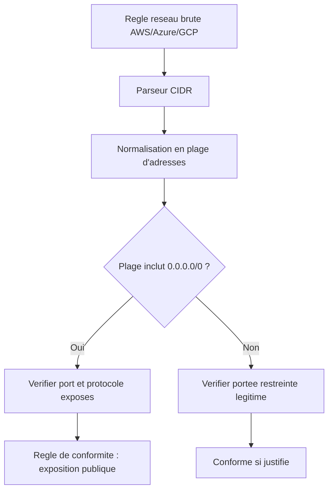

# PARTIE II — FONDAMENTAUX DES RÉSEAUX

# Chapitre 5 : Modèles OSI/TCP-IP et Adressage Appliqués à l'Infrastructure Cloud

> *« On ne peut auditer la sécurité réseau d'un cloud qu'en comprenant précisément à quelle couche chaque contrôle s'applique — confondre une règle de couche 3 avec une règle de couche 7 est l'une des erreurs d'audit les plus fréquentes. »*

---

## 1. Objectifs pédagogiques

À la fin de ce chapitre, vous serez capable de :

- Expliquer le modèle **OSI** à 7 couches et le modèle **TCP/IP** à 4 couches, et situer précisément où s'appliquent les contrôles de sécurité cloud (Security Groups, NSG, Firewall Rules, WAF).
- Comprendre les mécanismes fondamentaux d'**adressage IP**, de **sous-réseaux (CIDR)**, et de **routage**, indispensables pour auditer une configuration VPC/VNet/VPC GCP.
- Distinguer les concepts de **réseau public** et **réseau privé** dans le cloud, et comprendre pourquoi cette distinction est centrale dans la quasi-totalité des référentiels de conformité (ISO 27001 A.13, DNSSI).
- Analyser comment une mauvaise segmentation réseau constitue l'une des non-conformités les plus fréquentes et les plus critiques détectées par ComplianceIQ.
- Préparer la compréhension du Chapitre 6 (sécurité réseau approfondie : pare-feu, segmentation, zero trust).

---

## 2. Problème du monde réel

Un audit de conformité ISO/IEC 27001 (contrôle A.13.1 — gestion de la sécurité des réseaux) exige de prouver que les flux réseau entre systèmes sont **maîtrisés et documentés**. Dans un environnement cloud, cela se traduit concrètement par des questions très précises : *quelles adresses IP peuvent atteindre cette base de données ? Sur quel port ? Depuis quel réseau ?* Répondre correctement exige de comprendre **à quelle couche du modèle réseau** chaque règle de sécurité s'applique — un Security Group AWS filtre au niveau **couches 3-4** (adresse IP, port, protocole), tandis qu'un WAF (Web Application Firewall) opère au niveau **couche 7** (contenu applicatif HTTP). Un ingénieur qui confond ces niveaux peut croire à tort qu'une ressource est protégée contre une attaque applicative alors que seule sa couche réseau est filtrée.

---

## 3. Évolution historique

| Période | Étape | Contexte |
|---|---|---|
| 1969 | ARPANET, premiers réseaux à commutation de paquets | Origine d'Internet |
| 1974 | Publication du protocole TCP/IP (Cerf & Kahn) | Standardisation de l'interconnexion de réseaux hétérogènes |
| 1984 | Modèle de référence OSI (ISO) | Cadre théorique à 7 couches, jamais totalement implémenté tel quel |
| 1990s | Généralisation de TCP/IP comme standard de fait | OSI reste un modèle pédagogique, TCP/IP domine en pratique |
| 2006+ | Virtualisation réseau (VPC AWS, 2009 ; VNet Azure, 2014 ; VPC GCP) | Le réseau devient logiciel (Software-Defined Networking) |

Le modèle OSI n'a jamais été adopté tel quel en production — c'est **TCP/IP** qui s'est imposé — mais OSI reste indispensable comme **cadre conceptuel pédagogique** pour raisonner précisément sur « à quel niveau » se situe un problème ou un contrôle de sécurité.

---

## 4. Pourquoi les solutions précédentes ont échoué

Les réseaux propriétaires pré-Internet (SNA d'IBM, DECnet) échouaient à interconnecter des systèmes hétérogènes car chaque fournisseur imposait son propre protocole fermé. TCP/IP a réussi précisément parce qu'il proposait une **abstraction en couches indépendantes**, permettant à n'importe quel matériel de couche physique de transporter n'importe quel protocole de couche supérieure — un principe d'abstraction identique à celui étudié au Chapitre 2 pour le modèle canonique de ComplianceIQ.

---

## 5. Pourquoi cette approche a été inventée

Le principe de **séparation en couches** répond à la même logique architecturale que l'Anti-Corruption Layer du Chapitre 2 : chaque couche ne connaît que l'interface de la couche adjacente, jamais son implémentation interne. Cela permet de faire évoluer indépendamment le câblage physique (couche 1), les commutateurs (couche 2), le routage (couche 3) et les applications (couche 7) sans tout redévelopper à chaque changement technologique.

---

## 6. Concepts fondamentaux

### 6.1 Le modèle OSI (7 couches)

| Couche | Nom | Rôle | Exemple cloud |
|---|---|---|---|
| 7 | Application | Protocoles applicatifs | HTTP, HTTPS, DNS |
| 6 | Présentation | Formatage, chiffrement | TLS/SSL |
| 5 | Session | Gestion de sessions | Sessions TCP longues, tokens |
| 4 | Transport | Livraison fiable (TCP) ou rapide (UDP) | Ports 443, 22, 3306 |
| 3 | Réseau | Adressage et routage | Adresses IP, tables de routage VPC |
| 2 | Liaison de données | Adressage physique local | Adresses MAC, VLAN |
| 1 | Physique | Support physique de transmission | Câblage, fibre (abstrait dans le cloud public) |

### 6.2 Le modèle TCP/IP (4 couches, modèle réellement implémenté)

| Couche TCP/IP | Correspondance OSI | Exemple |
|---|---|---|
| Application | Couches 5-7 | HTTP, DNS, SSH |
| Transport | Couche 4 | TCP, UDP |
| Internet | Couche 3 | IP, routage |
| Accès réseau | Couches 1-2 | Ethernet virtuel, VLAN cloud |

### 6.3 Adressage IP et CIDR

Une adresse IPv4 est composée de 32 bits, représentée en notation décimale pointée (ex. : `10.0.1.5`). La notation **CIDR** (`10.0.0.0/16`) indique combien de bits sont réservés au préfixe réseau — ici 16 bits, laissant 16 bits (65 536 adresses) pour les hôtes du sous-réseau. Cette notation est **omniprésente** dans la configuration de VPC AWS, VNet Azure et VPC GCP, et donc dans les règles de conformité que ComplianceIQ doit évaluer (ex. : « aucune règle réseau ne doit autoriser `0.0.0.0/0` en entrée sur le port 22 »).

### 6.4 Réseau public vs réseau privé

Une ressource est en **réseau public** si elle possède une adresse IP routable sur Internet et si les règles de pare-feu associées autorisent un trafic entrant depuis Internet. Une ressource en **réseau privé** n'est accessible que depuis un réseau interne (VPC/VNet) ou via des mécanismes contrôlés (VPN, Bastion, Private Link/Private Endpoint).

---

## 7. Fondations scientifiques

- **Théorie de la commutation de paquets** (Kleinrock, Baran, Davies — années 1960) : fondement mathématique de la transmission de données découpées en paquets indépendants, base de tout réseau IP moderne.
- **Files d'attente et théorie des files** (queueing theory) : modélise mathématiquement la latence et la congestion dans un réseau, pertinent pour comprendre les limites de performance des règles de pare-feu à fort volume.
- **Notation binaire et arithmétique des masques de sous-réseau** : le calcul CIDR repose sur des opérations bit à bit (ET logique entre l'adresse IP et le masque de sous-réseau) pour déterminer l'appartenance à un réseau — une compétence directement mobilisée pour auditer la portée exacte d'une règle réseau cloud.

### 7.1 Calcul formel d'un sous-réseau CIDR

Pour déterminer si une adresse IP `A` appartient à un sous-réseau `N/p` (préfixe de `p` bits), on calcule : `A ET Masque(p) = N ET Masque(p)`, où `Masque(p)` est un nombre de 32 bits ayant les `p` premiers bits à 1. Par exemple, pour vérifier si `10.0.5.20` appartient à `10.0.0.0/16` : les 16 premiers bits de `10.0.5.20` correspondent à `10.0`, identiques aux 16 premiers bits de `10.0.0.0` — l'adresse appartient donc bien au sous-réseau. Ce calcul, trivial pour un humain sur un exemple simple, doit être **automatisé et vérifié programmatiquement** par ComplianceIQ pour auditer des milliers de règles CIDR à travers trois fournisseurs cloud.

---

## 8. Architecture interne (modélisation réseau dans ComplianceIQ)



---

## 9. Flux interne

1. Extraction des règles réseau brutes (Security Groups AWS, NSG Azure, Firewall Rules GCP).
2. Parsing et normalisation des notations CIDR spécifiques à chaque fournisseur vers un modèle canonique commun (rappel du Chapitre 2).
2bis. Résolution des plages d'adresses effectives (une règle peut référencer un groupe de sécurité plutôt qu'un CIDR direct — nécessitant une résolution transitive).
3. Application des règles de conformité réseau (ex. : interdiction de `0.0.0.0/0` sur les ports d'administration comme 22/3389).
4. Remontée des écarts au moteur de risque.

---

## 10. Décomposition en composants

| Composant | Rôle |
|---|---|
| Parseur CIDR multi-fournisseur | Normalise les notations réseau spécifiques |
| Résolveur de références transitives | Résout les règles référençant d'autres groupes de sécurité |
| Évaluateur d'exposition publique | Détecte les plages ouvertes sur Internet |
| Mappeur couche OSI | Associe chaque règle à sa couche réseau pertinente pour un rapport pédagogique clair |

---

## 11. Flux de données

```
[Security Group AWS]  --+
[NSG Azure]            --+--> [Parseur CIDR] --> [Modele canonique reseau] --> [Moteur de regles]
[Firewall Rule GCP]    --+
```

---

## 12. Cycle de vie

Une règle réseau suit un cycle : **création** → **évaluation initiale** → **surveillance continue des modifications** (Chapitre 3 : delta, Chapitre 4 : machine à états) → **détection d'une exposition non conforme** → **remédiation ou justification documentée** (exception d'audit) → **suppression ou modification**.

---

## 13. Perspective architecture d'entreprise

Les grandes entreprises documentent leurs flux réseau autorisés dans une **matrice de flux** (network flow matrix), exigée par de nombreux référentiels de sécurité. ComplianceIQ peut générer automatiquement cette matrice à partir de l'état réel observé, offrant un gain de temps considérable par rapport à une documentation manuelle, souvent obsolète dès sa publication.

---

## 14. Perspective sécurité

> **Note de sécurité** : la règle de conformité la plus universellement critique en audit cloud est l'absence d'exposition de ports d'administration (SSH/22, RDP/3389) à `0.0.0.0/0`. C'est historiquement l'une des causes principales de compromission cloud à grande échelle (attaques automatisées de type scan-and-exploit sur Internet). Toute plateforme de conformité doit traiter cette règle avec la plus haute priorité de risque.

---

## 15. Perspective performance

L'évaluation de règles réseau à grande échelle nécessite une résolution efficace des références transitives entre groupes de sécurité (un groupe peut référencer un autre groupe, qui en référence un autre) — un problème de **fermeture transitive** dans un graphe, dont la complexité rejoint directement les concepts de parcours de graphe étudiés au Chapitre 3.

---

## 16. Scalabilité

Un plan d'adressage cloud (VPC peering, transit gateways) peut relier des centaines de VPC/VNet. ComplianceIQ doit être capable de modéliser cette topologie à grande échelle sans dégrader ses performances d'évaluation.

---

## 17. Haute disponibilité

L'évaluation des règles réseau ne doit jamais dépendre d'un accès direct et bloquant aux APIs cloud en période de forte charge — un cache local des règles réseau, rafraîchi de manière incrémentale, garantit la continuité de l'évaluation même en cas de latence API élevée.

---

## 18. Bonnes pratiques

- Toujours résoudre les références transitives avant d'évaluer l'exposition réelle d'une ressource.
- Toujours documenter, pour chaque exposition publique légitime, sa justification métier (exception documentée plutôt que non-conformité silencieuse).
- Toujours différencier explicitement, dans les rapports, les couches réseau concernées (3-4 vs 7) pour éviter toute confusion d'audit.

---

## 19. Erreurs courantes

- Évaluer une règle CIDR sans résoudre les références indirectes vers d'autres groupes de sécurité, sous-estimant l'exposition réelle.
- Confondre l'absence de règle explicite d'autorisation avec un blocage effectif (certains fournisseurs ont des comportements par défaut différents : AWS bloque par défaut en entrée, GCP autorise certains flux internes par défaut).

---

## 20. Anti-patterns

- **L'audit CIDR textuel naïf** : comparer les chaînes de caractères des règles CIDR sans effectuer le calcul binaire réel, menant à des faux négatifs (ex. : ne pas détecter que `10.0.0.0/8` inclut `10.5.0.0/16`).

---

## 21. Alternatives

| Alternative | Description | Limite |
|---|---|---|
| Audit manuel des matrices de flux | Documentation humaine | Rapidement obsolète, sujette à l'erreur |
| Outils natifs (VPC Flow Logs analysés séparément) | Bonne granularité de trafic réel | Ne remplace pas l'analyse de configuration déclarative |
| Modélisation CIDR automatisée multi-cloud (choix de ComplianceIQ) | Cohérence et exhaustivité | Nécessite une résolution transitive robuste |

---

## 22. Tableau comparatif

| Critère | Audit manuel | VPC Flow Logs seuls | ComplianceIQ (modélisation CIDR) |
|---|---|---|---|
| Détecte l'exposition potentielle (pas seulement observée) | Non | Non (uniquement trafic réel) | Oui |
| Résolution des références transitives | Rarement | Non applicable | Oui |
| Fréquence | Ponctuelle | Continue mais volumineuse | Continue et synthétique |

---

## 23. Implémentation AWS

Les règles réseau AWS s'expriment via les **Security Groups** (avec état, *stateful*) et les **Network ACLs** (sans état, *stateless*, au niveau du sous-réseau) — une distinction cruciale souvent source de confusion en audit, les deux mécanismes agissant à des granularités différentes.

## 24. Implémentation Azure

Azure utilise les **Network Security Groups (NSG)**, applicables au niveau du sous-réseau ou de l'interface réseau individuelle, avec un système de priorités numériques déterminant l'ordre d'évaluation des règles.

## 25. Implémentation Google Cloud

GCP utilise des **règles de pare-feu VPC globales** (et non attachées à un sous-réseau comme AWS/Azure), avec des priorités et des tags réseau permettant un ciblage fin — une différence architecturale notable que le modèle canonique de ComplianceIQ doit absorber.

---

## 26. Études de cas en entreprise

**Cas 1** : une entreprise pensait son sous-réseau de base de données isolé, sans réaliser qu'une règle héritée référençait un groupe de sécurité tiers lui-même ouvert publiquement par erreur — une exposition indirecte invisible sans résolution transitive, détectée seulement après l'implémentation d'un outil de type ComplianceIQ.

---

## 27. Comment ComplianceIQ utilise ces concepts

ComplianceIQ normalise toutes les règles réseau des trois fournisseurs en un modèle canonique commun de plages CIDR et de références résolues transitivement, permettant d'évaluer de manière uniforme des règles de conformité comme l'interdiction d'exposition publique des ports sensibles, indépendamment des différences syntaxiques et sémantiques entre AWS, Azure et GCP décrites en sections 23-25.

---

## 28. Diagramme d'architecture (ASCII)

```
[Regle brute fournisseur] -> [Parseur CIDR] -> [Resolveur transitif]
        -> [Modele canonique reseau] -> [Regles de conformite (port admin, 0.0.0.0/0)]
        -> [Rapport avec couche OSI associee]
```

---

## 29. Résumé

Ce chapitre a établi les bases indispensables du modèle réseau (OSI/TCP-IP, adressage CIDR) nécessaires pour comprendre et auditer correctement la sécurité réseau cloud, en insistant sur la nécessité de résoudre les références transitives et de situer précisément chaque règle dans sa couche réseau pertinente — fondation directe du Chapitre 6 sur la sécurité réseau approfondie.

---

## 30. Vocabulaire clé

| Terme | Définition |
|---|---|
| CIDR | Notation de préfixe réseau (ex. `/16`) définissant une plage d'adresses IP |
| Security Group | Pare-feu avec état associé à une ressource AWS |
| NSG | Pare-feu Azure associé à un sous-réseau ou une interface |
| Fermeture transitive | Résolution complète des références indirectes dans un graphe de règles |
| Réseau public/privé | Distinction fondée sur l'accessibilité depuis Internet |

---

## 31. Questions de réflexion

1. Pourquoi la distinction entre couche 3-4 et couche 7 est-elle essentielle pour interpréter correctement un rapport de conformité réseau ?
2. Quel risque spécifique la non-résolution des références transitives entre groupes de sécurité fait-elle courir à un audit de conformité ?

---

## 32. Questions d'entretien

1. Expliquez comment vous calculeriez, de manière programmatique, si une adresse IP appartient à une plage CIDR donnée.
2. Quelle est la différence fondamentale entre un Security Group AWS et une Network ACL AWS, et pourquoi cette différence complique-t-elle l'audit automatisé ?

---

## 33. Références

- Cerf, V., Kahn, R. — *A Protocol for Packet Network Intercommunication*, IEEE Transactions on Communications, 1974.
- Tanenbaum, A. — *Computer Networks*, Pearson.
- Kurose, Ross — *Computer Networking: A Top-Down Approach*, Pearson.

---

*Fin du Chapitre 5. En attente de votre validation avant de rédiger le Chapitre 6 (sécurité réseau approfondie : pare-feu, segmentation, zero trust).*
