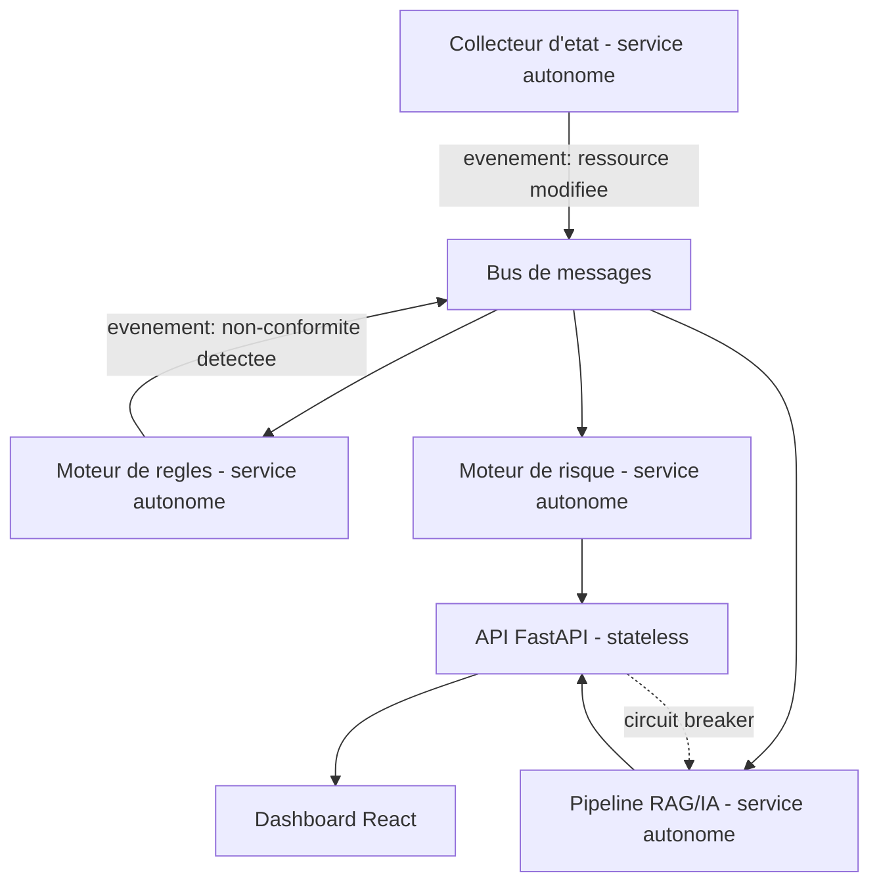

# PARTIE VI — ARCHITECTURE CLOUD

# Chapitre 12 : Patrons d'Architecture Cloud-Native

> *« Une architecture cloud-native ne se définit pas par l'endroit où le code s'exécute, mais par la manière dont il assume, dès sa conception, que tout composant peut échouer à tout moment. »*

---

## 1. Objectifs pédagogiques

À la fin de ce chapitre, vous serez capable de :

- Définir précisément ce qui distingue une architecture **cloud-native** d'une architecture simplement « hébergée dans le cloud » (*lift-and-shift*).
- Expliquer les patrons d'architecture fondamentaux : **microservices**, **architecture événementielle**, **12-factor app**, **sidecar**, **circuit breaker**, **backend-for-frontend**.
- Comprendre pourquoi ces patrons sont indispensables pour concevoir une plateforme comme ComplianceIQ, capable d'ingérer, d'évaluer et d'exposer des données de conformité à grande échelle et de façon résiliente.
- Justifier les choix architecturaux du backend ComplianceIQ (FastAPI, PostgreSQL, découplage des couches) à la lumière de ces patrons.
- Préparer la compréhension de la Partie VII (Architecture Multi-Cloud), de Docker/Kubernetes (Parties XXXIII-XXXIV) et de l'architecture d'entreprise (Partie XXXVII).

---

## 2. Problème du monde réel

Une entreprise migrant une application monolithique traditionnelle vers un fournisseur cloud, sans en modifier l'architecture (*lift-and-shift*), constate souvent qu'elle paie plus cher pour une fiabilité équivalente, voire inférieure, à son ancien data center. La raison : le cloud n'apporte de bénéfices réels (élasticité, résilience, coût à l'usage) qu'à des architectures **conçues pour lui** — capables de scaler horizontalement, de tolérer la panne d'une instance individuelle sans interruption de service, et de se déployer indépendamment composant par composant. ComplianceIQ, devant traiter des dizaines de milliers de ressources en continu à travers trois fournisseurs cloud, ne peut tout simplement pas être conçu comme une application monolithique classique sans s'effondrer sous sa propre charge dès les premiers milliers de ressources.

---

## 3. Évolution historique

| Période | Style d'architecture | Contexte |
|---|---|---|
| 1990s-2000s | Monolithe 3-tiers (présentation/logique/données) | Data centers propriétaires, cycles de déploiement lents |
| 2002 | Manifeste des Service-Oriented Architecture (SOA) | Premiers découplages via bus de services (ESB) |
| 2011 | *The Twelve-Factor App* (Heroku) | Formalisation des bonnes pratiques d'applications cloud portables |
| 2014 | Popularisation des microservices (Netflix, Amazon) | Découplage poussé, déploiement indépendant par équipe |
| 2015+ | Architecture événementielle et serverless | Découplage temporel via files de messages et fonctions à la demande |
| 2018+ | Service mesh, sidecar pattern (Istio, Linkerd) | Externalisation de la logique réseau/sécurité hors du code métier |

---

## 4. Pourquoi les solutions précédentes ont échoué

1. **Le monolithe 3-tiers** couple fortement présentation, logique et données : une simple modification du moteur de règles de ComplianceIQ nécessiterait de redéployer l'intégralité de l'application, y compris le dashboard et l'API, augmentant considérablement le risque de régression et le temps de mise en production.
2. **Le SOA basé sur ESB (Enterprise Service Bus)** centralise trop de logique métier dans le bus lui-même, créant un point unique de défaillance et un goulot d'étranglement de performance — un anti-pattern que les microservices ont cherché à corriger en répartissant la logique dans des services autonomes communiquant via des contrats simples (REST, événements).
3. **L'absence de découplage temporel** (appels synchrones systématiques) rend un système fragile : si le pipeline RAG (Parties XXV-XXIX) de ComplianceIQ devient temporairement lent, un appel synchrone bloquerait l'ensemble du scan de conformité, alors qu'un découplage événementiel permettrait au scan de continuer indépendamment.

---

## 5. Pourquoi cette approche a été inventée

Les patrons cloud-native répondent à un changement de posture fondamental résumé par la formule de Netflix : *« design for failure »* (concevoir en assumant l'échec). Dans un environnement cloud élastique, les instances de calcul sont **éphémères par nature** (redémarrage, migration, mise à l'échelle automatique) — une architecture qui suppose la permanence d'un serveur ou d'un état local en mémoire est structurellement incompatible avec le cloud. Les microservices, l'architecture événementielle et le 12-factor app formalisent des règles de conception garantissant qu'une application reste fonctionnelle malgré cette instabilité intrinsèque de l'infrastructure sous-jacente.

---

## 6. Concepts fondamentaux

### 6.1 Microservices

Un microservice est un composant logiciel **autonome**, déployable indépendamment, possédant sa propre base de données (ou son propre schéma), et communiquant avec les autres services via des interfaces bien définies (API REST, événements). Le critère décisif n'est pas la taille du service, mais son **autonomie de déploiement**.

### 6.2 The Twelve-Factor App

Méthodologie de 12 principes pour concevoir des applications cloud portables et résilientes, dont les plus pertinents pour ComplianceIQ incluent :
- **Configuration** : stockée dans l'environnement (variables d'environnement), jamais codée en dur — essentiel pour déployer le même code sur AWS, Azure et GCP sans modification.
- **Processus sans état (stateless)** : chaque instance de l'API FastAPI de ComplianceIQ ne doit stocker aucun état local persistant — tout état vit dans PostgreSQL ou le cache partagé.
- **Élimination via mise à l'échelle horizontale** : privilégier l'ajout d'instances identiques plutôt que l'augmentation de la puissance d'une instance unique (scaling horizontal vs vertical).

### 6.3 Architecture événementielle (Event-Driven Architecture)

Modèle où les composants communiquent en publiant et consommant des **événements** de manière asynchrone, via un courtier de messages (message broker), plutôt que par appel direct synchrone. Ceci découple temporellement les producteurs et les consommateurs : le collecteur d'état de ComplianceIQ (Chapitre 3) peut publier un événement « ressource modifiée » sans attendre que le moteur de règles ait terminé son évaluation.

### 6.4 Circuit Breaker (disjoncteur)

Patron protégeant un système contre les défaillances en cascade : si un service dépendant (par exemple, l'API Claude pour le RAG) échoue de manière répétée, le circuit breaker « ouvre le circuit » et cesse temporairement d'appeler ce service, renvoyant une réponse dégradée plutôt que de laisser l'échec se propager et bloquer l'ensemble du système.

### 6.5 Sidecar

Patron consistant à déployer un processus auxiliaire aux côtés du service principal (dans le même pod Kubernetes, par exemple) pour gérer des préoccupations transverses — journalisation, chiffrement TLS, observabilité — sans polluer le code métier du service lui-même.

---

## 7. Fondations scientifiques

- **Théorie des files d'attente** : fondement mathématique du découplage asynchrone, modélisant comment un système absorbe des pics de charge via une file tampon plutôt que par rejet immédiat.
- **Théorème CAP** (Brewer, 2000, formalisé par Gilbert & Lynch, 2002) : dans un système distribué, on ne peut garantir simultanément Cohérence, Disponibilité et Tolérance au partitionnement — un compromis fondamental qui guide la conception de tout système multi-services, approfondi en Partie V.
- **Loi de Conway** (1967) : *« Toute organisation qui conçoit un système produira un design dont la structure reflète la structure de communication de cette organisation »* — justification sociotechnique du découplage en microservices, alignant l'architecture logicielle sur l'organisation des équipes.

---

## 8. Architecture interne (ComplianceIQ en architecture cloud-native)



---

## 9. Flux interne

1. Le collecteur d'état détecte un changement et publie un événement, sans attendre de réponse synchrone.
2. Le bus de messages distribue l'événement à tous les services abonnés (moteur de règles, journal d'audit).
3. Le moteur de règles évalue la conformité de manière autonome et publie à son tour un événement de résultat.
4. Le moteur de risque et le pipeline RAG consomment cet événement indépendamment, chacun à son propre rythme.
5. L'API FastAPI, service **sans état**, agrège les résultats depuis PostgreSQL à la demande du dashboard, sans jamais dépendre d'un état en mémoire propre à une instance particulière.

---

## 10. Décomposition en composants

| Composant | Rôle | Patron appliqué |
|---|---|---|
| Collecteur d'état | Observation du cloud | Microservice autonome |
| Bus de messages | Découplage temporel | Architecture événementielle |
| Moteur de règles | Évaluation de conformité | Microservice, stateless |
| Moteur de risque | Priorisation | Microservice, consommateur d'événements |
| Pipeline RAG | Explication IA | Microservice, protégé par circuit breaker |
| API FastAPI | Exposition des résultats | 12-factor, stateless, scalable horizontalement |

---

## 11. Flux de données

```
[Collecteur] --evenement--> [Bus de messages] --+--> [Moteur de regles] --evenement--> [Bus]
                                                  +--> [Journal d'audit (log immuable)]
[Bus] --> [Moteur de risque] --> [PostgreSQL]
[Bus] --> [Pipeline RAG] --(circuit breaker)--> [PostgreSQL]
[PostgreSQL] <--lecture-- [API FastAPI stateless] --> [Dashboard]
```

---

## 12. Cycle de vie

Chaque microservice de ComplianceIQ suit un cycle de vie **indépendant** : développement, test, conteneurisation (Partie XXXIII), déploiement via pipeline CI/CD (Partie XXXV), mise à l'échelle automatique selon la charge, et remplacement transparent des instances défaillantes par l'orchestrateur (Kubernetes, Partie XXXIV) — sans jamais nécessiter l'arrêt des autres services.

---

## 13. Perspective architecture d'entreprise

Le découplage en microservices permet d'aligner l'architecture technique sur l'organisation du projet PFA : par exemple, un binôme peut travailler sur le moteur de règles pendant qu'un autre travaille sur le pipeline RAG, sans interférence, à condition que le contrat d'interface (le format des événements et des APIs) soit défini et stable dès le départ — une application directe de la loi de Conway (section 7).

---

## 14. Perspective sécurité

> **Note de sécurité** : la communication entre microservices, même interne, doit être chiffrée (mTLS) et authentifiée. Un découplage en microservices sans authentification inter-services créerait une surface d'attaque interne : un attaquant ayant compromis un seul service à faible privilège (par exemple, un service de journalisation) pourrait autrement usurper des appels vers des services critiques (moteur de règles, API).

---

## 15. Perspective performance

Le découplage événementiel introduit une **latence supplémentaire** (le temps de transit par le bus de messages) par rapport à un appel direct synchrone, mais ce coût est largement compensé par la résilience et la capacité de montée en charge indépendante de chaque composant — un compromis classique **latence vs résilience** à documenter explicitement dans un rapport d'architecture.

---

## 16. Scalabilité

Chaque microservice de ComplianceIQ peut être mis à l'échelle **indépendamment** selon son propre goulot d'étranglement : le moteur de règles, à forte charge de calcul, peut nécessiter davantage d'instances que le service de journalisation, à faible charge — un avantage majeur impossible à obtenir avec une architecture monolithique où tout le code scale en bloc.

---

## 17. Haute disponibilité

L'absence d'état local dans les services (principe 12-factor, section 6.2) permet à l'orchestrateur de remplacer instantanément une instance défaillante par une nouvelle, sans perte de contexte, car tout l'état persistant réside dans PostgreSQL, répliqué et sauvegardé indépendamment.

---

## 18. Bonnes pratiques

- Toujours concevoir chaque service pour qu'il soit **sans état** (stateless), reportant tout état persistant vers une base de données partagée.
- Toujours protéger les appels vers des dépendances externes potentiellement instables (API Claude, APIs cloud tierces) par un circuit breaker.
- Toujours définir un contrat d'interface stable (schéma d'événements, contrat API) avant de développer les services de part et d'autre.

---

## 19. Erreurs courantes

- Créer des microservices trop fins, couplés fortement entre eux par des appels synchrones chaînés (« microservices distribués mais toujours monolithiques en pratique » — un anti-pattern courant appelé *distributed monolith*).
- Oublier de gérer l'idempotence des consommateurs d'événements (un événement peut être délivré plusieurs fois dans un système distribué, Chapitre 3 section 6.2).

---

## 20. Anti-patterns

- **Le monolithe distribué (Distributed Monolith)** : découper le code en plusieurs services déployés séparément, mais qui restent couplés au point de devoir être déployés simultanément — cumulant la complexité opérationnelle des microservices sans en obtenir les bénéfices d'autonomie.
- **La base de données partagée entre microservices** : plusieurs services accédant directement au même schéma de base de données, recréant un couplage fort masqué derrière une façade de découplage apparent.

---

## 21. Alternatives

| Alternative | Description | Limite |
|---|---|---|
| Monolithe modulaire | Un seul déploiement, modules internes bien séparés | Plus simple pour un MVP, mais scale en bloc |
| Microservices complets | Découplage total, déploiement indépendant | Complexité opérationnelle plus élevée |
| Approche hybride (recommandée pour le MVP ComplianceIQ) | Quelques services majeurs (collecte, règles, IA, API) | Bon compromis complexité/bénéfices pour un projet de fin d'études |

---

## 22. Tableau comparatif

| Critère | Monolithe | Monolithe modulaire | Microservices |
|---|---|---|---|
| Complexité de déploiement initial | Faible | Faible | Élevée |
| Scalabilité indépendante des composants | Non | Non | Oui |
| Résilience aux pannes partielles | Faible | Faible | Élevée |
| Adapté à un MVP académique (ComplianceIQ) | Oui, si périmètre restreint | Oui, recommandé | Envisageable en cible long terme |

---

## 23. Implémentation AWS

AWS propose des services natifs pour chaque patron : **Amazon SQS/SNS** pour le bus de messages événementiel, **AWS Lambda** pour des fonctions serverless réagissant à des événements, et **Amazon ECS/EKS** pour l'orchestration de microservices conteneurisés.

## 24. Implémentation Azure

Azure propose des équivalents directs : **Azure Service Bus / Event Grid** pour la messagerie événementielle, **Azure Functions** pour le serverless, et **Azure Kubernetes Service (AKS)** pour l'orchestration — la cible officielle du MVP ComplianceIQ.

## 25. Implémentation Google Cloud

GCP propose **Cloud Pub/Sub** pour la messagerie événementielle, **Cloud Functions/Cloud Run** pour le serverless et les conteneurs à la demande, et **Google Kubernetes Engine (GKE)** pour l'orchestration.

---

## 26. Études de cas en entreprise

**Cas 1 — Netflix** : pionnier historique des microservices et du patron circuit breaker (bibliothèque Hystrix), motivé par la nécessité de rester disponible malgré la défaillance fréquente de composants individuels dans une infrastructure cloud à très grande échelle.

**Cas 2 — Migration lift-and-shift ratée** : une entreprise ayant migré un monolithe vers des VM cloud sans en revoir l'architecture a constaté une facture cloud supérieure à son ancien data center, sans gain de résilience, faute d'avoir adopté les patrons de conception présentés dans ce chapitre.

---

## 27. Comment ComplianceIQ utilise ces concepts

ComplianceIQ adopte une architecture hybride pragmatique pour son MVP : un découplage en services majeurs autonomes (collecte, moteur de règles, moteur de risque, pipeline RAG, API), communiquant en partie de manière événementielle (pour la scalabilité du scan) et en partie via API REST synchrone (pour l'interaction dashboard-API, où la latence est moins critique), avec un circuit breaker protégeant spécifiquement les appels vers l'API Claude, potentiellement sujette à des limites de débit ou des indisponibilités temporaires.

---

## 28. Diagramme d'architecture (ASCII)

```
+----------------+     evenement     +----------------+
| Collecteur     | ----------------> |  Bus de         |
| d'etat          |                   |  messages       |
+----------------+                   +----------------+
                                            |
                     +----------------------+----------------------+
                     v                                              v
           +------------------+                          +-------------------+
           | Moteur de regles  |                          | Journal d'audit    |
           +------------------+                          +-------------------+
                     |
                     v
           +------------------+     circuit breaker      +-------------------+
           | Moteur de risque  | -----------------------> | Pipeline RAG (IA)  |
           +------------------+                          +-------------------+
                     \                                            /
                      \                                          /
                       v                                        v
                        +----------------------------------+
                        |   API FastAPI (stateless)          |
                        +----------------------------------+
                                      |
                                      v
                        +----------------------------------+
                        |   Dashboard React                  |
                        +----------------------------------+
```

---

## 29. Résumé

Ce chapitre a établi les patrons fondamentaux de l'architecture cloud-native — microservices, 12-factor app, architecture événementielle, circuit breaker, sidecar — et a montré pourquoi ces patrons ne sont pas des choix esthétiques mais des réponses directes à la nature intrinsèquement instable et élastique de l'infrastructure cloud. ComplianceIQ adopte une architecture hybride pragmatique, combinant découplage événementiel pour la scalabilité du scan et API REST synchrone pour l'interaction utilisateur, protégée par un circuit breaker sur ses dépendances IA externes.

---

## 30. Vocabulaire clé

| Terme | Définition |
|---|---|
| Cloud-native | Architecture conçue pour l'élasticité et l'instabilité intrinsèque du cloud |
| Microservice | Composant autonome déployable indépendamment |
| 12-Factor App | Méthodologie de conception d'applications cloud portables |
| Architecture événementielle | Communication asynchrone via publication/consommation d'événements |
| Circuit Breaker | Patron protégeant contre les défaillances en cascade |
| Distributed Monolith | Anti-pattern de microservices couplés fortement entre eux |
| Loi de Conway | Principe reliant structure organisationnelle et structure logicielle |

---

## 31. Questions de réflexion

1. Pourquoi une architecture monolithique classique est-elle structurellement mal adaptée à un système devant traiter des dizaines de milliers de ressources cloud en continu ?
2. En quoi le principe « stateless » du 12-factor app facilite-t-il la haute disponibilité de l'API ComplianceIQ ?
3. Pourquoi un « monolithe distribué » est-il pire, à certains égards, qu'un monolithe classique ?

---

## 32. Questions d'entretien

1. Comment justifieriez-vous le choix d'une architecture événementielle plutôt que purement synchrone pour le pipeline de scan de ComplianceIQ ?
2. Expliquez le rôle d'un circuit breaker dans l'appel à une API IA externe comme l'API Claude, et ce qui se passerait en son absence.
3. Comment éviteriez-vous de transformer votre architecture microservices en « monolithe distribué » ?

---

## 33. Références

- Newman, S. — *Building Microservices*, O'Reilly, 2015.
- Wiggins, A. — *The Twelve-Factor App*, 2011 (12factor.net).
- Nygard, M. — *Release It!: Design and Deploy Production-Ready Software* (origine du patron Circuit Breaker), Pragmatic Bookshelf.
- Conway, M. — *How Do Committees Invent?*, 1968.

---

*Fin du Chapitre 12. Enchaînement direct sur le Chapitre 13 (Partie VII — Architecture Multi-Cloud).*
