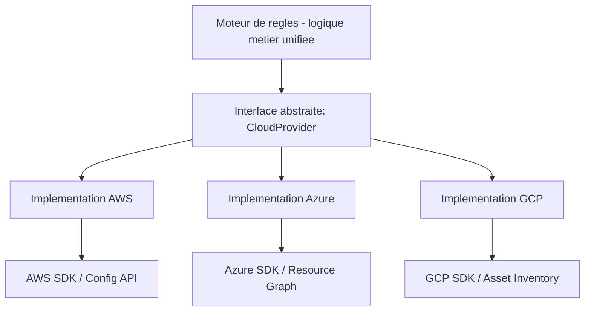

# PARTIE VII — ARCHITECTURE MULTI-CLOUD

# Chapitre 13 : Stratégies Multi-Cloud et Portabilité

> *« Le multi-cloud n'est pas une stratégie de redondance gratuite — c'est un arbitrage permanent entre portabilité, coût d'ingénierie, et exploitation des services natifs les plus avancés de chaque fournisseur. »*

---

## 1. Objectifs pédagogiques

À la fin de ce chapitre, vous serez capable de :

- Distinguer les stratégies **multi-cloud**, **hybrid cloud**, et **cloud-agnostic**, et positionner précisément ComplianceIQ dans cette typologie.
- Expliquer le compromis fondamental entre **portabilité** (code identique sur tout fournisseur) et **exploitation des services natifs** (profiter des fonctionnalités avancées propres à un fournisseur).
- Comprendre les motivations réelles des entreprises adoptant une stratégie multi-cloud (souveraineté des données, négociation tarifaire, résilience, conformité réglementaire régionale).
- Justifier pourquoi ComplianceIQ, bien que ciblant Azure comme MVP officiel, est architecturé dès le départ pour supporter AWS et GCP — et quelles décisions de conception rendent cela possible.
- Relier ce chapitre à la Partie XI (Infrastructure as Code) et à la Partie XX (découverte d'actifs cloud), où la portabilité multi-cloud se traduit concrètement en code.

---

## 2. Problème du monde réel

Une entreprise marocaine soumise à la Loi 05-20 et aux directives DNSSI peut être contrainte, pour certaines catégories de données, de garantir une **localisation géographique précise** (souveraineté des données) — une contrainte qu'un seul fournisseur cloud pourrait ne pas satisfaire pour toutes les régions ou tous les cas d'usage. De plus, une dépendance à un seul fournisseur (*vendor lock-in*) expose l'entreprise à des risques de négociation tarifaire défavorable, de discontinuité de service, ou de limitation géopolitique. Le multi-cloud répond à ces contraintes, mais introduit un problème informatique concret et non trivial : **comment concevoir un système de conformité capable de raisonner uniformément sur trois modèles d'infrastructure fondamentalement différents**, sans dupliquer indéfiniment la logique métier pour chacun ?

---

## 3. Évolution historique

| Période | Étape | Contexte |
|---|---|---|
| 2006-2010 | Mono-cloud (AWS domine largement) | Adoption précoce, peu d'alternatives matures |
| 2010-2015 | Émergence d'Azure et GCP comme concurrents crédibles | Début de la diversification des choix d'entreprise |
| 2015-2018 | Premières stratégies multi-cloud délibérées | Motivées par la négociation tarifaire et la résilience |
| 2018+ | Outils de portabilité (Terraform multi-provider, Kubernetes comme couche d'abstraction) | Réduction du coût d'ingénierie du multi-cloud |
| 2020+ | Réglementations de souveraineté des données (RGPD, lois nationales) | Le multi-cloud devient parfois une obligation réglementaire, pas seulement un choix stratégique |

---

## 4. Pourquoi les solutions précédentes ont échoué

1. **Le mono-cloud pur**, bien que plus simple à opérer, expose l'entreprise à un risque de dépendance totale (*vendor lock-in*) : migrer hors d'un fournisseur après plusieurs années d'adoption de ses services propriétaires (bases de données managées spécifiques, formats propriétaires) peut coûter des années-ingénieur.
2. **Les premières tentatives de portabilité multi-cloud naïves** consistaient à réécrire entièrement l'infrastructure pour chaque fournisseur sans abstraction commune, dupliquant la charge de maintenance par trois — un problème directement analogue à l'absence de modèle canonique évoquée au Chapitre 2.
3. **L'approche « plus petit dénominateur commun »** (n'utiliser que les fonctionnalités strictement identiques entre fournisseurs) garantit la portabilité mais sacrifie souvent des gains de performance ou de sécurité significatifs offerts par les services natifs avancés d'un fournisseur spécifique (ex. : GuardDuty sur AWS, Microsoft Defender for Cloud sur Azure).

---

## 5. Pourquoi cette approche a été inventée

La stratégie multi-cloud moderne repose sur un principe d'ingénierie explicite : **isoler la logique métier des spécificités de chaque fournisseur via une couche d'abstraction**, tout en acceptant consciemment, pour certaines fonctionnalités à forte valeur ajoutée, de sacrifier une portion de portabilité au profit de capacités natives supérieures — un arbitrage documenté et assumé, jamais un compromis accidentel. C'est exactement le rôle de l'Anti-Corruption Layer et du modèle canonique introduits au Chapitre 2, appliqués ici à l'échelle de la stratégie d'entreprise entière, et non plus seulement à la représentation des données.

---

## 6. Concepts fondamentaux

### 6.1 Multi-cloud vs Hybrid Cloud vs Cloud-agnostic

- **Multi-cloud** : utilisation de plusieurs fournisseurs cloud publics simultanément (AWS + Azure + GCP), généralement pour des charges de travail différentes ou redondantes.
- **Hybrid Cloud** : combinaison d'une infrastructure cloud publique et d'une infrastructure sur site (on-premises) ou privée.
- **Cloud-agnostic** : conception logicielle visant à fonctionner **indifféremment** sur n'importe quel fournisseur cloud, sans modification — un objectif de portabilité maximale, rarement atteint à 100%, mais vers lequel ComplianceIQ tend structurellement (rappel : son modèle canonique du Chapitre 2 est une brique essentielle de cette portabilité).

### 6.2 Vendor Lock-in

Situation où le coût de migration hors d'un fournisseur devient prohibitif en raison de la dépendance à ses services propriétaires (formats de données, API spécifiques, écosystème d'outils). Le vendor lock-in n'est pas nécessairement négatif — il peut être un choix stratégique assumé en échange de gains de productivité — mais il doit être **conscient et documenté**, jamais subi passivement.

### 6.3 Portabilité vs Optimisation native

Un arbitrage central de toute architecture multi-cloud : plus une application exploite les services natifs avancés d'un fournisseur (par exemple, Azure Resource Graph pour ComplianceIQ), plus elle gagne en performance et en simplicité d'implémentation pour ce fournisseur, mais moins elle reste portable telle quelle vers un autre fournisseur sans adaptation.

### 6.4 Couche d'abstraction cloud (Cloud Abstraction Layer)

Couche logicielle interceptant les appels vers les APIs spécifiques de chaque fournisseur et les traduisant vers/depuis un modèle interne unifié — l'application directe, au niveau de l'infrastructure entière, du modèle canonique du Chapitre 2 et de l'Anti-Corruption Layer.

---

## 7. Fondations scientifiques

- **Théorie des coûts de transaction** (Coase, 1937 ; appliquée à l'IT) : formalise pourquoi le coût de changement de fournisseur (coût de transaction) influence la décision stratégique multi-cloud autant que des considérations purement techniques.
- **Théorie des jeux appliquée à la négociation fournisseur** : une entreprise multi-cloud dispose d'un pouvoir de négociation tarifaire supérieur, car elle peut crédiblement menacer de déplacer sa charge vers un concurrent — un raisonnement stratégique parfois plus déterminant que les considérations techniques pures.
- **Principe d'abstraction et de substitution de Liskov** (appliqué architecturalement) : tout composant implémentant l'interface de la couche d'abstraction cloud doit pouvoir être substitué à un autre sans changer le comportement observable du système — le critère de réussite d'une architecture cloud-agnostic.

---

## 8. Architecture interne (couche d'abstraction cloud de ComplianceIQ)



---

## 9. Flux interne

1. Le moteur de règles interroge une interface abstraite unique (`CloudProvider.getResources()`), sans jamais connaître le fournisseur cloud sous-jacent.
2. Une implémentation concrète par fournisseur (AWS, Azure, GCP) traduit cet appel abstrait vers l'API native correspondante.
3. La réponse brute est traduite vers le modèle canonique (Chapitre 2) avant d'être retournée au moteur de règles.
4. Toute évolution ou ajout d'un quatrième fournisseur (par exemple OCI, mentionné dans une version antérieure du projet) nécessite uniquement l'ajout d'une nouvelle implémentation de l'interface, sans modification du moteur de règles.

---

## 10. Décomposition en composants

| Composant | Rôle |
|---|---|
| Interface CloudProvider | Contrat abstrait commun à tous les fournisseurs |
| Implémentation AWS/Azure/GCP | Traduction spécifique vers/depuis chaque API native |
| Registre de capacités par fournisseur | Documente quelles fonctionnalités sont disponibles nativement pour chaque fournisseur (pour gérer les écarts de fonctionnalités, voir section 19) |
| Sélecteur de fournisseur actif | Détermine, selon la configuration de l'entreprise cliente, quel(s) fournisseur(s) interroger |

---

## 11. Flux de données

```
[Moteur de regles] --appel abstrait--> [Interface CloudProvider]
                                              |
                     +------------------------+------------------------+
                     v                        v                        v
           [Implementation AWS]     [Implementation Azure]     [Implementation GCP]
                     |                        |                        |
                     v                        v                        v
              [AWS SDK/API]           [Azure SDK/API]            [GCP SDK/API]
```

---

## 12. Cycle de vie

L'ajout d'un nouveau fournisseur cloud à ComplianceIQ suit un cycle défini : **spécification du mapping** vers le modèle canonique → **implémentation de l'interface CloudProvider** → **tests de conformité de l'implémentation** (vérifier qu'elle respecte le contrat attendu, principe de substitution de Liskov, section 7) → **documentation des écarts de capacités** → **intégration en production**.

---

## 13. Perspective architecture d'entreprise

Une décision multi-cloud n'est jamais purement technique — elle engage la direction générale, les équipes juridiques (contrats fournisseurs), et la gouvernance des risques. Pour ComplianceIQ, cibler officiellement Azure comme MVP tout en concevant une architecture portable vers AWS et GCP est un choix pragmatique qui **réduit le risque de vendor lock-in dès la conception**, sans retarder la livraison d'un MVP fonctionnel — un compromis architectural directement pertinent pour la soutenance du projet.

---

## 14. Perspective sécurité

> **Note de sécurité** : chaque implémentation `CloudProvider` doit utiliser des identifiants strictement dédiés et en lecture seule pour son fournisseur respectif, jamais un identifiant partagé entre plusieurs implémentations — un identifiant en lecture seule compromis reste circonscrit à un seul fournisseur plutôt que d'exposer l'ensemble du système multi-cloud.

---

## 15. Perspective performance

L'appel à trois APIs cloud distinctes (AWS, Azure, GCP) pour une entreprise réellement multi-cloud doit être **parallélisé** plutôt que séquentiel — un cas d'application direct du parallélisme *embarrassingly parallel* évoqué au Chapitre 3, chaque fournisseur pouvant être interrogé indépendamment sans dépendance entre eux.

---

## 16. Scalabilité

L'ajout d'un nouveau fournisseur cloud (ou d'une nouvelle région chez un fournisseur existant) ne doit impacter que la couche d'implémentation spécifique, jamais le moteur de règles ni le modèle canonique — un test décisif de la qualité de l'architecture multi-cloud, identique en substance au test de scalabilité du modèle canonique évoqué au Chapitre 2, section 16.

---

## 17. Haute disponibilité

Une architecture multi-cloud bien conçue peut, en théorie, offrir une résilience supérieure : si l'API d'un fournisseur devient temporairement indisponible, le reste du système (scan des autres fournisseurs, évaluation des règles, dashboard) continue de fonctionner normalement — un bénéfice direct du découplage introduit au Chapitre 12.

---

## 18. Bonnes pratiques

- Toujours documenter explicitement, pour chaque fonctionnalité, si elle est portable (identique sur les trois fournisseurs) ou spécifique (nécessitant une implémentation dédiée par fournisseur).
- Toujours tester chaque nouvelle implémentation `CloudProvider` par des tests de contrat garantissant la conformité au comportement attendu de l'interface abstraite.
- Toujours paralléliser les appels vers différents fournisseurs pour éviter une latence cumulative inutile.

---

## 19. Erreurs courantes

- Supposer que toutes les fonctionnalités sont disponibles de manière identique sur les trois fournisseurs, alors que certaines capacités avancées (ex. : détection d'anomalie IA native) ne sont disponibles que sur un seul fournisseur — nécessitant un **registre de capacités par fournisseur** documentant ces écarts (section 10) plutôt qu'une supposition silencieuse d'équivalence totale.
- Négliger les différences de terminologie et de granularité (ex. : un « Resource Group » Azure n'a pas d'équivalent exact chez AWS ou GCP), risquant des erreurs de mapping dans le modèle canonique.

---

## 20. Anti-patterns

- **Le « faux multi-cloud »** : prétendre supporter plusieurs fournisseurs alors que l'essentiel de la logique métier reste couplé implicitement aux spécificités d'un seul fournisseur, rendant toute portabilité illusoire en pratique.
- **La duplication de logique métier par fournisseur** : réimplémenter la même règle de conformité séparément pour AWS, Azure et GCP au lieu de la définir une seule fois sur le modèle canonique — retour direct à l'anti-pattern identifié au Chapitre 2.

---

## 21. Alternatives

| Alternative | Description | Limite |
|---|---|---|
| Mono-cloud strict | Simplicité maximale, un seul fournisseur | Vendor lock-in, pas de flexibilité réglementaire |
| Multi-cloud sans abstraction | Support de plusieurs fournisseurs, logique dupliquée | Coût de maintenance multiplié |
| Multi-cloud avec couche d'abstraction (choix de ComplianceIQ) | Portabilité et maintenabilité | Complexité de conception initiale plus élevée |

---

## 22. Tableau comparatif

| Critère | Mono-cloud | Multi-cloud sans abstraction | Multi-cloud avec abstraction |
|---|---|---|---|
| Risque de vendor lock-in | Élevé | Faible | Faible |
| Coût de maintenance | Faible | Élevé (logique dupliquée) | Modéré |
| Vitesse de livraison du MVP | Rapide | Rapide mais dette technique élevée | Légèrement plus lente initialement, mais soutenable |
| Conformité à des exigences de souveraineté variées | Difficile | Possible mais coûteux | Possible et maintenable |

---

## 23. Implémentation AWS

Pour AWS, l'implémentation `CloudProvider` s'appuie principalement sur **AWS Config** et le **AWS SDK (boto3 en Python)**, avec authentification via des rôles IAM en lecture seule dédiés (`ReadOnlyAccess` restreint, jamais un rôle administrateur).

## 24. Implémentation Azure

Pour Azure, cible officielle du MVP, l'implémentation s'appuie sur **Azure Resource Graph** et le **Azure SDK for Python**, authentifiée via un **Service Principal** doté d'un rôle **Reader** strictement scoped aux abonnements concernés.

## 25. Implémentation Google Cloud

Pour GCP, l'implémentation s'appuie sur **Cloud Asset Inventory** et le **Google Cloud Client Library**, authentifiée via un compte de service disposant du rôle **Viewer** au niveau du projet ou de l'organisation.

---

## 26. Études de cas en entreprise

**Cas 1 — Négociation tarifaire** : une entreprise ayant démontré sa capacité technique à migrer une charge de travail significative entre deux fournisseurs a pu obtenir une réduction tarifaire substantielle lors du renouvellement de son contrat — illustrant le pouvoir de négociation évoqué en section 7.

**Cas 2 — Contrainte réglementaire de souveraineté** : une institution financière a dû répartir ses données entre plusieurs fournisseurs pour satisfaire des exigences réglementaires de localisation géographique variables selon la catégorie de donnée traitée — un cas d'usage direct de la nécessité du multi-cloud pour la conformité, au cœur de la mission de ComplianceIQ.

---

## 27. Comment ComplianceIQ utilise ces concepts

ComplianceIQ implémente une interface abstraite `CloudProvider` avec une implémentation Azure complète pour le MVP officiel, tout en développant en parallèle des implémentations AWS (et potentiellement GCP) pour valider la portabilité réelle de l'architecture — une démarche qui permet de présenter, lors de la soutenance, une preuve concrète que le modèle canonique et la couche d'abstraction ne sont pas de simples déclarations d'intention mais des choix architecturaux vérifiés en pratique sur au moins deux fournisseurs distincts.

---

## 28. Diagramme d'architecture (ASCII)

```
                     +--------------------------------+
                     |  Moteur de regles (logique       |
                     |  metier unifiee, modele canonique)|
                     +--------------------------------+
                                    |
                                    v
                     +--------------------------------+
                     |   Interface CloudProvider         |
                     |   (contrat abstrait commun)        |
                     +--------------------------------+
                       |             |              |
                       v             v              v
              +---------------+ +---------------+ +---------------+
              | Impl. AWS      | | Impl. Azure     | | Impl. GCP      |
              | (MVP secondaire)| | (MVP officiel)  | | (exploratoire) |
              +---------------+ +---------------+ +---------------+
```

---

## 29. Résumé

Ce chapitre a montré que le multi-cloud n'est ni un simple choix technique ni une contrainte purement réglementaire, mais un **arbitrage stratégique** entre portabilité, coût d'ingénierie et exploitation des capacités natives de chaque fournisseur. ComplianceIQ traduit cet arbitrage en une architecture concrète : une interface `CloudProvider` abstraite, alimentant le modèle canonique du Chapitre 2, avec une implémentation Azure prioritaire pour le MVP et une portabilité démontrée vers AWS, réduisant structurellement le risque de vendor lock-in dès la conception.

---

## 30. Vocabulaire clé

| Terme | Définition |
|---|---|
| Multi-cloud | Utilisation simultanée de plusieurs fournisseurs cloud publics |
| Vendor Lock-in | Dépendance coûteuse à un fournisseur rendant la migration difficile |
| Cloud-agnostic | Conception visant une portabilité totale entre fournisseurs |
| Couche d'abstraction cloud | Interface unifiant l'accès à des APIs cloud hétérogènes |
| Registre de capacités | Documentation des écarts de fonctionnalités entre fournisseurs |

---

## 31. Questions de réflexion

1. Pourquoi une stratégie multi-cloud « sans abstraction » recrée-t-elle, à terme, les mêmes problèmes qu'une absence totale de modèle canonique ?
2. En quoi la souveraineté des données peut-elle transformer le multi-cloud d'un choix stratégique en une obligation réglementaire ?
3. Quel est le compromis entre portabilité et exploitation native, et comment ComplianceIQ le documente-t-il ?

---

## 32. Questions d'entretien

1. Comment concevriez-vous une interface abstraite `CloudProvider` capable d'accueillir un futur quatrième fournisseur cloud sans modifier le moteur de règles existant ?
2. Pourquoi cibler Azure comme MVP officiel n'empêche-t-il pas ComplianceIQ de revendiquer une architecture multi-cloud dès sa conception ?
3. Comment géreriez-vous une fonctionnalité disponible nativement chez un seul fournisseur sans casser la portabilité globale du système ?

---

## 33. Références

- Coase, R. — *The Nature of the Firm*, 1937.
- Liskov, B. — *Data Abstraction and Hierarchy*, 1987 (principe de substitution).
- Gartner — *Multicloud Strategy Research* (cadre conceptuel repris largement dans l'industrie).

---

*Fin du Chapitre 13, et fin des Parties VI-VII. Enchaînement sur le Chapitre 14 (Partie VIII — Fondamentaux AWS).*
