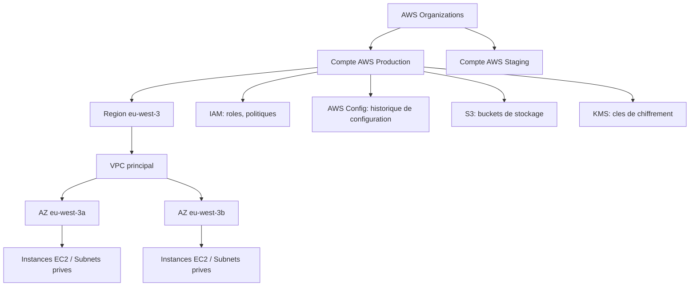

# PARTIE VIII — FONDAMENTAUX AWS

# Chapitre 14 : Amazon Web Services — Architecture et Services Fondamentaux

> *« AWS n'est pas un fournisseur de serveurs — c'est un fournisseur de primitives de calcul, de stockage et de réseau, composables à volonté. Comprendre AWS, c'est comprendre sa logique de composition, pas mémoriser son catalogue de 200+ services. »*

---

## 1. Objectifs pédagogiques

À la fin de ce chapitre, vous serez capable de :

- Expliquer l'organisation hiérarchique fondamentale d'AWS : **comptes, régions, zones de disponibilité (AZ), VPC**.
- Décrire le rôle des services fondamentaux pertinents pour ComplianceIQ : **IAM, EC2, S3, VPC, AWS Config, CloudTrail, KMS**.
- Comprendre le modèle de **responsabilité partagée** appliqué spécifiquement à AWS.
- Identifier les services natifs de gouvernance et de conformité AWS (**AWS Config, AWS Security Hub, AWS Audit Manager**) et leur rôle potentiel comme sources de données ou comme systèmes complémentaires à ComplianceIQ.
- Poser les bases nécessaires à la Partie XI (IaC/Terraform) où ces services seront provisionnés par du code, et à la Partie XX (découverte d'actifs) où ils seront interrogés par le collecteur d'état.

---

## 2. Problème du monde réel

Avant de pouvoir écrire une seule règle Terraform ou une seule règle de conformité pour AWS, il est indispensable de comprendre **comment AWS organise fondamentalement son infrastructure** — sans cette compréhension, des erreurs de conception coûteuses sont quasi inévitables : provisionner des ressources dans la mauvaise région (violation de souveraineté des données), mal comprendre la portée d'un rôle IAM (excès de privilèges), ou confondre l'isolation offerte par un compte AWS avec celle offerte par un VPC (erreur d'architecture de sécurité fréquente chez les débutants).

---

## 3. Évolution historique

| Année | Étape | Signification |
|---|---|---|
| 2002 | Lancement d'Amazon Web Services (services internes exposés) | Origine du cloud computing commercial moderne |
| 2006 | Lancement public de S3 et EC2 | Naissance du IaaS grand public |
| 2009 | Lancement de VPC | Introduction de l'isolation réseau logique dans le cloud public |
| 2011 | Lancement d'IAM | Formalisation de la gestion d'identité et d'accès cloud |
| 2014 | Lancement d'AWS Config | Naissance du concept d'audit de configuration continu chez AWS |
| 2018+ | AWS Security Hub, Audit Manager | Consolidation de la posture de sécurité et de conformité en tableau de bord unifié |

---

## 4. Pourquoi les solutions précédentes ont échoué

Les architectures pré-cloud (data centers physiques) échouaient à offrir l'élasticité et le provisionnement à la demande. AWS a résolu ce problème par la **virtualisation** (Partie IV) combinée à une **API programmable** pour chaque ressource — mais cette flexibilité extrême a elle-même créé un nouveau problème : la **prolifération incontrôlée de ressources** (« shadow IT cloud »), rendant l'audit manuel impossible dès que l'organisation dépasse quelques centaines de ressources — exactement le problème que résout AWS Config, et à plus grande échelle multi-cloud, ComplianceIQ.

---

## 5. Pourquoi cette approche a été inventée

L'architecture hiérarchique d'AWS (Compte → Région → Zone de disponibilité → VPC → Sous-réseau → Ressource) répond à un besoin fondamental d'**isolation à plusieurs niveaux de granularité**, chaque niveau répondant à une préoccupation distincte : le compte isole la facturation et les permissions à l'échelle organisationnelle, la région isole la souveraineté des données et la latence géographique, la zone de disponibilité isole la tolérance aux pannes physiques, et le VPC isole le réseau logique.

---

## 6. Concepts fondamentaux

### 6.1 Comptes AWS et AWS Organizations

Un **compte AWS** est la limite fondamentale d'isolation : facturation, quotas, et par défaut, permissions. **AWS Organizations** permet de gérer plusieurs comptes de manière centralisée (souvent un compte par environnement — production, staging, développement — ou par unité métier), une pratique recommandée que ComplianceIQ doit prendre en compte lors de la découverte d'actifs à l'échelle d'une organisation entière.

### 6.2 Régions et Zones de disponibilité (AZ)

Une **région** AWS est une zone géographique (ex. : `eu-west-3` — Paris) contenant plusieurs **zones de disponibilité (AZ)**, des data centers physiquement isolés mais interconnectés par un réseau à faible latence. Cette structure permet de concevoir des architectures **haute disponibilité** (répartition sur plusieurs AZ) et de répondre à des exigences de **souveraineté des données** (choix de région).

### 6.3 VPC (Virtual Private Cloud)

Un VPC est un réseau logique isolé au sein d'une région AWS, dans lequel sont déployées les ressources (instances EC2, bases de données RDS). Il constitue la brique de base de l'isolation réseau étudiée au Chapitre 5.

### 6.4 IAM (Identity and Access Management)

Service central de gestion des identités et permissions, reposant sur des **utilisateurs**, **groupes**, **rôles**, et **politiques** (documents JSON définissant des permissions). Sera approfondi théoriquement en Partie XIII.

### 6.5 EC2, S3, KMS

- **EC2 (Elastic Compute Cloud)** : instances de calcul virtualisées.
- **S3 (Simple Storage Service)** : stockage objet, l'un des services les plus anciens et les plus utilisés d'AWS, fréquemment mal configuré (accès public non intentionnel) — une cible prioritaire des règles de conformité.
- **KMS (Key Management Service)** : gestion des clés de chiffrement, central pour toute règle de conformité exigeant le chiffrement des données au repos.

### 6.6 AWS Config, CloudTrail, Security Hub

- **AWS Config** : capture en continu l'état de configuration des ressources et permet de définir des règles de conformité natives — une source de données précieuse pour le collecteur d'état de ComplianceIQ (Chapitre 3).
- **CloudTrail** : journalise chaque appel API effectué sur le compte — essentiel pour la traçabilité et l'investigation d'incidents.
- **Security Hub** : agrège des résultats de sécurité de multiples services AWS dans un tableau de bord unifié — un système partiellement analogue à ComplianceIQ, mais limité à l'écosystème AWS seul.

---

## 7. Fondations scientifiques

- **Virtualisation matérielle** (Nitro Hypervisor d'AWS, dérivé de KVM) : fondement technique d'EC2, approfondi en Partie IV.
- **Systèmes de stockage distribué et cohérence éventuelle** : S3 garantit une cohérence forte en lecture après écriture depuis 2020 (auparavant cohérence éventuelle), un changement ayant eu un impact direct sur la fiabilité des architectures de données construites dessus — illustration concrète du théorème CAP (Chapitre 12, section 7) appliqué à un service réel.
- **Cryptographie à clé symétrique et enveloppe de chiffrement (envelope encryption)** : fondement théorique de KMS, où une clé de données est elle-même chiffrée par une clé maîtresse, limitant l'exposition directe de cette dernière.

---

## 8. Architecture interne (hiérarchie AWS pertinente pour ComplianceIQ)



---

## 9. Flux interne (interrogation AWS par ComplianceIQ)

1. ComplianceIQ s'authentifie via un rôle IAM en lecture seule, assumé via **AWS STS (Security Token Service)** pour obtenir des identifiants temporaires (jamais des clés d'accès statiques de longue durée — bonne pratique de sécurité fondamentale).
2. Interrogation d'**AWS Config** pour obtenir l'historique et l'état actuel des ressources.
3. Interrogation ciblée de services spécifiques (S3, IAM, EC2) pour des attributs non couverts par Config.
4. Traduction des réponses JSON natives AWS vers le modèle canonique (Chapitre 2).

---

## 10. Décomposition en composants

| Composant AWS | Rôle pour ComplianceIQ |
|---|---|
| IAM Role + STS | Authentification en lecture seule et temporaire |
| AWS Config | Source principale d'état de configuration |
| CloudTrail | Source de traçabilité des changements (qui a modifié quoi, quand) |
| S3 API | Vérification directe des politiques de bucket |
| KMS API | Vérification du statut de chiffrement des ressources |

---

## 11. Flux de données

```
[ComplianceIQ] --AssumeRole (STS)--> [Identifiants temporaires]
       --> [AWS Config API] --> [Etat des ressources]
       --> [CloudTrail API] --> [Historique des changements]
       --> [Mapper AWS] --> [Modele canonique]
```

---

## 12. Cycle de vie

Le rôle IAM utilisé par ComplianceIQ pour interroger AWS suit lui-même un cycle de vie à surveiller : **création du rôle avec permissions minimales** → **rotation régulière des éventuelles clés associées** → **audit périodique des permissions effectivement utilisées** (principe du moindre privilège appliqué de manière continue, pas seulement à la création) → **révocation en fin de mission**.

---

## 13. Perspective architecture d'entreprise

Une entreprise structurée utilise généralement **AWS Organizations** avec une architecture multi-comptes (« Landing Zone »), séparant production, staging, et sécurité/audit. ComplianceIQ doit être capable de découvrir et d'agréger les ressources à travers l'ensemble de ces comptes, généralement via un rôle IAM central dans un compte de sécurité dédié, assumant des rôles délégués dans chaque compte membre (patron **cross-account role assumption**).

---

## 14. Perspective sécurité

> **Note de sécurité** : le rôle IAM utilisé par ComplianceIQ doit strictement suivre le principe du moindre privilège — permissions `Describe*`, `List*`, `Get*` uniquement, jamais de permissions de modification (`Put*`, `Delete*`, `Create*`). L'utilisation d'identifiants temporaires via STS plutôt que des clés d'accès statiques limite drastiquement la fenêtre d'exposition en cas de fuite d'identifiants.

---

## 15. Perspective performance

Les appels à AWS Config peuvent être soumis à des **quotas de débit (rate limiting)** — ComplianceIQ doit implémenter une stratégie de pagination et de backoff exponentiel pour éviter les erreurs de throttling lors de l'interrogation d'un grand nombre de ressources, un sujet directement lié à la théorie des files d'attente évoquée au Chapitre 12.

---

## 16. Scalabilité

Pour une organisation avec des dizaines de comptes AWS, la découverte d'actifs doit être **parallélisée par compte et par région**, chaque combinaison compte/région pouvant être interrogée indépendamment — application directe du parallélisme *embarrassingly parallel* du Chapitre 3.

---

## 17. Haute disponibilité

AWS Config et les APIs AWS sont eux-mêmes des services distribués à haute disponibilité, mais ComplianceIQ doit néanmoins gérer les échecs transitoires d'appels API (timeouts, erreurs 5xx) par des mécanismes de retry avec backoff, sans bloquer l'ensemble du cycle de scan pour une erreur isolée sur un seul compte.

---

## 18. Bonnes pratiques

- Toujours utiliser AWS STS pour des identifiants temporaires plutôt que des clés d'accès statiques.
- Toujours restreindre le rôle IAM de ComplianceIQ aux permissions de lecture strictement nécessaires.
- Toujours prévoir l'architecture cross-account dès la conception, même si le MVP ne couvre initialement qu'un seul compte.

---

## 19. Erreurs courantes

- Utiliser des clés d'accès IAM statiques de longue durée pour l'authentification, augmentant le risque en cas de fuite.
- Sous-estimer les quotas de débit d'AWS Config lors de scans à grande échelle, provoquant des échecs de scan silencieux.

---

## 20. Anti-patterns

- **Le rôle « AdministratorAccess » pour un outil de lecture seule** : accorder des permissions bien plus larges que nécessaire par simplicité de configuration initiale — un risque de sécurité majeur si les identifiants du rôle étaient compromis.

---

## 21. Alternatives

| Alternative | Description | Limite |
|---|---|---|
| Appels directs aux APIs de chaque service (EC2, S3, IAM séparément) | Contrôle fin | Complexité et volume d'appels API élevés |
| AWS Config comme source principale (choix recommandé) | Historique intégré, moins d'appels API directs | Nécessite qu'AWS Config soit activé et correctement configuré par le client |
| AWS Security Hub comme source complémentaire | Résultats de sécurité déjà agrégés | Limité à l'écosystème AWS, ne couvre pas le multi-cloud |

---

## 22. Tableau comparatif

| Critère | Appels API directs | AWS Config | AWS Security Hub |
|---|---|---|---|
| Historique de configuration | Non natif | Oui | Partiel |
| Couverture multi-cloud | Non applicable | Non | Non |
| Volume d'appels API nécessaires | Élevé | Modéré | Faible |
| Adapté comme source pour ComplianceIQ | Complémentaire | Principal | Complémentaire |

---

## 23-25. Implémentation par fournisseur

*(Ce chapitre étant dédié à AWS, les sections 23-25 sont fusionnées ici en une analyse d'intégration technique.)*

L'intégration technique de ComplianceIQ avec AWS repose sur le **AWS SDK (boto3 pour Python)**, avec les appels principaux suivants : `config.get_resource_config_history()`, `config.select_resource_config()` (requêtes de type SQL sur l'inventaire de ressources — particulièrement puissant), `iam.list_roles()`, `iam.get_role_policy()`, `s3.get_bucket_policy()`, `s3.get_bucket_encryption()`. L'authentification se fait via un rôle IAM dédié, assumé par STS, avec une politique de confiance (*trust policy*) limitée au compte ou au rôle applicatif de ComplianceIQ.

---

## 26. Études de cas en entreprise

**Cas 1 — Capital One (2019)** : une mauvaise configuration de pare-feu applicatif (WAF) combinée à un rôle IAM trop permissif a permis l'exfiltration de données de plus de 100 millions de clients — un cas d'école largement étudié illustrant l'importance cruciale du principe de moindre privilège IAM et de l'audit continu de configuration, la mission centrale de ComplianceIQ.

---

## 27. Comment ComplianceIQ utilise ces concepts

ComplianceIQ implémente son connecteur AWS (module secondaire du MVP, pratiqué en parallèle du développement Azure officiel) en s'appuyant prioritairement sur AWS Config comme source d'inventaire et d'historique, complété par des appels ciblés IAM/S3/KMS pour les attributs de sécurité fins non couverts par Config, le tout authentifié via un rôle IAM en lecture seule assumé via STS, conformément aux bonnes pratiques de sécurité de la section 14.

---

## 28. Diagramme d'architecture (ASCII)

```
[ComplianceIQ] --AssumeRole--> [STS: identifiants temporaires]
        |
        +--> [AWS Config: select_resource_config (SQL-like)] --> [Inventaire + historique]
        +--> [IAM: list_roles, get_role_policy]                --> [Politiques d'acces]
        +--> [S3: get_bucket_policy, get_bucket_encryption]     --> [Configuration stockage]
        +--> [KMS: describe_key]                                --> [Statut de chiffrement]
                                    |
                                    v
                          [Mapper AWS -> Modele canonique]
```

---

## 29. Résumé

Ce chapitre a couvert l'organisation hiérarchique fondamentale d'AWS (comptes, régions, AZ, VPC), les services centraux pertinents pour ComplianceIQ (IAM, EC2, S3, KMS, Config, CloudTrail), et les bonnes pratiques d'authentification sécurisée (rôles IAM en lecture seule via STS) indispensables pour construire un connecteur AWS robuste, sécurisé et respectueux du principe de moindre privilège.

---

## 30. Vocabulaire clé

| Terme | Définition |
|---|---|
| Compte AWS | Limite fondamentale d'isolation de facturation et de permissions |
| Région / AZ | Découpage géographique et physique de l'infrastructure AWS |
| VPC | Réseau logique isolé au sein d'une région |
| STS | Service émettant des identifiants temporaires à partir d'un rôle IAM |
| AWS Config | Service de capture continue de l'état de configuration des ressources |
| Cross-account role assumption | Patron permettant à un rôle central d'accéder à plusieurs comptes AWS |

---

## 31. Questions de réflexion

1. Pourquoi l'utilisation d'identifiants temporaires via STS est-elle préférable à des clés d'accès statiques pour un outil comme ComplianceIQ ?
2. En quoi AWS Config constitue-t-il une source de données plus riche que des appels API directs pour la découverte d'actifs ?

---

## 32. Questions d'entretien

1. Comment concevriez-vous une architecture cross-account permettant à ComplianceIQ d'auditer des dizaines de comptes AWS depuis un point central unique ?
2. Quelles permissions IAM précises accorderiez-vous au rôle utilisé par ComplianceIQ, et pourquoi exclure explicitement toute permission d'écriture ?

---

## 33. Références

- AWS Well-Architected Framework — pilier Sécurité.
- Rapport d'incident Capital One (2019), Congressional Testimony and public post-mortems.
- Documentation technique AWS IAM, Config, STS (architecture et bonnes pratiques).

---

*Fin du Chapitre 14. Enchaînement direct sur le Chapitre 15 (Partie IX — Fondamentaux Microsoft Azure).*
