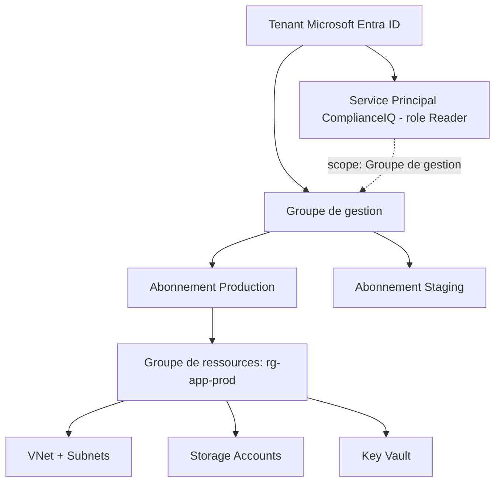

# PARTIE IX — FONDAMENTAUX MICROSOFT AZURE

# Chapitre 15 : Microsoft Azure — Architecture et Services Fondamentaux

> *« Azure est le fournisseur cible officiel du MVP de ComplianceIQ — chaque concept de ce chapitre n'est donc pas théorique : il sera directement implémenté dans le connecteur principal de la plateforme. »*

---

## 1. Objectifs pédagogiques

À la fin de ce chapitre, vous serez capable de :

- Expliquer l'organisation hiérarchique fondamentale d'Azure : **tenant Azure AD (Microsoft Entra ID), abonnements (subscriptions), groupes de ressources (resource groups), régions**.
- Décrire le rôle des services fondamentaux pertinents pour ComplianceIQ : **Microsoft Entra ID, Azure Resource Manager (ARM), Azure Resource Graph, Azure Policy, Azure Monitor, Key Vault**.
- Comprendre le modèle de contrôle d'accès **RBAC (Role-Based Access Control)** d'Azure et ses différences structurelles avec IAM AWS.
- Justifier pourquoi Azure Resource Graph constitue la pierre angulaire technique du connecteur MVP de ComplianceIQ.
- Poser les bases nécessaires à la Partie XI (Terraform azurerm provider) et à la Partie XX (découverte d'actifs via Resource Graph).

---

## 2. Problème du monde réel

Le cahier des charges de ComplianceIQ cible Azure comme fournisseur unique du MVP officiel. Cela signifie que la **qualité et la robustesse du connecteur Azure conditionnent directement la réussite du projet** dans son périmètre principal d'évaluation académique. Comprendre en profondeur la hiérarchie Azure (tenant → abonnement → groupe de ressources → ressource) et son modèle RBAC est donc un prérequis non négociable, bien plus critique pour ce projet que la même compréhension appliquée à AWS ou GCP, qui restent des extensions secondaires.

---

## 3. Évolution historique

| Année | Étape | Signification |
|---|---|---|
| 2010 | Lancement de Windows Azure | Entrée de Microsoft sur le marché du cloud public |
| 2014 | Renommage en Microsoft Azure, introduction d'ARM | Passage à un modèle de gestion de ressources unifié et déclaratif |
| 2014-2018 | Généralisation du RBAC Azure | Formalisation du contrôle d'accès basé sur les rôles |
| 2020+ | Azure Resource Graph atteint sa maturité | Requêtage à grande échelle de l'ensemble des ressources d'un tenant |
| 2023 | Renommage d'Azure AD en **Microsoft Entra ID** | Repositionnement de la gestion d'identité dans une suite de sécurité plus large |

---

## 4. Pourquoi les solutions précédentes ont échoué

Avant l'introduction d'**Azure Resource Manager (ARM)** en 2014, Azure utilisait un modèle de déploiement plus ancien (« Azure Service Management », ASM/RDFE) sans gestion cohérente des groupes de ressources ni de modèle déclaratif unifié — rendant l'audit de conformité et la gestion des permissions granulaires beaucoup plus complexes, chaque service ayant son propre modèle de gestion isolé.

---

## 5. Pourquoi cette approche a été inventée

**Azure Resource Manager** a été conçu pour unifier la gestion de **toutes** les ressources Azure sous un modèle unique et cohérent : chaque ressource, quel que soit son type, appartient à un **groupe de ressources**, possède des **tags**, et est gouvernée par les mêmes mécanismes de RBAC et de politique. Ce choix architectural — une seule API de gestion pour des centaines de types de ressources différents — est directement comparable au principe du modèle canonique introduit au Chapitre 2 : ARM est, en un sens, le **modèle canonique interne d'Azure lui-même**, ce qui explique pourquoi Azure Resource Graph (construit sur ARM) est un outil si naturellement adapté à un usage de conformité.

---

## 6. Concepts fondamentaux

### 6.1 Hiérarchie Azure : Tenant, Abonnement, Groupe de gestion, Groupe de ressources

- **Tenant Microsoft Entra ID** : instance dédiée d'annuaire d'identité, représentant l'organisation dans son ensemble — l'équivalent conceptuel le plus proche d'un compte racine AWS Organizations.
- **Groupe de gestion (Management Group)** : regroupement hiérarchique d'abonnements, permettant d'appliquer des politiques à grande échelle.
- **Abonnement (Subscription)** : limite de facturation et de quotas, comparable à un compte AWS individuel.
- **Groupe de ressources (Resource Group)** : conteneur logique de ressources liées, généralement organisées par application ou par environnement — un niveau hiérarchique **sans équivalent direct chez AWS**, une différence de modélisation que le modèle canonique de ComplianceIQ doit absorber (rappel Chapitre 2, section 19).

### 6.2 Azure Resource Manager (ARM)

Couche de gestion unifiée à travers laquelle toutes les opérations (création, modification, suppression, interrogation) sur toute ressource Azure transitent, exposée via une API REST cohérente et des modèles déclaratifs (templates ARM/Bicep).

### 6.3 Azure RBAC (Role-Based Access Control)

Modèle de contrôle d'accès attribuant des **rôles** (ensembles de permissions prédéfinies, ex. : `Reader`, `Contributor`, `Owner`) à des **principaux de sécurité** (utilisateurs, groupes, service principals) à un **niveau de portée (scope)** donné — tenant, groupe de gestion, abonnement, groupe de ressources, ou ressource individuelle. Cette portée hiérarchique à granularité variable est une différence structurelle importante par rapport au modèle de politiques IAM plus flexible mais plus verbeux d'AWS (approfondi en Partie XIII).

### 6.4 Azure Resource Graph

Service permettant d'interroger, via un langage proche de SQL (**KQL — Kusto Query Language**), l'ensemble des ressources d'un tenant à travers tous les abonnements, en une seule requête performante — l'outil technique central sur lequel repose le collecteur d'état du MVP Azure de ComplianceIQ.

### 6.5 Azure Policy et Key Vault

- **Azure Policy** : service natif de gouvernance permettant de définir des règles de conformité déclaratives (ex. : « tout stockage doit être chiffré ») et d'en auditer ou forcer l'application — un système directement analogue, à l'échelle mono-cloud, au moteur de règles de ComplianceIQ (Partie XXI).
- **Key Vault** : gestion sécurisée des secrets, certificats et clés de chiffrement, équivalent fonctionnel de KMS/Secrets Manager côté AWS.

---

## 7. Fondations scientifiques

- **Modèle RBAC formel** (Ferraiolo & Kuhn, 1992 ; Sandhu et al., 1996 — modèle NIST RBAC) : cadre académique standard sur lequel repose le RBAC Azure, définissant formellement rôles, permissions, et affectations.
- **Langages de requête déclaratifs (KQL, dérivé de concepts SQL et de l'algèbre relationnelle)** : fondement théorique permettant d'interroger efficacement un graphe de ressources à grande échelle, en cohérence directe avec l'algèbre relationnelle étudiée au Chapitre 2, section 7.
- **Hiérarchies de portée (scope hierarchies)** : modélisation en arbre du RBAC Azure, où les permissions accordées à un niveau supérieur (tenant, groupe de gestion) sont héritées par tous les niveaux inférieurs — une structure de données arborescente classique appliquée au contrôle d'accès.

---

## 8. Architecture interne (hiérarchie Azure pertinente pour ComplianceIQ)



---

## 9. Flux interne (interrogation Azure par ComplianceIQ)

1. Authentification via un **Service Principal** dédié, doté d'un rôle **Reader** attribué au niveau du **groupe de gestion** (portée maximale nécessaire pour couvrir tous les abonnements, tout en restant strictement en lecture seule).
2. Envoi d'une requête **KQL** à Azure Resource Graph, filtrant par type de ressource et propriétés pertinentes pour la conformité.
3. Réception d'une réponse structurée couvrant potentiellement des dizaines d'abonnements en une seule requête — un avantage architectural majeur par rapport au modèle AWS (nécessitant une itération explicite par compte).
4. Traduction des résultats vers le modèle canonique (Chapitre 2).

---

## 10. Décomposition en composants

| Composant Azure | Rôle pour ComplianceIQ |
|---|---|
| Service Principal + rôle Reader | Authentification en lecture seule à large portée |
| Azure Resource Graph (KQL) | Source principale d'inventaire et de configuration |
| Azure Policy (mode audit) | Source complémentaire de résultats de conformité déjà évalués nativement |
| Azure Monitor / Activity Log | Source de traçabilité des changements |
| Key Vault API | Vérification du statut des secrets et certificats |

---

## 11. Flux de données

```
[ComplianceIQ] --auth OAuth2 (Service Principal)--> [Microsoft Entra ID: token]
       --> [Azure Resource Graph API: requete KQL] --> [Etat des ressources multi-abonnements]
       --> [Azure Activity Log API] --> [Historique des changements]
       --> [Mapper Azure] --> [Modele canonique]
```

---

## 12. Cycle de vie

Le Service Principal utilisé par ComplianceIQ suit un cycle de vie rigoureux : **création via Microsoft Entra ID** → **attribution du rôle Reader au niveau de portée approprié** → **génération d'un secret ou certificat d'authentification, avec rotation périodique planifiée** → **audit régulier de son utilisation via Azure Activity Log** → **révocation en fin de mission**.

---

## 13. Perspective architecture d'entreprise

Une entreprise Azure mature organise typiquement ses abonnements selon une architecture de référence appelée **Azure Landing Zone**, avec une hiérarchie de groupes de gestion séparant production, non-production, et plateforme partagée. ComplianceIQ doit être conçu pour s'intégrer naturellement à cette architecture de référence plutôt que d'imposer sa propre structure — un point important à mentionner en soutenance pour démontrer une compréhension des pratiques d'entreprise réelles, pas seulement d'un environnement de test isolé.

---

## 14. Perspective sécurité

> **Note de sécurité** : le Service Principal de ComplianceIQ doit impérativement se voir attribuer le rôle **Reader** (lecture seule) et non **Contributor** ou **Owner**. De plus, l'authentification par **certificat** est préférable à l'authentification par **secret client**, ce dernier étant plus sujet à une fuite accidentelle (commit dans un dépôt de code, par exemple) — un risque à documenter explicitement dans le rapport de sécurité du projet.

---

## 15. Perspective performance

Azure Resource Graph impose des limites de pagination (généralement 1000 résultats par page) et des quotas de débit par tenant — ComplianceIQ doit implémenter une gestion de pagination robuste et un espacement des requêtes conforme aux quotas documentés par Microsoft pour éviter les erreurs de limitation de débit (`429 Too Many Requests`).

---

## 16. Scalabilité

L'un des avantages majeurs d'Azure Resource Graph, comparé à une itération manuelle par abonnement, est sa capacité à interroger **des centaines d'abonnements en une seule requête KQL**, réduisant considérablement la complexité de scalabilité par rapport à l'approche AWS multi-comptes du Chapitre 14, qui nécessite une itération explicite.

---

## 17. Haute disponibilité

Azure Resource Graph étant un service géré à haute disponibilité, la responsabilité de ComplianceIQ se limite à la gestion robuste des erreurs transitoires (retry avec backoff exponentiel) et à la mise en cache locale des résultats récents pour limiter l'impact d'une indisponibilité momentanée du service.

---

## 18. Bonnes pratiques

- Toujours privilégier l'authentification par certificat plutôt que par secret client pour le Service Principal.
- Toujours utiliser Azure Resource Graph comme source principale d'inventaire plutôt que d'itérer manuellement à travers les APIs de chaque type de ressource.
- Toujours attribuer le rôle Reader au niveau de portée le plus restreint compatible avec la couverture requise (éviter la portée « tenant root » si la portée « groupe de gestion » suffit).

---

## 19. Erreurs courantes

- Attribuer par erreur un rôle Contributor à un Service Principal destiné à un usage de lecture seule uniquement.
- Ignorer les limites de pagination d'Azure Resource Graph, provoquant une troncature silencieuse des résultats sur de grands tenants.

---

## 20. Anti-patterns

- **Le Service Principal universel** : utiliser le même Service Principal, avec les mêmes permissions larges, pour à la fois l'audit de conformité et le déploiement Terraform — mélangeant des responsabilités de lecture et d'écriture qui devraient être strictement séparées (voir Partie XIII sur l'IAM).

---

## 21. Alternatives

| Alternative | Description | Limite |
|---|---|---|
| Appels directs aux APIs ARM par type de ressource | Contrôle fin | Nécessite une itération par abonnement, plus lent |
| Azure Resource Graph (choix de ComplianceIQ) | Requêtage unifié multi-abonnements | Limites de pagination à gérer |
| Azure Policy comme source unique | Résultats de conformité déjà calculés nativement | Limité aux règles définies dans Azure Policy, pas de logique métier personnalisée multi-cloud |

---

## 22. Tableau comparatif

| Critère | APIs ARM directes | Azure Resource Graph | Azure Policy |
|---|---|---|---|
| Requêtage multi-abonnements en un appel | Non | Oui | Oui |
| Langage de requête expressif | Non (REST simple) | Oui (KQL) | Limité aux définitions de policy |
| Adapté comme source principale pour ComplianceIQ | Complémentaire | Principal | Complémentaire |

---

## 23-25. Implémentation technique par service

*(Chapitre dédié à Azure : ces sections détaillent l'implémentation technique directement, en miroir de la structure des autres chapitres.)*

L'intégration technique s'appuie sur le **Azure SDK for Python** (`azure-mgmt-resourcegraph`, `azure-identity`), avec le flux d'authentification `ClientCertificateCredential` (préféré, section 14) ou `ClientSecretCredential`, suivi d'appels à `resourcegraph_client.resources()` avec une requête KQL type :

```
Resources
| where type =~ 'microsoft.storage/storageaccounts'
| project name, resourceGroup, properties.encryption
```

Cette requête illustre concrètement comment ComplianceIQ peut extraire, en une seule opération, le statut de chiffrement de tous les comptes de stockage d'un tenant entier.

---

## 26. Études de cas en entreprise

**Cas 1 — Adoption d'Azure Landing Zone** : de nombreuses grandes entreprises ayant adopté l'architecture de référence Azure Landing Zone rapportent une réduction significative du temps nécessaire pour intégrer de nouveaux outils de gouvernance, précisément parce que la hiérarchie de groupes de gestion standardisée facilite l'attribution cohérente de rôles RBAC à des outils tiers comme ComplianceIQ.

---

## 27. Comment ComplianceIQ utilise ces concepts

Le connecteur Azure, cœur du MVP officiel de ComplianceIQ, s'authentifie via un Service Principal doté du rôle Reader au niveau du groupe de gestion cible, interroge l'ensemble des ressources via des requêtes KQL ciblées sur Azure Resource Graph (couvrant potentiellement plusieurs abonnements simultanément), et complète cette source par les résultats d'Azure Policy en mode audit lorsque disponibles, avant de tout traduire vers le modèle canonique multi-cloud défini au Chapitre 2.

---

## 28. Diagramme d'architecture (ASCII)

```
[ComplianceIQ] --auth (certificat)--> [Microsoft Entra ID] --token OAuth2--> [ComplianceIQ]
        |
        +--> [Azure Resource Graph: requete KQL] --> [Ressources multi-abonnements]
        +--> [Azure Policy: etats de conformite natifs] --> [Resultats complementaires]
        +--> [Azure Activity Log] --> [Historique des changements]
                                    |
                                    v
                        [Mapper Azure -> Modele canonique]
```

---

## 29. Résumé

Ce chapitre a détaillé l'organisation hiérarchique d'Azure (tenant, groupes de gestion, abonnements, groupes de ressources), le modèle RBAC, et le rôle central d'Azure Resource Graph comme source technique principale du connecteur MVP de ComplianceIQ, en insistant sur les bonnes pratiques de sécurité (authentification par certificat, rôle Reader à portée minimale) indispensables à un connecteur de conformité robuste.

---

## 30. Vocabulaire clé

| Terme | Définition |
|---|---|
| Tenant Microsoft Entra ID | Instance d'annuaire représentant l'organisation |
| Groupe de gestion | Regroupement hiérarchique d'abonnements pour une gouvernance à grande échelle |
| Groupe de ressources | Conteneur logique de ressources liées, spécifique à Azure |
| Azure RBAC | Modèle de contrôle d'accès basé sur des rôles à portée hiérarchique |
| Azure Resource Graph | Service de requêtage KQL multi-abonnements |
| Service Principal | Identité applicative non humaine utilisée pour l'authentification programmatique |

---

## 31. Questions de réflexion

1. Pourquoi le « groupe de ressources » Azure n'a-t-il pas d'équivalent direct chez AWS, et comment le modèle canonique de ComplianceIQ doit-il gérer cette asymétrie ?
2. En quoi Azure Resource Graph simplifie-t-il structurellement la découverte d'actifs à grande échelle par rapport à l'approche multi-comptes d'AWS ?

---

## 32. Questions d'entretien

1. Pourquoi privilégier l'authentification par certificat plutôt que par secret client pour le Service Principal de ComplianceIQ ?
2. Écrivez et expliquez une requête KQL type permettant de lister tous les comptes de stockage non chiffrés d'un tenant Azure.
3. À quel niveau de portée RBAC attribueriez-vous le rôle Reader du Service Principal de ComplianceIQ, et pourquoi ?

---

## 33. Références

- Microsoft Learn — Azure Resource Manager overview and Azure Resource Graph documentation architecture.
- Ferraiolo, D., Kuhn, R. — *Role-Based Access Control*, 15th National Computer Security Conference, 1992.
- Sandhu, R. et al. — *Role-Based Access Control Models*, IEEE Computer, 1996.
- Microsoft Cloud Adoption Framework — Azure Landing Zone architecture.

---

*Fin du Chapitre 15. Enchaînement direct sur le Chapitre 16 (Partie X — Fondamentaux Google Cloud Platform).*
