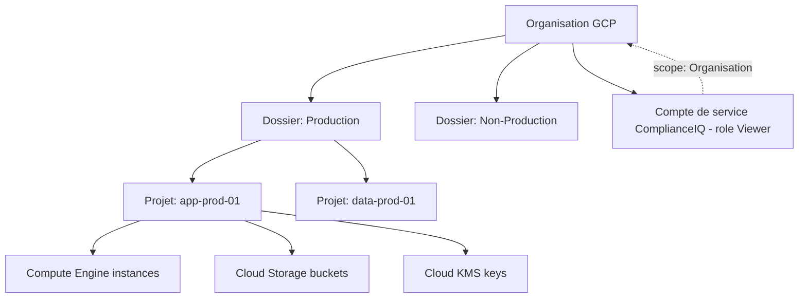

# PARTIE X — FONDAMENTAUX GOOGLE CLOUD PLATFORM

# Chapitre 16 : Google Cloud Platform — Architecture et Services Fondamentaux

> *« GCP est le troisième pilier de la stratégie multi-cloud de ComplianceIQ — moins prioritaire que le MVP Azure, mais essentiel pour prouver la portabilité réelle de l'architecture au-delà de deux fournisseurs. »*

---

## 1. Objectifs pédagogiques

À la fin de ce chapitre, vous serez capable de :

- Expliquer l'organisation hiérarchique fondamentale de GCP : **organisation, dossiers (folders), projets (projects)**.
- Décrire le rôle des services fondamentaux pertinents pour ComplianceIQ : **Cloud IAM, Compute Engine, Cloud Storage, Cloud Asset Inventory, Cloud KMS, Security Command Center**.
- Comprendre les spécificités du modèle IAM GCP (rôles primitifs, prédéfinis, personnalisés) et leurs différences avec AWS IAM et Azure RBAC.
- Justifier le rôle central de **Cloud Asset Inventory** comme équivalent GCP d'Azure Resource Graph et d'AWS Config pour la découverte d'actifs.
- Compléter la vision comparative multi-cloud entamée aux Chapitres 14 et 15, préparant la Partie XI (Terraform google provider).

---

## 2. Problème du monde réel

Une entreprise ayant historiquement investi dans l'écosystème Google (souvent via BigQuery pour l'analytique de données, ou via Google Workspace) peut adopter GCP comme fournisseur additionnel sans jamais y consolider l'intégralité de son infrastructure. ComplianceIQ doit être capable d'auditer ce parc GCP, potentiellement plus restreint mais tout aussi critique, avec la même rigueur que ses connecteurs AWS et Azure, malgré des différences structurelles significatives dans la hiérarchie organisationnelle et le modèle de permissions.

---

## 3. Évolution historique

| Année | Étape | Signification |
|---|---|---|
| 2008 | Lancement de Google App Engine | Premier service cloud public de Google (PaaS) |
| 2012 | Lancement de Compute Engine | Entrée de Google sur le marché IaaS |
| 2016 | Introduction de la hiérarchie Organisation/Dossier/Projet | Structuration formelle de la gouvernance à grande échelle |
| 2018 | Lancement de Cloud Asset Inventory | Réponse directe au besoin d'audit continu, comparable à AWS Config (2014) |
| 2020+ | Security Command Center atteint sa maturité | Consolidation de la posture de sécurité, comparable à AWS Security Hub et Azure Security Center |

---

## 4. Pourquoi les solutions précédentes ont échoué

Avant l'introduction de la hiérarchie Organisation/Dossier/Projet, la gestion de nombreux projets GCP indépendants (l'unité de base historique de GCP) sans structure de gouvernance centralisée rendait l'application cohérente de politiques de sécurité et l'audit à grande échelle extrêmement difficiles — chaque projet fonctionnant initialement de manière quasi autonome.

---

## 5. Pourquoi cette approche a été inventée

La hiérarchie Organisation/Dossier/Projet de GCP répond au même besoin de gouvernance à plusieurs niveaux que les groupes de gestion Azure ou AWS Organizations, mais avec une philosophie légèrement différente : le **projet** reste l'unité fondamentale et immuable de facturation et de regroupement de ressources chez GCP (contrairement au groupe de ressources Azure, qui est un simple conteneur logique à l'intérieur d'un abonnement) — une nuance importante pour le mapping vers le modèle canonique de ComplianceIQ.

---

## 6. Concepts fondamentaux

### 6.1 Hiérarchie GCP : Organisation, Dossier, Projet

- **Organisation** : nœud racine représentant l'entreprise, généralement lié à un domaine Google Workspace ou Cloud Identity.
- **Dossier (Folder)** : regroupement hiérarchique de projets, pouvant être imbriqué (contrairement aux groupes de gestion Azure, les dossiers GCP supportent une profondeur arbitraire).
- **Projet (Project)** : unité fondamentale de facturation, de quotas, et de regroupement de ressources — l'équivalent le plus proche d'un compte AWS ou d'un abonnement Azure, mais à une granularité souvent plus fine (une entreprise GCP peut posséder des centaines de projets, contre quelques dizaines de comptes/abonnements chez AWS/Azure).

### 6.2 Cloud IAM GCP

Modèle de permissions basé sur trois catégories de rôles :
- **Rôles primitifs** (`Owner`, `Editor`, `Viewer`) : très larges, hérités des débuts de GCP, déconseillés pour un usage de production fin.
- **Rôles prédéfinis** (`roles/storage.objectViewer`, etc.) : granularité par service, recommandés pour la plupart des cas d'usage.
- **Rôles personnalisés** : ensembles de permissions définis sur mesure, utiles pour un principe de moindre privilège strict.

### 6.3 Cloud Asset Inventory

Service permettant de capturer un instantané et un historique de l'ensemble des ressources d'une organisation GCP, avec des capacités de recherche et un flux de notifications en temps réel (Feed) — l'équivalent fonctionnel direct d'AWS Config et d'Azure Resource Graph, bien que reposant sur un modèle de requêtage différent (moins expressif que le KQL d'Azure, davantage orienté recherche par filtre).

### 6.4 Compute Engine, Cloud Storage, Cloud KMS

- **Compute Engine** : instances de calcul virtualisées, équivalent d'EC2/VM Azure.
- **Cloud Storage** : stockage objet, équivalent de S3/Blob Storage, avec un modèle de contrôle d'accès combinant IAM et listes de contrôle d'accès (ACL) hérité historiquement.
- **Cloud KMS** : gestion des clés de chiffrement, équivalent de KMS AWS/Key Vault Azure.

---

## 7. Fondations scientifiques

- **Modèle de permissions hiérarchique avec héritage** : les permissions accordées au niveau organisation ou dossier sont héritées par tous les projets descendants — une application directe de la théorie des arbres et de l'héritage de propriétés, identique en substance au modèle RBAC hiérarchique d'Azure (Chapitre 15, section 7), mais avec une profondeur d'imbrication potentiellement plus grande côté GCP.
- **Systèmes de recherche indexée à grande échelle** : Cloud Asset Inventory s'appuie sur des techniques d'indexation similaires à celles utilisées par les moteurs de recherche (index inversés), permettant une recherche rapide parmi des millions de ressources.

---

## 8. Architecture interne (hiérarchie GCP pertinente pour ComplianceIQ)



---

## 9. Flux interne (interrogation GCP par ComplianceIQ)

1. Authentification via un **compte de service** dédié, doté du rôle prédéfini `roles/viewer` (ou d'un rôle personnalisé plus restreint), attribué au niveau de l'**organisation** pour couvrir l'ensemble des dossiers et projets.
2. Interrogation de **Cloud Asset Inventory** via son API de recherche (`searchAllResources`, `searchAllIamPolicies`) pour obtenir l'inventaire complet et les politiques d'accès associées.
3. Complément par des appels ciblés aux APIs spécifiques (Cloud Storage, Cloud KMS) pour des attributs de sécurité fins.
4. Traduction des résultats vers le modèle canonique (Chapitre 2).

---

## 10. Décomposition en composants

| Composant GCP | Rôle pour ComplianceIQ |
|---|---|
| Compte de service + rôle Viewer | Authentification en lecture seule à large portée |
| Cloud Asset Inventory (searchAllResources) | Source principale d'inventaire multi-projets |
| Cloud Asset Inventory Feed | Détection événementielle des changements (Chapitre 3) |
| Cloud Logging (Admin Activity logs) | Source de traçabilité des changements |
| Cloud KMS API | Vérification du statut de chiffrement |

---

## 11. Flux de données

```
[ComplianceIQ] --auth (Service Account JSON key ou Workload Identity)--> [Google Auth: token OAuth2]
       --> [Cloud Asset Inventory API: searchAllResources] --> [Inventaire multi-projets]
       --> [Cloud Logging API] --> [Historique des changements]
       --> [Mapper GCP] --> [Modele canonique]
```

---

## 12. Cycle de vie

Le compte de service utilisé par ComplianceIQ suit un cycle de vie similaire à celui décrit pour AWS et Azure : **création** → **attribution du rôle Viewer au niveau organisation** → **génération d'une clé d'authentification (idéalement remplacée par Workload Identity Federation, évitant toute clé statique)** → **audit périodique via Cloud Logging** → **révocation en fin de mission**.

---

## 13. Perspective architecture d'entreprise

Les entreprises GCP matures adoptent généralement une architecture de référence similaire aux Landing Zones Azure/AWS, avec une hiérarchie de dossiers séparant environnements et unités métier, et l'utilisation de **Organization Policy Constraints** pour appliquer des contraintes de gouvernance à l'échelle de l'organisation entière — un mécanisme conceptuellement proche d'Azure Policy.

---

## 14. Perspective sécurité

> **Note de sécurité** : GCP recommande fortement l'usage de **Workload Identity Federation** plutôt que des clés de compte de service statiques (fichiers JSON), ces dernières étant une source fréquente de fuites d'identifiants (commit accidentel dans un dépôt de code). Pour un projet académique comme ComplianceIQ, l'utilisation d'une clé JSON peut être acceptable en environnement de développement, mais doit être explicitement signalée comme une limitation à corriger avant toute mise en production réelle.

---

## 15. Perspective performance

L'API `searchAllResources` de Cloud Asset Inventory impose des quotas de requêtes par minute et une pagination par jetons de continuation (`pageToken`) — ComplianceIQ doit gérer cette pagination de manière robuste pour garantir l'exhaustivité de l'inventaire sur de grandes organisations.

---

## 16. Scalabilité

Comme Azure Resource Graph, Cloud Asset Inventory permet d'interroger l'ensemble d'une organisation en une seule série d'appels paginés, sans nécessiter d'itération manuelle projet par projet — un avantage architectural partagé avec Azure et contrastant avec l'approche par compte d'AWS.

---

## 17. Haute disponibilité

Cloud Asset Inventory étant un service géré à haute disponibilité par Google, la responsabilité de ComplianceIQ se limite, comme pour les autres fournisseurs, à la gestion robuste des erreurs transitoires et à la mise en cache locale des résultats récents.

---

## 18. Bonnes pratiques

- Toujours privilégier Workload Identity Federation à une clé de compte de service statique lorsque l'environnement d'exécution le permet.
- Toujours utiliser Cloud Asset Inventory comme source principale d'inventaire plutôt que d'itérer manuellement projet par projet.
- Toujours attribuer le rôle Viewer (ou un rôle personnalisé restreint) au niveau organisation, jamais un rôle Owner ou Editor.

---

## 19. Erreurs courantes

- Utiliser une clé de compte de service statique en production sans plan de rotation ni migration vers Workload Identity Federation.
- Ignorer la pagination de l'API Cloud Asset Inventory, provoquant une troncature silencieuse de l'inventaire sur de grandes organisations.

---

## 20. Anti-patterns

- **Le compte de service « Editor » universel** : accorder par erreur le rôle `Editor` (autorisant la modification) à un compte de service destiné exclusivement à un usage d'audit en lecture seule.

---

## 21. Alternatives

| Alternative | Description | Limite |
|---|---|---|
| Appels directs par service (Compute, Storage séparément) | Contrôle fin | Nécessite une itération projet par projet |
| Cloud Asset Inventory (choix de ComplianceIQ) | Requêtage unifié multi-projets | Langage de requête moins expressif que KQL Azure |
| Security Command Center comme source unique | Résultats de sécurité déjà agrégés | Limité à l'écosystème GCP, fonctionnalités avancées réservées au niveau Premium |

---

## 22. Tableau comparatif

| Critère | Appels API directs | Cloud Asset Inventory | Security Command Center |
|---|---|---|---|
| Requêtage multi-projets en un appel | Non | Oui | Oui (selon niveau) |
| Expressivité du langage de requête | Non applicable | Modérée (filtres) | Limitée aux résultats prédéfinis |
| Adapté comme source principale pour ComplianceIQ | Complémentaire | Principal | Complémentaire |

---

## 23-25. Implémentation technique

*(Chapitre dédié à GCP : implémentation détaillée directement.)*

L'intégration technique s'appuie sur la **Google Cloud Client Library for Python** (`google-cloud-asset`), avec authentification via `google.auth` (Workload Identity Federation recommandé, ou clé JSON en développement), suivi d'appels à `AssetServiceClient.search_all_resources()` avec un filtre de type d'actif, par exemple :

```
asset_types = ["storage.googleapis.com/Bucket"]
scope = "organizations/123456789"
```

Cette requête permet d'extraire, en une opération paginée, l'ensemble des buckets Cloud Storage de toute l'organisation, avant d'en vérifier individuellement les politiques d'accès public via l'API Cloud Storage dédiée.

---

## 26. Études de cas en entreprise

**Cas 1 — Migration vers Workload Identity Federation** : plusieurs grandes entreprises technologiques ont documenté publiquement leur migration progressive hors des clés de compte de service statiques vers Workload Identity Federation, réduisant significativement leur surface d'exposition aux fuites d'identifiants — une pratique que ComplianceIQ devrait recommander explicitement dans ses propres rapports de conformité lorsqu'il détecte l'usage de clés statiques chez ses utilisateurs.

---

## 27. Comment ComplianceIQ utilise ces concepts

Le connecteur GCP (module exploratoire du projet, développé en parallèle du MVP Azure officiel) s'authentifie via un compte de service doté du rôle Viewer au niveau organisation, interroge l'inventaire complet via Cloud Asset Inventory (`searchAllResources`), complète cette source par des appels ciblés à Cloud Storage et Cloud KMS pour les attributs de sécurité fins, avant de traduire l'ensemble vers le modèle canonique multi-cloud défini au Chapitre 2 — complétant ainsi la démonstration de portabilité de l'architecture entamée avec les connecteurs AWS et Azure.

---

## 28. Diagramme d'architecture (ASCII)

```
[ComplianceIQ] --auth (Workload Identity / cle JSON)--> [Google Auth: token OAuth2]
        |
        +--> [Cloud Asset Inventory: searchAllResources] --> [Inventaire multi-projets]
        +--> [Cloud Storage API: getIamPolicy]            --> [Politiques d'acces buckets]
        +--> [Cloud KMS API: getKeyRing]                   --> [Statut de chiffrement]
        +--> [Cloud Logging: Admin Activity]               --> [Historique des changements]
                                    |
                                    v
                        [Mapper GCP -> Modele canonique]
```

---

## 29. Résumé

Ce chapitre a complété la vision comparative multi-cloud entamée aux Chapitres 14 et 15, en détaillant la hiérarchie Organisation/Dossier/Projet de GCP, son modèle Cloud IAM à trois catégories de rôles, et le rôle central de Cloud Asset Inventory comme source d'inventaire — tout en soulignant les bonnes pratiques de sécurité spécifiques à GCP, notamment la préférence pour Workload Identity Federation plutôt que des clés statiques.

---

## 30. Vocabulaire clé

| Terme | Définition |
|---|---|
| Organisation GCP | Nœud racine de la hiérarchie, lié au domaine de l'entreprise |
| Dossier (Folder) | Regroupement hiérarchique imbriqué de projets |
| Projet (Project) | Unité fondamentale de facturation et de regroupement de ressources GCP |
| Rôle primitif/prédéfini/personnalisé | Trois catégories de granularité de permissions Cloud IAM |
| Cloud Asset Inventory | Service d'inventaire et d'historique des ressources GCP |
| Workload Identity Federation | Mécanisme d'authentification évitant les clés de compte de service statiques |

---

## 31. Questions de réflexion

1. En quoi la granularité plus fine des projets GCP (comparée aux comptes AWS ou abonnements Azure) impacte-t-elle la conception du connecteur ComplianceIQ ?
2. Pourquoi Workload Identity Federation constitue-t-il une amélioration de sécurité significative par rapport aux clés de compte de service statiques ?

---

## 32. Questions d'entretien

1. Comparez les trois catégories de rôles Cloud IAM (primitifs, prédéfinis, personnalisés) et justifiez celle que vous choisiriez pour le compte de service de ComplianceIQ.
2. Comment Cloud Asset Inventory permet-il d'auditer efficacement une organisation GCP comportant plusieurs centaines de projets ?

---

## 33. Références

- Google Cloud Architecture Framework — pilier Sécurité et Gouvernance.
- Documentation technique Google Cloud IAM et Cloud Asset Inventory (modèle de permissions et architecture de requêtage).

---

*Fin du Chapitre 16, et fin des Parties VIII-X (Fondamentaux AWS/Azure/GCP). Enchaînement sur le Chapitre 17 (Partie XI — Théorie de l'Infrastructure as Code).*
