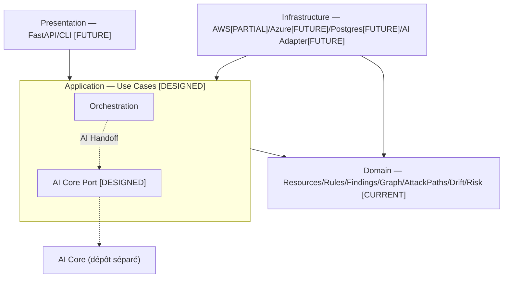
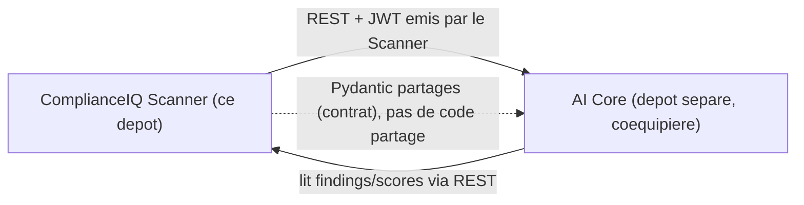

# ComplianceIQ — Senior Architecture Blueprint

> Architecture uniquement. Aucun code écrit. Chaque affirmation d'état
> distingue explicitement **CURRENT** (existe et testé dans `ciq/`),
> **DESIGNED** (architecture définie ici, non implémentée) et **FUTURE**
> (hors périmètre volontaire).

---

## 1. Executive Architecture

ComplianceIQ Scanner est aujourd'hui un pipeline déterministe **CURRENT** :
Découverte → Normalisation → Resource Graph → Rule Engine contextuel →
Attack Path → Drift → Finding, sans Terraform, sans Application layer
formelle, sans Infrastructure de persistance, sans frontière AI Core
matérialisée. Ce document conçoit l'architecture cible permettant d'ajouter
ces couches sans réécrire ce qui existe.

## 2. Architectural Principles

| Couche | Contient | Ne contient JAMAIS |
|---|---|---|
| **Domain** | Entités, Value Objects, services de domaine purs | SDK cloud, Terraform, FastAPI, ORM, client AI/LLM |
| **Application** | Use cases, orchestration, ports (interfaces) | Détail d'implémentation d'un SDK, requête SQL brute |
| **Infrastructure** | Adaptateurs concrets (AWS, Azure, Postgres, AI client) | Décision métier |
| **Presentation** | FastAPI, CLI | Logique métier |
| **Terraform** | Provisioning de test | Toute logique du moteur de conformité |

Règle de dépendance : `Infrastructure → Application → Domain`, jamais
l'inverse. **Vérifié CURRENT** dans le code existant (`grep` exhaustif
confirme que `scanner/` — le futur `domain/` — ne dépend que de `pydantic`
et `yaml.safe_load`, aucun SDK cloud).



---

## 3. Domain Architecture

```
domain/
├── resources/    NormalizedResource, ResourceRelationship, CloudProvider  [CURRENT]
├── rules/          Rule, RuleCondition (dict brut valide a l'evaluation)   [CURRENT]
├── findings/         Finding, Evidence, FindingStatus                      [CURRENT]
├── graph/               ResourceGraph, GraphNode, GraphEdge                  [CURRENT]
├── attack_paths/           AttackPath, PathDiscovery, Scorer                   [CURRENT]
├── drift/                    DriftEvent, canonicalisation, DiffEngine           [CURRENT]
├── risk/                        RiskScore, ConfidenceScore                        [CURRENT]
├── compliance/                     FrameworkMapping, ComplianceAssessment          [DESIGNED]
├── tenants/                           Tenant, isolation                               [DESIGNED — aujourd'hui, isolation
│                                                                                        vérifiée au niveau ResourceGraph/
│                                                                                        RuleEngine, pas d'entité Tenant]
└── shared/                                identifiants, enums communs                  [CURRENT, partiel]
```

Pour chaque module, ce qu'il ne doit **jamais** connaître : `resources/`,
`rules/`, `graph/`, `attack_paths/`, `drift/`, `risk/` ne connaissent
jamais un SDK cloud (vérifié) ; `compliance/` (à construire) ne doit jamais
connaître le contrat AI Core (frontière étanche, §26).

**Invariants déjà vérifiés par test (CURRENT)** : un attribut non collecté
ne devient jamais silencieusement conforme ; un nœud de graphe d'un autre
tenant est rejeté à la construction ; un chemin d'attaque bloqué score 0.

---

## 4. Application Architecture — DESIGNED

```
application/
├── scanning/       ScanCloudAccount (use case principal)
├── rules/            EvaluateRules, LoadRuleCatalog
├── findings/           QueryFindings
├── graph/                 BuildResourceGraph
├── attack_paths/             AnalyzeAttackPaths
├── drift/                       DetectDrift
├── risk/                           EnrichRisk
└── tenants/                           ManageTenant
```

### Use Case central : `ScanCloudAccount`

| | |
|---|---|
| Input | `tenant_id`, `provider`, `credentials_reference`, `scan_configuration` |
| Output | `ScanResult` |
| Séquence interne | discover → normalize → build graph → evaluate rules → correlate findings → calculate risk → discover attack paths → detect drift → produce final findings |
| Statut | **DESIGNED** — `ScanService.run()` (CURRENT) remplit déjà informellement ce rôle, sans être situé dans une couche `application/` formelle ni sans `credentials_reference` (la session cloud est injectée directement, pas encore résolue depuis une référence tenant) |

**Note architecturale** : le `ScanService` actuel orchestre déjà exactement
la séquence ci-dessus (Graph avant Rules, Attack Path avant Risk final —
justifié dans le docstring du code) — la migration vers `application/`
formalise, elle ne redessine pas.

---

## 5. Infrastructure Architecture

```
infrastructure/
├── cloud/
│   ├── aws/        [PARTIAL — collecteur S3/SG/IAM Users, pas RDS/EC2/CloudTrail/KMS/EBS/VPC]
│   └── azure/         [FUTURE — aucun code]
├── persistence/          [FUTURE]
├── rules/                    yaml loader [CURRENT, informel dans rule_engine.py]
├── graph/                       ResourceGraphPort — interface posee, aucune implementation [DESIGNED]
├── scanning/                        [DESIGNED]
├── ai/                                  adaptateur AI Core [FUTURE — voir §26]
├── identity/                                JWT issuance [FUTURE — Core Service EMET le JWT
│                                             d'après le contrat mémorisé avec l'AI Service]
├── observability/                               [FUTURE]
└── configuration/                                   [FUTURE]
```

---

## 6. AWS Adapter Architecture

**CURRENT** : `AwsCollector` reçoit une `boto3.Session` injectée (jamais
construite en interne — isolation SDK vérifiée). Collecte : S3
(`_collect_s3`), Security Groups (`_collect_security_groups`), IAM Users
(`_collect_iam_users`). Chaque appel isolé par `_safe()` — un échec sur un
service n'empêche pas la collecte des autres.

**GAP CURRENT identifié** : aucune pagination (`NextToken`/`Marker`) sur
les appels existants — collecte silencieusement incomplète sur un grand
compte.

**FUTURE (non implémenté)** : EC2, RDS, CloudTrail, KMS, EBS, VPC.

| Ressource | Statut |
|---|---|
| S3 | CURRENT |
| Security Groups | CURRENT |
| IAM Users | CURRENT |
| IAM Roles, EC2, RDS, CloudTrail, KMS, EBS, VPC | FUTURE |

## 7. Azure Adapter Architecture — FUTURE (aucun code)

**DESIGNED** : mêmes ports (`BaseCollector`), même
`NormalizedResource` de sortie. Concepts Azure propres (subscription,
resource group, managed identity, RBAC ARM) doivent se mapper vers le
modèle canonique sans forcer une symétrie artificielle avec AWS — un
concept sans équivalent AWS reste dans `attributes` (libre), jamais forcé
dans un champ typé commun.

---

## 8. Resource Normalization

**CURRENT** (`schema.py::NormalizedResource`) : `resource_id`,
`resource_type`, `cloud_provider`, `tenant_id`, `region`, `attributes`
(libre), `tags`, `relationships`, `collected_at`.

**Recommandation (trade-off tranché)** : `resource_type` reste aujourd'hui
un nom **provider-spécifique** (`s3_bucket`), pas une catégorie
provider-agnostique. **RECOMMENDATION** : ne PAS introduire une catégorie
abstraite (`OBJECT_STORAGE`) tant qu'Azure n'existe pas réellement — la
construire maintenant serait spéculatif ; le jour où Azure produit
`blob_container`, un mapping explicite `resource_type → canonical_category`
(table de correspondance, pas un enum figé dans le domaine) résout le
problème sans rupture rétroactive.

---

## 9. Rule Engine Architecture

**CURRENT**, vérifié sans `eval()`/`exec()` (`grep` exhaustif). Modèle :
`Rule` (dict `condition` brut, validé à l'exécution par un évaluateur
récursif pur Python — `conditions.py`), logique à 3 états
(`matched`/`not_matched`/`indeterminate`, Kleene), opérateurs `equals`,
`not_equals`, `greater_than`, `less_than`, `contains`, `not_contains`,
`in`, `not_in`, `exists`, `not_exists` — **tous CURRENT**, 6 sur 10 non
encore utilisés par les 33 règles réelles.

AND/OR/NOT et feuilles contextuelles (`source: graph`, registre fermé de
fonctions) **CURRENT** dans le moteur, **non exploitées** par aucune règle
réelle aujourd'hui — capacité posée, catalogue en retard sur elle.

---

## 10. Graph Architecture

**CURRENT**, `ResourceGraph` (agrégat scopé tenant), `GraphNode`,
`GraphEdge` (`blocked: bool`). Relations : `CONTAINS`, `CONNECTS_TO`,
`PROTECTS`, `ALLOWS`, `ASSUMES`, `ACCESSES`, `ATTACHED_TO`,
`PUBLICLY_EXPOSED` — fermé, chaque valeur justifiée par une capacité de
collecte réelle.

**Qui crée le graphe** : `GraphBuilder.build()`, appelé par
`ScanService`/futur `application/scanning/`. **Qui le possède** : le use
case du scan (durée de vie = un scan, reconstruit à chaque fois, jamais
persisté aujourd'hui). **Qui le mute** : personne après construction (pas
d'API de mutation incrémentale). **Isolation tenant** : vérifiée à
`add_node` (CURRENT, testé). **Intégrité référentielle** : `add_edge` lève
si un nœud référencé n'existe pas (CURRENT, testé).

---

## 11. Attack Path Architecture

**CURRENT**, composants séparés (`PathDiscovery`, `PathConstraintEvaluator`,
`AttackPathScorer`, `AttackTechniqueMapper`, `AttackPathAnalyzer`). Entrée :
`__internet__` (nœud spécial, créé seulement si exposition réelle
détectée). Sortie : `AttackPath` (nodes, edges, `risk_score`, `severity`,
`attack_techniques`, `contributing_finding_ids`, `algorithm_version`).

**Pourquoi séparé des Findings individuels** : un `Finding` répond "cette
ressource viole cette règle" ; un `AttackPath` répond "cette combinaison de
findings, dans ce contexte de graphe, constitue un risque composite" — une
question de nature différente, un objet de domaine différent, avec son
propre versioning (`algorithm_version`) car l'algorithme évoluera
indépendamment du Rule Engine.

---

## 12. Drift Architecture

**CURRENT** pour le modèle (`DriftEvent`, `canonicalize()`, `DiffEngine`).
**Séparation stricte** (déjà respectée) : le modèle de domaine
(`drift/models.py`, `canonicalization.py`, `diff_engine.py`) ne connaît
aucune notion de persistance — `DiffEngine.compare(previous, current)`
prend deux dicts en mémoire. La persistance de `ResourceSnapshot` reste
**FUTURE**, une responsabilité d'`infrastructure/persistence/`, jamais
mélangée au domaine.

---

## 13. Risk Architecture

**CURRENT**. `Severity` (issue de la règle, statique par définition de
règle) ≠ `RiskScore` (0-100, contextuel : sévérité 40% + exposition 25% +
environnement 10% + confiance 10% + implication attack path 15%,
`model_version="crsf-1.1"`) ≠ `ConfidenceScore` (fiabilité de la collecte
elle-même). Ce ne sont pas la même chose parce qu'ils répondent à trois
questions différentes : *"combien c'est grave dans l'absolu"*, *"combien
c'est grave ici, maintenant"*, *"à quel point peut-on faire confiance à
cette donnée"*.

**Points d'extension (DESIGNED)** : le facteur `attack_path_involvement`
est déjà un point d'extension exercé (ajouté en v1.1 sans casser
`crsf-1.0`) — le même mécanisme (nouveau facteur pondéré, nouvelle version)
s'applique à tout facteur futur (segmentation réseau, MFA sur l'identité).

---

## 14. Terraform Architecture — DESIGNED (aucun fichier `.tf` dans ce dépôt)

```
terraform/
├── modules/     briques reutilisables par ressource
├── aws/           instanciation des modules AWS
├── azure/            instanciation des modules Azure
├── scenarios/           compositions nommees (voir §16)
├── environments/            dev/test, isolees par backend d'etat
├── tests/                      validation syntaxe + plan + apply + assertions
├── scripts/                       orchestration scan-apres-apply
└── docs/                              une note par scenario
```

Principe non négociable : **Terraform ne contient jamais de logique du
moteur de conformité** — il ne fait QUE provisionner, jamais évaluer.

## 15. Terraform Modules — DESIGNED

| Module AWS | Sortie compliant | Sortie non-compliant |
|---|---|---|
| `s3` | bucket privé, chiffré, versionné | bucket public, non chiffré |
| `security_group` | règles restrictives | `0.0.0.0/0` sur port sensible |
| `iam_user` | MFA actif | MFA absent |
| `iam_role` | privilège minimal | `AdministratorAccess` |
| `rds` | non public, chiffré | public, non chiffré |
| `cloudtrail` | multi-région, validation activée | mono-région |
| `kms` | rotation activée | rotation désactivée |
| `ebs` | chiffré | non chiffré |
| `vpc` | flow logs activés | flow logs absents |

Module Azure symétrique par fonction, jamais par implémentation identique
(ADR-008, §22).

## 16. Terraform Scenario Architecture — DESIGNED

```
scenarios/
├── aws/
│   ├── s3/{public,private}/
│   ├── network/{ssh-open,database-open,restricted}/
│   ├── identity/{no-mfa,least-privilege,privileged-role}/
│   ├── database/{public-rds,private-rds}/
│   ├── attack-paths/{public-ec2-to-s3,public-rds}/
│   ├── encryption/{unencrypted-ebs,kms-rotation-disabled}/
│   └── logging/{cloudtrail-misconfigured}/
└── azure/{storage,network,compute,identity,database,secrets,attack-paths}/
```

Un scénario = une composition Terraform **avec de vraies dépendances**
(pas des ressources isolées) reproduisant un chemin d'attaque réel — voir
§23.

## 17. Compliant/Vulnerable Matrix — DESIGNED

| Paire | Pourquoi essentielle |
|---|---|
| `s3-public-vulnerable` / `s3-private-compliant` | Prouve qu'une règle détecte le cas PASS autant que le cas FAIL — sans la paire, un test pourrait "toujours dire FAIL" sans être réellement discriminant |
| `rds-public-vulnerable` / `rds-private-compliant` | idem |
| `ec2-open-role-vulnerable` / `ec2-restricted-role-compliant` | Valide l'Attack Path Engine dans les deux sens : un chemin doit apparaître pour le premier, disparaître pour le second |

## 18. Resource Coverage Matrix

| Cloud | Service | Ressource | Module TF | Scénario | Collecteur | Type normalisé | Relations | Règles | Findings attendus | Attack path | Statut |
|---|---|---|---|---|---|---|---|---|---|---|---|
| AWS | S3 | Bucket | DESIGNED | DESIGNED | CURRENT | `s3_bucket` | `PUBLICLY_EXPOSED` | 9 (storage) | oui | oui | CURRENT (collecteur+règles), TF DESIGNED |
| AWS | EC2 | Security Group | DESIGNED | DESIGNED | CURRENT | `security_group` | `PUBLICLY_EXPOSED`, `ALLOWS` | 6 (network) | oui | oui | idem |
| AWS | IAM | User | DESIGNED | DESIGNED | CURRENT | `iam_user` | `ASSUMES` (non peuplé) | 7 (iam) | oui | oui (privilège) | idem |
| AWS | RDS | Instance | DESIGNED | DESIGNED | **FUTURE** (non collecté, `MISSING COLLECTOR CAPABILITY` documenté dans le code) | `rds_instance` | cible dans `MockAwsCollector` uniquement | 9 (storage/network) | oui (mock seulement) | oui (mock seulement) | PARTIAL |
| AWS | CloudTrail | Trail | FUTURE | DESIGNED | **FUTURE** | `cloudtrail` | — | 6 (logging) | oui (mock seulement) | non | PARTIAL |
| AWS | EC2/RDS/CloudTrail/KMS/EBS/VPC | — | FUTURE | FUTURE | FUTURE | — | — | — | — | — | FUTURE |
| Azure | * | * | FUTURE | FUTURE | FUTURE | — | — | — | — | — | FUTURE |

---

## 19. Testing Architecture

**CURRENT** : 90 tests écrits, 84 exécutés (domaine pur, aucun mock requis
— rien à mocker puisque le domaine ne dépend d'aucune infra), 6 non
exécutés (`moto`/`boto3` absents).

**DESIGNED — Terraform Integration Test** :
```
Terraform apply (scenario vulnerable)
   -> ComplianceIQ scan reel
   -> Finding attendu en FAIL, sur la bonne resource, bonne severite
   -> Relation de graphe attendue presente
   -> Attack Path attendu detecte
   -> Terraform destroy
```
Un scénario est réussi si et seulement si CHAQUE assertion de cette chaîne
passe — pas seulement "un Finding est apparu".

---

## 20. Dependency Rules

|  | Domain | Application | Infrastructure | Presentation | Terraform | AI Core |
|---|---|---|---|---|---|---|
| Domain | ✓ | ✗ | ✗ | ✗ | ✗ | ✗ |
| Application | ✓ | ✓ | ✗ | ✗ | ✗ | ✓ (via port) |
| Infrastructure | ✓ | ✓ | ✓ | ✗ | ✗ | ✓ (adaptateur) |
| Presentation | ✓ | ✓ | ✗ | ✓ | ✗ | ✗ |
| Terraform | ✗ | ✗ | ✗ | ✗ | ✓ | ✗ |
| AI Core | ✗ | ✗ | ✗ | ✗ | ✗ | ✓ |

Correction par rapport à la matrice suggérée dans le prompt d'origine :
**Application dépend de l'AI Core via un port**, pas directement — c'est
la seule flèche sortant d'`Application` vers autre chose que `Domain`,
justifiée par le besoin d'orchestrer l'appel AI sans que `Domain` ne le
sache (§26).

---

## 21. Complete Project Tree

```
complianceiq/
├── domain/            [CURRENT, a deplacer depuis scanner/ — voir docs deja produits]
├── application/          [DESIGNED]
├── infrastructure/          [PARTIAL : collectors/ CURRENT, reste FUTURE]
├── presentation/               [FUTURE]
├── rules/                         [CURRENT — 33 regles, 5 fichiers]
├── terraform/                        [DESIGNED, aucun fichier .tf present]
│   ├── modules/ aws/ azure/ scenarios/ environments/ tests/ docs/
├── tests/                                [CURRENT — 90 tests]
├── docs/                                    [CURRENT — 43 fichiers deja generes,
│                                              session anterieure]
└── contracts/                                  [DESIGNED — schema Finding v1,
                                                   AI Core contract fige, voir §26]
```

Pour chaque dossier de premier niveau : appartenance de couche, dépendances
autorisées/interdites — voir §20, déjà exhaustif.

---

## 22. Architectural Decision Records

| ADR | Décision | Alternative rejetée | Conséquence |
|---|---|---|---|
| ADR-001 | Clean/Hexagonal | Monolithe non structuré | Restructuration progressive possible sans réécriture |
| ADR-002 | Isolation provider stricte | Branches `if provider==` | AWS/Azure ajoutables sans toucher au Rule Engine (déjà vérifié : zéro branche provider dans `rule_engine.py`) |
| ADR-003 | `NormalizedResource` avec `attributes` libre | Schéma strict par type de ressource | Pas de perte de données provider-spécifiques, prix : validation faible sur `attributes` |
| ADR-004 | `Rule.condition` en dict validé à l'exécution | Modèle Pydantic récursif typé | Évite la fragilité d'un Union polymorphe récursif |
| ADR-005 | Graphe en mémoire, PostgreSQL relationnel visé (pas Neo4j) | Neo4j dès le départ | Un port (`ResourceGraphPort`) permet un remplacement futur sans toucher au domaine, si le volume le justifie un jour, mesuré |
| ADR-006 | Attack Path comme entité séparée du Finding | Champ `attack_path_score` sur Finding | Un chemin composite a un cycle de vie et un versioning (`algorithm_version`) propres |
| ADR-007 | Terraform scenario-driven, jamais un `main.tf` unique | Un seul environnement géant | Isolation, destruction ciblée, paires compliant/vulnerable testables indépendamment |
| ADR-008 | Symétrie AWS/Azure par fonction, pas par implémentation | Forcer un module Azure identique à AWS | Respecte les concepts natifs Azure (RBAC, managed identity) sans traduction artificielle |
| ADR-009 | Paires compliant/vulnerable systématiques | Scénarios vulnérables seuls | Prouve qu'une règle discrimine réellement, pas seulement qu'elle "trouve toujours quelque chose" |
| ADR-010 | Isolation tenant vérifiée au niveau du Domain lui-même | Isolation uniquement applicative/API | Défense en profondeur — déjà CURRENT et testé sur `ResourceGraph`/`RuleEngine`, avant même que Persistence/API n'existent |

---

## 23. Anti-Patterns — interdits explicitement

SDK AWS/Azure dans `Domain` ; logique Terraform dans `Application` ;
parsing YAML dans une entité `Rule` elle-même (le parsing reste dans
l'infrastructure/loader, l'entité ne reçoit que des données déjà validées) ;
dépendance FastAPI dans `Domain` ; credentials cloud portés par un
`Finding` ; branchement `if provider==` dispersé dans la logique métier ;
graphe global mutable partagé entre scans ; un unique `main.tf` géant ; une
règle YAML monolithique couvrant plusieurs domaines ; relations de graphe
fabriquées sans preuve de collecte ; chemin d'attaque codé en dur ;
**objet SDK AI/LLM franchissant la frontière `Domain`** (voir §26) ;
**réponse AI Core traitée comme preuve de conformité** (voir §26.11).

---

## 24. Implementation Roadmap — DESIGNED

```
Phase 0  Gel de l'architecture (ce document)
Phase 1  Contrats de domaine (deja largement CURRENT — formaliser le reste)
Phase 2  Use cases Application (extraire ScanService en use case formel)
Phase 3  Adaptateur AWS complet (RDS, CloudTrail, EC2, KMS, EBS, VPC + pagination)
Phase 4  Adaptateur Azure
Phase 5  Rule Engine (deja CURRENT — exploiter AND/OR/NOT dans de vraies regles)
Phase 6  Graph (deja CURRENT)
Phase 7  Attack Paths (deja CURRENT)
Phase 8  Drift (deja CURRENT — ajouter la persistance de snapshot)
Phase 9  Scenarios Terraform
Phase 10 Tests d'integration (Terraform -> Scan -> Assertions)
Phase 11 FastAPI + JWT (issuance, d'apres le contrat AI Service memorise)
Phase 12 Adaptateur AI Core (voir §26, contrat deja fige par la coequipiere)
Phase 13 Dashboard
```

Note : contrairement à un projet greenfield, les Phases 1, 5, 6, 7, 8 sont
**déjà largement CURRENT** — ce roadmap réordonne autour de ce qui existe
plutôt que de partir de zéro.

---

## 25. Architecture Acceptance Criteria

```
[x] Domain independant des SDK cloud -- VERIFIE (grep exhaustif)
[x] AND/OR/NOT sans eval() -- VERIFIE
[x] Isolation tenant au niveau Domain -- VERIFIE, teste
[ ] AWS remplaçable sans modifier Domain -- vrai par construction (port non
    formalise mais BaseCollector deja abstrait), a confirmer apres Phase 2
[ ] Azure ajoutable sans modifier Domain -- architecture le permet, non
    encore prouve (aucun code Azure)
[ ] Terraform scenarios testent de vraies relations -- DESIGNED seulement
[ ] AI Core Handoff frozen avant implementation -- voir §26, contrat DEJA
    recu de la coequipiere, a traiter comme fige
```


---

## 26. AI Core Handoff Architecture

> **Un contrat existe déjà** — reçu directement de la personne qui possède
> l'AI Core (document "Core Service — Integration Handoff", mémorisé). Ce
> qui suit **documente ce contrat existant**, ne le redessine pas.
> Toute proposition de modification est explicitement étiquetée
> **PROPOSED CHANGE — REQUIRES REVIEW**, jamais silencieusement substituée.

### 26.1 Boundary definition



Le Scanner ne dépend d'aucun SDK LLM, aucun objet OpenAI/Azure
OpenAI/LangChain, aucune base vectorielle — **CURRENT** (vérifié : aucune
de ces dépendances n'existe dans `scanner/` aujourd'hui, et le contrat
reçu confirme que ces détails restent internes à l'AI Core).

### 26.2 Existing contract — CURRENT CONTRACT

| Aspect | Valeur (source : handoff mémorisé) |
|---|---|
| Localisation canonique | Dépôt de l'AI Core, `src/complianceiq/domain/entities/*.py` et `value_objects/*.py` |
| Type de partage | Contrat (schémas Pydantic identiques des deux côtés), **pas de code partagé** |
| Producteur du `NormalizedResource`/`Finding`/`ComplianceScore` | Le Scanner (ce dépôt) |
| Consommateur de ces trois contrats | L'AI Core |
| Producteur des artefacts IA (`EnrichedFinding`, `CorrelatedRisk`, `FinancialRiskAssessment`, `RemediationProposal`) | L'AI Core |
| Consommateur de ces artefacts | Le Scanner / futur dashboard |

### 26.3 Request model — CURRENT CONTRACT

Le Scanner n'envoie pas une "requête IA" au sens `AIRequest` générique —
**le contrat réel est plus simple** : l'AI Core **lit** les `Finding` et
`ComplianceScore` du Scanner via REST (`GET /api/v1/findings`, `/scores`),
et les endpoints `/ai/*` qu'elle expose reçoivent directement des objets
`Finding` (pas une enveloppe `AIRequest` distincte) :

| Endpoint AI Core | Corps envoyé par le Scanner/consommateur |
|---|---|
| `POST /ai/enrich` | `{ findings: [Finding] }` |
| `POST /ai/map` | `{ finding: Finding }` |
| `POST /ai/correlate` | `{ findings: [Finding] }` |
| `POST /ai/financial` | `{ finding \| risk }` |
| `POST /ai/remediate` | `{ finding: Finding }` |
| `POST /ai/ask` | `{ question, tenant context }` |

**RECOMMENDATION** : ne pas introduire de type `AIRequest` générique côté
Scanner — le contrat réel est déjà spécifique par capacité (`enrich`,
`map`, `correlate`...), l'abstraire ajouterait une indirection sans valeur
prouvée.

### 26.4 Response model — CURRENT CONTRACT

`EnrichedFinding` = tous les champs de `Finding` + `explanation` (string),
`citations` (liste de `Citation`), `citation_verified` (bool — **si
`false`, doit être affiché comme non vérifié, jamais présenté comme fiable
par défaut**). `CorrelatedRisk` = `{id, tenant_id, finding_ids[], narrative,
severity}`. `FinancialRiskAssessment` = `{finding_id | risk_id (exactement
un), min_mad, max_mad, rationale, assumptions[]}` — toujours une
**fourchette**, jamais un chiffre unique. `RemediationProposal` =
`{finding_id, terraform, justification, citations, approved}` —
**`approved` est TOUJOURS `false`** en sortie de l'AI Core, une proposition
n'est jamais auto-appliquée.

### 26.5 Finding → AI Core flow

```
NormalizedResource + Rule -> Finding (CURRENT, ce depot)
   -> projection stricte vers les 11 champs du contrat (id, tenant_id,
      resource_id, rule_id, framework, control_id, domain, status,
      severity, evidence, detected_at)
   -> POST /ai/enrich {findings:[...]}
   -> EnrichedFinding (explanation, citations, citation_verified)
```

**GAP CURRENT** : aucune Anti-Corruption Layer n'existe encore dans ce
dépôt pour réaliser cette projection stricte — le `Finding` interne porte
des champs internes (`risk`, `confidence`, `scan_id`, `rule_version`,
`region`, `environment`, `version`, `superseded_by`,
`related_attack_path_ids`, `related_drift_event_ids`) qui **ne font pas
partie du contrat** et feraient rejeter le payload par le `extra="forbid"`
côté AI Core si projetés tels quels.

### 26.6 Graph → AI Core flow

**UNKNOWN — REQUIRES CONFIRMATION** : le contrat reçu ne mentionne aucun
champ de type `GraphContext`/`AttackPathContext`. Rien dans le handoff
n'indique que le graphe ou les `AttackPath` traversent la frontière AI Core
aujourd'hui. **RECOMMENDATION** : si l'AI Core doit un jour expliquer un
chemin d'attaque, transmettre une représentation minimale et sérialisée
(liste de types de nœuds + techniques, jamais l'objet `ResourceGraph`
interne) — à traiter comme **PROPOSED CHANGE — REQUIRES REVIEW** si
introduit, puisque absent du contrat actuel.

### 26.7 Citation flow

`Citation = {framework, control_id, reference}` — **CURRENT CONTRACT**.
Le contrat distingue explicitement l'evidence déterministe du Scanner
(`Finding.evidence`, autoritaire) de l'explication générée par l'AI Core
(`EnrichedFinding.explanation`, jamais traitée comme preuve). `control_id`
doit s'aligner sur `corpus/frameworks/*.json` côté AI Core — dépendance
déjà documentée dans les sessions antérieures de ce projet.

### 26.8 Security boundary

Metadata cloud potentiellement non fiable (tags, noms de ressources) —
**UNKNOWN — REQUIRES CONFIRMATION** : le handoff ne documente aucune
mesure de sanitisation avant l'envoi vers `/ai/enrich`. **RECOMMENDATION** :
l'Anti-Corruption Layer (§26.5) doit aussi rédiger tout champ ressemblant
à un secret dans `evidence` avant projection — pas seulement filtrer les
champs internes, mais aussi le **contenu** des champs autorisés.

### 26.9 Tenant isolation

**CURRENT CONTRACT** : `tenant_id` obligatoire, non vide, porté à la fois
par le payload et par le claim JWT `tenant_id` — **le Scanner ÉMET le JWT**
(pas seulement le valide), `iss=complianceiq-core`, `aud=complianceiq`,
signature asymétrique (RS256/ES256), et fournit la **clé publique**
uniquement à l'AI Core. L'AI Core scope tout par `tenant_id` du token.
**Point non négociable du contrat** : le `tenant_id` du corps de requête
doit correspondre à celui du token, sinon rejet — logique déjà appliquée
au niveau Domain de ce dépôt (isolation vérifiée sur `ResourceGraph`/
`RuleEngine`), à répliquer à la frontière AI Core.

### 26.10 Versioning

`schema_version` existe déjà comme champ interne du `Finding` de ce dépôt
(CURRENT), mais **n'apparaît pas dans les 11 champs du contrat externe**
reçu — **UNKNOWN — REQUIRES CONFIRMATION** : le contrat ne documente pas
explicitement de mécanisme de version du schéma lui-même au-delà de
`/openapi.json` (Phase 6 de l'AI Core). **RECOMMENDATION** : traiter
`/api/v1/` (déjà présent dans les chemins du contrat) comme le
versionnement effectif — un `v2` futur vivrait sous `/api/v2/`, en
parallèle, jamais en remplacement silencieux.

### 26.11 Dependency direction

```
Domain (ne connait pas l'AI Core)
   ^
Application (AIExplanationPort ou equivalent -- DESIGNED, pas encore code)
   ^
Infrastructure/ai/ (client REST vers l'AI Core, JWT, retry, timeout)
```

Un seul port suffit — **RECOMMENDATION** : ne pas créer
`AIExplanationPort` + `AIQueryPort` + `ComplianceCopilotPort` séparément ;
le contrat lui-même est déjà découpé par capacité (`enrich`/`map`/
`correlate`/`financial`/`remediate`/`ask`/`report`) au niveau HTTP, un seul
port applicatif avec une méthode par capacité suffit côté Scanner.

### 26.12 Adapter architecture — DESIGNED

```
infrastructure/ai/
├── client/        HTTP + JWT + retry + timeout + circuit breaker
├── serialization/    projection Finding -> payload contrat (l'ACL, §26.5)
└── security/            redaction des secrets avant projection
```

`CIQ_CORE_API_BASE_URL` — **CURRENT CONTRACT** : l'AI Core pointe par
défaut sur un stub (`http://core-stub:9000`) en local ; le Scanner réel
doit exposer exactement le même contrat pour que ce stub soit remplaçable
sans changement côté AI Core.

### 26.13 AI contract versioning — voir §26.10

### 26.14 Traceability

Chaîne exigée : `Scan -> Resource -> Rule -> Finding -> Evidence -> [AI
Request implicite via Finding] -> AI Response -> Citation`. Identifiants
déjà présents des deux côtés sans duplication : `tenant_id`, `resource_id`,
`rule_id`, `finding.id` — le contrat ne définit pas d'`AIRequestId` séparé,
la traçabilité passe par `finding.id` lui-même plus, si présent,
`X-Correlation-ID` (header HTTP, **CURRENT CONTRACT**, généré par l'AI Core
si absent).

### 26.15 REST endpoints exposés par le Scanner — CURRENT CONTRACT

| Méthode | Chemin | Retourne | Statut |
|---|---|---|---|
| GET | `/api/v1/findings` | `Page[Finding]`, filtrable tenant/framework/severity/status | **DESIGNED, non implémenté dans ce dépôt** |
| GET | `/api/v1/findings/{id}` | `Finding` | idem |
| GET | `/api/v1/scores` | `Page[ComplianceScore]` | idem — **`ComplianceScore` n'existe pas non plus dans ce dépôt aujourd'hui** |
| POST | `/api/v1/scans` | déclenche un scan | idem |

`Page[T] = {items, total, limit, offset}` — **CURRENT CONTRACT**, à
respecter exactement lors de l'implémentation FastAPI future.

### 26.16 Acceptance criteria — évalués contre CE dépôt

```
[x] Domain n'importe aucun SDK IA -- VERIFIE
[ ] Application communique via une frontiere AI explicite -- DESIGNED,
    aucun port code encore
[ ] AI Core recoit un contrat stable -- le contrat EST stable et recu,
    mais aucune ACL ne le produit encore cote Scanner
[ ] Objets SDK AWS/Azure ne traversent jamais la frontiere AI -- vrai par
    construction (NormalizedResource deja provider-agnostique en surface,
    bien que la forme exacte diverge du contrat -- voir 26.5)
[x] Findings restent deterministes et autoritaires -- VERIFIE, le contrat
    lui-meme le confirme (l'AI Core ne decide jamais pass/fail)
[x] Explications IA distinguables de l'evidence -- CURRENT CONTRACT
    (Finding.evidence vs EnrichedFinding.explanation, champs distincts)
[x] Citations tracables -- CURRENT CONTRACT (Citation avec framework/
    control_id/reference)
[x] Isolation tenant preservee -- CURRENT CONTRACT (JWT + tenant_id
    obligatoire), mecanisme d'emission JWT encore a construire cote Scanner
[x] Correlation IDs preserves -- CURRENT CONTRACT (X-Correlation-ID)
[ ] Versioning du contrat AI defini -- PARTIEL, voir 26.10 (UNKNOWN au-dela
    de /api/v1/ et /openapi.json)
[x] Remediation jamais auto-appliquee -- CURRENT CONTRACT (approved
    toujours false, garanti cote AI Core, PAS a re-verifier cote Scanner
    par prudence -- RECOMMENDATION : le Scanner/dashboard devrait quand
    meme re-verifier ce booleen avant tout affichage, defense en profondeur)
```

### 26.17 Open architectural questions

1. **UNKNOWN** — le graphe/attack path traverse-t-il un jour la frontière
   AI Core, et sous quelle forme minimale ? Non couvert par le contrat reçu.
2. **UNKNOWN** — mécanisme de versioning du contrat au-delà de `/api/v1/`
   et `/openapi.json` (breaking change, négociation de version) ?
3. **PROPOSED CHANGE — REQUIRES REVIEW** — si le Scanner devait un jour
   exposer plus que les 11 champs `Finding` (ex : `region`, `environment`
   pour une explication plus riche), cela reste une négociation
   inter-équipes explicite, jamais une extension unilatérale du Scanner —
   déjà noté dans les sessions antérieures de ce projet comme point à
   trancher avant la Phase 11.


---

## 27. Final Senior-Level Review

| # | Question | Réponse |
|---|---|---|
| 1 | Domain vraiment provider-independent ? | **Oui, VÉRIFIÉ** par grep exhaustif — seule dépendance externe : `pydantic`, `yaml.safe_load` |
| 2 | AWS remplaçable sans modifier Domain ? | Oui par construction (`BaseCollector` déjà abstrait) — non encore prouvé par un second collecteur réel autre qu'AWS |
| 3 | Azure ajoutable sans modifier Domain ? | Architecturalement oui — non prouvé, zéro ligne de code Azure |
| 4 | Un 3e cloud ajoutable plus tard ? | Oui, même mécanisme — `resource_type` provider-spécifique (§8) est le seul point qui demanderait un mapping explicite, pas une réécriture |
| 5 | Rule Engine sans SDK cloud ? | **Oui, VÉRIFIÉ** |
| 6 | Attack Paths sur relations normalisées ? | **Oui, VÉRIFIÉ** — `AttackPathAnalyzer` ne consulte que `ResourceGraph`, jamais un objet cloud brut |
| 7 | Terraform teste de vraies relations ? | DESIGNED seulement — aucun scénario implémenté |
| 8 | Scénarios compliant/vulnerable comparables ? | DESIGNED, principe posé (§17), non implémenté |
| 9 | Multi-tenant à la bonne frontière ? | **Oui pour ce qui existe** (Domain), **non encore répliqué** à la frontière AI Core (ACL absente) |
| 10 | Ports correctement situés ? | `BaseCollector` correctement en Application/Infrastructure (pas Domain) ; port AI Core encore à créer |
| 11 | Dépendances circulaires ? | **Aucune détectée** |
| 12 | Abstractions prématurées ? | Aucune trouvée — `ResourceGraphPort` existe sans implémentation mais reste un port minimal, pas une sur-abstraction |
| 13 | Parties sur-ingénierées ? | Aucune dans le code CURRENT — le seul risque serait d'introduire Neo4j/Kafka avant un besoin mesuré (ADR-005, déjà évité) |
| 14 | Parties manquantes ? | Application layer formelle, Infrastructure de persistance, Terraform, ACL AI Core, Azure |
| 15 | Que geler avant implémentation ? | Le contrat AI Core (déjà reçu, à traiter comme figé — §26), le schéma `NormalizedResource`/`Finding` (déjà stable, CURRENT), la matrice de dépendance (§20) |

### ARCHITECTURE READINESS SCORE : 72/100

**Justification** : le score n'est pas plus haut parce que 4 couches
entières (Application formelle, Infrastructure persistance, Terraform, ACL
AI Core) restent DESIGNED sans une ligne de code, et parce que le contrat
AI Core — bien que reçu et clair — n'est pas encore respecté par une
Anti-Corruption Layer réelle dans ce dépôt (gap §26.5, déjà classé HIGH
dans l'audit documentaire de session antérieure). Le score n'est pas plus
bas parce que la partie qui EXISTE (Domain : Resources, Rules, Graph,
Attack Paths, Drift, Risk) est **vérifiée par 84 tests exécutés**, sans
dépendance infrastructure détectée, et le contrat externe le plus critique
(Finding, 11 champs) est déjà exactement aligné sur ce que l'AI Core
attend — le risque d'intégration le plus probable (divergence de contrat)
est déjà largement désamorcé.

