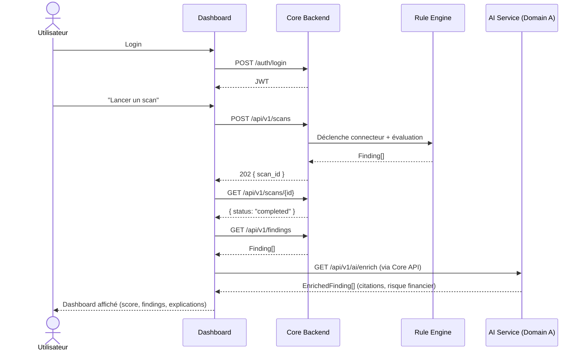
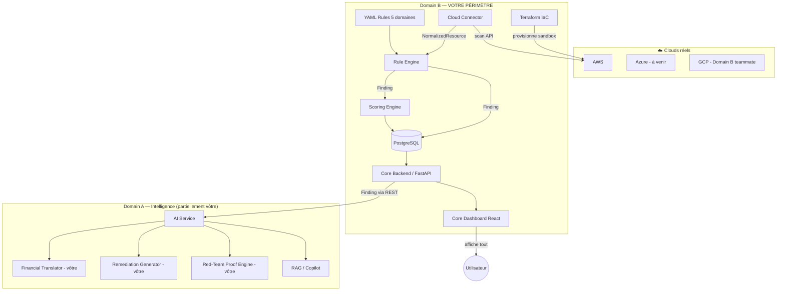
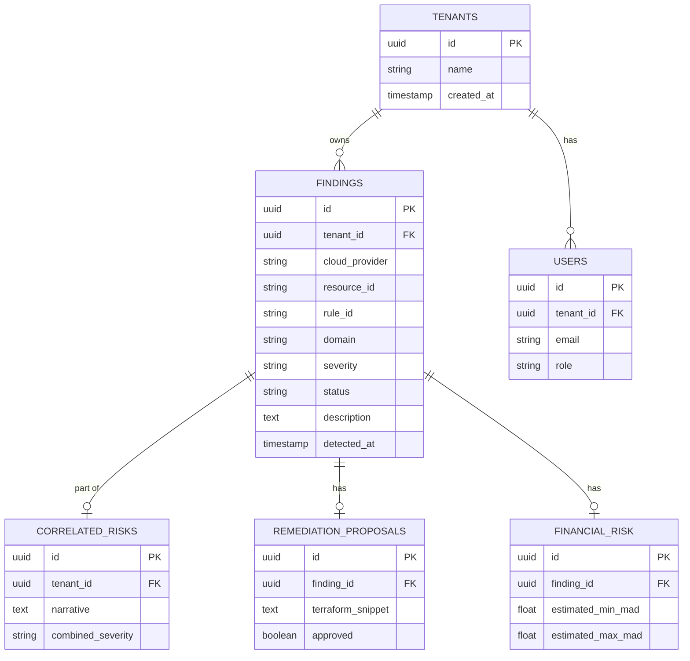

# 🧭 Domain B Guide — Core Platform & Compliance Engine

> Manuel technique complet de votre domaine : infrastructure, connecteurs, moteur de règles,
> scoring, backend, API, dashboard, déploiement — plus les modules IA que vous avez choisi de
> garder (Financial Translator, Remediation Generator, Red-Team Proof Engine).

---

## Table des matières

1. [Vue d'ensemble produit](#1--vue-densemble-produit)
2. [Architecture globale](#2--architecture-globale)
3. [Séparation des domaines — votre périmètre réel](#3--séparation-des-domaines--votre-périmètre-réel)
4. [Module 1 — Terraform IaC](#4--module-1--terraform-iac)
5. [Module 2 — Cloud Connector](#5--module-2--cloud-connector)
6. [Module 3 — YAML Rule Base](#6--module-3--yaml-rule-base)
7. [Module 4 — Rule Engine](#7--module-4--rule-engine)
8. [Module 5 — Scoring Engine](#8--module-5--scoring-engine)
9. [Module 6 — Core Backend](#9--module-6--core-backend)
10. [Module 7 — Findings/Scores API](#10--module-7--findingsscores-api)
11. [Module 8 — Core Dashboard](#11--module-8--core-dashboard)
12. [Module 9 — Déploiement](#12--module-9--déploiement)
13. [Modules IA que vous gardez](#13--modules-ia-que-vous-gardez)
14. [Base de données](#14--base-de-données)
15. [Structure du dépôt](#15--structure-du-dépôt)
16. [Roadmap semaine par semaine](#16--roadmap-semaine-par-semaine)
17. [Difficultés déjà rencontrées et à venir](#17--difficultés-déjà-rencontrées-et-à-venir)

---

## 1. 🎯 Vue d'ensemble produit

### Le problème résolu

Une organisation multi-cloud (AWS/Azure/GCP) n'a aujourd'hui aucun outil qui combine : scan technique
de conformité + citation réglementaire vérifiée (ISO 27001, Loi 05-20/DNSSI) + traduction en risque
financier chiffré (MAD).

### Les utilisateurs

- **RSSI / Compliance Officer** : consulte le score global, les findings critiques, les rapports
- **Ingénieur cloud** : reçoit des propositions de remédiation Terraform, les approuve ou les rejette
- **Auditeur externe** : consulte le dashboard en lecture seule pour valider la conformité

### Workflow complet, du login au rapport



### Où vous intervenez (Domain B)

Vous possédez **tout ce qui transforme le cloud réel en données structurées et exploitables** :
Terraform → Connecteur → Rule Engine → Scoring → Backend → API → Dashboard de base → Déploiement.

> **IMPORTANT** : vous avez aussi choisi de garder Financial Translator, Remediation Generator et
> Red-Team Proof Engine — normalement côté "Domain A" dans le découpage type, mais déjà construits
> par vous. Voir [chapitre 13](#13--modules-ia-que-vous-gardez).

---

## 2. 🏗️ Architecture globale



### Composants et responsabilités

| Composant | Rôle | Technologie | Défaillance possible |
|---|---|---|---|
| Terraform | Provisionne le sandbox | HCL, provider AWS | Drift si modif manuelle hors Terraform |
| Cloud Connector | Lit l'état réel via API | boto3 | `AccessDenied`, throttling, pagination tronquée |
| Rule Engine | Juge la conformité | Python + YAML | Règle mal formée, attribut manquant |
| Scoring Engine | Agrège en score | Python | Division par zéro si aucun finding |
| Core Backend | API sécurisée | FastAPI, JWT | Token expiré, tenant mal isolé |
| Core Dashboard | Visualisation | React | Désynchronisation avec l'API |

---

## 3. 🔀 Séparation des domaines — votre périmètre réel

| | Domain B (le vôtre, standard) | Domain A (normalement teammate) | Ce que VOUS gardez en plus |
|---|---|---|---|
| Terraform, Connector, Rules, Rule Engine, Scoring, Backend, API, Dashboard, Deploy | Oui | | Oui |
| Corpus, RAG, Copilot Q&A | | Oui | Non (reste teammate) |
| Financial Translator | | Oui (normalement) | Oui — vous le gardez |
| Remediation Generator | | Oui (normalement) | Oui — vous le gardez |
| Red-Team Proof Engine | *(pas dans doc original)* | | Oui — vous l'avez construit |

### Pourquoi ce choix élargi fonctionne quand même

Le principe d'isolation reste respecté : **votre teammate consomme vos `Finding` uniquement via l'API
REST**, jamais vos tables internes. Que vous possédiez en plus le Financial Translator ne casse rien
côté contrat — ça change juste qui écrit le code, pas l'interface.

> **⚠️ NOTE** : ça déséquilibre la charge de travail vs le teammate (vous portez plus). Assurez-vous
> d'en discuter pour rééquilibrer ailleurs (docs, tests, ou une partie du dashboard IA).

---

## 4. 📦 Module 1 — Terraform IaC

### Quoi

Provisionne un sandbox AWS reproductible : ressources conformes et volontairement non conformes,
pour donner au Cloud Connector un vrai terrain de test.

### Pourquoi cette architecture (modulaire par provider)

```
terraform/
├── main.tf, providers.tf, variables.tf, outputs.tf   (racine, orchestration)
└── modules/
    ├── aws/     complet (le vôtre)
    ├── azure/   placeholder (S2, pairing)
    └── gcp/     placeholder (teammate)
```

**Alternative rejetée** : tout mettre dans un seul fichier plat. Rejetée parce que ça créerait des
collisions de merge dès que le teammate ajoute son module GCP — un module par cloud = zéro collision.

### Comment ça marche (déjà construit)

- `main.tf` racine appelle `module "aws" { source = "./modules/aws" ... }`
- `modules/aws/iam.tf` : 7 cas (scanner least-privilege, MFA/no-MFA, wildcard role, user vulnérable...)
- `modules/aws/s3.tf` : bucket conforme (SSE-KMS+versioning+logging+lifecycle) vs non conforme
- `modules/aws/ec2.tf` : security groups, IMDSv2, EBS
- `modules/aws/cloudtrail.tf` : trail conforme vs non conforme
- Chaque ressource non conforme est taguée `Purpose = "Intentionally misconfigured - for scanner testing only"` — c'est ce tag que le Red-Team Proof Engine vérifie avant toute action

### Intégration avec le reste

Les `outputs.tf` exposent les credentials du scanner (`sensitive = true`) — consommés par le Cloud
Connector via `.env`, jamais committés.

---

## 5. 🔌 Module 2 — Cloud Connector

### Quoi

Se connecte à l'API AWS réelle (via `boto3`), lit l'état de 4 catégories de ressources (IAM, S3,
Security Groups, CloudTrail), et normalise chaque résultat.

### Pourquoi une session boto3 dédiée, jamais des credentials personnelles

Principe de moindre privilège : le connecteur utilise un user IAM read-only strict (policy
custom, pas `ReadOnlyAccess` managée), créé par Terraform, jamais votre compte admin.

### Comment (déjà construit, `scanner/collectors/aws.py`)

```python
def collect_iam(session) -> list[FindingDict]:
    paginator = iam.get_paginator("list_users")  # pagination - ne rate aucun résultat
    for user in users:
        try:
            mfa_devices = call_with_retry(lambda: iam.list_mfa_devices(...))
            if not mfa_devices:
                findings.append(normalize_finding(..., rule_id="iam.no_mfa", ...))
        except ClientError as e:
            logger.warning(...)  # AccessDenied != non-conforme - jamais de faux positif
```

### Principe de conception non négociable

> **⚠️ WARNING** : une erreur `AccessDenied` sur une vérification ne doit **jamais** être interprétée
> comme une non-conformité. C'est le bug qu'on a corrigé ensemble (permission `s3:GetEncryptionConfiguration`
> manquante causait de faux positifs sur `compliant-bucket`).

### Alternative à terme (roadmap)

Séparer collecte (`NormalizedResource`, attributs bruts) et jugement (`Rule Engine`) — actuellement,
`aws.py` fait les deux en même temps. Le Rule Engine existe déjà séparément mais n'est pas encore
branché sur une version refactorée du connecteur.

---

## 6. 📋 Module 3 — YAML Rule Base

### Quoi

22 règles déclaratives réparties sur 5 fichiers (`iam.yaml`, `network.yaml`, `encryption.yaml`,
`logging.yaml`, `storage.yaml`), chacune liant une condition technique à un `rule_id`, une `severity`,
un `domain`.

### Pourquoi du YAML et pas juste plus de code Python

1. Un non-développeur (compliance officer) peut lire/proposer une règle
2. Le même moteur (Python) s'applique à AWS et GCP et Azure sans dupliquer la logique
3. Testable indépendamment via fixtures, sans connexion cloud réelle

### Comment est structurée une règle

```yaml
- rule_id: iam.no_mfa
  domain: iam
  severity: medium
  resource_types: [iam_user]
  description: "User {resource_id} has no MFA device configured."
  enabled: true
  condition:
    attribute: mfa_enabled
    operator: equals
    value: false
```

### À faire — lier chaque règle à l'ISO 27001 / DNSSI

> **TIP** : ajoutez un champ `framework_refs` à chaque règle — c'est ce que le RAG (Domain A) utilisera
> pour retrouver la citation exacte, plutôt que de deviner :
> ```yaml
> framework_refs:
>   - framework: "ISO 27001"
>     control: "Annexe A.8.5"
> ```

---

## 7. ⚙️ Module 4 — Rule Engine

### Quoi

Charge les règles YAML, les évalue contre des `NormalizedResource`, produit des `Finding` validés
Pydantic.

### Pourquoi un évaluateur de conditions fermé (pas `eval()`)

> **WARNING** : évaluer une chaîne de texte arbitraire avec `eval()` permettrait à quiconque modifiant
> un fichier YAML (par erreur ou malveillance) d'exécuter du code Python arbitraire. À la place, chaque
> condition est une comparaison structurée (`attribute`/`operator`/`value`), interprétée par un
> dictionnaire fermé d'opérateurs (`equals`, `not_equals`, `greater_than`...).

### Comment (déjà construit, `scanner/rule_engine.py`)

```python
SUPPORTED_OPERATORS = {
    "equals": lambda actual, expected: actual == expected,
    "greater_than": lambda actual, expected: actual is not None and actual > expected,
}

class RuleEngine:
    @classmethod
    def from_directory(cls, rules_dir, domains=None):
        # charge tous les *.yaml, filtrable par domaine
        ...
    def evaluate_resource(self, cloud_provider, resource_id, resource_type, attributes):
        # applique chaque règle dont resource_type matche
        ...
```

Testé avec 22 règles, filtrage par domaine fonctionnel, champ `enabled` pour désactiver une règle
sans la supprimer.

### Intégration

Consomme `NormalizedResource` (attributs bruts), produit `Finding` (schema.py v1.2.0) — le contrat
central que Domain A consomme ensuite via l'API.

---

## 8. 📊 Module 5 — Scoring Engine

### Quoi (à construire)

Transforme une liste de `Finding` en `ComplianceScore` : un score global (0-100), un score par
domaine, un score par cloud.

### Pourquoi un calcul pondéré, pas juste passed/total

Un finding `critical` ne devrait pas peser pareil qu'un `low`. Principe de conception recommandé :
pondérer par sévérité.

### Comment (pseudo-code, à implémenter)

```python
SEVERITY_WEIGHTS = {"low": 1, "medium": 3, "high": 7, "critical": 15}

class ScoringEngine:
    def calculate(self, findings: list[Finding]) -> ComplianceScore:
        if not findings:
            return ComplianceScore(overall_score=100.0, total_findings=0, critical_findings=0)

        total_weight = sum(SEVERITY_WEIGHTS[f.severity] for f in findings)
        max_possible = len(findings) * SEVERITY_WEIGHTS["critical"]
        overall_score = 100 * (1 - total_weight / max_possible)

        score_by_domain = self._score_by_key(findings, key=lambda f: f.domain)
        score_by_cloud = self._score_by_key(findings, key=lambda f: f.cloud_provider)

        return ComplianceScore(
            overall_score=round(overall_score, 1),
            score_by_domain=score_by_domain,
            score_by_cloud=score_by_cloud,
            total_findings=len(findings),
            critical_findings=sum(1 for f in findings if f.severity == "critical"),
        )
```

### Alternative envisageable

Score binaire simple (`passed/total * 100`) — plus simple à expliquer en soutenance, mais moins fin.
Recommandation : gardez la pondération, mais mentionnez les deux en soutenance pour montrer la
réflexion.

### Piège à éviter

> **⚠️ WARNING** : ne jamais diviser par `len(findings)` si `findings` est vide — gérez le cas
> "aucun finding = score parfait" explicitement (comme dans le pseudo-code ci-dessus).

---

## 9. 🔐 Module 6 — Core Backend

### Quoi (à construire)

Service FastAPI qui expose l'API REST, gère l'authentification JWT, le RBAC minimal, et journalise
les actions (audit trail basique).

### Pourquoi JWT plutôt que des sessions serveur

Stateless — pas besoin de stocker l'état de session côté serveur, ce qui simplifie le passage à
plusieurs instances (même si vous ne scalez pas horizontalement pour un PFE, c'est la bonne pratique
standard).

### Comment (squelette à construire)

```python
# backend/main.py
from fastapi import FastAPI, Depends, HTTPException
from fastapi.security import HTTPBearer
import jwt

app = FastAPI(title="ComplianceIQ Core API")
security = HTTPBearer()

def get_current_user(token = Depends(security)) -> dict:
    try:
        payload = jwt.decode(token.credentials, SECRET_KEY, algorithms=["HS256"])
        return payload  # { "sub": user_id, "tenant_id": ..., "roles": [...] }
    except jwt.InvalidTokenError:
        raise HTTPException(status_code=401, detail="Token invalide")

@app.get("/api/v1/findings")
def list_findings(user: dict = Depends(get_current_user)):
    # filtré automatiquement par user["tenant_id"]
    ...
```

### RBAC minimal recommandé pour un PFE

> **TIP** : n'implémentez pas un système de permissions à la carte (19 permissions différentes) —
> 2-3 rôles fixes suffisent : `admin` (tout), `viewer` (lecture seule), `auditor` (lecture + export
> rapport). C'est démontrable en 10 minutes de démo, contrairement à un vrai moteur RBAC.

### Audit trail minimal

Un simple log structuré par requête (`user_id`, `action`, `timestamp`, `status`) suffit — pas besoin
du modèle `AuditEvent` complet qu'on a mis en "EXTENDED" (non câblé) dans le schéma.

---

## 10. 🌐 Module 7 — Findings/Scores API

### Quoi (à construire, mais déjà spécifié dans openapi.yaml v0.3.0)

Les endpoints REST que Domain A et le frontend consomment.

### Contrat déjà figé (rappel)

```
GET  /api/v1/findings?domain=&severity=&status=&limit=&offset=   -> Finding[]  (paginé)
GET  /api/v1/findings/{id}                                        -> Finding
GET  /api/v1/score                                                 -> ComplianceScore
POST /api/v1/scans                                                 -> 202 { scan_id }
GET  /api/v1/scans/{scan_id}                                       -> { status }
```

### Pourquoi la pagination dès maintenant

Avec 5 clouds x plusieurs centaines de ressources potentielles, une liste non paginée deviendrait
inutilisable et lente. `limit`/`offset` + header `X-Total-Count` résout ça simplement.

### Comment implémenter /scans (asynchrone simple)

```python
import uuid

scan_jobs: dict[str, str] = {}  # en mémoire pour un PFE ; DB en prod

@app.post("/api/v1/scans", status_code=202)
def trigger_scan(background_tasks: BackgroundTasks, user=Depends(get_current_user)):
    scan_id = str(uuid.uuid4())
    scan_jobs[scan_id] = "running"
    background_tasks.add_task(run_scan_job, scan_id)
    return {"scan_id": scan_id}

def run_scan_job(scan_id: str):
    findings = run_all()  # votre aws.py
    scan_jobs[scan_id] = "completed"

@app.get("/api/v1/scans/{scan_id}")
def get_scan_status(scan_id: str):
    return {"status": scan_jobs.get(scan_id, "not_found")}
```

`BackgroundTasks` de FastAPI suffit pour un PFE — pas besoin de Kafka/RabbitMQ (mentionné dans un
diagramme "vision produit", mais hors scope de 6 semaines).

---

## 11. 📈 Module 8 — Core Dashboard

### Quoi (à construire)

Interface React affichant le score, la liste des findings, filtrable, avec authentification.

### Pourquoi React + Recharts (pas D3.js brut)

Recharts est plus rapide à intégrer pour des graphiques standards (score gauge, radar par domaine) —
D3.js offre plus de contrôle mais coûte bien plus de temps de développement pour un gain minime ici.

### Structure minimale recommandée

```
frontend/dashboard/
├── src/
│   ├── api/client.ts          (wrapper fetch avec JWT)
│   ├── components/
│   │   ├── ScoreGauge.tsx
│   │   ├── FindingsTable.tsx
│   │   └── DomainRadar.tsx
│   ├── pages/
│   │   ├── Login.tsx
│   │   └── Dashboard.tsx
│   └── App.tsx
```

### Piège classique

> **⚠️ WARNING** : ne stockez jamais le JWT dans `localStorage` sans réflexion — vulnérable au XSS.
> Pour un PFE, un simple state React (perdu au refresh) ou un cookie `httpOnly` (si le temps permet)
> sont préférables.

---

## 12. 🐳 Module 9 — Déploiement

### Quoi (à construire)

Dockerfile par service + docker-compose.yml pour tout lancer en une commande + CI basique.

### Pourquoi docker-compose plutôt que Kubernetes pour ce PFE

> **NOTE** : le diagramme "vision produit" mentionne Kubernetes — hors de portée totalement pour
> 6 semaines. `docker-compose up` est amplement suffisant pour démontrer un déploiement reproductible
> en soutenance.

### Structure minimale

```yaml
# docker-compose.yml
services:
  core-backend:
    build: ./backend
    ports: ["8000:8000"]
    environment:
      - DATABASE_URL=postgresql://...
    depends_on: [postgres]

  postgres:
    image: postgres:16
    environment:
      POSTGRES_DB: complianceiq
    volumes: ["pgdata:/var/lib/postgresql/data"]

  dashboard:
    build: ./frontend/dashboard
    ports: ["3000:3000"]

volumes:
  pgdata:
```

### CI minimale (GitHub Actions)

```yaml
# .github/workflows/ci.yml
on: [pull_request]
jobs:
  test:
    runs-on: ubuntu-latest
    steps:
      - uses: actions/checkout@v4
      - run: pip install -r requirements.txt
      - run: pytest tests/
```

---

## 13. 🤖 Modules IA que vous gardez

Rappel : normalement "Domain A", mais vous les avez construits et gardez la propriété.

### Financial Translator

Prend un `Finding` (ou `CorrelatedRisk`) enrichi, appelle Claude API avec un prompt contraint, produit
`FinancialRiskAssessment` (fourchette MAD + `citation` liant au texte légal exact).

### Remediation Generator

Prend un `EnrichedFinding`, génère un `RemediationProposal` (snippet Terraform + justification RAG),
jamais appliqué automatiquement — `approved: false` par défaut.

### Red-Team Proof Engine

Déjà codé (`proof_engine.py`) — démontre l'impact réel d'un finding uniquement sur les ressources
sandbox taguées `Purpose = "Intentionally misconfigured..."`, jamais ailleurs (`UnsafeTargetError`).

> **IMPORTANT** : ces 3 modules consomment un `Finding` via l'API (pas d'accès direct à vos tables),
> donc leur intégration reste propre même si c'est vous qui les codez des deux côtés.

---

## 14. 🗄️ Base de données

### Schéma minimal recommandé



### Pourquoi PostgreSQL plutôt que SQLite pour ce projet

Support natif de `jsonb` (pratique pour stocker `evidence`/`attributes` flexibles), et cohérent avec
un vrai déploiement multi-tenant (SQLite ne gère pas bien les accès concurrents).

### Migration

> **TIP** : utilisez Alembic dès le premier schéma, même simple — ça évite de devoir tout
> recréer manuellement si vous ajoutez une colonne en semaine 4.

---

## 15. 📂 Structure du dépôt

```
complianceiq/
├── contracts/                  (schémas Pydantic partagés - JOINT, review à deux)
│   └── schema.py
├── terraform/                  (VOTRE domaine)
│   ├── main.tf, providers.tf, variables.tf, outputs.tf
│   └── modules/{aws,azure,gcp}/
├── scanner/                     (VOTRE domaine)
│   ├── collectors/aws.py
│   ├── rule_engine.py
│   └── scoring.py               (à créer)
├── rules/                        (VOTRE domaine)
│   ├── iam.yaml, network.yaml, encryption.yaml, logging.yaml, storage.yaml
├── backend/                       (VOTRE domaine)
│   ├── main.py, auth.py, models.py, database.py
├── ai_service/                     (partagé : vous = financial/remediation/red-team)
│   ├── financial_translator.py
│   ├── remediation_generator.py
│   ├── proof_engine.py
│   └── rag_pipeline.py           (teammate)
├── frontend/
│   ├── dashboard/                 (VOTRE domaine)
│   └── ai/                        (teammate)
├── tests/
├── docker-compose.yml
└── .github/workflows/ci.yml
```

---

## 16. 🗓️ Roadmap semaine par semaine

| Semaine | Objectif | Livrable attendu |
|---|---|---|
| S1 (fait) | Terraform + Connector AWS + Schéma + Rule Engine | 20 findings détectés, 22 règles |
| S2 | Scoring Engine + début Core Backend | ComplianceScore calculé, FastAPI qui démarre |
| S3 | Core Backend complet (JWT/RBAC/audit) + Findings API | Endpoints /findings, /score fonctionnels |
| S4 | Core Dashboard + intégration Financial Translator/Remediation | Dashboard affiche score réel + risque MAD |
| S5 | Red-Team Proof Engine intégré au dashboard + tests | Bouton "Prouver l'impact" fonctionnel |
| S6 | Déploiement Docker/CI + rapport + soutenance | docker-compose up fonctionne de bout en bout |

---

## 17. 🐛 Difficultés déjà rencontrées et à venir

| Difficulté | Déjà vécue ? | Comment la résoudre |
|---|---|---|
| AccessDenied interprété comme finding | Vécue, corrigée | Toujours distinguer erreur de permission vs absence réelle |
| Caractères accentués dans les tags/descriptions AWS | Vécue, corrigée | ASCII uniquement sur les champs description AWS natifs |
| Rotation de clé IAM créant un doublon | Vécue, corrigée | Toujours utiliser terraform taint plutôt qu'une création manuelle |
| Credentials scanner vs admin mélangés dans un terminal | Vécue, corrigée | Deux terminaux séparés, ou AWS_PROFILE explicite |
| Score qui plante si aucun finding | À anticiper | Gérer le cas "0 finding" explicitement dans ScoringEngine |
| JWT expiré non géré côté frontend | À anticiper | Intercepteur qui redirige vers login sur 401 |
| Drift Terraform après modification manuelle AWS Console | À anticiper | terraform plan avant chaque apply, ne jamais modifier la console directement |

---

*Guide généré pour votre domaine réel (Domain B + modules IA gardés), aligné sur schema.py v1.2.0,
openapi.yaml v0.3.0, et le code déjà testé (Terraform, aws.py, rule_engine.py, 22 règles YAML).*
