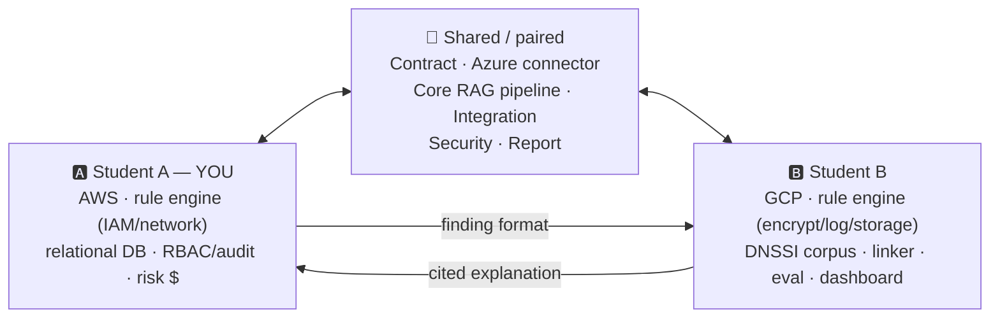
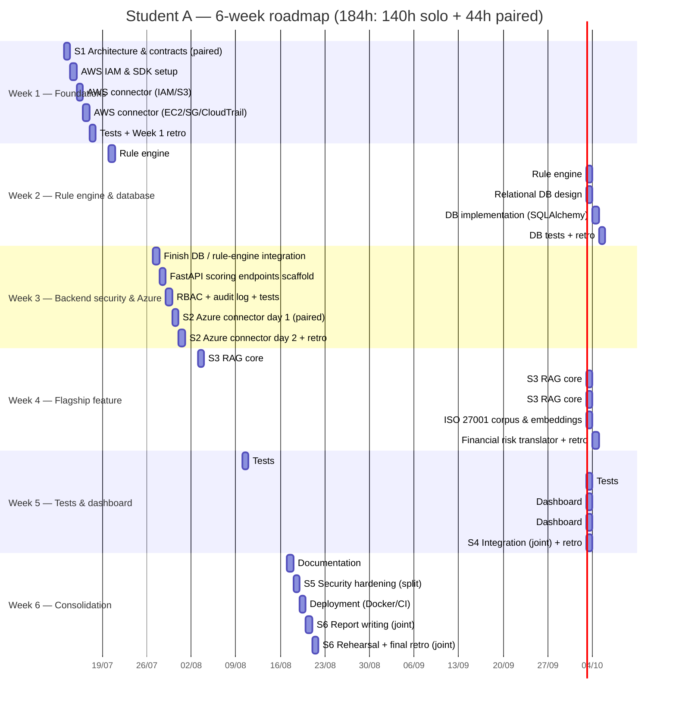
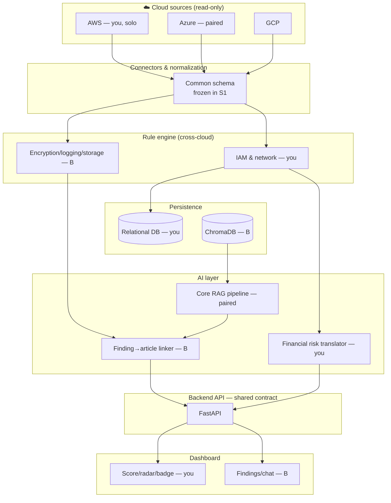
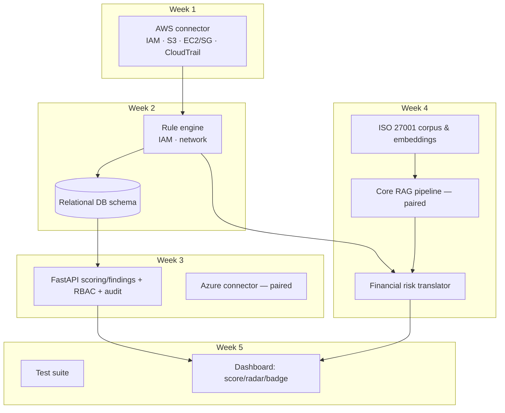
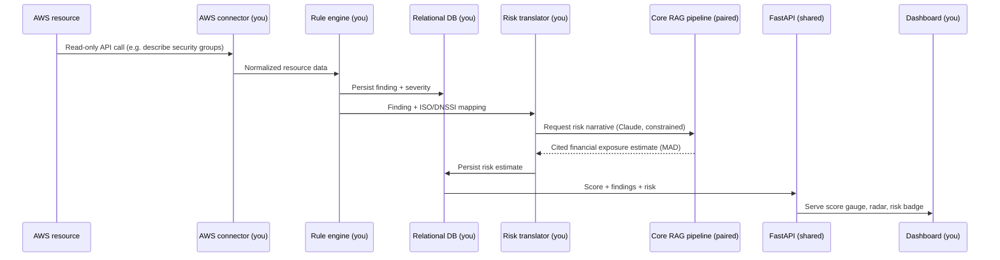
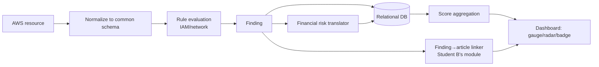
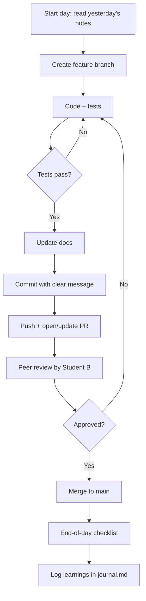
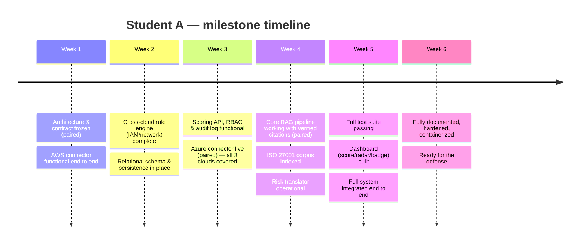

# 🎓 Internship Handbook — Student A
### AWS, Rule Engine, Backend Security, Risk & Dashboard — Copilot GRC Multi-Cloud

> **6-week personal roadmap**, built from the *balanced* task distribution (184h, 8 identical skill-category
> quotas, 2 explicit pairing sessions with Student B). Companion document to Student B's handbook — same project,
> same design principles, your half of the work.

---

## 📚 Table of contents

1. [Role overview](#1--role-overview)
2. [6-week roadmap at a glance](#2--6-week-roadmap-at-a-glance)
3. [Diagrams](#3--diagrams)
4. [Tech deep-dives](#4--tech-deep-dives)
5. [Day-by-day action plan](#5--day-by-day-action-plan)
6. [Weekly learning goals & industry relevance](#6--weekly-learning-goals--industry-relevance)
7. [How to make the most of this internship](#7--how-to-make-the-most-of-this-internship)
8. [Weekly challenges, mini-projects & quizzes](#8--weekly-challenges-mini-projects--quizzes)
9. [Learning resources](#9--learning-resources)
10. [Final checklist before the defense](#10--final-checklist-before-the-defense)

---

## 1. 🧭 Role overview

### Who you are in this project

You are **Student A**. Your individually-owned axis covers:

| Your axis | What it means concretely |
|---|---|
| ☁️ **One cloud connector, solo** | AWS — IAM, S3, EC2/Security Groups, CloudTrail |
| 🧩 **A third of the rule engine** | IAM and network compliance domains (cross-cloud) |
| 🗄️ **The relational backbone** | Database schema and persistence for findings, scores, and audit trail |
| 🔐 **Backend security** | FastAPI scoring/findings endpoints, RBAC, audit logging |
| 📖 **One regulatory corpus** | ISO 27001, indexed in ChromaDB (embeddings) |
| 💰 **The financial risk translator** | Converts findings into an estimated sanction range in MAD |
| 🎨 **Half the dashboard** | Score gauge, radar chart, financial risk badge (Student B owns findings/chat) |

Plus **44h of shared, paired work** with Student B on the architecture contract, the Azure connector, the core RAG
pipeline, integration, security hardening, and the final report.

### Why your axis matters

Anyone can build a scanner that flags misconfigurations. What makes this product different is that every finding
comes with a **number a director can act on** — a compliance score, and a financial exposure in dirhams — instead
of a vague "severity: high." Your risk translator and your persistence layer are what let the rest of the system
(Student B's copilot, the dashboard) actually mean something to a non-technical decision-maker.

### How you fit with Student B

> 💡 **Tip:** the two pairing sessions (Azure in Week 3, core RAG in Week 4) are not "extra help" — they're
> deliberately the two riskiest pieces of the project, built by both of you so neither leaves the internship
> without having wrestled with the hardest problems.

---

## 2. 🗺️ 6-week roadmap at a glance

| Week | Theme | Your main deliverable | Pairing? |
|---|---|---|---|
| **1** | 🏗️ Foundations + 1st connector | Frozen architecture/contract + working AWS connector | ✅ S1 (contract) |
| **2** | 🧩 Rule engine + database | IAM/network rules + relational schema & persistence | — |
| **3** | 🔐 Backend security + 3rd cloud | FastAPI scoring/RBAC/audit + Azure connector | ✅ S2 (Azure) |
| **4** | 🚀 The flagship feature | Core RAG pipeline (paired) + ISO corpus + risk translator | ✅ S3 (RAG core) |
| **5** | 🧪🎨 Proving it & showing it | Full test suite + dashboard (score/radar/badge) + integration | ✅ S4 (integration) |
| **6** | 🔌✅ Consolidation | Docs + security + deployment + defense prep | ✅ S5 + S6 |

### Gantt view

> ⚠️ Dates above are placeholders — replace `2026-07-13` with your actual start date before committing this file
> (keep it synced with Student B's start date, since Weeks 3 and 4 are paired).

---

## 3. 📊 Diagrams

### 3.1 Architecture diagram

### 3.2 Component diagram (your components, zoomed in)

### 3.3 Sequence diagram — an AWS finding becomes a score and a risk figure

### 3.4 Data flow diagram

### 3.5 Your personal workflow diagram

### 3.6 Visual timeline (milestones)

---

## 4. 🔬 Tech deep-dives

> Read the relevant deep-dive **before** the day you first touch that technology.

### 4.1 ISO 27001 — your regulatory corpus

- **What it is:** an international standard defining requirements for an Information Security Management System
  (ISMS) — organized into ~14 control domains (Annex A): access control, cryptography, physical security, incident
  management, and more.
- **Why it exists:** before ISO 27001, organizations had no common language to prove "we take security seriously"
  to a partner, client, or regulator.
- **Why we use it here:** it's the international reference every finding gets mapped to — the "universal
  translator" between a technical misconfiguration and a business control, and the corpus your financial risk
  narratives ultimately draw context from.
- **How it works:** each control is a management requirement, not a technical setting — your job (and your rule
  engine's) is to map technical findings to the right control number (e.g. A.9.2.3), not just the domain name.
- **Best practices:** always cite the control **number**, not just the domain — precision matters for auditors.
- **Common beginner mistakes:** treating ISO 27001 as a checklist of technical settings. It isn't — it's a
  management framework; the technical rule is *your* interpretation of it.
- **Analogy:** ISO 27001 is like a building code — it says "electrical installations must be safe," not "use
  exactly this brand of cable."

> 📝 Note: Student B owns the DNSSI/Loi 05-20 corpus. Your financial risk translator (A6) references **both**
> collections — you don't need to ingest DNSSI yourself, just query Student B's collection alongside your own when
> a sanction figure is needed.

### 4.2 Rule engines & policy-as-code

- **What it is:** a system that expresses security requirements as structured, machine-readable rules (often YAML)
  instead of hardcoded logic, then evaluates resources against them.
- **Why it exists:** hardcoding "if security group allows 0.0.0.0/0 on port 22, flag it" in Python for every
  possible check doesn't scale — policy-as-code separates the *rule* (declarative) from the *engine* (generic
  evaluator).
- **Why we use it here:** it's what lets the same 2 domains (IAM, network) apply identically across AWS, Azure,
  and GCP once resources are normalized.
- **How it works:** each rule declares a condition (e.g. `security_group.ingress_open_to_world == true`), a
  severity, and references to the ISO/DNSSI controls it maps to; the engine loads all rules and evaluates them
  against every normalized resource.
- **Best practices:** one rule = one specific, testable condition; never bundle multiple checks into one rule.
- **Common beginner mistakes:** writing rules that assume a specific cloud's field names instead of the normalized
  schema — breaks portability across providers.
- **Analogy:** a rule engine is like a checklist app that works the same whether you're inspecting a house, an
  apartment, or an office — only the checklist items' data source changes.

### 4.3 Amazon Web Services (AWS) — IAM, S3, EC2/Security Groups, CloudTrail

- **What it is:** AWS's cloud platform; the services relevant to you are IAM (identity & access), S3 (object
  storage), EC2 Security Groups (network firewall rules), and CloudTrail (audit logging).
- **Why it exists:** to let organizations run infrastructure without owning physical servers, with (in theory)
  strong native security controls.
- **Why we use it here:** your solo-owned cloud, and the most mature, best-documented cloud SDK in the industry
  (`boto3`) — a good anchor for a tight 6-week timeline.
- **How it works:** authenticate with a dedicated, read-only IAM user or role, then call `boto3` clients
  (`boto3.client("iam")`, `boto3.client("s3")`, etc.) to list policies, bucket configurations, and security group
  rules.
- **Best practices:** always use least-privilege (`ReadOnlyAccess` or a custom narrower policy) for your scanning
  credentials — never attach broader permissions "just in case."
- **Common beginner mistakes:** using your personal AWS root account credentials instead of a dedicated IAM
  user/role — makes access impossible to audit or revoke cleanly, and is flagged by security best practices
  everywhere.
- **Analogy:** IAM is the guest list and door policy of a building; S3 is the filing cabinets; Security Groups are
  which doors are locked; CloudTrail is the security camera footage.

### 4.4 Microsoft Azure — IAM (RBAC), Storage, NSG, Monitor — *your pairing session*

- **What it is:** Azure's identity and access model (RBAC, backed by Microsoft Entra ID / Graph API), Blob Storage,
  Network Security Groups (firewall rules), and Azure Monitor (logging/audit).
- **Why it exists:** Azure structures permissions differently from AWS/GCP — role assignments are scoped to
  management groups, subscriptions, resource groups, or individual resources, which changes how you query "who can
  access what."
- **Why we use it here:** it's the third cloud, and you're building it **together** with Student B — one of your
  two paired sessions, deliberately shared because it's new territory for both of you.
- **How it works:** authenticate via `azure-identity` (service principal), then query role assignments with
  `azure-mgmt-authorization`, storage configuration with `azure-mgmt-storage`, and NSG rules with
  `azure-mgmt-network`.
- **Best practices:** scope your service principal's role assignment to "Reader" at the subscription level — never
  broader than needed.
- **Common beginner mistakes:** confusing Azure RBAC role assignments (who can do what) with Entra ID user/group
  membership (who exists) — related but distinct layers.
- **Analogy:** if AWS IAM is a guest list per building and GCP IAM is a guest list per floor, Azure RBAC is a guest
  list that can be scoped at the level of the whole city, one district, one building, or one room — same idea, finer
  and more nested scoping.
- 💡 **Why pairing matters here:** normalizing a third, differently-shaped permission model into your shared schema
  is exactly the kind of design decision that benefits from two people thinking it through together.

### 4.5 Relational databases & SQLAlchemy (ORM)

- **What it is:** a relational database (Postgres or SQLite) stores structured data in tables with defined
  relationships; SQLAlchemy is a Python ORM (Object-Relational Mapper) that lets you work with rows as Python
  objects instead of writing raw SQL for every query.
- **Why it exists:** findings, scores, and audit events are inherently structured and relational (a finding
  belongs to a scan, a scan belongs to a cloud account, an audit entry belongs to a user) — a relational database
  models these relationships natively and enforces them.
- **Why we use it here:** it's the system of record for everything Student B's vector database *isn't* built for
  — structured queries like "give me every critical finding from the last 7 days for this account," fast joins,
  and transactional integrity for the audit log.
- **How it works:** define Python classes (`class Finding(Base): __tablename__ = "findings"; id = Column(...)`),
  let SQLAlchemy generate the SQL, and use a session to query/insert/update.
- **Best practices:** use migrations (e.g. Alembic) from day one instead of hand-editing the schema — you will
  change it, and you want a history of those changes.
- **Common beginner mistakes:** modeling everything as loosely-typed JSON blobs instead of proper columns and
  foreign keys — you lose the main benefit of using a relational database in the first place.
- **Analogy:** a relational database is a well-organized filing cabinet with labeled folders and cross-references;
  a vector database (Student B's ChromaDB) is a "similar meaning" search assistant — you need both, for different
  jobs.

### 4.6 RBAC & audit logging

- **What it is:** Role-Based Access Control restricts what a user can do based on their assigned role (e.g.
  "viewer," "analyst," "admin"); audit logging records who did what, when, so actions can be reconstructed later.
- **Why it exists:** not every user of a security tool should be able to change scan configurations, delete
  findings, or export sensitive reports — and when something does go wrong, you need a trustworthy record of who
  did it.
- **Why we use it here:** the product handles sensitive compliance data — access control and a tamper-evident audit
  trail are themselves compliance requirements (ISO 27001 and DNSSI both explicitly require both).
- **How it works:** define roles and permissions, attach a role to each user/API token, check permissions in
  FastAPI middleware before processing a request, and write an audit log entry for every state-changing action.
- **Best practices:** default to the most restrictive role for new users; never let audit log entries be editable
  or deletable through the normal application flow.
- **Common beginner mistakes:** checking permissions only in the frontend (trivially bypassed) instead of
  enforcing them in the backend, where it actually matters.
- **Analogy:** RBAC is a building's keycard system (different keycards open different doors); the audit log is the
  building's logbook of every keycard swipe, kept in a drawer nobody can quietly edit.

### 4.7 Embeddings & vector search

- **What it is:** embeddings turn text into a list of numbers (a vector) capturing its *meaning*; vector search
  finds the closest vectors to a query vector.
- **Why it exists:** keyword search fails when a question says "data leakage" but the standard says "unauthorized
  disclosure of information" — embeddings capture that these mean the same thing.
- **Why we use it here:** it's how the copilot finds the right ISO 27001 control even when the wording doesn't
  match exactly — and how your financial risk translator retrieves the right context to justify a sanction figure.
- **How it works:** a model converts each chunk into a vector; at query time the question is converted the same
  way, and the database returns the closest chunks (cosine similarity).
- **Best practices:** chunk by meaningful unit (a full control, not a fixed character count).
- **Common beginner mistakes:** chunking mid-sentence, or chunks so small they lose context.
- **Analogy:** every sentence becomes GPS coordinates on a "meaning map" — search means finding the nearest
  neighboring points, not matching exact street names.

### 4.8 RAG (Retrieval-Augmented Generation) & LangChain — *your other pairing session*

- **What it is:** RAG retrieves relevant documents *before* asking a language model to answer, feeding them into
  the prompt as context. LangChain provides ready-made building blocks for this pattern.
- **Why it exists:** language models don't know your specific corpus and can hallucinate — RAG grounds the answer
  in real, retrievable text.
- **Why we use it here:** it's the only way to guarantee both the copilot's citations *and* your financial risk
  narratives are grounded in real regulatory text, never invented — and it's shared with Student B because it
  queries **both** corpora (ISO 27001 + DNSSI) regardless of which student's rule engine produced the finding.
- **How it works:** query → retrieve top-k chunks from both ChromaDB collections → build a prompt ("using only the
  following excerpts, answer and cite the article/control") → send to Claude → verify the citation exists in the
  retrieved chunks before returning it.
- **Best practices:** explicitly instruct the model to say "I don't know" if retrieved chunks don't contain the
  answer — never let it fill gaps from training data, especially when the output is a number someone might act on
  financially.
- **Common beginner mistakes:** trusting a citation without checking it's actually one of the retrieved chunks —
  always verify programmatically.
- **Analogy:** RAG is an open-book exam instead of reciting from memory — the model can only answer from the pages
  you hand it.
- 💡 **Why pairing matters here:** this is the single highest-risk, highest-value component in the product — both
  of you should be able to explain it cold at the defense.

### 4.9 Claude API & prompt engineering (for risk narratives)

- **What it is:** Anthropic's API — send a prompt, get back a generated response from a Claude model.
- **Why it exists:** to let developers embed Claude's reasoning and language abilities into their own applications.
- **Why we use it here:** for your financial risk translator, it turns a finding plus its retrieved regulatory
  context into a concise, human-readable exposure estimate — with the same citation discipline as the copilot.
- **How it works:** send a `messages` array (system + user turns) to `/v1/messages`, with a system prompt that
  constrains the model to a specific output format and forbids inventing a sanction figure not present in the
  retrieved text.
- **Best practices:** for a numeric/financial output, be extra explicit: "if the retrieved excerpts do not specify
  a sanction range, say so explicitly — never estimate one yourself." Version your prompts as you refine them.
- **Common beginner mistakes:** letting the model "round" or "estimate" a legal sanction figure when the source
  text doesn't actually specify one — this is the one place in the whole project where a hallucination would be
  actively misleading, not just embarrassing.
- **Analogy:** prompting is briefing a very capable new colleague — for anything involving numbers someone might
  act on, you'd double-check their sources before repeating a figure, and your prompt should enforce the same
  discipline.
- 📖 Anthropic's API evolves quickly — always check https://docs.claude.com for anything model- or rate-limit-specific.

### 4.10 FastAPI

- **What it is:** a modern Python web framework for building APIs, built on type hints and async support.
- **Why it exists:** older frameworks required lots of boilerplate for validation and docs — FastAPI generates both
  automatically from your function signatures.
- **Why we use it here:** it auto-generates interactive API docs (Swagger UI), which is exactly what's needed to
  hand a working contract to Student B for the shared endpoints, and its dependency-injection system is a clean fit
  for RBAC middleware.
- **How it works:** declare a route (`@app.get("/scores")`), type-hint input/output with Pydantic models, add a
  dependency that checks the caller's role, and FastAPI validates, authorizes, and documents it automatically.
- **Best practices:** define your Pydantic models first (that *is* your API contract), then implement the logic;
  implement RBAC as a reusable dependency, not copy-pasted checks in every route.
- **Common beginner mistakes:** returning raw dictionaries instead of typed Pydantic models — silently defeats
  automatic validation and documentation.
- **Analogy:** FastAPI is a form with built-in spell-check and a bouncer at the door — it rejects bad input and
  unauthorized requests before either ever reaches your logic.

### 4.11 Financial risk quantification (translating findings into MAD exposure)

- **What it is:** the practice of mapping a technical/compliance finding to an estimated financial consequence —
  here, a sanction range in Moroccan dirhams drawn from the specific Loi 05-20 article a finding violates.
- **Why it exists:** technical severity labels ("critical," "high") mean little to a director; a number in the
  currency their budget is denominated in is immediately actionable.
- **Why we use it here:** it's what turns a compliance report into a prioritization tool a non-technical
  stakeholder can actually use — arguably the single most business-relevant feature in the whole product.
- **How it works:** each finding's rule maps to a DNSSI domain, which maps (via Student B's corpus and the shared
  RAG core) to a specific Loi 05-20 article; your translator retrieves that article's sanction range and attaches
  it to the finding, generating a short narrative via Claude that explains the exposure in plain language.
- **Best practices:** always show your work — cite the article the range comes from, and never silently combine or
  average multiple articles' sanctions into one invented figure.
- **Common beginner mistakes:** treating this as "just multiply severity by a constant" — the whole point is that
  the figure is grounded in a specific, citable legal source, not a synthetic scoring formula.
- **Analogy:** it's the difference between a mechanic saying "your car has a problem" and a mechanic saying "this
  specific part is failing, here's the repair estimate, and here's the manual page it's based on."

### 4.12 React & Recharts — score gauge, radar chart, risk badge

- **What it is:** React is a JavaScript library for building UIs out of reusable components; Recharts is a
  charting library built specifically for React, giving you production-quality charts (gauges, radars, bars) with
  a few lines of declarative code.
- **Why it exists:** manually manipulating the DOM for a dynamic dashboard gets messy fast — React lets you
  describe "what the UI should look like for this data" and handles the updates; hand-rolling SVG charts for every
  view is slow and error-prone compared to a dedicated charting library.
- **Why we use it here:** your half of the dashboard is inherently data-visualization-heavy (a score gauge, a
  radar comparing domains/clouds, a financial risk badge) — exactly Recharts' sweet spot.
- **How it works:** build small components (`<ScoreGauge score={82} />`, `<DomainRadar data={scores} />`), each
  receiving data via props from the API and rendering a chart declaratively.
- **Best practices:** keep components small and focused (one chart = one component); memoize expensive
  computations (like radar data transformation) so re-renders stay fast.
- **Common beginner mistakes:** re-fetching or re-computing chart data on every render instead of once when the
  underlying data actually changes.
- **Analogy:** React components are LEGO bricks — simple alone, powerful once snapped together; Recharts is the
  specialized "instrument panel" brick set, purpose-built for gauges and dials rather than generic shapes.

### 4.13 Docker & CI basics

- **What it is:** Docker packages an application with everything it needs into a portable "container"; a CI
  (Continuous Integration) pipeline automatically runs your tests (and other checks) every time code is pushed.
- **Why it exists:** "it works on my machine" is a real problem — Docker guarantees the same environment runs
  everywhere; CI catches a broken commit within minutes instead of at the next manual test run.
- **Why we use it here:** lets you and Student B ship your two services (backend/scanner vs. copilot/frontend)
  independently, then run them together with `docker-compose`; CI enforces that nobody merges a PR with failing
  tests.
- **How it works:** write a `Dockerfile` (base image, dependencies, code, start command); write a CI workflow file
  (e.g. GitHub Actions) that installs dependencies and runs `pytest` on every push/PR.
- **Best practices:** use `.dockerignore`; never bake secrets into the image; keep the CI pipeline fast (a slow CI
  gets ignored).
- **Common beginner mistakes:** hardcoding environment-specific values like `localhost` URLs instead of using
  environment variables; a CI pipeline that only lints but never actually runs the test suite.
- **Analogy:** a Docker image is a fully packed shipping container — identical contents regardless of which ship
  (server) it lands on; CI is a quality-control checkpoint every container passes through before it's allowed to
  ship.

### 4.14 Security scanning tools (Bandit, pip-audit, npm audit, TruffleHog)

- **What they are:** automated tools that scan your *own* codebase — Bandit finds common Python security issues,
  pip-audit checks for known vulnerabilities in your Python dependencies, npm audit does the same for JavaScript
  dependencies, and TruffleHog scans for accidentally committed secrets (API keys, passwords) in your Git history.
- **Why they exist:** most real-world breaches come from known, already-patched vulnerabilities or leaked
  credentials — not exotic zero-days. Catching these automatically is cheap insurance.
- **Why we use them here:** it would be more than a little ironic for a security compliance tool to ship with
  unpatched dependencies or a leaked AWS key in its own Git history.
- **How they work:** each tool runs as a CLI command (or CI step) and outputs a report of findings by severity.
- **Best practices:** run these in CI on every PR, not just once at the end — catching a leaked secret the same day
  it's committed is far easier than after it's buried in history.
- **Common beginner mistakes:** running the scan once, fixing what it finds, and never running it again —
  dependency vulnerabilities are discovered continuously, so this needs to be a recurring habit.
- **Analogy:** these tools are a smoke detector for your own code — you hope it never goes off, but you'd rather
  know immediately than find out the hard way.

### 4.15 Git workflow (feature branches, PRs & peer review)

- **What it is:** every new piece of work lives on its own branch, then merges into main via a reviewed pull
  request (PR) — and in this project, that review is done by the *other* student, every time.
- **Why it exists:** working directly on main means one broken commit can break the project for everyone; peer
  review catches issues *and* spreads knowledge of the codebase between both of you.
- **Why we use it here:** it's your built-in, continuous collaboration mechanism — not just at the 6 explicitly
  shared tasks, but on every single task either of you ships.
- **How it works:** `git checkout -b feature/a1-aws-connector` → commit as you go → `git push` → open a PR →
  Student B reviews it → merge.
- **Best practices:** small, frequent commits with clear messages beat one giant end-of-week commit.
- **Common beginner mistakes:** working for days on one branch without committing, producing a huge, unreviewable
  diff.
- **Analogy:** a feature branch is a sandbox — nothing you do there affects the main sandcastle until you're happy
  with it and someone else has looked at it.

---

## 5. 📅 Day-by-day action plan

> Legend: 🎯 Tasks · 📚 Learning objective · ✅ Expected outcome · ⏱️ Time · 🔲 EOD checklist

### 🗓️ WEEK 1 — Foundations + first connector

**Week goal:** freeze the shared architecture (paired), then ship a fully working AWS connector solo.

<b>Day 1 — Paired: architecture, schema & contracts (S1)</b>

- 🎯 Tasks: joint session with Student B — agree the normalized finding schema, the OpenAPI contract
  (`/findings`, `/scores`, `/copilot/ask`), and how the two rule-engine halves (yours: IAM/network; theirs:
  encryption/logging/storage) will share one schema. Afternoon: read [4.3 AWS](#43-amazon-web-services-aws--iam-s3-ec2security-groups-cloudtrail);
  set up your dev environment.
- 📚 Learning objective: experience why freezing a contract *together*, on day 1, is the highest-leverage two hours
  of the whole internship.
- ✅ Expected outcome: `openapi.yaml` v1.0 + finding schema committed and agreed by both students; local dev
  environment ready.
- ⏱️ Estimated time: 6h (4h paired + 2h solo)
- 🔲 EOD checklist: [ ] contract frozen &amp; committed [ ] dev environment ready [ ] journal.md started

<b>Day 2 — AWS IAM & SDK setup</b>

- 🎯 Tasks: create a dedicated read-only IAM user/role; install and authenticate `boto3`; confirm access to your
  sandbox account.
- 📚 Learning objective: internalize least-privilege access as a habit from day one.
- ✅ Expected outcome: a working, read-only-authenticated AWS client in Python.
- ⏱️ Estimated time: 5h
- 🔲 EOD checklist: [ ] IAM role created with read-only policy [ ] boto3 auth tested [ ] credentials excluded from Git via `.gitignore`

<b>Day 3 — AWS connector: IAM & S3</b>

- 🎯 Tasks: write collector functions for IAM policies/users/roles and S3 bucket configuration (public access,
  encryption, versioning); map raw responses into the frozen normalized schema.
- 📚 Learning objective: practice translating a provider-specific API shape into a shared, abstract schema.
- ✅ Expected outcome: `scanner/collectors/aws.py` (part 1) producing normalized IAM and S3 findings.
- ⏱️ Estimated time: 6h
- 🔲 EOD checklist: [ ] IAM collector working [ ] S3 collector working [ ] output matches the schema exactly

<b>Day 4 — AWS connector: EC2/Security Groups & CloudTrail</b>

- 🎯 Tasks: add collector functions for EC2 Security Group rules and CloudTrail configuration; normalize to the
  common schema.
- 📚 Learning objective: notice how much of Day 3's pattern you can reuse — good abstractions pay off fast.
- ✅ Expected outcome: complete `aws.py` connector covering all 4 services.
- ⏱️ Estimated time: 6h
- 🔲 EOD checklist: [ ] security group + CloudTrail collectors done [ ] full connector runs end to end on your sandbox

<b>Day 5 — Tests + Week 1 retro</b>

- 🎯 Tasks: write unit tests for the whole AWS connector; compare your output schema against Student B's early GCP
  output to confirm consistency; write Week 1 retro.
- 📚 Learning objective: build the habit of cross-checking schema consistency early, not at Week 6.
- ✅ Expected outcome: `tests/collectors/test_aws.py` passing; schema consistency confirmed with Student B.
- ⏱️ Estimated time: 5h
- 🔲 EOD checklist: [ ] tests passing [ ] schema cross-checked with Student B [ ] retro written

> 🏁 **Week 1 milestone:** architecture &amp; contract frozen (paired); AWS connector functional end to end.

---

### 🗓️ WEEK 2 — Rule engine + relational database

**Week goal:** ship your third of the cross-cloud rule engine, and stand up the relational persistence layer.

<b>Day 1 — Rule engine: IAM domain</b>

- 🎯 Tasks: read [4.2 Rule engines &amp; policy-as-code](#42-rule-engines--policy-as-code); write IAM-related rules
  (overly permissive policies, unused credentials, missing MFA) applicable across all 3 normalized cloud schemas.
- 📚 Learning objective: understand how one rule can apply identically across 3 different cloud providers once
  data is normalized.
- ✅ Expected outcome: `rules/iam.yaml` with 8-10 rules, each mapped to an ISO/DNSSI reference.
- ⏱️ Estimated time: 6h
- 🔲 EOD checklist: [ ] IAM rules written [ ] each rule mapped to a control [ ] tested against your AWS sandbox

<b>Day 2 — Rule engine: network domain + integration tests</b>

- 🎯 Tasks: write network-related rules (security groups open to the world, missing segmentation); run the full
  rule engine (both domains) against your AWS sandbox and validate results.
- 📚 Learning objective: practice writing rules that are specific and testable, not vague.
- ✅ Expected outcome: `rules/network.yaml` complete; `tests/rules/` passing for both domains.
- ⏱️ Estimated time: 6h
- 🔲 EOD checklist: [ ] network rules written and mapped [ ] full rule engine tested end to end on AWS sandbox

<b>Day 3 — Relational database design</b>

- 🎯 Tasks: read [4.5 Relational databases &amp; SQLAlchemy](#45-relational-databases--sqlalchemy-orm); design the
  schema for findings, scores, scans, and audit log entries, including relationships and indexes.
- 📚 Learning objective: practice modeling relationships explicitly instead of reaching for loose JSON blobs.
- ✅ Expected outcome: `docs/architecture/db-schema.md` with an entity-relationship sketch and rationale.
- ⏱️ Estimated time: 5h
- 🔲 EOD checklist: [ ] schema design documented [ ] reviewed against your own future query needs (e.g. "findings by severity, by week")

<b>Day 4 — Database implementation (SQLAlchemy)</b>

- 🎯 Tasks: implement the SQLAlchemy models; set up Alembic migrations; write the persistence layer functions used
  by the rule engine and (later) the API.
- 📚 Learning objective: experience migrations as a safety net for schema evolution, not busywork.
- ✅ Expected outcome: working `models.py` + first migration; findings from your rule engine persist correctly.
- ⏱️ Estimated time: 6h
- 🔲 EOD checklist: [ ] models implemented [ ] first migration applied cleanly [ ] rule-engine findings persist to DB

<b>Day 5 — Database tests + Week 2 retro</b>

- 🎯 Tasks: write tests for the persistence layer (insert, query, constraints); write Week 2 retro.
- 📚 Learning objective: test the database layer in isolation before building the API on top of it.
- ✅ Expected outcome: `tests/db/` passing.
- ⏱️ Estimated time: 5h
- 🔲 EOD checklist: [ ] DB tests passing [ ] retro written

> 🏁 **Week 2 milestone:** cross-cloud rule engine (IAM/network) complete; relational schema &amp; persistence in place.

---

### 🗓️ WEEK 3 — Backend security + third cloud (paired)

**Week goal:** ship the scoring API with RBAC and audit logging, then pair with Student B on the Azure connector.

<b>Day 1 — Finish DB / rule-engine integration</b>

- 🎯 Tasks: wire the persistence layer fully into the rule engine's output path; confirm findings, scores, and
  scan metadata all persist correctly end to end.
- 📚 Learning objective: close the loop between Week 2's two deliverables before building the API on top.
- ✅ Expected outcome: a scan run against your AWS sandbox fully persists to the database.
- ⏱️ Estimated time: 5h
- 🔲 EOD checklist: [ ] end-to-end persistence confirmed [ ] any schema gaps found and fixed

<b>Day 2 — FastAPI scoring endpoints scaffold + RBAC design</b>

- 🎯 Tasks: read [4.10 FastAPI](#410-fastapi) and [4.6 RBAC &amp; audit logging](#46-rbac--audit-logging); scaffold
  the `/scores` and `/findings` routes matching the frozen contract; design your role model (e.g. viewer, analyst,
  admin) and permission matrix.
- 📚 Learning objective: understand how a skeleton API unblocks your own future dashboard work.
- ✅ Expected outcome: FastAPI app running, Swagger UI showing the scoring routes with mock data; role/permission
  matrix documented.
- ⏱️ Estimated time: 6h
- 🔲 EOD checklist: [ ] scoring routes exist (mocked) [ ] role/permission matrix documented [ ] repo pushed

<b>Day 3 — RBAC middleware + audit log + tests</b>

- 🎯 Tasks: implement RBAC as a reusable FastAPI dependency; wire real data behind the scoring endpoints; implement
  audit logging for every state-changing action; write tests.
- 📚 Learning objective: practice enforcing access control in the backend, not the frontend.
- ✅ Expected outcome: working, tested scoring API with enforced RBAC and a populated audit log.
- ⏱️ Estimated time: 6h
- 🔲 EOD checklist: [ ] RBAC enforced on every relevant route [ ] audit log entries created correctly [ ] tests passing

<b>Day 4 — Paired: Azure connector, day 1 (S2)</b>

- 🎯 Tasks: read [4.4 Azure](#44-microsoft-azure--iam-rbac-storage-nsg-monitor--your-pairing-session); pair with
  Student B to set up a read-only service principal and build the IAM (RBAC) and Storage collectors.
- 📚 Learning objective: see how a differently-shaped permission model (Azure RBAC vs. AWS/GCP IAM) gets normalized
  into the same shared schema — and benefit from thinking it through with a second person.
- ✅ Expected outcome: `scanner/collectors/azure.py` (part 1) — IAM and Storage collectors working.
- ⏱️ Estimated time: 6h (paired)
- 🔲 EOD checklist: [ ] service principal created, least-privilege [ ] IAM + Storage collectors working with Student B

<b>Day 5 — Paired: Azure connector, day 2 (S2) + Week 3 retro</b>

- 🎯 Tasks: finish the Azure connector (Network Security Groups + Azure Monitor); write tests together; write Week 3
  retro.
- 📚 Learning objective: experience pairing on a full component start to finish — notice what worked and what
  didn't in how you split the keyboard/navigator roles.
- ✅ Expected outcome: complete Azure connector; all 3 clouds now produce normalized findings.
- ⏱️ Estimated time: 6h (paired)
- 🔲 EOD checklist: [ ] Azure connector complete and tested [ ] all 3 connectors cross-checked for schema consistency [ ] retro written

> 🏁 **Week 3 milestone:** scoring API, RBAC &amp; audit log functional; Azure connector live (paired) — all 3 clouds
> covered.

---

### 🗓️ WEEK 4 — The flagship feature (paired core) + risk translator

**Week goal:** build the core RAG pipeline together, then index ISO 27001 and ship the financial risk translator solo.

<b>Day 1 — Paired: RAG core, retriever (S3, day 1)</b>

- 🎯 Tasks: read [4.8 RAG &amp; LangChain](#48-rag-retrieval-augmented-generation--langchain--your-other-pairing-session);
  pair with Student B to build the retriever querying **both** ChromaDB collections (ISO 27001 + DNSSI), with
  top-k configuration and a relevance threshold.
- 📚 Learning objective: understand the trade-off between retrieving too little context (missed answers) and too
  much (noisy prompts).
- ✅ Expected outcome: `copilot/retriever.py` returning ranked, metadata-rich chunks from both corpora.
- ⏱️ Estimated time: 6h (paired)
- 🔲 EOD checklist: [ ] retriever tested on &ge;10 varied questions across both corpora [ ] threshold tuned and documented

<b>Day 2 — Paired: RAG core, prompt builder & Claude API (S3, day 2)</b>

- 🎯 Tasks: read [4.9 Claude API &amp; prompt engineering](#49-claude-api--prompt-engineering-for-risk-narratives);
  design the system prompt together ("answer only from provided excerpts, cite article/control number, say 'I don't
  know' if unsure"); wire retriever output into the prompt and the API call.
- 📚 Learning objective: practice iterative prompt engineering as a pair — write, test, observe failures, refine,
  together.
- ✅ Expected outcome: `copilot/rag_pipeline.py` producing full answers with citations.
- ⏱️ Estimated time: 6h (paired)
- 🔲 EOD checklist: [ ] prompt template versioned in `prompts/` [ ] 10 test questions answered [ ] iterations documented

<b>Day 3 — Paired: RAG core, citation checker (S3, day 3)</b>

- 🎯 Tasks: build the citation checker together — verify the article/control Claude cites actually exists in the
  retrieved chunks; test against a deliberately "hostile" question designed to trigger hallucination.
- 📚 Learning objective: understand that RAG *reduces* hallucination risk but doesn't eliminate it — verification
  is still your joint responsibility, and it's what your risk translator will lean on next.
- ✅ Expected outcome: `copilot/citation_checker.py`; the shared RAG core (S3) is complete.
- ⏱️ Estimated time: 6h (paired)
- 🔲 EOD checklist: [ ] citation checker implemented [ ] hostile test case passes [ ] core RAG pipeline officially done — both of you can explain every line

<b>Day 4 — ISO 27001 corpus ingestion & embeddings (solo)</b>

- 🎯 Tasks: read [4.1 ISO 27001](#41-iso-27001--your-regulatory-corpus) and [4.7 Embeddings](#47-embeddings--vector-search);
  gather clean ISO 27001 control text; chunk it (one control per chunk, with metadata); generate embeddings; load
  into a ChromaDB collection.
- 📚 Learning objective: apply the same corpus-ingestion discipline Student B used for DNSSI, now on ISO 27001.
- ✅ Expected outcome: an indexed ISO 27001 ChromaDB collection, tested with 5 sample queries.
- ⏱️ Estimated time: 6h
- 🔲 EOD checklist: [ ] chunker + metadata done [ ] index builds cleanly [ ] 5 test queries return sensible results

<b>Day 5 — Financial risk translator + Week 4 retro</b>

- 🎯 Tasks: implement `risk_translator.py`, reusing the shared RAG core (retriever + citation checker) to fetch the
  relevant Loi 05-20 article and sanction range for a given finding, and generate a short, cited risk narrative via
  Claude; write Week 4 retro.
- 📚 Learning objective: experience the payoff of a well-built shared component — reusing it should feel fast, and
  notice how the "never invent a figure" discipline from 4.11 plays out in real prompt design.
- ✅ Expected outcome: a finding is automatically annotated with an estimated MAD exposure, grounded in a cited
  article.
- ⏱️ Estimated time: 6h
- 🔲 EOD checklist: [ ] end-to-end demo: finding → risk narrative → citation [ ] retro written

> 🏁 **Week 4 milestone:** core RAG pipeline (paired) working end to end with verified citations; ISO 27001 corpus
> indexed; financial risk translator operational.

---

### 🗓️ WEEK 5 — Tests, dashboard & integration

**Week goal:** prove the whole backend axis works under test, ship your half of the dashboard, and validate the
whole system together.

<b>Day 1 — Tests: connectors, rules, backend</b>

- 🎯 Tasks: write/complete unit and integration tests for the AWS connector, the rule engine, the database layer,
  and the scoring API.
- 📚 Learning objective: aim for meaningful coverage (&ge;80%) on the code that matters most, not just an easy
  percentage on trivial code.
- ✅ Expected outcome: `tests/` passing across your whole axis.
- ⏱️ Estimated time: 6h
- 🔲 EOD checklist: [ ] connector tests passing [ ] rule engine tests passing [ ] backend/API tests passing

<b>Day 2 — Tests: coverage review</b>

- 🎯 Tasks: run a coverage report; identify untested critical paths (especially RBAC edge cases and the risk
  translator's "no data found" path); add the missing tests.
- 📚 Learning objective: use a coverage report to find *gaps*, not just chase a percentage.
- ✅ Expected outcome: coverage report reviewed; critical gaps closed.
- ⏱️ Estimated time: 5h
- 🔲 EOD checklist: [ ] coverage report generated [ ] critical untested paths identified and covered

<b>Day 3 — Dashboard: score gauge</b>

- 🎯 Tasks: read [4.12 React &amp; Recharts](#412-react--recharts--score-gauge-radar-chart-risk-badge); scaffold the
  React app (or extend the shared one); build the score gauge component consuming your real API.
- 📚 Learning objective: connect frontend state management to a real API for the first time in this project.
- ✅ Expected outcome: a running dashboard showing a live score gauge.
- ⏱️ Estimated time: 6h
- 🔲 EOD checklist: [ ] score gauge component working with real data [ ] pushed to repo

<b>Day 4 — Dashboard: radar chart & risk badge</b>

- 🎯 Tasks: build the radar chart (score per cloud / per domain) and the financial risk badge component (consuming
  your risk translator's output).
- 📚 Learning objective: practice composing multiple small chart components into one coherent view.
- ✅ Expected outcome: dashboard showing score, radar, and risk badge together.
- ⏱️ Estimated time: 6h
- 🔲 EOD checklist: [ ] radar chart working [ ] risk badge displays MAD ranges correctly

<b>Day 5 — Joint: end-to-end integration (S4) + Week 5 retro</b>

- 🎯 Tasks: connect your dashboard half to Student B's findings/chat half; run a full scan across all 3 clouds and
  verify the entire chain: scan → findings → score → risk → citation → dashboard.
- 📚 Learning objective: experience the payoff of the contract you froze back in Week 1, and of the two paired
  sessions — this is where all of it either clicks together or reveals gaps.
- ✅ Expected outcome: a full, working demo across the whole system.
- ⏱️ Estimated time: 6h (joint)
- 🔲 EOD checklist: [ ] real end-to-end scan works [ ] any schema mismatches resolved and documented [ ] retro written

> 🏁 **Week 5 milestone:** full test suite passing; dashboard (score/radar/badge) built; full system integrated
> end to end.

---

### 🗓️ WEEK 6 — Consolidation: docs, security, deployment, defense

**Week goal:** document, harden, containerize, and prepare — together — for the final defense.

<b>Day 1 — Documentation</b>

- 🎯 Tasks: finalize `docs/architecture/` and `docs/scan/`, covering the AWS connector, the rule engine, the
  database schema, RBAC/audit design, the ISO 27001 corpus, and the risk translator.
- 📚 Learning objective: practice writing documentation a stranger could actually follow.
- ✅ Expected outcome: complete, reviewed documentation for your axis.
- ⏱️ Estimated time: 6h
- 🔲 EOD checklist: [ ] docs written [ ] reviewed for clarity by a peer if possible

<b>Day 2 — Security hardening (S5, split by codebase)</b>

- 🎯 Tasks: read [4.14 Security scanning tools](#414-security-scanning-tools-bandit-pip-audit-npm-audit-trufflehog);
  run Bandit and pip-audit on your Python code, npm audit on any frontend code you touched, and TruffleHog across
  the repo history; fix or document every finding.
- 📚 Learning objective: apply security tooling to your own code, not just the product's cloud scanning logic.
- ✅ Expected outcome: clean (or fully documented) security scan reports for your codebase.
- ⏱️ Estimated time: 5h
- 🔲 EOD checklist: [ ] all 4 tools run [ ] findings fixed or documented [ ] no secrets in Git history

<b>Day 3 — Deployment: Dockerfile & CI</b>

- 🎯 Tasks: read [4.13 Docker &amp; CI basics](#413-docker--ci-basics); write a `Dockerfile` for the
  backend/scanner service; wire it into the shared `docker-compose.yml`; set up a CI pipeline running your test
  suite on every push.
- 📚 Learning objective: understand how independently-built services get composed into one deployable system, and
  how CI enforces quality automatically.
- ✅ Expected outcome: `docker-compose up` starts your services alongside Student B's; CI runs green on your PRs.
- ⏱️ Estimated time: 5h
- 🔲 EOD checklist: [ ] Dockerfile builds successfully [ ] full stack starts via docker-compose [ ] CI pipeline passing

<b>Day 4 — Joint: report writing (S6, part 1)</b>

- 🎯 Tasks: write your sections of the internship report together with Student B — the shared architecture, the
  two pairing sessions, and your individual contributions.
- 📚 Learning objective: practice presenting technical work clearly, as a shared narrative rather than two separate
  stories.
- ✅ Expected outcome: complete draft of the internship report.
- ⏱️ Estimated time: 6h (joint)
- 🔲 EOD checklist: [ ] report draft complete [ ] both students' contributions clearly and fairly represented

<b>Day 5 — Joint: rehearsal + final retro (S6, part 2)</b>

- 🎯 Tasks: rehearse the defense together, at least once, cold, in front of someone unfamiliar with the project;
  write your final Week 6 retro.
- 📚 Learning objective: presenting technical work clearly to a non-technical audience is its own skill — practice it.
- ✅ Expected outcome: a rehearsed, timed defense with clear ownership of who presents what.
- ⏱️ Estimated time: 6h (joint)
- 🔲 EOD checklist: [ ] demo rehearsed cold at least once [ ] final retro written [ ] both students can explain the whole system, not just their half

> 🏁 **Week 6 milestone:** fully documented, hardened, containerized product; ready for the defense.

---

## 6. 🎯 Weekly learning goals & industry relevance

| Week | Skills gained | Industry relevance |
|---|---|---|
| 1 | System design, API contracts, cloud IAM, least-privilege access | Cloud security architects design contracts and access models before writing code |
| 2 | Policy-as-code, rule design, relational schema design, ORM/migrations | Core skill for any backend or security-tooling engineer |
| 3 | Backend security (RBAC, audit logging), a second cloud's IAM model (Azure RBAC) via pairing | Multi-cloud security engineering is exactly this: enforcing access control and normalizing different permission models |
| 4 | RAG pipelines, prompt engineering, hallucination mitigation, financial risk quantification — via pairing on the hardest problem | The most in-demand AI engineering skill set in 2026, paired with a genuinely rare "AI + business risk" crossover skill |
| 5 | Test engineering, data-visualization/dashboard engineering, integration testing | Evaluation and observability are what separate hobby projects from production ones |
| 6 | Security tooling (SAST/SCA/secret scanning), containerization, CI/CD, technical communication | What actually gets you hired: shipping something that *works end to end*, is provably secure, and ships automatically |

---

## 7. 🧑‍💻 How to make the most of this internship

- **📝 Keep a daily `journal.md`.** One paragraph: what you built, what confused you, what you'd do differently —
  this becomes your portfolio narrative *and* your defense prep material.
- **🌿 Git discipline.** One feature branch per task (e.g. `feature/a1-aws-connector`, `feature/s3-rag-core`).
  Commit at least once every 2 hours of work.
- **🤝 Take pairing seriously.** During S2 and S3, actually swap driver/navigator roles rather than one person
  watching — you're both accountable for understanding the whole component.
- **📖 Document as you go, not at the end.** A README written the same day you build the feature is far more
  accurate than one written from memory weeks later.
- **🗂️ Project organization.** Mirror the task IDs from the recap table in your folder/file names — it makes
  cross-referencing your report trivial later.
- **💼 Portfolio building.** Pin this repo on your GitHub profile; write a short top-level README with the
  architecture diagram from this guide and a short clip of the dashboard.
- **🎤 Presentation prep.** Practice explaining *why* the financial risk translator and the shared RAG core matter
  — that's the project's actual pitch, not the fact that it "scans 3 clouds."
- **🗣️ Sync with Student B daily**, even for 10 minutes, beyond the 6 explicitly shared tasks — most integration
  pain comes from silent schema drift, not from either person doing bad work.

> ⚠️ **Warning:** don't wait until Week 5 to test end-to-end integration "for real." Do a tiny smoke test as early
> as Week 3, right after the Azure connector — it will surface schema surprises while there's still time to fix
> them cheaply.

---

## 8. 🏆 Weekly challenges, mini-projects & quizzes

### Week 1 challenge — "Break the contract on purpose"
Try changing one field name in the finding schema after freezing it, and see how many places it breaks across your
own AWS connector code. That's the cost of an unfrozen contract — feel it once, on purpose, in a safe way.

**Mini-quiz:** 1) Why is least-privilege access important even for a read-only scanning tool? 2) What's the risk of
skipping schema validation between your connector and the shared normalizer?

### Week 2 challenge — "One schema, two domains, one database"
Take one finding from your IAM rules and one from your network rules — confirm both persist to the same
`findings` table with an identical shape, differing only in content and rule reference.

**Mini-quiz:** 1) Why use migrations instead of hand-editing the schema? 2) What's the difference between ISO
27001 and DNSSI in one sentence?

### Week 3 challenge — "Explain Azure RBAC to an AWS person"
Write 3 sentences explaining Azure's role-assignment scoping to someone who only knows AWS IAM. If you can't,
that's a sign to revisit the pairing session notes.

**Mini-quiz:** 1) What does a service principal do in Azure, and how is it similar to an AWS IAM role? 2) Why must
RBAC be enforced in the backend rather than just the frontend?

### Week 4 challenge — "Try to make the risk translator invent a number"
Deliberately ask the risk translator about a finding whose sanction range isn't clearly specified in the corpus.
Confirm it says so explicitly rather than guessing a figure — if it doesn't, that's your top priority fix.

**Mini-quiz:** 1) What does RAG actually prevent, and what does it *not* prevent? 2) Why is inventing a financial
figure worse than inventing a citation in a plain explanation?

### Week 5 challenge — "Read your own coverage report like a skeptic"
Pick the 3 least-tested files in your coverage report. For each, write one realistic scenario your current tests
don't cover, and add a test for it.

**Mini-quiz:** 1) Why is a high coverage percentage not the same thing as "well tested"? 2) What's one Recharts
best practice for keeping a dashboard fast?

### Week 6 challenge — "5-minute demo, cold"
Do your final demo once, completely cold, in front of someone unfamiliar with the project, with a 5-minute timer.
Note every place they looked confused — that's your presentation script's weak spot.

**Mini-quiz:** 1) Why run Bandit/pip-audit/npm audit/TruffleHog on your *own* code, not just the cloud scanning
logic? 2) What's the one artifact from Week 1 that made the rest of the internship easier?

---

## 9. 📚 Learning resources

| Technology | Official docs | Free course / video | Repo |
|---|---|---|---|
| ISO 27001 | https://www.iso.org/standard/27001.html | Search "ISO 27001 explained" on YouTube (reputable auditor channels) | — |
| Policy-as-code | https://www.openpolicyagent.org/docs/latest/ | "What is policy as code" (search on YouTube) | https://github.com/open-policy-agent/opa |
| AWS (boto3) | https://boto3.amazonaws.com/v1/documentation/api/latest/index.html | AWS Skill Builder (free tier courses) | https://github.com/boto/boto3 |
| Microsoft Azure (Python SDKs) | https://learn.microsoft.com/en-us/azure/developer/python/ | Microsoft Learn's free Azure fundamentals path | https://github.com/Azure/azure-sdk-for-python |
| Azure RBAC | https://learn.microsoft.com/en-us/azure/role-based-access-control/overview | Microsoft Learn "RBAC fundamentals" module | — |
| SQLAlchemy | https://docs.sqlalchemy.org | SQLAlchemy official tutorial | https://github.com/sqlalchemy/sqlalchemy |
| Alembic (migrations) | https://alembic.sqlalchemy.org | — | https://github.com/sqlalchemy/alembic |
| Embeddings & vector search | https://www.pinecone.io/learn/vector-embeddings/ | "Vector databases explained" (search on YouTube) | — |
| ChromaDB | https://docs.trychroma.com | Official ChromaDB YouTube walkthroughs | https://github.com/chroma-core/chroma |
| LangChain / RAG | https://python.langchain.com/docs/ | LangChain's own YouTube channel, "RAG from scratch" series | https://github.com/langchain-ai/langchain |
| Claude API | https://docs.claude.com | Anthropic's official developer documentation and cookbook | https://github.com/anthropics/anthropic-cookbook |
| FastAPI | https://fastapi.tiangolo.com | freeCodeCamp "FastAPI Course" (YouTube) | https://github.com/fastapi/fastapi |
| React & Recharts | https://react.dev/learn / https://recharts.org/en-US/ | React's official tutorial; Recharts examples gallery | https://github.com/facebook/react / https://github.com/recharts/recharts |
| Docker | https://docs.docker.com/get-started/ | Docker's official "Get Started" video course | https://github.com/docker |
| GitHub Actions (CI) | https://docs.github.com/en/actions | GitHub's official "Learn GitHub Actions" guide | https://github.com/actions |
| Bandit | https://bandit.readthedocs.io | — | https://github.com/PyCQA/bandit |
| pip-audit | https://pypi.org/project/pip-audit/ | — | https://github.com/pypa/pip-audit |
| TruffleHog | https://github.com/trufflesecurity/trufflehog | — | https://github.com/trufflesecurity/trufflehog |
| Git & GitHub workflow | https://docs.github.com/en/get-started | "Git & GitHub for Beginners" (freeCodeCamp, YouTube) | https://github.com/git-guides |

> 💡 Always prefer **official docs** as your primary source — tools like LangChain and Claude's API evolve quickly,
> and official docs are the only source guaranteed to be current.

---

## 10. ✅ Final checklist before the defense

- [ ] All 6 weekly milestones achieved and demoable
- [ ] `journal.md` complete for all 30 working days
- [ ] AWS connector, rule engine, relational DB, scoring API/RBAC/audit, ISO 27001 corpus, shared RAG core, risk
  translator, and dashboard all working together in one end-to-end demo
- [ ] Both pairing sessions (Azure, core RAG) can be explained by you *and* by Student B, independently
- [ ] Docker Compose stack starts cleanly from a fresh clone; CI passing on the latest commit
- [ ] Security scan reports (Bandit/pip-audit/npm audit/TruffleHog) clean or fully documented
- [ ] All docs (`docs/architecture/`, `docs/scan/`) reviewed and up to date
- [ ] Demo rehearsed cold at least once, in front of someone outside the project
- [ ] Can explain, without notes, *why* the financial risk translator and the shared RAG core are the actual
  innovation — not just "we scan 3 clouds"
- [ ] GitHub repo is clean, pinned, and has a top-level README with the architecture diagram

---

🎉 **You've got this.** Six weeks from now, you won't just have shipped a feature — you'll have paired on the two
hardest problems in the whole project, built a real relational-and-vector-backed backend end to end, and be able
to explain, without notes, how a technical misconfiguration becomes a persisted finding, a compliance score, and a
cited financial exposure a director can actually act on. That's a genuinely rare, valuable skill set. Good luck!
