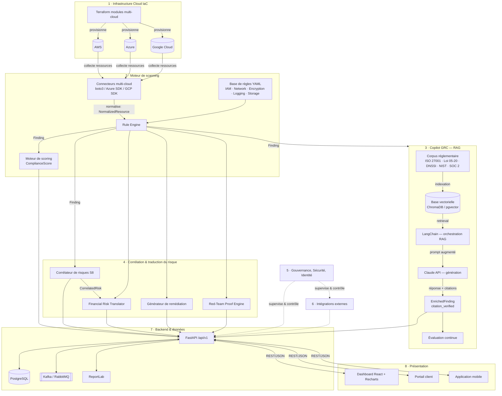
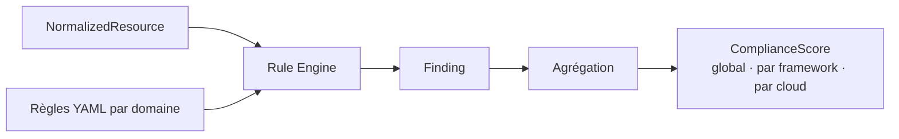
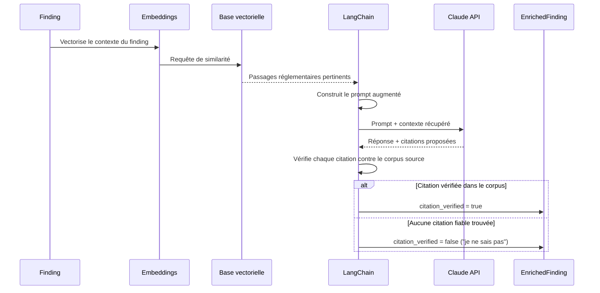
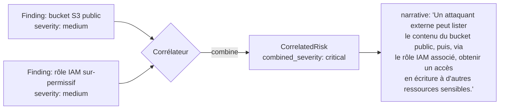
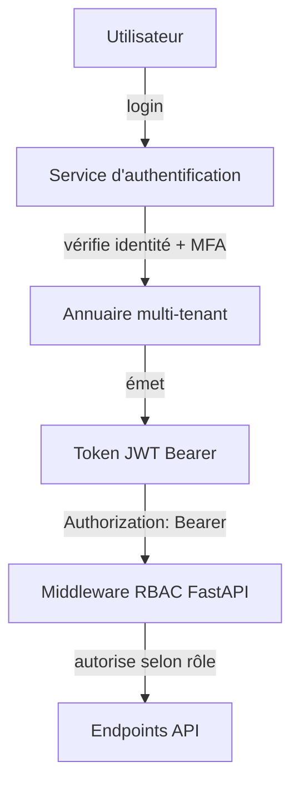
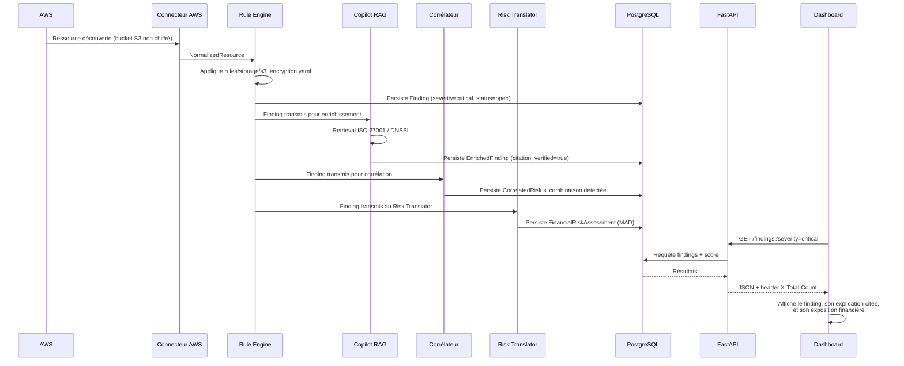
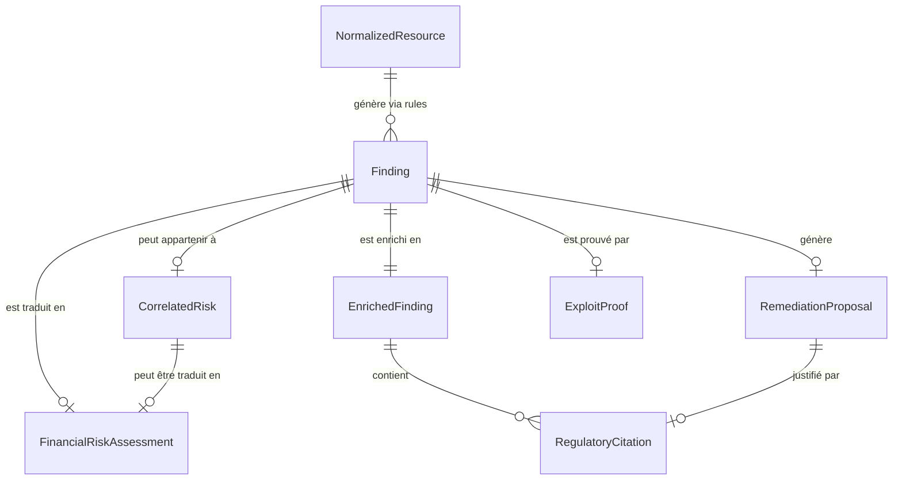

<div align="center">

# ComplianceIQ

### La plateforme intelligente de conformité Multi-Cloud

*Scanner. Comprendre. Corréler. Prouver. Corriger. Gouverner.*


</div>

---

> **Note d'échelle** : ce document décrit l'architecture complète et la vision produit de ComplianceIQ, telle que représentée dans le schéma d'architecture de référence, le contrat de données (`schema.py`) et le contrat API (`openapi.yaml`). Certains composants (couches 1, 5, 6, 11 notamment — Azure actif, gouvernance multi-tenant complète, intégrations SIEM/ITSM, Kubernetes/CI-CD) sont présentés comme cible d'architecture Enterprise ; leur statut d'implémentation précis à un instant T dépend de la version du produit que vous exécutez. Le pipeline central — scan, scoring, RAG avec citation vérifiée, corrélation, remédiation humaine, preuve d'exploitabilité sandboxée — constitue le cœur fonctionnel du produit et est celui décrit avec le plus de précision technique dans ce manuel.

---

## Sommaire

1. [Vision du produit](#1-vision-du-produit)
2. [Vision de l'architecture](#2-vision-de-larchitecture)
3. [Infrastructure Multi-Cloud](#3-infrastructure-multi-cloud)
4. [Moteur de Scan](#4-moteur-de-scan)
5. [Copilot IA](#5-copilot-ia)
6. [Corrélation des risques](#6-corrélation-des-risques)
7. [Gouvernance](#7-gouvernance)
8. [Intégrations](#8-intégrations)
9. [Backend](#9-backend)
10. [Frontend](#10-frontend)
11. [Mobile](#11-mobile)
12. [Déploiement](#12-déploiement)
13. [Sécurité](#13-sécurité)
14. [Structure complète du projet](#14-structure-complète-du-projet)
15. [Flux complet des données](#15-flux-complet-des-données)
16. [API](#16-api)
17. [Base de données](#17-base-de-données)
18. [Tests](#18-tests)
19. [Bonnes pratiques](#19-bonnes-pratiques)
20. [Roadmap Produit](#20-roadmap-produit)

---

## 1. Vision du produit

Toute organisation qui opère aujourd'hui sur plusieurs clouds — AWS pour un workload, Azure pour un autre, GCP pour un troisième — finit par découvrir la même vérité inconfortable : **personne ne sait exactement, en temps réel, si l'ensemble est conforme**. Les audits de sécurité deviennent des projets à part entière. Les tableurs Excel remplacent les tableaux de bord. Et quand un régulateur demande une preuve — un article précis, une citation exacte de la norme appliquée — la réponse est trop souvent reconstruite a posteriori, dans l'urgence, par une personne qui n'était pas là au moment du déploiement.

ComplianceIQ part d'un constat simple : **la conformité multi-cloud ne peut plus être un processus manuel, périodique et rétrospectif.** Elle doit devenir continue, automatisée, et surtout *explicable*. C'est cette dernière exigence — l'explicabilité — qui a orienté chacune des décisions d'architecture de ce produit.

### Le problème, en trois couches

| Couche du problème | Ce qui se passe sans ComplianceIQ |
|---|---|
| **Visibilité** | Chaque cloud a sa propre console, ses propres API, son propre vocabulaire. Personne n'a une vue unifiée de l'état réel de conformité. |
| **Compréhension** | Un finding technique brut (« security group ouvert sur 0.0.0.0/0 ») ne dit rien à un comité de direction. Il faut le traduire en risque métier, en impact financier, en obligation réglementaire précise. |
| **Action** | Corriger un problème de conformité implique souvent de modifier une infrastructure en production — un geste qui ne doit jamais être automatique sans validation humaine explicite. |

ComplianceIQ répond à ces trois couches avec trois capacités respectives : un **moteur de scan multi-cloud unifié**, un **copilot IA qui explique et cite ses sources**, et un **flux de remédiation qui reste toujours sous contrôle humain**.

### Pourquoi l'IA générative, précisément

On pourrait se contenter d'un moteur de règles : il détecterait les problèmes, très bien. Mais il ne saurait pas répondre à la question qu'un RSSI pose systématiquement en comité d'audit : *« Peut-on le prouver, et sur quelle base réglementaire précise ? »*. C'est là qu'intervient un pipeline de RAG (Retrieval-Augmented Generation) : au lieu de laisser un modèle de langage deviner une réponse plausible, ComplianceIQ l'oblige à aller chercher une citation réelle dans un corpus indexé (ISO 27001, DNSSI, Loi 05-20, NIST, SOC 2) avant de répondre. Si aucune citation fiable n'est trouvée, le copilot dit explicitement qu'il ne sait pas. **Ne jamais halluciner une obligation réglementaire est, dans ce produit, une contrainte d'architecture — pas une bonne intention.**

### Pourquoi le multi-cloud, précisément

Le multi-cloud n'est pas un choix marketing : c'est la réalité de toute organisation de taille moyenne à grande en 2026. ComplianceIQ normalise chaque ressource cloud — qu'elle vienne d'AWS, d'Azure ou de GCP — dans un format commun (`NormalizedResource`) avant même de la juger. Cela signifie qu'une même règle de conformité (« le chiffrement au repos doit être activé ») s'applique de façon cohérente, peu importe si la ressource sous-jacente est un bucket S3, un Blob Storage ou un Cloud Storage bucket.

### Qui utilise ComplianceIQ

| Persona | Ce qu'il vient chercher |
|---|---|
| **RSSI / Responsable conformité** | Une vue consolidée du score de conformité, par framework et par cloud, avec une traduction en risque financier. |
| **Ingénieur cloud / DevOps** | Des findings techniques précis, avec une proposition de correction Terraform prête à revue. |
| **Auditeur / Régulateur** | Des citations réglementaires vérifiées, traçables jusqu'au document source. |
| **Équipe Red Team / Sécurité offensive** | Une preuve d'exploitabilité, générée uniquement sur environnement sandbox, jamais en production. |

Cette diversité de personas explique naturellement pourquoi ComplianceIQ n'est pas un simple scanner : c'est une plateforme complète, avec une architecture en couches que nous allons maintenant détailler.

---

## 2. Vision de l'architecture

Si la vision produit répond à la question *pourquoi*, l'architecture répond à la question *comment*. ComplianceIQ est construit comme un pipeline : chaque couche reçoit une donnée d'une forme précise, l'enrichit, et la transmet à la suivante. Cette discipline de contrat de données strict (voir chapitre 17) est ce qui permet à des équipes différentes de travailler en parallèle sur des couches différentes sans jamais se marcher dessus.

L'architecture se compose de huit couches fonctionnelles, encadrées par une couche de déploiement transversale et une couche de gouvernance qui supervise l'ensemble :

```
┌─────────────────────────────────────────────────────────────────┐
│  1. INFRASTRUCTURE CLOUD (IaC)         Terraform → AWS/Azure/GCP │
└───────────────────────────────┬───────────────────────────────────┘
                                 │ collecte ressources
┌───────────────────────────────▼───────────────────────────────────┐
│  2. MOTEUR DE SCANNING          Connecteurs → Rule Engine → Score │
└───────────────────────────────┬───────────────────────────────────┘
                                 │ Finding
┌───────────────────────────────▼───────────────────────────────────┐
│  3. COPILOT GRC (RAG)            Corpus → Vecteurs → LLM → Citée │
└───────────────────────────────┬───────────────────────────────────┘
                                 │ EnrichedFinding
┌───────────────────────────────▼───────────────────────────────────┐
│  4. CORRÉLATION & RISQUE      Attack Paths → MAD → Remédiation   │
└───────────────────────────────┬───────────────────────────────────┘
                                 │
┌───────────────────────────────▼───────────────────────────────────┐
│  7. BACKEND & DONNÉES            FastAPI → PostgreSQL → Broker   │
└───────────────────────────────┬───────────────────────────────────┘
                                 │ API REST / JSON
┌───────────────────────────────▼───────────────────────────────────┐
│  8. PRÉSENTATION           Dashboard → Portail client → Mobile   │
└─────────────────────────────────────────────────────────────────┘

      supervisé transversalement par :
      5. GOUVERNANCE, SÉCURITÉ & IDENTITÉ
      6. INTÉGRATIONS EXTERNES (SIEM/SOAR/ITSM)

      porté par :
      DÉPLOIEMENT & SCALABILITÉ (Kubernetes / Docker / CI-CD)
```

### Le pipeline complet, en un diagramme Mermaid



### Le flux de données global, en une phrase

*Une ressource cloud est provisionnée par Terraform → collectée et normalisée par un connecteur → jugée par le Rule Engine, qui produit un Finding → ce Finding est simultanément expliqué par le Copilot RAG, corrélé à d'autres findings, traduit en risque financier, et candidat à une proposition de remédiation → tout cela est exposé par l'API FastAPI → et consommé par le dashboard, le portail client ou l'application mobile, sous la supervision continue de la couche de gouvernance.*

Cette phrase unique est la colonne vertébrale du reste de ce document. Chaque chapitre suivant zoome sur l'un de ses maillons — en commençant, logiquement, par le tout premier : comment l'infrastructure cloud elle-même est décrite et provisionnée.

---

## 3. Infrastructure Multi-Cloud

Avant de pouvoir scanner quoi que ce soit, ComplianceIQ a besoin d'un langage commun pour décrire l'infrastructure sous-jacente. Ce langage, c'est Terraform — choisi non pas par habitude, mais parce qu'il permet à la fois de **provisionner réellement** des environnements et de **simuler** une infrastructure qui n'existe pas encore (voir « Compliance Simulation » plus bas).

### Modules IaC multi-cloud

```hcl
# infra/terraform/modules/aws/main.tf
module "compliance_scanner_role" {
  source = "./modules/aws/iam"

  role_name = "compliance-iq-scanner"
  # Service account dédié — jamais de credentials personnels.
  # ComplianceIQ exige un rôle IAM à privilèges minimaux,
  # limité aux permissions de lecture nécessaires au scan.
  policy_document = data.aws_iam_policy_document.read_only_scan.json
}

module "environment_aws" {
  source   = "./modules/aws/environment"
  region   = "eu-west-1"
  tags = {
    "compliance-iq:managed" = "true"
    "compliance-iq:tenant"  = var.tenant_id
  }
}
```

> **Bonne pratique** : chaque environnement cloud provisionné par ComplianceIQ est tagué (`compliance-iq:tenant`), ce qui permet à l'annuaire multi-tenant (chapitre 7) d'associer chaque ressource découverte à l'organisation cliente propriétaire, sans ambiguïté.

### Providers couverts

| Provider | Statut | Mécanisme de collecte |
|---|---|---|
| **AWS** | Actif | `boto3`, via un rôle IAM dédié en lecture seule |
| **Microsoft Azure** | Actif | Azure SDK, via un service principal dédié |
| **Google Cloud** | Actif | GCP SDK, via un service account dédié |
| **OCI (Oracle Cloud)** | Prévu (roadmap, voir chapitre 20) | Non implémenté |

### Provisioning, Inventory, Discovery — trois responsabilités distinctes

Il est tentant de confondre ces trois notions ; ComplianceIQ les sépare délibérément :

- **Provisioning** : Terraform crée l'infrastructure elle-même (VPC, IAM, stockage). C'est un acte volontaire, versionné, revu.
- **Inventory** : à tout instant, ComplianceIQ maintient une liste vivante de *toutes* les ressources existantes dans les comptes cloud connectés — qu'elles aient été créées par Terraform ou manuellement dans une console.
- **Discovery** : le processus actif d'interrogation des API cloud pour rafraîchir cet inventaire — c'est la première tâche exécutée par le Moteur de Scanning, que nous abordons maintenant.

Cette distinction est cruciale : ComplianceIQ ne se contente pas d'auditer ce qu'il a lui-même déployé. Il découvre et évalue **l'intégralité** de l'environnement cloud, y compris les ressources créées en dehors de tout pipeline IaC — souvent la source la plus fréquente de dérive de conformité.

---

## 4. Moteur de Scan

Une fois l'inventaire des ressources cloud disponible, encore faut-il le transformer en un format que des règles de conformité peuvent interpréter de façon uniforme, quel que soit le cloud d'origine. C'est le rôle du Moteur de Scanning — le cœur opérationnel de ComplianceIQ.

### Étape 1 — Connecteurs et normalisation

Chaque connecteur (`aws.py`, `azure.py`, `gcp.py`) traduit les objets natifs de son cloud (un `Bucket` S3, un `Blob Container` Azure, un `Storage Bucket` GCP...) en un objet unique et générique :

```python
class NormalizedResource(BaseModel):
    """Une ressource cloud unique, peu importe son fournisseur d'origine."""

    cloud_provider: CloudProvider
    resource_id: str
    resource_type: str          # ex: s3_bucket, security_group, iam_user...
    region: Optional[str] = None
    tags: dict[str, str] = Field(default_factory=dict)

    # Attributs bruts spécifiques au type de ressource — volontairement
    # flexible pour ne pas exploser le schéma à chaque nouveau type.
    attributes: dict = Field(default_factory=dict)
    collected_at: str = Field(default_factory=lambda: datetime.now(timezone.utc).isoformat())
```

> 💡 **Astuce d'architecture** : le champ `attributes` est volontairement un dictionnaire libre plutôt qu'une explosion de champs typés par type de ressource. Cela évite de devoir modifier le schéma central à chaque fois qu'un nouveau type de ressource cloud doit être supporté — les règles savent, chacune, quels attributs lire selon le `resource_type`.

### Étape 2 — Le Rule Engine

Le Rule Engine applique un ensemble de règles déterministes, organisées par domaine :

| Domaine | Exemple de règle | Sévérité typique |
|---|---|---|
| **IAM** | Utilisateur avec accès `Admin` sans MFA activé | `high` |
| **Network** | `ec2.sg_open_to_world` — security group ouvert sur `0.0.0.0/0` | `critical` |
| **Encryption** | `s3.encryption_disabled` — bucket sans chiffrement au repos | `critical` |
| **Logging** | Journalisation d'accès désactivée sur une ressource sensible | `medium` |
| **Storage** | Bucket exposé publiquement en écriture | `critical` |

```yaml
# rules/network/ec2_sg_open_to_world.yaml
rule_id: ec2.sg_open_to_world
name: "Security Group ouvert à Internet"
category: network
severity: critical
source: cis
source_reference: "CIS AWS Foundations 5.2"
condition: >
  resource_type == "security_group" and
  any(rule.cidr == "0.0.0.0/0" for rule in resource.attributes.ingress_rules)
remediation_guide: >
  Restreindre les plages CIDR autorisées en entrée au strict nécessaire.
```

Chaque règle évaluée positivement produit un `Finding` — l'unité de donnée la plus importante de toute la plateforme, car c'est elle qui alimente *tous* les chapitres suivants (RAG, corrélation, risque financier, remédiation, preuve d'exploitabilité).

### Étape 3 — Le Compliance Engine et le scoring

Une fois tous les findings d'un scan produits, le moteur de scoring les agrège en un `ComplianceScore` global, décliné par framework réglementaire et par fournisseur cloud :



> ℹ️ **Note** : le champ `domain` sur `Finding` (`iam`, `network`, `encryption`, `logging`, `storage`) permet également de router chaque résultat vers l'onglet du tableau de bord correspondant — une décision d'architecture qui a des répercussions directement visibles au chapitre 10 (Frontend).

Un finding brut, aussi précis soit-il, reste une donnée technique. Pour qu'il devienne réellement actionnable — pour qu'il réponde à la question *« pourquoi est-ce un problème, et sur quelle base réglementaire »* — il doit être enrichi. C'est exactement le rôle du chapitre suivant : le Copilot IA.

---

## 5. Copilot IA

Un ingénieur cloud comprend immédiatement ce que signifie `s3.encryption_disabled`. Un comité d'audit, beaucoup moins. Et surtout : ni l'un ni l'autre ne veut se fier à une explication générée par une IA qui pourrait, sans le vouloir, inventer une référence réglementaire inexistante. C'est ce double besoin — pédagogie et fiabilité absolue — qui a motivé la conception du Copilot GRC.

### Pourquoi le RAG plutôt qu'un LLM seul

Un modèle de langage interrogé directement (« Explique-moi pourquoi ce bucket S3 non chiffré pose un problème de conformité ISO 27001 ») produira une réponse plausible — et c'est justement le danger. « Plausible » n'est pas « vérifié ». Le Retrieval-Augmented Generation renverse la logique : plutôt que de demander au modèle de *savoir*, on lui demande d'aller *chercher* dans une base documentaire indexée, puis de ne répondre qu'à partir de ce qu'il y a trouvé.

### Pourquoi ChromaDB / pgvector

La base vectorielle est ce qui permet de retrouver, parmi des milliers de pages de normes (ISO 27001, DNSSI, Loi 05-20, NIST, SOC 2), les quelques paragraphes réellement pertinents pour un finding donné — par similarité sémantique plutôt que par recherche de mots-clés exacts.

### Pourquoi LangChain

LangChain orchestre la chaîne complète : transformation de la question en requête vectorielle, récupération des passages pertinents, construction du prompt augmenté, appel au modèle, et post-traitement de la réponse pour en extraire les citations exploitables par le reste de la plateforme.

### Pourquoi Claude

Le modèle génératif doit produire un texte à la fois rigoureux (proche de la citation source) et lisible par un humain non technique — un équilibre pour lequel les modèles Claude d'Anthropic sont utilisés dans cette architecture.

### Le pipeline RAG complet



### Le contrat de sortie : `EnrichedFinding`

```python
class RegulatoryCitation(BaseModel):
    """Une citation vérifiée — jamais générée sans preuve dans le corpus."""
    framework: str              # ex: "ISO 27001", "Loi 05-20", "DNSSI"
    article_or_control: str     # ex: "Annexe A.8.24", "Article 12"
    excerpt: str                # extrait exact du corpus source
    source_document_id: str


class EnrichedFinding(BaseModel):
    """Un Finding enrichi par le copilot IA : explication + citation vérifiée."""
    finding: Finding
    explanation: str
    citations: list[RegulatoryCitation] = Field(default_factory=list)
    citation_verified: bool     # False → le copilot doit dire "je ne sais pas"
```

> ⚠️ **Garde-fou non négociable** : `citation_verified` n'est pas un simple indicateur d'affichage. C'est la règle d'or du produit : si cette valeur est `False`, l'interface (dashboard, portail, mobile) doit afficher explicitement que le copilot n'a pas trouvé de base réglementaire fiable — jamais une explication non sourcée présentée comme si elle l'était.

Un `EnrichedFinding` répond très bien à la question *« qu'est-ce que c'est, et pourquoi c'est interdit »*. Mais il ne répond pas encore à deux questions tout aussi importantes pour un comité de direction : *« est-ce grave si on combine ce problème à d'autres ? »* et *« combien cela peut-il nous coûter ? »*. C'est l'objet du chapitre suivant.

---

## 6. Corrélation des risques

Pris isolément, un finding « moyen » peut sembler négligeable. Mais la sécurité ne fonctionne pas en silos : un bucket public à faible sensibilité combiné à une clé IAM sur-permissive peut constituer un chemin d'attaque complet — ce qu'on appelle un *attack path*. ComplianceIQ modélise explicitement cette réalité au lieu de la laisser à l'appréciation manuelle d'un analyste.

### Attack Paths et Risk Engine

```python
class CorrelatedRisk(BaseModel):
    """Une combinaison de findings dont le risque combiné dépasse la somme des parties."""
    correlation_id: str
    finding_ids: list[str] = Field(..., min_length=2)
    combined_severity: Severity
    narrative: str   # Explication en langage naturel de la chaîne de risque
```

**Exemple d'attack path détecté par le Risk Engine :**



### Financial Risk — parler le langage du management

Un risque technique, même correctement corrélé, ne mobilise pas un comité de direction de la même façon qu'un chiffre. Le Financial Risk Translator convertit un `Finding` ou un `CorrelatedRisk` en fourchette d'exposition financière :

```python
class FinancialRiskAssessment(BaseModel):
    """Traduction d'un finding en exposition financière."""
    finding_id: Optional[str] = None
    correlation_id: Optional[str] = None
    estimated_min_mad: float = Field(..., ge=0)
    estimated_max_mad: float = Field(..., ge=0)
    rationale: str

    @field_validator("estimated_max_mad")
    @classmethod
    def max_gte_min(cls, v, info):
        min_val = info.data.get("estimated_min_mad")
        if min_val is not None and v < min_val:
            raise ValueError("estimated_max_mad doit être >= estimated_min_mad")
        return v
```

### Remediation — proposer sans jamais imposer

Une fois le risque compris et chiffré, ComplianceIQ peut proposer une correction — jamais l'appliquer seul :

```hcl
# Proposition générée automatiquement — NON appliquée tant que non approuvée
resource "aws_s3_bucket_server_side_encryption_configuration" "fix" {
  bucket = "mon-bucket-non-chiffre"

  rule {
    apply_server_side_encryption_by_default {
      sse_algorithm = "AES256"
    }
  }
}
```

```python
class RemediationProposal(BaseModel):
    finding_id: str
    terraform_snippet: str
    justification: str
    justification_citation: Optional[RegulatoryCitation] = None
    approved: bool = Field(default=False)   # Validation humaine requise
    approved_by: Optional[str] = None
    generated_at: str
```

> 🛑 **Bonne pratique fondamentale** : ne jamais initialiser `approved=True` par défaut, quel que soit le contexte. La signature humaine (`approved_by`) est le seul mécanisme qui autorise une correction à quitter l'état de proposition.

### Proof Engine — prouver sans jamais casser la production

Enfin, pour les organisations qui veulent aller plus loin qu'une simple détection déclarative, le Red-Team Proof Engine peut démontrer qu'un finding est réellement exploitable — mais uniquement dans un environnement explicitement tagué comme sandbox de test.

```python
class ExploitProof(BaseModel):
    """Preuve d'exploitabilité, générée UNIQUEMENT sur le sandbox tagué."""
    finding_rule_id: str
    resource_id: str
    exploited: bool
    narrative: str
    evidence: dict = Field(default_factory=dict)
    timestamp: str
```

```python
# proof_engine.py — extrait conceptuel du garde-fou
class UnsafeTargetError(Exception):
    """Levée si la ressource ciblée n'est pas taguée sandbox."""

def prove_impact(resource: NormalizedResource) -> ExploitProof:
    if resource.tags.get("compliance-iq:sandbox") != "true":
        raise UnsafeTargetError(
            f"Refus d'exécuter une preuve d'exploitabilité sur "
            f"{resource.resource_id} : ressource hors sandbox."
        )
    # ... exécution non destructive de la preuve, sandbox uniquement ...
```

Ces quatre capacités — corrélation, traduction financière, remédiation proposée, preuve sandboxée — ne peuvent exister sans un cadre de gouvernance strict qui détermine qui a le droit de déclencher quoi. C'est précisément l'objet du chapitre suivant.

---

## 7. Gouvernance

Une plateforme qui centralise l'état de conformité de plusieurs environnements cloud, propose des corrections d'infrastructure et peut déclencher des preuves d'exploitabilité doit, par construction, être elle-même exemplaire en matière de sécurité. La couche de Gouvernance de ComplianceIQ n'est pas une fonctionnalité parmi d'autres : c'est le filtre à travers lequel passe toute action sensible du système.

### IAM, RBAC et JWT



```python
# backend/auth/middleware.py — extrait conceptuel
from fastapi import Depends, HTTPException, Security
from fastapi.security import HTTPBearer

bearer_scheme = HTTPBearer()

async def require_permission(permission: str):
    async def checker(credentials = Security(bearer_scheme)):
        payload = decode_jwt(credentials.credentials)
        if permission not in payload.get("permissions", []):
            raise HTTPException(status_code=403, detail="Permission refusée")
        return payload
    return checker

@router.post("/findings/{finding_id}/remediation")
async def review_remediation(
    finding_id: str,
    body: RemediationReview,
    user = Depends(require_permission("approve_remediation")),
):
    ...
```

### Vault et gestion des secrets

Aucun secret (clé d'API cloud, token de service, clé de chiffrement du corpus RAG) ne transite en clair dans le code ou la configuration. Chaque environnement cloud a son coffre-fort natif :

| Cloud | Coffre-fort de secrets |
|---|---|
| AWS | AWS Secrets Manager |
| Azure | Azure Key Vault |
| Google Cloud | GCP Secret Manager |

### Audit et journalisation

Toute action sensible — approbation d'une remédiation, déclenchement d'une preuve d'exploitabilité, modification d'une règle — est journalisée dans un trail d'audit conçu pour répondre aux exigences de conformité elles-mêmes (RGPD, Loi 09-08). C'est une forme de récursivité assumée : **la plateforme de conformité est elle-même auditée en continu.**

Cette rigueur de gouvernance interne prépare naturellement la question suivante : comment ComplianceIQ s'insère-t-il dans un écosystème de sécurité déjà existant, plutôt que de fonctionner en silo ?

---

## 8. Intégrations

Aucune organisation sérieuse ne remplace son SIEM, son SOAR ou son outil de ticketing par une nouvelle plateforme isolée. ComplianceIQ est conçu pour s'intégrer à l'écosystème déjà en place, pas pour le concurrencer.

### SIEM / SOAR

| Intégration | Usage |
|---|---|
| Splunk | Envoi des findings critiques comme événements de sécurité |
| Microsoft Sentinel | Corrélation avec les autres signaux de sécurité déjà collectés |
| QRadar | Alimentation du pipeline SOAR existant |

### Notification et collaboration

```json
{
  "event": "finding.critical.detected",
  "webhook_url": "https://hooks.slack.com/services/...",
  "payload": {
    "rule_id": "s3.encryption_disabled",
    "severity": "critical",
    "resource_id": "arn:aws:s3:::mon-bucket-public",
    "dashboard_link": "https://app.complianceiq.io/findings/f_8a2c1e"
  }
}
```

Ces webhooks alimentent Slack, Microsoft Teams ou l'email, selon la préférence de l'organisation cliente.

### ITSM — Jira et ServiceNow

Chaque `RemediationProposal` peut, une fois approuvée, générer automatiquement un ticket dans l'outil ITSM de l'organisation, avec la proposition Terraform en pièce jointe et la citation réglementaire justificative en description.

Toutes ces intégrations, ainsi que l'ensemble des couches précédentes, convergent vers un même point de passage obligé : le backend. C'est lui qui orchestre, persiste et expose tout ce que nous avons décrit jusqu'ici.

---

## 9. Backend

Le backend de ComplianceIQ est construit autour de FastAPI, choisi pour trois raisons qui comptent particulièrement dans ce contexte : la validation de données native via Pydantic (qui s'aligne exactement sur le contrat `schema.py`), la génération automatique d'une documentation OpenAPI interactive, et des performances adaptées à un pipeline qui doit orchestrer des appels à des SDK cloud, une base vectorielle et un LLM.

### Architecture en couches

```
backend/
├── main.py                 # Point d'entrée, montage des routers
├── routers/                # Couche API — un router par domaine fonctionnel
│   ├── findings.py
│   ├── scores.py
│   └── copilot.py
├── services/                # Logique métier — indépendante de FastAPI
│   ├── scoring_service.py
│   └── remediation_service.py
├── repositories/            # Accès aux données — indépendant de la logique métier
│   └── findings_repository.py
├── auth/
│   └── middleware.py        # RBAC / JWT bearer
└── db/
    └── models.py             # Persistance SQLAlchemy, miroir de schema.py
```

> 💡 **Bonne pratique** : les *services* ne connaissent jamais FastAPI directement (pas de `Request`, pas de `Depends`) — cela permet de les tester unitairement sans lancer de serveur, et de les réutiliser depuis un worker asynchrone (voir Message Broker ci-dessous) sans dupliquer la logique.

### Exemple de router

```python
# backend/routers/findings.py
from fastapi import APIRouter, Depends, Query
from scanner.schema import Finding, CloudProvider, Severity, Domain

router = APIRouter(prefix="/api/v1", tags=["findings"])

@router.get("/findings", response_model=list[Finding])
async def list_findings(
    cloud_provider: CloudProvider | None = Query(default=None),
    severity: Severity | None = Query(default=None),
    domain: Domain | None = Query(default=None),
    limit: int = Query(default=50, le=200),
    offset: int = Query(default=0),
    service = Depends(get_findings_service),
):
    findings, total = await service.list_findings(
        cloud_provider=cloud_provider, severity=severity,
        domain=domain, limit=limit, offset=offset,
    )
    return JSONResponse(
        content=[f.model_dump() for f in findings],
        headers={"X-Total-Count": str(total)},
    )
```

### Message Broker et traitement asynchrone

Un scan complet d'un environnement cloud, l'appel au pipeline RAG et la génération d'un rapport PDF sont trois opérations dont la durée ne doit jamais bloquer une requête HTTP. ComplianceIQ délègue ce travail à un broker de messages (Kafka ou RabbitMQ selon le déploiement) :

```python
# Émission d'une tâche de scan asynchrone
await broker.publish(
    topic="scan.requested",
    message={"tenant_id": tenant_id, "cloud_provider": "aws", "region": "eu-west-1"},
)
```

### Caching

Les résultats de `GET /scores`, coûteux à recalculer à chaque appel, sont mis en cache avec une invalidation déclenchée par tout nouveau scan terminé — évitant de recalculer un `ComplianceScore` complet à chaque rafraîchissement de dashboard.

Le backend orchestre les données ; encore faut-il les présenter d'une façon qui donne envie de les consulter chaque jour. C'est le rôle du frontend.

---

## 10. Frontend

Le dashboard web est le point de contact quotidien entre ComplianceIQ et les équipes sécurité. Construit en React avec Recharts pour la visualisation de données, il est pensé multi-tenant dès sa conception : chaque organisation cliente dispose d'un espace isolé, sans possibilité de fuite de données entre tenants.

### Widgets principaux

| Widget | Donnée affichée |
|---|---|
| Score global | `ComplianceScore.overall_score`, avec tendance dans le temps |
| Répartition par framework | `score_by_framework` (ISO 27001, DNSSI...) |
| Répartition par cloud | `score_by_cloud` (AWS, Azure, GCP) |
| Liste des findings | Filtrable par `severity`, `domain`, `cloud_provider` |
| Fil du copilot | Historique des questions posées via `/copilot/ask` |
| File de remédiations | Propositions en attente d'approbation humaine |

### Exemple d'appel React vers l'API

```jsx
function useComplianceScore() {
  const [score, setScore] = useState(null);

  useEffect(() => {
    fetch("/api/v1/scores", {
      headers: { Authorization: `Bearer ${getToken()}` },
    })
      .then((res) => res.json())
      .then(setScore);
  }, []);

  return score;
}
```

### Reporting

Le dashboard permet de déclencher la génération d'un rapport PDF personnalisé (via ReportLab côté backend), destiné à être partagé directement avec un auditeur externe — un document qui ne fait que refléter, sous une forme imprimable, les mêmes données que le dashboard.

Le dashboard répond aux besoins d'une équipe assise devant un écran. Mais la conformité ne s'arrête pas à un bureau : c'est pourquoi ComplianceIQ propose également une expérience mobile.

---

## 11. Mobile

L'application mobile ComplianceIQ n'est pas une version réduite du dashboard : elle répond à un usage différent — être alerté et pouvoir agir en déplacement, notamment sur les décisions qui ne peuvent pas attendre un retour au bureau, comme l'approbation d'une remédiation critique.

### Architecture

L'application communique avec le même backend FastAPI, via les mêmes endpoints REST/JSON que le dashboard et le portail client — aucune API mobile dédiée n'est nécessaire, ce qui garantit que mobile et web restent toujours strictement synchronisés sur les mêmes données.

### Notifications

Un finding critique nouvellement détecté, ou une remédiation en attente d'approbation depuis plus d'un délai configuré, déclenche une notification push — le mobile devenant alors le canal le plus rapide pour débloquer une décision humaine bloquante dans le pipeline.

### Offline et synchronisation

Les données déjà consultées (liste de findings, score de conformité) restent disponibles en lecture hors-ligne. Toute action qui modifie un état (approbation de remédiation) est mise en file d'attente localement et synchronisée dès que la connectivité est rétablie, avec résolution de conflit basée sur l'horodatage serveur.

Que ce soit sur le dashboard ou sur mobile, l'expérience utilisateur ne vaut que si la plateforme qui la sert est elle-même fiable, disponible et déployée de façon reproductible. C'est l'objet du chapitre suivant.

---

## 12. Déploiement

ComplianceIQ est pensé pour être déployé de façon reproductible, à l'échelle, et sans intervention manuelle sur l'infrastructure de production.

### Conteneurisation

```dockerfile
# Dockerfile — backend
FROM python:3.11-slim AS base
WORKDIR /app
COPY requirements.txt .
RUN pip install --no-cache-dir -r requirements.txt
COPY . .
CMD ["uvicorn", "backend.main:app", "--host", "0.0.0.0", "--port", "8000"]
```

```yaml
# docker-compose.yml — environnement de développement local
version: "3.9"
services:
  backend:
    build: .
    ports: ["8000:8000"]
    environment:
      DATABASE_URL: postgresql://compliance:compliance@db:5432/compliance_iq
    depends_on: [db, broker]
  db:
    image: postgres:16
    environment:
      POSTGRES_DB: compliance_iq
      POSTGRES_USER: compliance
      POSTGRES_PASSWORD: compliance
  broker:
    image: bitnami/kafka:latest
```

### Kubernetes et Helm

En production, chaque service (API, worker asynchrone, module RAG) est déployé comme un déploiement Kubernetes indépendant, ce qui permet de scaler le worker RAG (gourmand en calcul lors des appels LLM) séparément de l'API REST (gourmande en connexions concurrentes) :

```yaml
# helm/templates/api-deployment.yaml (extrait)
apiVersion: apps/v1
kind: Deployment
metadata:
  name: compliance-iq-api
spec:
  replicas: {{ .Values.api.replicaCount }}
  template:
    spec:
      containers:
        - name: api
          image: "{{ .Values.image.repository }}:{{ .Values.image.tag }}"
          ports: [{ containerPort: 8000 }]
          envFrom:
            - secretRef: { name: compliance-iq-secrets }
```

### CI/CD

```yaml
# .github/workflows/ci.yml
name: CI
on: [push, pull_request]
jobs:
  test:
    runs-on: ubuntu-latest
    steps:
      - uses: actions/checkout@v4
      - run: pip install -r requirements.txt
      - run: pytest tests/unit tests/integration
      - run: python tests/runner.py   # validation croisée du contrat schema.py/openapi.yaml
  build-and-push:
    needs: test
    runs-on: ubuntu-latest
    steps:
      - run: docker build -t compliance-iq-api .
      - run: docker push ...
```

### Observabilité

| Pilier | Outil typique |
|---|---|
| Monitoring | Métriques d'infrastructure et applicatives |
| Logging | Logs structurés centralisés |
| Tracing | Suivi distribué d'une requête à travers scan → RAG → API |

Déployer une plateforme qui manipule des identifiants cloud, des secrets et des propositions de modification d'infrastructure impose un niveau d'exigence de sécurité qui dépasse la simple gouvernance interne décrite au chapitre 7. C'est ce que nous détaillons maintenant, de façon transversale à toute l'architecture.

---

## 13. Sécurité

### Architecture Zero Trust

Aucun composant de ComplianceIQ ne fait confiance implicitement à un autre du seul fait qu'il se trouve sur le même réseau interne. Chaque appel de service à service est authentifié, chaque token a une portée limitée dans le temps, et chaque accès à un secret est audité.

### Chiffrement

- **En transit** : TLS obligatoire sur tous les appels externes (API publique, connecteurs cloud, appel au LLM).
- **Au repos** : chiffrement des données persistées (PostgreSQL), y compris les `Finding` et `EnrichedFinding` qui peuvent contenir des identifiants de ressources sensibles.

### Authentification et autorisation

Le même mécanisme JWT Bearer + RBAC décrit au chapitre 7 s'applique uniformément : dashboard, portail client, application mobile, et tout appel API tiers (SIEM, ITSM) passent par la même vérification de permission granulaire (`view_findings`, `approve_remediation`, `run_red_team`, `manage_rules`, `admin`...).

### Protection API et Secrets

- Rate limiting sur tous les endpoints publics.
- Rotation régulière des secrets stockés dans les coffres-forts natifs (Secrets Manager / Key Vault / Secret Manager).
- Aucun secret n'apparaît jamais dans un log, y compris en cas d'erreur.

### Sandbox

Le principe déjà énoncé au chapitre 6 mérite d'être répété ici comme principe de sécurité transversal, et non comme simple détail fonctionnel du Proof Engine :

> **Aucune action potentiellement destructive ou intrusive n'est jamais exécutée en dehors d'un environnement explicitement tagué comme sandbox de test.** Ce principe est appliqué au niveau du code (`UnsafeTargetError`) et non laissé à la discipline de configuration d'un opérateur humain.

### Conformité de la plateforme elle-même

ComplianceIQ applique à sa propre infrastructure les standards qu'il audite chez ses clients — RGPD pour les données personnelles traitées, et les mêmes référentiels de sécurité (ISO 27001, NIST) pour son propre socle technique.

Cette rigueur transversale s'incarne concrètement dans l'organisation du code source. Voir maintenant comment.

---

## 14. Structure complète du projet

```
compliance-iq/
├── scanner/
│   ├── schema.py                  # 🔒 Contrat de données central — jamais d'edit solo
│   ├── connectors/
│   │   ├── aws.py                  # Collecte AWS (boto3) → NormalizedResource
│   │   ├── azure.py                # Collecte Azure (Azure SDK) → NormalizedResource
│   │   └── gcp.py                  # Collecte GCP (GCP SDK) → NormalizedResource
│   ├── rules/
│   │   ├── iam/                     # Règles IAM (YAML)
│   │   ├── network/                  # Règles réseau
│   │   ├── encryption/               # Règles chiffrement
│   │   ├── logging/                  # Règles journalisation
│   │   └── storage/                   # Règles stockage
│   ├── correlation/
│   │   └── correlator.py             # Combine des Finding en CorrelatedRisk
│   ├── proof_engine.py               # Red-Team Proof Engine, garde-fou UnsafeTargetError
│   └── remediation/
│       └── generator.py               # Génère les RemediationProposal
├── rag/
│   ├── ingestion/                    # Ingestion des corpus réglementaires
│   ├── embeddings/                   # Index vectoriel (ChromaDB / pgvector)
│   └── linker.py                     # Finding → EnrichedFinding
├── risk_translator/
│   └── financial.py                  # Finding/CorrelatedRisk → FinancialRiskAssessment
├── backend/
│   ├── main.py
│   ├── routers/
│   ├── services/
│   ├── repositories/
│   ├── auth/
│   │   └── middleware.py
│   └── db/
│       └── models.py                 # Persistance SQLAlchemy, miroir de schema.py
├── frontend/                          # Dashboard React + Recharts
├── mobile/                             # Application mobile
├── infra/
│   ├── terraform/                      # IaC multi-cloud + sandbox de test taggé
│   └── helm/                            # Charts Kubernetes
├── tests/
│   ├── unit/
│   ├── integration/
│   └── runner.py                        # Validation croisée du contrat
├── openapi.yaml                         # 🔒 Contrat API — jamais d'edit solo
├── requirements.txt
├── docker-compose.yml
└── README.md
```

> 🔒 = fichier constituant un contrat partagé entre équipes : `schema.py` et `openapi.yaml`. Toute modification doit être discutée avant d'être appliquée — c'est la garantie que le scanner, le RAG, le backend et le frontend restent toujours d'accord sur la forme des données qu'ils échangent.

Cette organisation en dossiers reflète directement le pipeline logique décrit au chapitre 2. Revenons-y une dernière fois, mais cette fois en suivant une donnée unique, de bout en bout, comme le ferait un ingénieur en train de déboguer un incident.

---

## 15. Flux complet des données

Suivons le parcours complet d'une seule ressource cloud, depuis sa découverte jusqu'à son affichage dans le dashboard.



Ce flux illustre une propriété essentielle de l'architecture : **un même événement de découverte déclenche plusieurs traitements en parallèle** (enrichissement RAG, corrélation, traduction financière), tous convergeant vers la même base de données, puis exposés de façon unifiée par une seule couche API. C'est cette API que nous détaillons maintenant.

---

## 16. API

L'intégralité de la plateforme est pilotable via une API REST versionnée, documentée par un contrat OpenAPI strict, et protégée par authentification Bearer JWT.

### Tous les endpoints

| Méthode | Chemin | Description | Propriétaire fonctionnel |
|---|---|---|---|
| `GET` | `/findings` | Liste des findings, filtrable et paginée | Scoring / Findings |
| `GET` | `/scores` | Score de conformité agrégé | Scoring |
| `GET` | `/findings/{finding_id}/explain` | Explication IA + citation vérifiée | Copilot |
| `POST` | `/findings/{finding_id}/prove-impact` | Lance le Red-Team Proof Engine (sandbox uniquement) | Red-Team Proof Engine |
| `GET` | `/findings/{finding_id}/remediation` | Récupère la proposition de remédiation | Générateur de remédiation |
| `POST` | `/findings/{finding_id}/remediation` | Approuve/rejette la remédiation | Validation dashboard/mobile |
| `POST` | `/copilot/ask` | Question libre au copilot RAG | Copilot |
| `GET` | `/risk/financial/{finding_id}` | Estimation du risque financier en MAD | Risk Translator |

### Exemple complet — lister les findings critiques AWS

**Requête**
```http
GET /api/v1/findings?cloud_provider=aws&severity=critical&limit=10 HTTP/1.1
Authorization: Bearer <token>
```

**Réponse `200 OK`**
```json
[
  {
    "id": "f_8a2c1e",
    "cloud_provider": "aws",
    "resource_id": "arn:aws:s3:::mon-bucket-public",
    "resource_type": "s3_bucket",
    "rule_id": "s3.encryption_disabled",
    "severity": "critical",
    "domain": null,
    "description": "Le bucket S3 n'a pas de chiffrement au repos activé.",
    "detected_at": "2026-07-10T09:12:00+00:00",
    "simulated": false,
    "correlation_id": null
  }
]
```
> Le nombre total de résultats disponibles (avant pagination) est renvoyé dans le header `X-Total-Count`.

### Exemple — interroger le copilot librement

**Requête**
```json
POST /api/v1/copilot/ask
{
  "question": "Sommes-nous conformes aux exigences de logging de la DNSSI ?"
}
```

**Réponse `200 OK`**
```json
{
  "finding": { "...": "..." },
  "explanation": "La ressource concernée ne journalise pas les accès administrateurs, ce qui contrevient à l'exigence de traçabilité de la DNSSI.",
  "citations": [
    {
      "framework": "DNSSI",
      "article_or_control": "Article 12",
      "excerpt": "...",
      "source_document_id": "dnssi_2020_fr"
    }
  ],
  "citation_verified": true
}
```

### Codes d'erreur

| Code | Signification |
|---|---|
| `401` | Token manquant ou invalide |
| `403` | Refus explicite — ex. `UnsafeTargetError` sur `/prove-impact` |
| `404` | Ressource introuvable |
| `422` | Corps de requête ou paramètres invalides |

### Swagger / OpenAPI

Le contrat complet est disponible de façon interactive une fois le backend lancé :

```bash
uvicorn backend.main:app --reload --port 8000
open http://localhost:8000/docs
```

Cette API n'est qu'une façade : derrière elle se trouve un modèle de données persistant qu'il est temps de détailler.

---

## 17. Base de données

Le schéma relationnel de ComplianceIQ est un miroir direct du contrat `schema.py` — chaque modèle Pydantic CORE a sa table de persistance correspondante.

### Modèles CORE et leur rôle

| Modèle | Rôle | Produit par | Consommé par |
|---|---|---|---|
| `NormalizedResource` | État brut normalisé d'une ressource cloud | Connecteurs | Rule Engine |
| `Finding` | Problème de conformité détecté | Rule Engine | Corrélation, RAG, Risk Translator, Remediation, Proof Engine, API |
| `CorrelatedRisk` | Combinaison de findings à risque composite | Corrélateur | Risk Translator, API |
| `RegulatoryCitation` | Citation vérifiée d'un référentiel | RAG Pipeline | EnrichedFinding, RemediationProposal |
| `EnrichedFinding` | Finding + explication + citation | RAG Pipeline | API, Dashboard |
| `FinancialRiskAssessment` | Exposition financière en MAD | Risk Translator | API |
| `RemediationProposal` | Proposition de correction Terraform | Générateur de remédiation | API, Dashboard/Mobile |
| `ExploitProof` | Preuve d'exploitabilité sandbox | Proof Engine | API |
| `ComplianceScore` | Score agrégé de conformité | Moteur de scoring | API, Dashboard |

### ER Diagram



### Exemple SQL — requête des findings critiques non résolus

```sql
SELECT f.id, f.resource_id, f.rule_id, f.severity, f.detected_at
FROM findings f
WHERE f.severity = 'critical'
  AND f.status = 'open'
  AND f.tenant_id = :tenant_id
ORDER BY f.detected_at DESC
LIMIT 50 OFFSET 0;
```

### Optimisations

- Index composite sur `(tenant_id, severity, status)` pour accélérer le filtrage du dashboard.
- Index sur `correlation_id` pour retrouver rapidement tous les findings d'un `CorrelatedRisk`.
- Partitionnement par tenant pour les déploiements à fort volume, garantissant l'isolation stricte des données entre organisations clientes.

Un schéma de données aussi central ne vaut rien s'il n'est pas protégé par une discipline de test rigoureuse, à chaque niveau du pipeline.

---

## 18. Tests

### Tests unitaires

Chaque règle de conformité, chaque validator Pydantic (`max_gte_min`, `not_empty`...) et chaque service métier est couvert isolément.

```python
def test_financial_risk_max_must_be_gte_min():
    with pytest.raises(ValidationError):
        FinancialRiskAssessment(
            estimated_min_mad=10000,
            estimated_max_mad=5000,
            rationale="test",
        )
```

### Tests d'intégration

Vérifient le pipeline bout-en-bout : d'une ressource simulée jusqu'à la réponse API, en passant par le Rule Engine et le RAG.

### Validation croisée du contrat

```bash
python tests/runner.py
```
Ce script vérifie qu'aucune divergence silencieuse n'existe entre `schema.py`, `openapi.yaml` et les modèles de persistance — le mécanisme qui protège les équipes travaillant en parallèle sur des couches différentes.

### Tests de sécurité

Vérifient explicitement que le Proof Engine refuse toute cible non taguée sandbox, et qu'aucune `RemediationProposal` ne peut être marquée `approved=True` sans passer par l'endpoint de validation humaine.

### Tests de performance et de charge

Mesurent le temps de scan complet d'un environnement de taille moyenne, et la latence du pipeline RAG sous charge concurrente — deux indicateurs directement liés à l'expérience utilisateur du dashboard en temps réel.

Cette discipline de test s'accompagne d'un ensemble de bonnes pratiques transversales, qui condensent les principes évoqués tout au long de ce manuel.

---

## 19. Bonnes pratiques

### Architecture
- Respecter strictement la séparation entre couches (connecteurs → Rule Engine → enrichissement → API → présentation) — jamais de court-circuit direct entre le frontend et le Rule Engine, par exemple.
- Traiter `schema.py` et `openapi.yaml` comme des contrats verrouillés : toute modification est discutée avant d'être appliquée.

### Développement
- Utiliser les enums fermés (`CloudProvider`, `Severity`, `Domain`) plutôt que des chaînes libres, pour éviter toute dérive de vocabulaire entre les couches.
- Dater systématiquement en ISO 8601 UTC.

### Sécurité
- Jamais de credentials personnels pour les connecteurs cloud — toujours un service account ou rôle IAM dédié à privilèges minimaux.
- `approved=False` par défaut sur toute `RemediationProposal`, sans exception.
- `citation_verified=False` doit toujours se traduire par un message explicite de type « je ne sais pas », jamais par une explication non sourcée présentée comme fiable.
- Le Red-Team Proof Engine ne s'exécute jamais hors sandbox — le garde-fou est implémenté au niveau du code (`UnsafeTargetError`), pas seulement de la documentation.

### Cloud
- Tagger systématiquement les ressources provisionnées avec l'identité du tenant propriétaire.
- Séparer clairement les environnements sandbox (utilisables par le Proof Engine) des environnements de production.

### CI/CD
- Faire tourner `tests/runner.py` à chaque pull request touchant `schema.py` ou `openapi.yaml`.
- Ne jamais déployer en production un changement qui casse la compatibilité ascendante du contrat API.

### Terraform
- Toujours passer par un module versionné plutôt que par des ressources ad hoc, pour garder l'infrastructure auditable.
- Utiliser `terraform plan` en mode simulation pour alimenter la Compliance Simulation (findings avec `simulated=true`), avant tout déploiement réel.

### Python / FastAPI
- Garder les services métier indépendants de FastAPI, pour permettre leur test unitaire et leur réutilisation dans des workers asynchrones.
- Valider systématiquement les entrées via les modèles Pydantic du contrat central, jamais via des dictionnaires non typés.

Ces pratiques ne sont pas figées : elles évoluent avec la plateforme elle-même. Ce qui nous amène, logiquement, à la dernière question de ce manuel — où va ComplianceIQ à partir d'ici ?

---

## 20. Roadmap Produit

### Vision long terme

ComplianceIQ vise à devenir le point de vérité unique de la posture de conformité multi-cloud d'une organisation — un système où la détection, l'explication réglementaire et la remédiation ne sont plus trois processus séparés gérés par des outils différents, mais un seul pipeline continu et auditable.

### Prochaines étapes

| Axe | Évolution prévue |
|---|---|
| **Cloud** | Activation complète du support Azure et ajout d'OCI (Oracle Cloud) comme quatrième fournisseur |
| **Gouvernance** | Passage d'un RBAC à rôles fixes vers un modèle de permissions à la carte, avec annuaire multi-tenant complet |
| **Intégrations** | Connecteurs natifs SIEM/SOAR (Splunk, Sentinel, QRadar) et ITSM (Jira, ServiceNow) en production |
| **Observabilité** | Instrumentation complète du pipeline (scan, RAG, remédiation) pour un monitoring et un tracing de bout en bout |
| **Scoring avancé** | Passage d'un score de sévérité simple vers un scoring multi-facteurs (probabilité, impact, exploitabilité) |
| **Gestion des exceptions** | Workflow structuré de gestion des faux positifs et des exceptions de conformité justifiées métier |
| **Audit** | Trail d'audit dédié et persistant, avec détection d'anomalies, au-delà des logs applicatifs standards |

### Une plateforme conçue pour scaler vers un vrai produit

Une partie du contrat de données (`schema.py`) documente déjà, volontairement, des modèles « niveau production » qui ne sont pas encore branchés à une logique métier active : traçabilité complète des données (`DataProvenance`), moteur de workflow avec SLA (`Workflow`), audit avancé (`AuditEvent`), scoring de risque multi-facteurs (`RiskScore`). Ce choix n'est pas un oubli : c'est une décision d'architecture assumée, qui montre la voie vers laquelle la plateforme est conçue pour évoluer, sans jamais prétendre que ces capacités fonctionnent avant qu'elles ne soient réellement câblées.

---

<div align="center">

**ComplianceIQ** — parce que la conformité multi-cloud ne devrait jamais être une question de chance.

</div>
