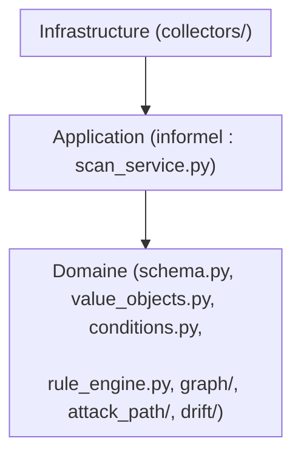

# 01 · Architecture

## 1. Overview

Ce dépôt suit une séparation Domain/Application/Infrastructure **de fait**,
sans encore l'arborescence de dossiers formelle qui la matérialiserait
(`domain/`, `application/`, `infrastructure/` n'existent pas comme dossiers
— tout est aujourd'hui dans `scanner/` à plat).

## 2. Scope

### Responsable de
Documenter la séparation réelle des responsabilités dans le code actuel.

### NOT responsable de
Documenter une arborescence en couches qui n'existe pas encore — voir
`13-decisions/architecture-decisions.md` pour la décision de restructuration
différée.

## 3. Architecture Position



## 4. Project Structure (réelle, vérifiée)

```text
scanner/
├── schema.py            -- Domain: entites + enums
├── value_objects.py       -- Domain: VO
├── conditions.py            -- Domain: service d'evaluation
├── rule_engine.py            -- Domain: service d'orchestration des regles
├── graph/                     -- Domain: ResourceGraph + construction
├── attack_path/                 -- Domain: 6 composants separes
├── drift/                        -- Domain: canonicalisation + diff
├── scan_service.py                -- Application (informel) : orchestration
└── collectors/                      -- Infrastructure : AWS reel, Mock
```

Voir `domain.md`, `application.md`, `infrastructure.md`,
`dependency-rules.md` pour le détail de chaque couche.
