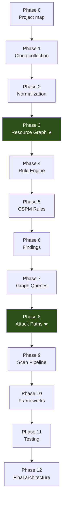
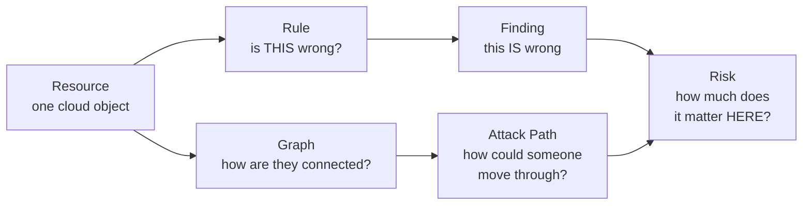

# ComplianceIQ Study Guide

A phase-by-phase walkthrough of **what is actually implemented in this
repository**. Not CSPM theory — every claim points at a file, a class, or
a test you can open.

> **Accuracy contract.** Every number and behaviour here was verified
> against the repository by executing a command or reading the code. Where
> something could not be verified it is marked
> **⚠️ Repository verification required** rather than guessed. Where a
> capability does not exist, the guide says so — the *limitations* are as
> carefully documented as the features, because knowing what ComplianceIQ
> cannot do is what stops you promising it to a customer.

---

## The one question this guide answers

> Take a real AWS resource. Explain exactly how ComplianceIQ collects it,
> normalizes it, inserts it into the Resource Graph, evaluates YAML rules
> against it, produces a Finding, queries relationships around it,
> determines whether it participates in an Attack Path, scores that path,
> enriches risk, and eventually exposes the result.

If you can answer that at the end, the guide worked.

---

## Roadmap



★ = the two phases that carry the most weight for your role.

---

## Phases

| # | Phase | Focus | Est. time |
|---|---|---|---|
| 0 | [Project map](phase-00-project-map/) | Architecture, layering, where things live | 45 min |
| 1 | [Cloud collection](phase-01-cloud-collection/) | Collectors, pagination, retry, `UNKNOWN` at the source | 1.5 h |
| 2 | [Normalization](phase-02-normalization/) | `NormalizedResource`, provider→domain mapping | 1 h |
| 3 | **[Resource Graph](phase-03-resource-graph/)** ★ | Nodes, edges, external nodes, integrity, determinism | 3 h |
| 4 | [Rule Engine](phase-04-rule-engine/) | Condition DSL, operators, Kleene logic | 2.5 h |
| 5 | [CSPM Rules](phase-05-cspm-rules/) | The 68-rule catalog, cross-resource rules | 1.5 h |
| 6 | [Findings](phase-06-findings/) | Finding model, evidence, severity, contextualization | 1.5 h |
| 7 | [Graph Queries](phase-07-graph-queries/) | The 11 primitives, indexes, multi-hop | 2 h |
| 8 | **[Attack Paths](phase-08-attack-paths/)** ★ | Scenarios, discovery, scoring, severity, risk | 3.5 h |
| 9 | [Scan Pipeline](phase-09-scan-pipeline/) | End-to-end orchestration | 1.5 h |
| 10 | [Frameworks](phase-10-frameworks/) | What exists, what is unresolved, who owns it | 45 min |
| 11 | [Testing](phase-11-testing/) | How to read the tests; the seam problem | 2 h |
| 12 | [Final architecture](phase-12-final-architecture/) | The complete picture | 1 h |

Plus: [glossary](glossary.md) · [what to work on next](next-work.md) ·
[completion report](STUDY-GUIDE-COMPLETION-REPORT.md)

**Total: roughly 23 hours** of focused reading with the code open.

---

## How to use it

Each phase has:

- **`README.md`** — the teaching content. Problem → why → files →
  classes → data in/out → callers → assumptions → failure modes → tests →
  limitations.
- **Deep-dive files** in the two ★ phases.
- **Learning objectives** — "what I should know now".
- **Self-test questions** at the end, with answers in **`answers.md`**.
  Don't read the answers first. The questions are where the learning
  actually happens.

**Read with the repository open.** Every file path is real; open it.

### Difficulty progression

| Level | What you can do | Phases |
|---|---|---|
| 1 — Understand | Follow the data flow | 0–2 |
| 2 — Explain | Describe each layer to someone else | 3–6 |
| 3 — Read the code | Trace a scan through the source | 7–9 |
| 4 — Debug | Diagnose why a rule or path did/didn't fire | 10–11 |
| 5 — Design | Extend it without breaking invariants | 12 + next-work |

---

## Prerequisites

- Python: dataclasses, type hints, generators, `Enum`
- AWS: IAM roles/trust policies, S3 ACLs & bucket policies, security
  groups, CloudTrail
- Azure (lighter): storage accounts, NSGs, Key Vault
- Helpful, not required: hexagonal architecture, three-valued logic

---

## What you can skip, and what you can't

**Skippable for a first pass:** Phase 2 (normalization is mechanical),
Phase 10 (frameworks are another owner's area — read it once to know the
boundary).

**Never skip:**

- **Phase 3 §6 — graph integrity and external nodes.** A real blocker
  that crashed every scan involving an IAM role.
- **Phase 4 §6 — `UNKNOWN` tri-state.** The single most important
  correctness idea in the codebase.
- **Phase 8 §5 — scoring, and §10 — limitations.** You will be asked what
  a score means and what the product cannot yet detect.
- **Phase 11 — the seam problem.** Why components can pass every unit
  test and still be broken together.

---

## The four core concepts, and how they relate



The distinction to hold onto:

| Question | Answered by |
|---|---|
| *What configuration is wrong?* | **Finding** |
| *How are resources connected?* | **Resource Graph** |
| *How could an attacker move?* | **Attack Path** |
| *How much does this one matter?* | **Risk** |

A Finding on an isolated bucket and the same Finding on a bucket that
CloudTrail writes audit logs into are the *same rule at the same
severity* — and completely different urgency. Everything from Phase 7
onward exists to express that difference.

---

## Current state, in numbers

Verified by execution at the time of writing:

```
Tests:               1408 collected · 1348 passed · 60 skipped · 0 failed
Source files:        175 (mypy-checked)
Rules:               68 (41 AWS / 27 Azure) · 7 cross-resource
Operators:           32 · Condition node types: 6
AWS collectors:      7  · Azure collectors: 5
Relationship types:  8 defined / 5 emitted
Graph queries:       11
Attack path scenarios: 4
```

The 60 skipped tests are the AWS/Azure integration suites, which require
real cloud credentials. **No collector in this repository has been run
against a live AWS or Azure API.**
