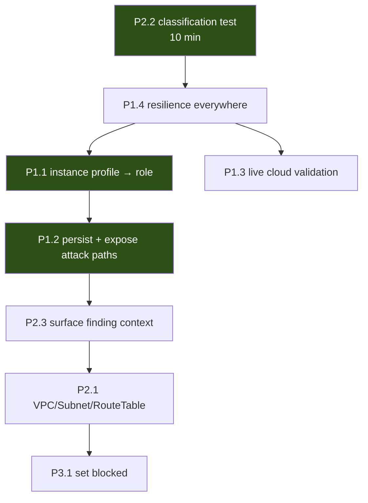

# What To Work On Next

Derived strictly from the current repository state. Every item names why
it matters, what it depends on, what it touches, whether it is safe to
start now, and what it would change.

---

## P0 — Blockers

**None.**

Nothing prevents the platform from running end to end. The suite is green
(1348 passed, 0 failed), the pipeline is wired, and all three previously
documented blockers — the graph integrity crash, the graph not reaching
the rule engine, and the placeholder analyzer — are fixed and
regression-tested.

The items below are about **value and honesty**, not brokenness.

---

## P1 — Important for a commercial CSPM

### P1.1 — Instance profile → role resolution

**Why:** the single highest-leverage change in the repository. One API
call unlocks the textbook cloud attack chain, *internet → workload →
identity → data* — the thing every competitor demos and ComplianceIQ
currently cannot detect.

| | |
|---|---|
| **Depends on** | Nothing. `ASSUMES` is already traversable |
| **Touches** | `aws/resource_collectors/ec2.py`, `aws/normalizers/ec2.py`, tests |
| **Safe now?** | ✅ Yes — additive, one new API call |
| **Impact** | High. Unlocks the highest-value scenario |

**Care required:** never derive the role from the profile *name* — that is
a convention, not a fact. On `AccessDenied`, emit **no edge** and mark the
attribute `UNKNOWN`. Delete
`test_no_workload_to_identity_path_is_invented` only when the edge
genuinely exists.

### P1.2 — Persist attack paths and expose them

**Why:** the pipeline computes attack paths and **throws them away**.
`PersistScanResult` silently drops `ScanResult.attack_paths`. Their risk
survives via findings; the chain, evidence and score breakdown do not. A
customer cannot see the analysis that produced their risk score.

| | |
|---|---|
| **Depends on** | Nothing |
| **Touches** | New ORM model, mapper, migration `0004`, repository, router, schema |
| **Safe now?** | ✅ Yes — purely additive |
| **Impact** | High. Turns an internal computation into a product feature |

**Design note:** reference paths by id from findings, never embed. See
Phase 12 answer 7 for the failure modes of embedding.

### P1.3 — Live cloud validation

**Why:** **no collector has ever run against a real AWS or Azure API.**
Every collector test uses fakes modelled on *documented* response shapes.
Documentation and reality diverge — undocumented fields, conditional
pagination, different error codes.

| | |
|---|---|
| **Depends on** | A test AWS account + the existing Terraform estates |
| **Touches** | Nothing in code; runs the 60 skipped tests |
| **Safe now?** | ✅ Yes — read-only scanning |
| **Impact** | High. Converts a modelled assumption into a verified one |

This is the largest gap between "tests pass" and "works".

### P1.4 — Resilience across all collectors

**Why:** 11 of 12 collectors lack retry, pagination and per-item
isolation. S3 and CloudTrail have **no paginator** — on a large estate
they silently return a first page and report it as the whole account.
Silent truncation is the worst class of CSPM bug.

| | |
|---|---|
| **Depends on** | Nothing; `resilience.py` exists and is tested |
| **Touches** | 11 collector files |
| **Safe now?** | ✅ Yes — mechanical, well-tested layer |
| **Impact** | High. Correctness at scale |

### P1.5 — Resolve the framework mappings

**Why:** 16 of 27 unresolved, including **100% of `cis_azure`**. Customers
see CIS control references and reasonably infer coverage.

| | |
|---|---|
| **Depends on** | Licensed benchmark text |
| **Touches** | YAML `framework_mappings` only |
| **Safe now?** | ⚠️ **Not yours** — framework owner's area |
| **Impact** | High for sales/audit credibility |

Also missing: an API surface exposing `framework_mappings`, so the
`unresolved` caveat cannot currently reach a user.
⚠️ *Repository verification required* on the response schemas.

---

## P2 — Valuable improvements

### P2.1 — VPC / Subnet / Route Table collectors

**Why:** they emit `CONTAINS`, `CONNECTS_TO` and (with a vocabulary
addition) routing edges — the three relationship types defined and never
produced. They make internet reachability *computable* rather than
inferred from "public IP + open SG".

| | |
|---|---|
| **Depends on** | P1.4 ideally (these are paginated APIs) |
| **Touches** | New collectors, normalizers, `classification.py` rows |
| **Safe now?** | ✅ Yes |
| **Impact** | Medium-high. Raises attack path *accuracy*, not just count |

### P2.2 — A test that every `RelationshipType` is classified

**Why:** a genuine gap found while writing this guide. Adding a
relationship type without placing it in `_TRAVERSABLE_RELATIONSHIPS` or
`_INFORMATIONAL_RELATIONSHIPS` makes attack paths **silently** never route
through it. No error, no warning.

```python
def test_every_relationship_type_is_classified(self) -> None:
    for rt in RelationshipType:
        assert (rt in _TRAVERSABLE_RELATIONSHIPS) ^ (rt in _INFORMATIONAL_RELATIONSHIPS)
```

| | |
|---|---|
| **Depends on** | Nothing |
| **Touches** | One test file |
| **Safe now?** | ✅ Yes. ~10 minutes |
| **Impact** | Low effort, prevents a silent capability loss |

### P2.3 — Surface finding context in the API

**Why:** `related_resources`, `indeterminate_resources` and
`graph_context` are computed, validated and **persisted** — and no
response schema exposes them. The context reaches the database and stops.

| | |
|---|---|
| **Depends on** | Nothing |
| **Touches** | `presentation/schemas`, routers |
| **Safe now?** | ✅ Yes — additive fields |
| **Impact** | Medium. Makes cross-resource findings actionable |

### P2.4 — Identity → resource edges

**Why:** completes Scenario C ("overprivileged identity reaches sensitive
resource"). Requires extracting resource ARNs from policy statements and
matching them to collected resources.

| | |
|---|---|
| **Depends on** | `policy_analysis.py` (exists) |
| **Touches** | `policy_analysis.py`, `iam_roles.py`, new scenario |
| **Safe now?** | ⚠️ Care — ARN matching involves wildcards and paths |
| **Impact** | Medium-high, with real false-positive risk |

**Hazard:** `arn:aws:s3:::*` matches every bucket. Emitting an edge per
bucket would explode the graph and manufacture paths. Needs a deliberate
wildcard policy before implementation.

### P2.5 — Populate `Finding.environment`

**Why:** no collector populates it, so **every** risk score in the product
uses `UNKNOWN_ENVIRONMENT_FACTOR = 50.0`, flagged as
`risk_environment_defaulted: true`. Real environment data would make the
10% environment weight meaningful.

| | |
|---|---|
| **Depends on** | A tag→environment convention decision |
| **Touches** | Normalizers, `factors.py` |
| **Safe now?** | ⚠️ Needs a product decision on the taxonomy |
| **Impact** | Medium. Improves ranking |

### P2.6 — Azure parity

**Why:** 5 Azure collectors vs 7 AWS; no Azure identity collector at all,
so `ResourceRole.IDENTITY` has **no Azure member**. Scenario 1 — the
best-evidenced attack path — is AWS-only.

| | |
|---|---|
| **Depends on** | Entra ID API access |
| **Touches** | New collectors, normalizers, `classification.py`, rules |
| **Safe now?** | ✅ Yes |
| **Impact** | Medium-high for Azure customers |

---

## P3 — Future / advanced

### P3.1 — Set `blocked` on edges

Evaluate whether a security group rule actually prevents a path. The
plumbing is complete and correct; the input is always `False`. Needs real
network-rule evaluation (P2.1 first).

### P3.2 — MITRE technique mapping

`AttackTechnique` exists and is always empty. Needs a catalog nobody has
specified — the same anti-fabrication reasoning as framework mappings.

### P3.3 — A DSL surface for the query layer

Rules can only reach the graph through `relationship` /
`no_relationship`. `find_paths`, the exposure query and the identity query
have no YAML surface. Would let rule authors express path-based controls
declaratively.

### P3.4 — Cross-scan graph diffing

`graph_fingerprint()` already makes "did the topology change?" answerable.
Nothing consumes it. Would enable "what changed since yesterday?" at the
*topology* level, not just the finding level.

### P3.5 — Property-based testing for the evaluator

The three-valued evaluator is an ideal candidate — Kleene laws
(commutativity, associativity, De Morgan) are checkable properties.

### P3.6 — Load and scale testing

The benchmark is synthetic and in-process. Nothing tests a
10,000-resource estate, real API latency, or the known S3/IAM N+1
patterns under load.

---

## Recommended order



**Why this order:**

1. **P2.2 first** — ten minutes, prevents a silent regression class.
2. **P1.4 before P1.1** — adding a collector call to an unprotected
   collector compounds an existing weakness.
3. **P1.1 then P1.2** — get the highest-value path working, *then* make it
   visible. Persisting four scenarios is good; persisting five including
   the textbook chain is a product.
4. **P1.3 in parallel** — it is validation, not development, and it gates
   any claim that this works against real clouds.

---

## The one-sentence summary

> ComplianceIQ has a sound, honest, well-tested core with **narrow
> coverage**; the highest-value work is not new architecture but
> **closing two missing edges, persisting what is already computed, and
> proving it against a real cloud**.
