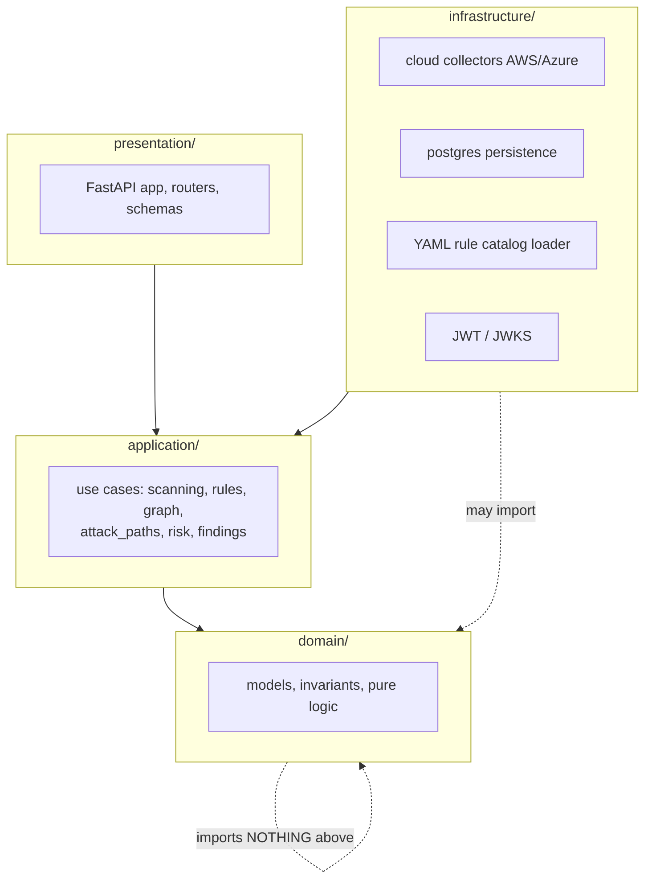
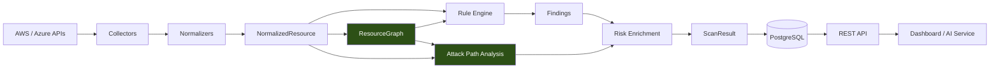

# Phase 0 — Project Map

**Level 1 — Understand.** Estimated 45 minutes.

---

## A. What problem does this phase solve?

Before tracing any single feature you need to know *where things live and
why they live there*. ComplianceIQ enforces a strict layering, and almost
every design decision in later phases is a consequence of it.

## B. Why does ComplianceIQ need it?

Because a CSPM is a **security product**, and security products lose
customers through false results, not through missing features. The
layering exists to make certain classes of wrong answer structurally
impossible:

- Domain code cannot call a cloud API, so a rule cannot silently depend
  on network availability.
- Domain code cannot read the clock or generate a UUID, so the same
  input always produces the same output — which is what makes a finding
  diffable between scans.
- Persistence cannot leak into Domain, so the security model is not
  shaped by what happens to be easy to store.

---

## C. The four layers



**The dependency rule: arrows only point inward.** `domain/` imports
nothing from `application/`, `infrastructure/` or `presentation/`.

This is not a convention — it is **enforced by a test**:
`tests/api/test_architecture.py`.

| Layer | Path | Owns | Must never |
|---|---|---|---|
| Domain | `domain/` | Models, invariants, three-valued logic, scoring | Do I/O, read a clock, generate a UUID |
| Application | `application/` | Use cases, orchestration, ports | Reimplement a domain invariant |
| Infrastructure | `infrastructure/` | AWS/Azure SDK calls, Postgres, YAML, JWT | Contain security logic |
| Presentation | `presentation/` | HTTP, serialization, auth wiring | Contain business rules |

---

## D. Repository map

```
domain/                     ← pure, deterministic, no I/O
├── shared/                 identifiers, enums, errors, UNKNOWN sentinel
├── resources/              NormalizedResource, ResourceRelationship
├── graph/                  models · validation · queries          ★ Phase 3, 7
├── rules/                  rule · conditions · trace              ★ Phase 4
├── findings/               Finding, Evidence, FindingStatus       ★ Phase 6
├── attack_paths/           models · classification · scoring      ★ Phase 8
├── risk/                   RiskScore (CRSF-1.1), ConfidenceScore
├── compliance/             frameworks, ComplianceScore
├── scans/                  Scan aggregate, lifecycle
├── drift/                  DriftEvent, DiffEngine
└── tenants/                Tenant, isolation helpers

application/                ← orchestration only
├── scanning/               ScanCloudAccount ★ the real pipeline entry
├── graph/                  BuildResourceGraph
├── rules/                  EvaluateRules, evidence rendering
├── attack_paths/           AnalyzeAttackPaths                     ★ Phase 8
├── risk/                   EnrichRisk, factors, enrich_findings   ★ Phase 8
├── findings/               QueryFindings
├── ports/                  auth, persistence, clock, queries
└── conformance/            rule-catalog conformance runner

infrastructure/             ← adapters
├── cloud/aws/              collectors · normalizers · policy_analysis · resilience
├── cloud/azure/            collectors · normalizers
├── persistence/postgres/   models · mappers · repositories · migrations
├── rules/                  YamlRuleCatalog
└── auth/                   JWT / JWKS

presentation/               ← FastAPI
rules/                      ← the YAML catalog (41 AWS + 27 Azure)
terraform/                  ← test estates
tests/                      ← 1408 tests
docs/                       ← architecture, audits, reports, this guide
```

---

## E. The complete pipeline

This is the diagram to keep in your head for the whole guide.



Two things to notice now, because they surprise people later:

1. **`RES` feeds the attack path analyzer directly**, not only through
   the graph. Graph nodes carry identity and provenance but **not
   attributes**, and "is this bucket public" lives in the attributes.
2. **Risk enrichment runs *after* attack paths.** The CRSF-1.1 risk
   formula takes attack-path involvement as one of its five factors, so
   the order is load bearing, not cosmetic.

### Where the pipeline is implemented

`application/scanning/scan_cloud_account.py` — `ScanCloudAccount.run()`.
That is the real entry point, reached from `SubmitScan`, the AWS/Azure
integration tests, and `scripts/dev_scan_aws.py`.

---

## F. Data in / out

| Stage | In | Out |
|---|---|---|
| Collect | credentials reference | `tuple[NormalizedResource, ...]` |
| Build graph | resources | `ResourceGraph` |
| Evaluate rules | resources + graph | `tuple[Finding, ...]` |
| Analyze attack paths | graph + resources + findings | `tuple[AttackPath, ...]` |
| Enrich risk | findings + attack paths | enriched findings |
| Result | all of the above | `ScanResult` |

---

## G/H. Who calls what

```
SubmitScan  ─┐
dev_scan_aws ├─▶ ScanCloudAccount.run()
integration ─┘        │
                      ├─▶ BuildResourceGraph
                      ├─▶ EvaluateRules
                      ├─▶ AnalyzeAttackPaths
                      ├─▶ EnrichFindingsWithRisk
                      └─▶ DetectDrift (optional)
```

---

## I. Assumptions

- One scan = one tenant = one cloud provider. Tenant isolation is checked
  at graph node insertion and rule evaluation.
- The graph is **rebuilt every scan and never persisted**. This has a
  consequence you must remember: a finding read back tomorrow cannot
  recompute which security group it matched — that is why finding context
  is stored.
- Collectors may fail partially. A denied API call yields `UNKNOWN`, not
  `False`.

## J. Failure modes

| Failure | Behaviour |
|---|---|
| Collector raises | `ResourceCollectionError`, scan aborts |
| One resource fails to collect | Isolated; the rest survive |
| Graph edge references a missing node | Target materialized as an **external node** |
| Rule references an uncollected attribute | `INDETERMINATE`, never `False` |
| One malformed attack path candidate | Skipped; the scan survives |

## K. Tests that protect this phase

- `tests/api/test_architecture.py` — enforces the dependency rule
- `tests/unit/application/test_scan_pipeline_regressions.py` — pins
  defects where components were correct but their *seam* was not

## L. Limitations

- Attack paths are **not persisted** — `PersistScanResult` drops
  `ScanResult.attack_paths`; there is no table.
- No API surface exposes attack paths.
- No collector has been run against a live cloud API.

---

## What I should know now

1. Name the four layers and the direction dependencies flow.
2. Say which test enforces that rule.
3. Locate the real scan entry point by file path.
4. Explain why `domain/` may not read a clock.
5. Draw the pipeline from cloud API to API response.
6. Explain why resources are passed to the attack path analyzer as well
   as the graph.
7. Explain why risk enrichment runs after attack path analysis.
8. State three things that are *not* implemented.

---

## Self-test

1. Why is it a design error for `domain/rules/conditions.py` to import
   `boto3`?
2. `ResourceGraph` lives in `domain/`, but `BuildResourceGraph` lives in
   `application/`. Why the split?
3. The graph is never persisted. What problem does that create for a
   finding fetched a week later, and how does the codebase handle it?
4. Where would you add a new AWS service collector, and which layers
   would you have to touch?
5. If risk enrichment ran *before* attack path analysis, which of the
   five CRSF factors would be wrong, and what value would it take?
6. A teammate proposes caching the graph between scans. Name two
   invariants that would need re-examining.
7. Which single file would you open first to answer "what does a scan
   actually do?"

Answers: [answers.md](answers.md)
