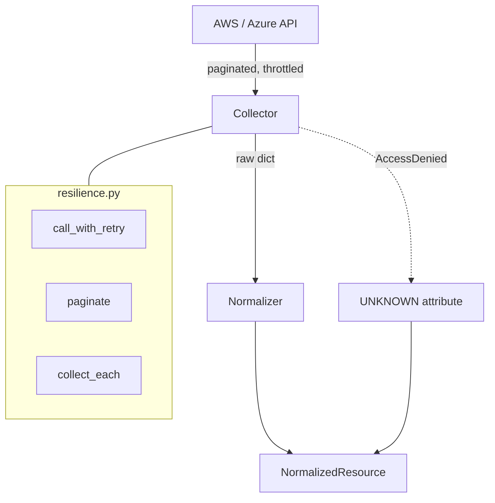

# Phase 1 — Cloud Collection

**Level 1–2.** Estimated 1.5 hours.

---

## A. What problem does this solve?

Getting facts out of AWS and Azure **without lying about them**.

That second half is the hard part and the reason this phase deserves real
attention. A collector that returns `False` when it means "I could not
check" produces a false accusation, and a false accusation in a security
product destroys trust in every other finding.

## B. Why does ComplianceIQ need it?

Cloud APIs are hostile in four specific ways:

| Reality | Consequence |
|---|---|
| Paginated | A naive `list_buckets()` silently truncates |
| Throttled | A burst of calls returns errors, not data |
| Partially permissioned | Some calls succeed, some return `AccessDenied` |
| Eventually consistent | Two calls can disagree |

Every one of those, handled wrongly, produces a **wrong security answer**
rather than an obvious crash.

---

## C. Files

```
infrastructure/cloud/
└── resilience.py                   ★ retry, pagination, per-item isolation
                                      (shared — NOT under aws/)

infrastructure/cloud/aws/
├── collector.py                    AwsCollector — the BaseCollector adapter
├── credentials.py, session.py      auth and client construction
├── errors.py                       translate_client_error, is_permission_denied
├── policy_analysis.py              ★ semantic IAM policy analysis
└── resource_collectors/
    ├── base.py                     AwsResourceCollector
    ├── s3.py                       S3Collector
    ├── ec2.py                      Ec2Collector
    ├── security_groups.py          SecurityGroupCollector
    ├── iam.py                      IamCollector, IamAccountCollector
    ├── iam_roles.py                ★ IamRoleCollector
    ├── cloudtrail.py               CloudTrailCollector
    └── kms.py                      KmsCollector

infrastructure/cloud/azure/
├── collector.py                    AzureCollector
└── resource_collectors/
    ├── StorageAccountCollector, VirtualMachineCollector,
    ├── NetworkSecurityGroupCollector, KeyVaultCollector,
    └── ActivityLogSettingCollector
```

**8 AWS collectors, 5 Azure collectors.**

> **Corrected.** This section previously said *7 AWS collectors*. There
> are **8 classes**; only 7 were registered in `AwsCollector`, and
> `IamRoleCollector` — the sole producer of `PUBLICLY_EXPOSED` — was the
> missing one, so it never ran in a real scan. Found by the STEP 0 audit
> (`docs/audits/post-study-guide-current-state.md` §2) and now
> registered, with a test that derives the expected set from the package
> rather than hardcoding a count.

---

## D. The collection flow



Concretely, for one S3 bucket:

```
s3:ListBuckets            → bucket names
s3:GetBucketAcl           → public (ACL grants to AllUsers)
s3:GetBucketPolicy        → bucket_policy_allows_public_access
s3:GetPublicAccessBlock   → public_access_block_enabled
s3:GetBucketEncryption    → encrypted
s3:GetBucketVersioning    → versioning_enabled
s3:GetBucketLogging       → logging_enabled
        ↓
normalize_s3_bucket(...)  → NormalizedResource(resource_type="s3_bucket")
```

If `GetBucketAcl` returns `AccessDenied`, `public` becomes **`UNKNOWN`**,
not `False`.

---

## E. The resilience layer

`infrastructure/cloud/resilience.py` — three primitives:

| Function | Purpose |
|---|---|
| `call_with_retry` | Full-jitter exponential backoff on throttling |
| `paginate` | Exhaust a paginator, never a truncated first page |
| `collect_each` | Per-item isolation — one bad resource doesn't kill the batch |

Supporting types: `RetryPolicy`, `CollectionStats`, `RetryBudgetExhausted`.

### The defect worth studying

`paginate()` once returned a **silently truncated** list. A generator that
raises is finalized (PEP 342), so retrying `next()` after an error got
`StopIteration` — which read as "end of pages" instead of "the paginator
is dead". The scan reported a subset of the estate as if it were all of
it.

The fix distinguishes the two:

```python
except StopIteration:
    if saw_error:
        raise RetryBudgetExhausted(
            f"{description} was interrupted and its paginator cannot resume — "
            "results would be silently truncated"
        ) from None
    return
```

**Silent truncation is the worst class of CSPM bug**: no error, no
crash, just a confident report about half your estate. It was caught by a
collector test, not by review.

⚠️ **Only `IamRoleCollector` uses the resilience layer.** The other seven
AWS collectors and all five Azure collectors do not. S3 and CloudTrail
still lack paginators.

> Until the STEP 0 audit, `IamRoleCollector` was **unregistered**, which
> meant the resilience layer had *zero* production users despite being
> fully implemented and tested. It now has one.

---

## F. `UNKNOWN` at the source

`domain/shared/unknown.py` defines a sentinel whose `__bool__` **raises**.

That is deliberate and clever: it makes the dangerous mistake impossible
to write by accident.

```python
mfa_enabled = bool(response.get("MFADevices"))   # WRONG if the call was denied
```

If `response.get(...)` returned `UNKNOWN`, `bool()` raises loudly instead
of silently producing `False`.

| Situation | Correct value | Meaning |
|---|---|---|
| List returned, empty | `False` | No MFA. A real finding. |
| List returned, non-empty | `True` | Compliant. |
| `AccessDenied` | **`UNKNOWN`** | *Our* permission problem, not the customer's |
| Attribute doesn't apply | key omitted | Rule doesn't apply |

`IamRoleCollector` shows the pattern: when policy enumeration is denied,
it sets *every* privilege attribute to `UNKNOWN` and records
`policy_analysis_confidence = "unknown"` — a degraded but honest result.

---

## G. Semantic IAM analysis

`infrastructure/cloud/aws/policy_analysis.py` does real policy reasoning,
not string matching:

- `NotAction` inversion (`NotAction: ["iam:*"]` grants everything else)
- Explicit `Deny` precedence over `Allow`
- Wildcard principal detection in trust policies
- `PassRole` + compute-service pairing → privilege escalation
- Confused-deputy risk (external principal without a condition)

Attributes it produces include `has_administrator_access`,
`has_privilege_escalation_path`, `has_pass_role_escalation`,
`has_wildcard_action`, `is_publicly_assumable`, `external_account_ids`.

**These attributes are what makes Attack Path Scenario 1 possible in
Phase 8.** Remember them.

---

## H. Who calls the collectors

```
ScanCloudAccount.run()
   └─▶ BaseCollector.collect()          (application/scanning/collector.py — the port)
          └─▶ AwsCollector / AzureCollector   (infrastructure — the adapter)
                 └─▶ each resource collector
```

`ScanCloudAccount` depends only on the **port**, which is why the same
pipeline serves both clouds and why tests can substitute a static
collector.

---

## I. Assumptions

- Credentials are supplied by reference, never inline. Nothing in the
  domain or the database ever sees a secret.
- A collector returns resources for exactly one provider; the pipeline
  verifies this and raises otherwise.
- Every resource carries `tenant_id` and (when resolvable) `account_id`.

## J. Failure modes

| Failure | Handling |
|---|---|
| Throttling | `call_with_retry` with full jitter |
| `AccessDenied` on an attribute call | Attribute → `UNKNOWN` |
| `AccessDenied` on enumeration | Whole group `UNKNOWN`, never `False` |
| One resource malformed | `collect_each` isolates it |
| Paginator interrupted | `RetryBudgetExhausted` — refuses to truncate silently |
| Collector raises overall | `ResourceCollectionError`; scan aborts |

## K. Tests

| File | Guards |
|---|---|
| `tests/unit/infrastructure/test_resilience.py` | Retry, pagination, truncation refusal |
| `test_aws_iam_role_collector.py` | Denied enumeration → `UNKNOWN` |
| `test_aws_policy_analysis.py`, `test_policy_semantics.py` | `NotAction`, Deny precedence, escalation |
| `test_aws_s3_collector.py`, `test_aws_ec2_collector.py`, … | Per-collector normalization |
| `tests/unit/domain/test_unknown.py` | The sentinel's `__bool__` raises |

All use **fakes modelled on documented AWS/Azure response shapes**.

## L. Limitations

1. **No collector has been run against a live AWS or Azure API.**
2. Resilience is applied in **one** of twelve collectors.
3. **12 of 26** target services are collected. Missing: VPC, Subnet,
   Route Table, RDS, EKS, ECR, Config, Entra ID, Azure SQL, AKS, and more.
4. S3 and IAM managed-policy lookups have an N+1 call pattern.
5. `instance_profile_arn` is collected as an *attribute*, but **no
   workload→identity edge is emitted** — this is the single biggest
   limiter on attack path coverage (Phase 8).

---

## What I should know now

1. Name the 7 AWS and 5 Azure collectors.
2. Explain why `UNKNOWN` exists and what `bool(UNKNOWN)` does.
3. Explain the silent-truncation pagination defect and its fix.
4. Say which collectors use the resilience layer (one).
5. List four privilege attributes `policy_analysis.py` produces.
6. Explain why `ScanCloudAccount` depends on a port, not `AwsCollector`.
7. Explain why `AccessDenied` must not become `False`.
8. State how many target services are actually collected.

---

## Self-test

1. A collector calls `GetBucketAcl`, gets `AccessDenied`, and sets
   `public = False`. Describe the exact customer-visible harm.
2. Why does `UNKNOWN.__bool__` raise instead of returning `False`?
3. Why can't `paginate()` just retry `next()` after an error?
4. `IamRoleCollector` sets *five* attributes to `UNKNOWN` at once when
   policy enumeration is denied. Why all five rather than the one that
   failed?
5. A trust policy has `"Principal": "*"` **with** a `Condition` on
   `aws:PrincipalOrgID`. Is the role publicly assumable? What should the
   collector report?
6. You add an RDS collector. List every file you touch, and every file
   you must *not* touch.
7. Which is worse for a CSPM: crashing the scan, or returning a truncated
   resource list? Justify it.
8. `has_administrator_access` is `UNKNOWN`. What must a rule reading it
   return, and why not `False`?

Answers: [answers.md](answers.md)
