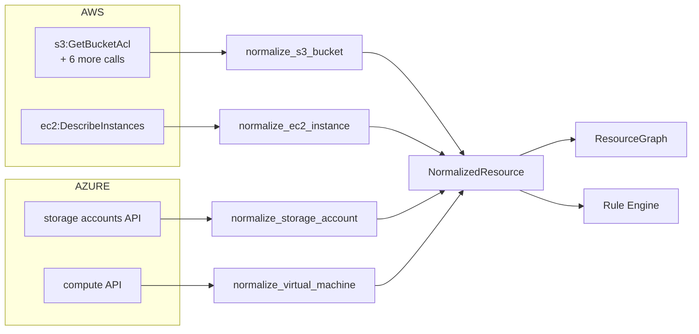

# Phase 2 — Normalization

**Level 1–2.** Estimated 1 hour. *Skippable on a first pass — but read §D.*

---

## A. What problem does this solve?

AWS and Azure describe the same security concept with completely
different shapes. Normalization collapses both into **one domain type**
so that everything downstream — the graph, the rule engine, attack path
analysis — is written once instead of twice.

## B. Why does ComplianceIQ need it?

Without it, every rule and every graph query would need a provider
branch. With it, `domain/` never learns that AWS exists.

Compare:

```python
if provider == "aws":     ...   # ← this appears NOWHERE in domain/
elif provider == "azure": ...
```

That absence is the deliverable.

---

## C. Files

```
domain/resources/models.py                     NormalizedResource, ResourceRelationship
infrastructure/cloud/aws/normalizers/
   s3.py · ec2.py · security_group.py · iam.py · cloudtrail.py · kms.py
infrastructure/cloud/azure/normalizers/
   storage.py · compute.py · network.py · keyvault.py · monitor.py
```

---

## D. `NormalizedResource` — the contract

```python
@dataclass(frozen=True, slots=True)
class NormalizedResource:
    resource_id: ResourceId
    resource_type: str                       # "s3_bucket", "azure_storage_account"
    cloud_provider: CloudProvider
    tenant_id: TenantId
    region: str
    attributes: Mapping[str, Any]            # ← the security facts
    tags: Mapping[str, str]
    relationships: tuple[ResourceRelationship, ...]   # ← becomes graph edges
    collected_at: datetime
    account_id: str | None = None
```

Three fields deserve attention because everything later depends on them:

**`attributes`** — the security facts. Rules read these. `UNKNOWN` lives
here. Note that **graph nodes do NOT carry attributes**, which is why the
attack path analyzer needs the resources as well as the graph.

**`relationships`** — declared by the normalizer, turned into graph edges
by `BuildResourceGraph`. This is the seam where Phase 3 begins.

**`resource_type`** — a string, and the key that ties three separate
systems together: rule scoping (`applies_to_resource_type`), graph
queries (`find_resources`), and attack path classification
(`_ROLE_BY_RESOURCE_TYPE`).

### The 13 resource types actually produced

| AWS | Azure |
|---|---|
| `s3_bucket` | `azure_storage_account` |
| `ec2_instance` | `azure_virtual_machine` |
| `security_group` | `azure_network_security_group` |
| `iam_role` | — |
| `iam_user` | — |
| `iam_account_summary` | — |
| `kms_key` | `azure_key_vault` |
| `cloudtrail` | `azure_activity_log_setting` |

---

## E. Provider → domain mapping



### Worked example — an S3 bucket

Raw AWS (several API responses, condensed):

```
ListBuckets           → {"Name": "acme-reports"}
GetBucketAcl          → Grantee URI = .../AllUsers
GetBucketEncryption   → (none)
GetBucketVersioning   → {"Status": "Enabled"}
```

`normalize_s3_bucket(...)` produces:

```python
NormalizedResource(
    resource_id=ResourceId("acme-reports"),
    resource_type="s3_bucket",
    cloud_provider=CloudProvider.AWS,
    region="us-east-1",
    attributes={
        "encrypted": False,
        "public": True,
        "public_access_block_enabled": False,
        "versioning_enabled": True,
        "logging_enabled": False,
        "has_bucket_policy": False,
        "bucket_policy_allows_public_access": False,
    },
    tags={...},
    relationships=(),          # ← note: EMPTY
    collected_at=...,
    account_id="111111111111",
)
```

**Note `relationships=()`.** The S3 normalizer emits **no** graph edges,
even though its docstring describes a `PUBLICLY_EXPOSED` edge to a
`__internet__` node. That edge does not exist. This matters in Phase 8:
the analyzer detects bucket exposure from the `public` **attribute**, not
from a graph edge.

---

## F. What normalizers may and may not decide

The rule is stated crisply in
`infrastructure/cloud/aws/normalizers/security_group.py`:

> "Is 0.0.0.0/0 exposed on a sensitive port" is deliberately NOT decided
> here — "sensitive port" is a rule concern, not an Infrastructure fact.

So the normalizer reports the **facts**:

```python
"has_unrestricted_ingress": True,          # any world-open rule
"unrestricted_ingress_ports": (22, 3389),  # single-port world-open rules
```

...and a rule decides which ports matter. This separation is why the
catalog can change its mind about port 22 without touching a collector.

---

## G. Data in / out

| | |
|---|---|
| **In** | Provider-specific raw dicts from SDK responses |
| **Out** | `NormalizedResource` |
| **Called by** | The resource collectors |
| **Feeds** | `BuildResourceGraph`, `EvaluateRules`, `AnalyzeAttackPaths` |

## H. Assumptions

- `resource_id` is unique within a tenant. For S3 it is the bucket name;
  for IAM roles it is the ARN.
- Attribute names are **not** globally unique across resource types —
  Azure Key Vault and storage accounts both have
  `network_default_action`. This caused a real defect and is why
  `Rule.applies_to_resource_type` exists.
- Normalizers are pure functions: same input, same output.

## I. Failure modes

A normalizer receiving a partial response emits `UNKNOWN` for what it
could not read, and omits keys that do not apply to that resource type.
**Those are different**: `UNKNOWN` means "we looked and could not tell";
an absent key means "this concept does not apply here".

## J. Tests

Per-collector tests in `tests/unit/infrastructure/` assert the normalized
shape. `tests/unit/domain/test_resources.py` covers the model's
invariants.

## K. Limitations

1. **S3 emits no relationships**, despite its docstring.
2. **EC2 emits only `ATTACHED_TO` → security group.** `instance_profile_arn`
   is captured as an attribute but produces no edge.
3. `environment` is not populated by any normalizer — which is why risk
   enrichment must default it (Phase 8).
4. No normalizer sets `GraphEdge.blocked = True`.

---

## What I should know now

1. State the ten fields of `NormalizedResource`.
2. Name the 13 resource types actually produced.
3. Explain why graph nodes carrying no attributes matters downstream.
4. Explain the normalizer/rule boundary using the security group example.
5. Explain why `applies_to_resource_type` exists.
6. Distinguish `UNKNOWN` from an absent key.
7. Name two relationships the normalizers do **not** emit.

---

## Self-test

1. Why does `resource_type` appear in three unrelated subsystems? Name
   them.
2. The S3 normalizer's docstring describes a `PUBLICLY_EXPOSED` edge it
   does not emit. What is the downstream consequence, and how does the
   attack path analyzer work around it?
3. Why is deciding "port 22 is sensitive" a rule concern rather than a
   normalizer concern? What would break if you moved it?
4. An Azure Key Vault and a storage account both have
   `network_default_action`. What defect did this cause, and what fixed
   it?
5. `normalize_ec2_instance` captures `instance_profile_arn`. Why is that
   not enough to build an `internet → workload → identity` attack path?
6. Give a case where omitting an attribute key is *more* correct than
   setting it to `UNKNOWN`.

Answers: [answers.md](answers.md)
