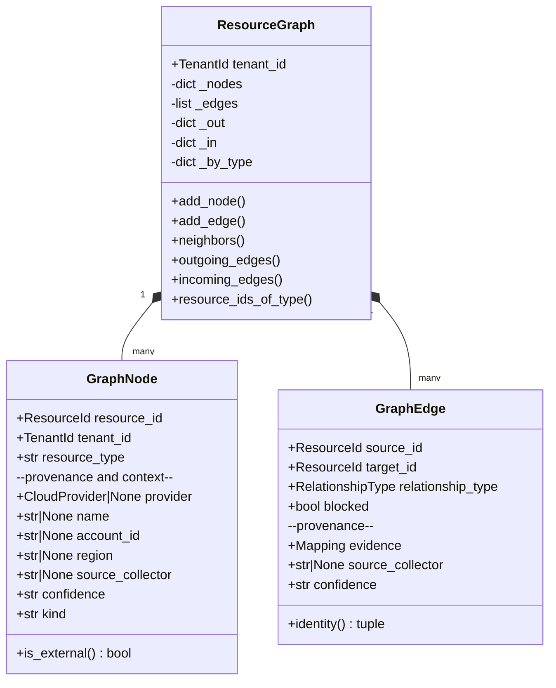

# Phase 3.1 — Nodes and Edges in detail

`domain/graph/models.py`

---

## The two structures



---

## GraphNode field by field

| Field | Type | Why it exists |
|---|---|---|
| `resource_id` | `ResourceId` | Identity within the tenant |
| `tenant_id` | `TenantId` | Isolation — checked at `add_node` |
| `resource_type` | `str` | Drives classification and type queries |
| `provider` | `CloudProvider \| None` | **`None` for external nodes** — the internet belongs to no cloud |
| `name` | `str \| None` | Human-readable; `resource_id` is often an ARN |
| `account_id` | `str \| None` | AWS account / Azure subscription |
| `region` | `str \| None` | |
| `source_collector` | `str \| None` | **Provenance** — who asserted this |
| `confidence` | `str` | `high` / `medium` / `low` / `unknown` |
| `kind` | `str` | `"collected"` or `"external"` |

Validation in `__post_init__`: `resource_type` must be non-blank, `kind`
must be one of the two values, `confidence` one of the four. Anything else
raises `GraphIntegrityViolation`.

### There is no `attributes` field — and that is deliberate

A node answers *"what is this?"*. It does **not** answer *"how is it
configured?"*

Consequences you will meet repeatedly:

- `AnalyzeAttackPaths.analyze()` takes `resources` **as well as** `graph`,
  because "is this bucket public" is an attribute.
- Relationship conditions in the rule DSL need `resources_by_id` for the
  same reason — the `where` clause evaluates against a
  `NormalizedResource`, not a node.

### Why provenance is on a node at all

Because **a graph is a set of assertions, not facts.** When two collectors
disagree, or a relationship is disputed, "who said this and how sure were
they" is the only way to adjudicate. `confidence` then propagates into
attack path scoring as a penalty (Phase 8).

---

## GraphEdge field by field

| Field | Type | Why it exists |
|---|---|---|
| `source_id`, `target_id` | `ResourceId` | The directed assertion |
| `relationship_type` | `RelationshipType` | Closed vocabulary |
| `blocked` | `bool` | Is this relationship *prevented in practice*? |
| `evidence` | `Mapping` | The observed values that justify it |
| `source_collector` | `str \| None` | Provenance |
| `confidence` | `str` | Provenance |

`evidence` is frozen into a `MappingProxyType` in `__post_init__`, so an
edge cannot be mutated after construction.

### `identity` — the deduplication key

```python
@property
def identity(self) -> tuple:
    return (self.source_id, self.target_id, self.relationship_type)
```

**Provenance is excluded on purpose.** Two collectors independently
observing the same relationship assert the *same* edge, not two. This is
what `BuildResourceGraph` deduplicates on.

### `blocked` — plumbing without a producer

An edge marked `blocked` exists structurally but is prevented in practice
(e.g. a security group rule that denies rather than allows).

It is honoured everywhere it matters:

- `is_traversable()` excludes blocked edges (Phase 8)
- `find_paths()` excludes them by default (Phase 7)
- `AttackPath` **requires** `risk_score == 0` if any edge is blocked

⚠️ **No collector ever sets it `True`.** The plumbing is correct; the
input is always `False`. Determining whether an SG rule actually blocks a
path requires evaluation that does not exist yet.

---

## The indexes

```python
_out: dict[ResourceId, list[GraphEdge]]      # by source
_in:  dict[ResourceId, list[GraphEdge]]      # by target
_by_type: dict[str, list[ResourceId]]        # by resource_type
```

Maintained **inside** `add_node`/`add_edge`, never rebuilt on demand.

That placement is the whole point. A stale index does not raise — it makes
a cross-resource rule **quietly stop firing**, which is
indistinguishable from the rule finding nothing. Building at mutation time
means the index cannot drift from the authoritative collection.

Before the indexes, relationship evaluation was **O(R × N × E)**. Measured
effect (`scripts/benchmark_graph.py`), at 999 resources:

| | indexed | linear scan |
|---|---|---|
| time | 5.1 ms | 88.5 ms |

Across a 10× growth in resources the scan grew ~110× (quadratic) while the
indexed path grew ~10× (linear) — while doing *strictly more work*, since
the indexed column runs full rule evaluation and the scan column only
looks up edges.

Read through public accessors so query code never touches the privates:

```python
graph.outgoing_edges(rid)        # tuple, insertion order
graph.incoming_edges(rid)        # tuple, insertion order
graph.resource_ids_of_type(t)    # tuple
```

They return **tuples, not the live lists** — an index is internal
accounting, and handing out the list would let a caller corrupt it
without going through `add_edge`.

---

## Worked example — one S3 bucket in the graph

```
1. AWS returns:              {"Name": "acme-reports"} + ACL/policy/etc
2. normalize_s3_bucket() →   NormalizedResource(
                                 resource_id="acme-reports",
                                 resource_type="s3_bucket",
                                 attributes={"public": True, ...},
                                 relationships=())          ← empty!
3. BuildResourceGraph    →   GraphNode(
                                 resource_id="acme-reports",
                                 resource_type="s3_bucket",
                                 provider=CloudProvider.AWS,
                                 account_id="111111111111",
                                 region="us-east-1",
                                 confidence="high",
                                 kind="collected")
4. edges                 →   NONE from the bucket itself
5. but CloudTrail declared:  cloudtrail --ACCESSES--> acme-reports
   so the graph gains:       GraphEdge(source_id="trail-1",
                                       target_id="acme-reports",
                                       relationship_type=ACCESSES)
```

The bucket's *public* status is nowhere in the graph — it lives only in
`NormalizedResource.attributes`. Hold that thought until Phase 8.

---

## The `neighbors()` migration

`neighbors()` was originally a linear scan over `_edges`. It now reads the
indexes. Its **observable contract is unchanged** — the adjacency lists
preserve edge insertion order, so it returns exactly what it returned
before, in the same order.

That claim is not assumed; `TestNeighborsStillBehavesTheSame` in
`tests/unit/domain/test_graph_queries.py` compares it against an
independent linear scan for both directions.
