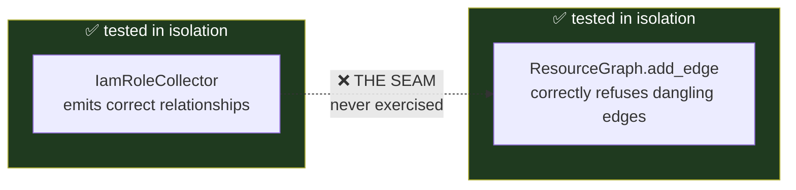

# Phase 3.2 — External Nodes and Graph Integrity

**The most instructive incident in this codebase. Read it carefully.**

---

## The invariant

`ResourceGraph.add_edge` refuses an edge whose source or target is not
already a node:

```python
if edge.target_id not in self._nodes:
    raise GraphIntegrityViolation(
        f"edge references unknown target node: {edge.target_id!s}"
    )
```

This is correct and should stay. A graph with dangling edges is a graph
whose queries silently return wrong answers.

---

## The blocker

`IamRoleCollector` reads a role's trust policy and emits relationships
that are genuinely security-meaningful:

```python
iam_role --ASSUMES----------> aws-account:999999999999
iam_role --ASSUMES----------> aws-service:ec2.amazonaws.com
iam_role --PUBLICLY_EXPOSED-> internet
```

None of those targets is a **collectible AWS resource**. There is no
`DescribeInternet` API. So none of them was a node.

```
GraphIntegrityViolation: edge references unknown target node: internet
```

`BuildResourceGraph` had no per-edge isolation, so the exception
propagated all the way out.

> **Any IAM role with a trust policy aborted the entire scan.**

And *every* IAM role has a trust policy — it is mandatory in AWS.

---

## Why it escaped the tests

**21 collector tests passed.** Every one of them asserted on
`resource.relationships` directly:

```python
assert role.relationships[0].relationship_type is RelationshipType.PUBLICLY_EXPOSED
```

True, and useless for catching this. **None of them built a graph.**



**Both components were correct. Their seam was never exercised.**

This is the same defect class as an earlier one where the graph was built
and never passed to `EvaluateRules`. Keep it in mind for Phase 11 — it is
the single most valuable testing lesson in the repository.

---

## Two bad fixes, and the good one

### ❌ Bad fix 1 — drop the edge

```python
if target not in collected:
    continue   # skip it
```

This destroys the signal. *"This role is assumable from the internet"*
**is the finding**. Dropping the edge deletes the most severe fact the
IAM collector produces, and does so silently.

### ❌ Bad fix 2 — swallow the exception

```python
try:
    graph.add_edge(edge)
except GraphIntegrityViolation:
    pass
```

Now the graph is quietly incomplete, and a cross-resource rule that stops
firing looks identical to one that found nothing.

### ✅ The actual fix — external nodes

Materialize the target as a node with `kind="external"` and reduced
confidence:

```python
def _external_type(target: ResourceId) -> str:
    value = str(target)
    if value == "internet":              return "internet"
    if value.startswith("aws-account:"): return "aws_account"
    if value.startswith("aws-service:"): return "aws_service"
    if value.startswith("azure-tenant:"):return "azure_tenant"
    return "external_resource"
```

Note the last line: an unrecognized target becomes `external_resource`
rather than being **guessed at**.

Plus per-edge isolation, with rejections **reported** rather than
swallowed:

```python
GraphBuildResult(graph, external_nodes, rejected_edges)
```

---

## Why `kind` matters more than it looks

External nodes let a rule distinguish two situations that look identical
in a naive graph:

| Situation | Meaning | Correct response |
|---|---|---|
| Edge points at an **external** node | Points outside the scan | **A finding** |
| Edge points at an **uncollected** resource | We failed to collect it | **A data gap** |

Conflating them produces *confident findings about resources nobody
enumerated* — which is the false-positive failure mode this codebase
works hardest to avoid.

```python
@property
def is_external(self) -> bool:
    return self.kind == "external"
```

External nodes carry **`medium`** confidence, not `high`. We did not
enumerate the internet; we only know something pointed at it. In Phase 8
that propagates: every internet-origin attack path is capped at `medium`
confidence and takes a −10 scoring penalty. **That is correct, not a
defect to fix.**

---

## The test that records the decision

An earlier test asserted `BuildResourceGraph` *raises* on an uncollected
target — the exact behaviour that was the blocker. It was rewritten, and
the rewrite is documented in the test itself:

`tests/unit/application/test_build_resource_graph.py`

```
test_graph_still_refuses_a_dangling_edge_at_the_aggregate
test_builder_materializes_an_uncollected_target_as_an_external_node
```

**The invariant was relocated, not removed.** `ResourceGraph.add_edge`
still refuses a dangling edge, and that is now asserted directly against
the aggregate that owns the rule. One assertion became two.

That distinction — *relocated, not weakened* — is what you should be able
to defend if someone asks whether a test was softened to make code pass.

---

## What to take away

1. A component can be perfectly correct and still break the system.
2. Tests that only exercise one side of a seam prove less than they look.
3. When an invariant blocks a legitimate case, the answer is usually a
   **richer model** (external nodes), not a weaker invariant.
4. Dropped data must be **reported**, never silently discarded.
5. "Outside the scan" and "we failed to look" are different facts and
   must stay different.
