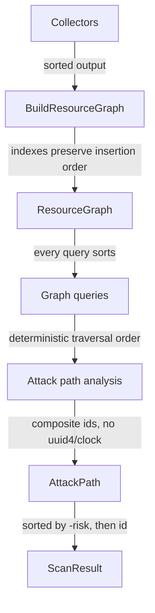

# Phase 3.3 — Determinism and the Graph Fingerprint

---

## The requirement

> Identical cloud input must produce an equivalent graph.

Not "similar". Equivalent, and **assertably** so.

## Why a CSPM needs it

A security team's core workflow is **diffing scans**:

- "What changed since yesterday?"
- "Did our fix work?"
- "Is this finding new or has it been there for months?"

If the graph varies between runs over unchanged infrastructure, every one
of those questions gets noise for an answer. Worse, the noise is
*plausible* — resources genuinely do change — so nobody notices the tool
is lying until they chase a phantom.

---

## What varies that shouldn't

| Source of variation | Is it a property of the infrastructure? |
|---|---|
| Collector scheduling order | ❌ No |
| Which collector observed a relationship | ❌ No |
| Dict/set iteration order | ❌ No |
| A resource genuinely appearing | ✅ Yes |
| A relationship genuinely changing | ✅ Yes |

`graph_fingerprint()` is built so only the ✅ rows can change it.

---

## How

`domain/graph/validation.py`

Two rules:

1. **Sort nodes and edges.** Insertion order reflects collector
   scheduling, which is not a fact about the customer's cloud.
2. **Exclude provenance.** `source_collector` and `confidence` are
   excluded from the fingerprint.

The second is the subtle one:

> Two scans learning the **same topology** from **different collectors**
> describe the same infrastructure.

If provenance were included, adding a second collector that observes an
existing relationship would change the fingerprint — reporting a topology
change that did not happen.

So:

```
fingerprint changed  →  the TOPOLOGY changed     (signal)
fingerprint same     →  same topology            (even if provenance differs)
```

---

## Determinism elsewhere in the stack

The graph is one link in a chain, and each link maintains it:



| Layer | Mechanism |
|---|---|
| Domain rules | No `datetime.now()`; `as_of` must be passed in |
| Graph queries | **Every** function that returns a collection sorts it |
| `find_paths` | Sorted by `(len, target ids)` |
| Attack paths | Deterministic composite ids — no `uuid4`, no clock |
| Findings | `logical_finding_id` = `tenant:account:resource:rule` |
| Finding context | `related_resources` sorted and deduplicated — enforced as a **model invariant** |

That last one is worth noting: `Finding.__post_init__` *raises* if
`related_resources` is not sorted and duplicate-free. Determinism is not
left to convention where it can be enforced.

---

## Where determinism is tested

| Test | Asserts |
|---|---|
| `test_graph_expansion.py` | Fingerprint stability; provenance exclusion |
| `test_graph_queries.py::TestDeterminism` | Ordering independent of insertion order |
| `test_attack_path_analysis.py::TestDeterminism` | 5 identical runs; reversed input order |
| `test_attack_path_pipeline_integration.py` | Whole-pipeline determinism |
| `test_finding_context.py::TestDeterminism` | Context identical across runs |

The characteristic shape of these tests:

```python
def test_resource_input_order_does_not_change_the_result(self) -> None:
    forward  = [(str(p.id), p.risk_score) for p in analyze(self._estate())]
    backward = [(str(p.id), p.risk_score) for p in analyze(list(reversed(self._estate())))]
    assert forward == backward
```

Reversing the input is a cheap, brutal way to catch accidental
order-dependence.

---

## The trap: `set` and `dict` iteration

Python's `set` iteration order depends on insertion **and hash values**.
Code like:

```python
for node in {n for n in graph.nodes if ...}:      # ← non-deterministic order
    results.append(build_something(node))
return tuple(results)                              # ← order leaks out
```

is a latent determinism bug. The codebase handles it by **sorting at the
boundary**, e.g. in `domain/graph/queries.py`:

```python
def _sorted_nodes(nodes): return tuple(sorted(nodes, key=lambda n: str(n.resource_id)))
def _sorted_edges(edges): return tuple(sorted(edges, key=lambda e: (str(e.source_id), str(e.target_id), e.relationship_type.value)))
```

Sets are still used internally for deduplication — that is fine — but
nothing returns a set's iteration order to a caller.

---

## What to take away

1. Determinism is a **product** requirement, not a purity preference: it
   is what makes scan diffing possible.
2. Sorting must happen at every boundary that returns a collection.
3. The fingerprint deliberately ignores provenance so it reports
   *topology* change and not *observation* change.
4. Ids must be composite and derived, never random or time-based.
5. Reversing the input order is the cheapest determinism test you can
   write.
