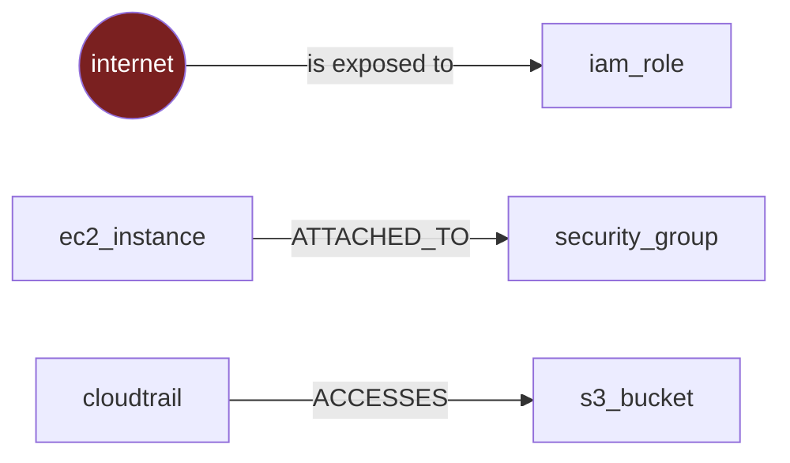
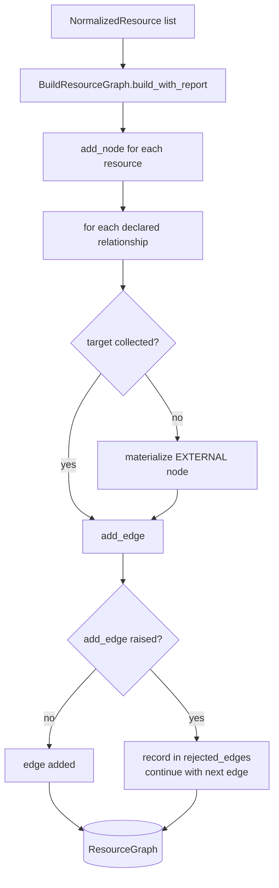

# Phase 3 — The Resource Graph ★

**Level 2–3.** Estimated 3 hours. **Do not skip this phase.**

Deep dives in this directory:
[01-nodes-and-edges.md](01-nodes-and-edges.md) ·
[02-external-nodes-and-integrity.md](02-external-nodes-and-integrity.md) ·
[03-determinism.md](03-determinism.md)

---

## 3.1 What is a graph?

Two things: **nodes** (the resources) and **edges** (directed
relationships between them).



In cloud security terms: a node is *a thing that exists*, an edge is *a
thing that is true about two things*.

The direction matters. `cloudtrail --ACCESSES--> bucket` and
`bucket --ACCESSES--> cloudtrail` are different claims, and only one of
them is true.

---

## 3.2 Why a CSPM needs a graph

Per-resource rules answer *"is this resource misconfigured?"* That is a
useful question and it is not where the risk lives.

Consider five facts, each individually common and individually
low-priority:

1. An EC2 instance has a public IP
2. …in a subnet whose route table points at an internet gateway
3. …protected by a security group allowing `0.0.0.0/0`
4. …carrying an IAM role with `AdministratorAccess`
5. …and that role can read a bucket of customer data

Every per-resource rule fires "medium". Together they are a **full
account compromise**.

**No amount of per-resource checking finds it**, because the finding is
not a property of any single resource — it is a property of the *path*
between them.

Without a graph a rule author has two options, both bad:

| Option | Why it fails |
|---|---|
| Flatten relationships into fake boolean attributes | Collectors must guess at them and keep them in sync |
| Move the logic into Python | Abandons the declarative catalog; every rule becomes a code release |

The graph makes the path **expressible**.

---

## 3.3 How ComplianceIQ builds it



**Code:** `application/graph/build_resource_graph.py`

Three properties of this loop matter:

1. **All nodes are added before any edge.** Otherwise a relationship
   declared by a resource appearing earlier in the list than its target
   would fail. Tested by
   `test_relationship_order_does_not_matter_nodes_added_before_edges`.
2. **Per-edge isolation.** One bad edge is recorded in
   `rejected_edges`, never allowed to abort the build.
3. **Deduplication by `edge.identity`** — `(source, target, relationship_type)`,
   excluding provenance, so two collectors observing the same relationship
   assert **one** edge.

`build_with_report()` returns `GraphBuildResult(graph, external_nodes,
rejected_edges)`. `build()` is preserved as the one-value signature so no
existing caller changed.

> A non-empty `rejected_edges` means the graph is **incomplete** and
> cross-resource rules over it may under-report. It is reported rather
> than swallowed for exactly that reason.

---

## 3.4 Nodes

```python
GraphNode(
    resource_id, tenant_id, resource_type,   # identity
    provider, name, account_id, region,      # context
    source_collector, confidence,            # provenance
    kind,                                    # "collected" | "external"
)
```

Full treatment: [01-nodes-and-edges.md](01-nodes-and-edges.md).

**The thing to notice now: there is no `attributes` field.** A graph node
knows *what* a resource is, not *how it is configured*. That single
absence explains why `AnalyzeAttackPaths.analyze()` takes `resources` as
well as `graph`.

---

## 3.5 Edges and relationship types

The vocabulary is **closed** — eight values, `domain/shared/enums.py`:

```
contains · connects_to · protects · allows
assumes  · accesses    · attached_to · publicly_exposed
```

Closed on purpose: an open vocabulary produces `attached_to`,
`attachedTo` and `ATTACHED_TO` in one graph and no query finds them all.

### What is ACTUALLY emitted — verified against the code

| Relationship | Producer file | Source type | Target type | Meaning | Used by |
|---|---|---|---|---|---|
| `ATTACHED_TO` | `aws/normalizers/ec2.py` | `ec2_instance` | `security_group` | Instance is protected by this SG | 2 cross-resource rules; attack path scenario 3 (as a witness) |
| `ATTACHED_TO` | `azure/normalizers/compute.py` | `azure_virtual_machine` | `azure_network_security_group` | VM is protected by this NSG | 1 cross-resource rule |
| `ALLOWS` | `aws/normalizers/security_group.py` | `security_group` | `security_group` | SG references another in an ingress rule | 1 cross-resource rule |
| `ACCESSES` | `aws/normalizers/cloudtrail.py` | `cloudtrail` | `s3_bucket` | Trail delivers logs to this bucket | 2 cross-resource rules; attack path scenario 4 |
| `ACCESSES` | `azure/normalizers/monitor.py` | `azure_activity_log_setting` | `azure_storage_account` | Activity log exports here | 2 cross-resource rules; attack path scenario 4 |
| `ASSUMES` | `aws/resource_collectors/iam_roles.py` | `iam_role` | `aws-account:*` / `aws-service:*` (external) | This principal may assume the role | — |
| `PUBLICLY_EXPOSED` | `aws/resource_collectors/iam_roles.py` | `iam_role` | `internet` (external) | Role assumable by anyone | Attack path scenario 1 |

### ⚠️ NOT emitted by anything

`CONTAINS` · `CONNECTS_TO` · `PROTECTS`

These are exactly the **network topology** edges that real
internet-reachability analysis needs. They require VPC / Subnet / Route
Table collectors that do not exist.

**5 of 8 relationship types are emitted.**

---

## 3.6 Graph integrity — and the blocker

`ResourceGraph.add_edge` **refuses** an edge whose source or target is not
already a node. That invariant caused a production-class blocker.

Full treatment:
[02-external-nodes-and-integrity.md](02-external-nodes-and-integrity.md).

Short version:

```
IamRoleCollector emits:  iam_role --PUBLICLY_EXPOSED--> "internet"
"internet" is not a collectible AWS resource → not a node
add_edge raises GraphIntegrityViolation
BuildResourceGraph had no isolation
→ ANY IAM role with a trust policy ABORTED THE ENTIRE SCAN
```

It escaped **21 collector tests** because every one asserted on
`resource.relationships` directly and none built a graph. Both components
were correct; their **seam** was never exercised.

The fix was *not* to drop the edge — *"this role is assumable from the
internet"* **is the finding**. External nodes were introduced instead.

---

## 3.7 Determinism

`graph_fingerprint()` in `domain/graph/validation.py` sorts nodes and
edges and **excludes provenance**. So:

- Two scans learning the same topology from different collectors →
  **same** fingerprint
- A genuine topology change → **different** fingerprint

Full treatment: [03-determinism.md](03-determinism.md).

---

## 3.8 Validation — diagnostic, not fatal

`validate_graph()` reports; it does not raise. The split is deliberate:

| Mechanism | Says |
|---|---|
| `add_node` / `add_edge` **raise** | "this graph is not constructible" |
| `validate_graph` **reports** | "constructible but suspicious" |

| Code | Severity | Meaning |
|---|---|---|
| `dangling_edge` | ERROR | Edge references a missing node |
| `impossible_relationship` | ERROR | e.g. something `ASSUMES` the internet |
| `duplicate_edge` | WARNING | Often a collector emitting per page |
| `self_loop` | WARNING | Resource relates to itself |
| `orphan_external_node` | WARNING | Its creating relationship was lost |
| `cross_account_edge` | INFO | Legitimate and worth surfacing |

`cross_account_edge` is **INFO on purpose**: a role trusting a partner
account is an intended pattern, and flagging it as corruption would train
people to ignore the report.

---

## 3.9 Multi-hop, and why it matters

```
A → B          one hop:   "cloudtrail writes to this bucket"
A → B → C      two hops:  "cloudtrail writes to a bucket that is public"
```

The second is a *composite* claim that neither resource states alone. The
graph is what lets you assert it, and `find_paths` (Phase 7) is what walks
it.

`neighbors()` is deliberately one hop only. Multi-hop lives in the query
layer, bounded to 4 hops.

---

## Data in / out / callers

| | |
|---|---|
| **In** | `tuple[NormalizedResource, ...]`, a `TenantId` |
| **Out** | `ResourceGraph` (or `GraphBuildResult`) |
| **Called by** | `ScanCloudAccount.run()` |
| **Feeds** | `EvaluateRules`, `AnalyzeAttackPaths`, `graph_context_for` |

## Assumptions

- One graph = one tenant. Enforced at `add_node`.
- Built once, never mutated after. There is **no removal API**.
- Edges are directed and the direction is meaningful.
- Absence of an edge means **"not observed"**, never "does not exist".

## Failure modes

| Failure | Behaviour |
|---|---|
| Foreign-tenant resource | `TenantIsolationViolation` — scan aborts, correctly |
| Duplicate node id | `GraphIntegrityViolation` |
| Edge to uncollected target | Target materialized as external |
| Edge that still fails | Recorded in `rejected_edges`, build continues |

## Tests

| File | Tests | Guards |
|---|---|---|
| `tests/unit/domain/test_graph.py` | 20 | Core invariants |
| `tests/unit/domain/test_graph_expansion.py` | 28 | Provenance, external nodes, validation, fingerprint |
| `tests/unit/domain/test_graph_queries.py` | 62 | The query layer (Phase 7) |
| `tests/unit/application/test_build_resource_graph.py` | 8 | Builder behaviour + the relocated invariant |

## Limitations

1. **5 of 8** relationship types emitted; the 3 missing are the network
   topology ones.
2. **No workload→identity edge** — the single biggest limiter on attack
   path coverage.
3. **No storage→internet edge** — S3 exposure is attribute-only.
4. **`blocked` is never set `True`** by any collector.
5. No cross-scan graph diffing; the graph is not persisted or cached.

---

## What I should know now

1. Explain what a `GraphNode` and a `GraphEdge` represent.
2. Name the 5 relationship types actually emitted — and the 3 that are not.
3. Explain external nodes and the blocker that motivated them.
4. Explain why `add_edge` raises but `validate_graph` only reports.
5. Explain why `graph_fingerprint` excludes provenance.
6. Explain why nodes carry no attributes and what that forces downstream.
7. Explain why "absence of an edge" is not "absence of the relationship".
8. Explain why multi-hop matters for attack paths.

---

## Self-test

1. Why can't a CSPM detect `Internet → Workload → Identity → Sensitive
   Resource` using only independent per-resource rules?
2. An IAM role's trust policy names an AWS *service principal*. What node
   does the graph get, and what `kind`?
3. `add_edge` refuses dangling edges. Why didn't the builder just create
   the missing node as a normal collected node?
4. 21 collector tests passed while every scan with an IAM role crashed.
   What exactly did those tests fail to exercise?
5. Two collectors both report `sg-1 ALLOWS sg-2`. How many edges are in
   the graph, and which field decides?
6. Why is `cross_account_edge` INFO rather than ERROR?
7. Two scans of unchanged infrastructure, but a collector ran in a
   different order. Same fingerprint or different? Why?
8. You add a `routes_to` relationship. What must you update in
   `domain/attack_paths/classification.py`, and what happens if you
   forget?
9. A rule needs "bucket has no logging". Can the graph answer that? What
   is the danger in the answer?

Answers: [answers.md](answers.md)
