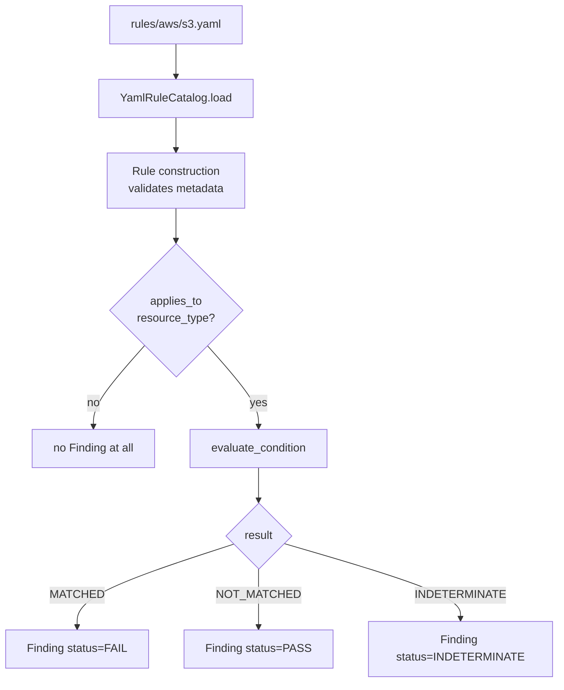
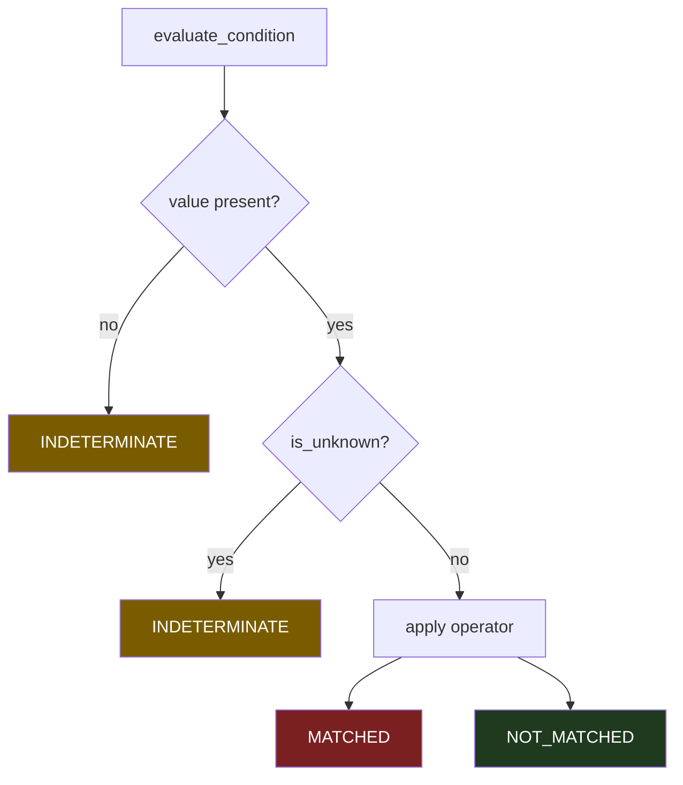
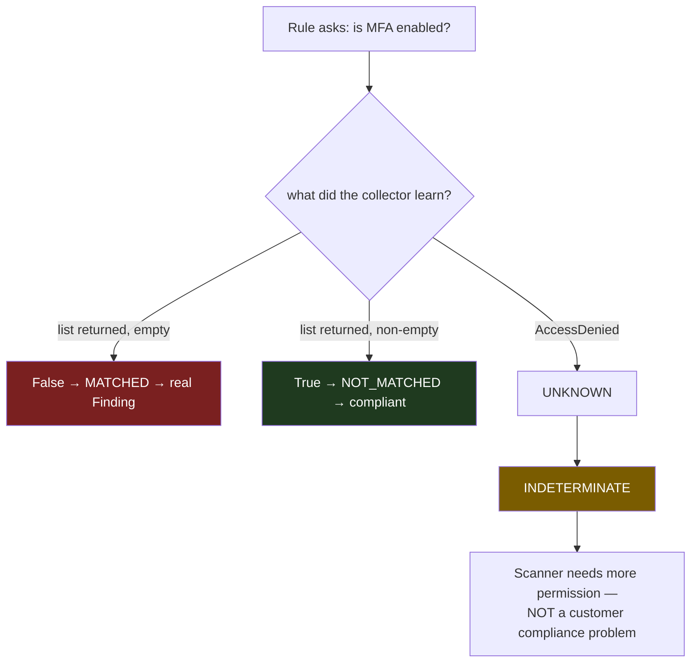

# Phase 4 — The Rule Engine

**Level 2–3.** Estimated 2.5 hours. **§6 (UNKNOWN) is required reading.**

---

## A. What problem does this solve?

Turning a declarative YAML condition into a **three-valued** verdict about
one resource, deterministically and without executing arbitrary code.

## B. Why does ComplianceIQ need it?

Two reasons, and the second is the interesting one.

**Declarative:** rules must be editable without a code release. A catalog
of 68 rules that each required a Python deploy would ossify.

**Three-valued:** a security scanner has to distinguish *"this is
compliant"* from *"I could not tell"*. Boolean logic cannot. That
distinction is the difference between a trustworthy CSPM and one that
quietly reports missing permissions as passes.

---

## C. Files

```
domain/rules/rule.py          Rule, FrameworkMapping, Remediation, Confidence
domain/rules/conditions.py    ★ the evaluator — read this file
domain/rules/trace.py         RelationshipTrace (Phase 6)
domain/rules/exceptions.py
infrastructure/rules/yaml_rule_catalog.py   YamlRuleCatalog (the loader)
application/rules/evaluate_rules.py         EvaluateRules (the use case)
application/rules/evidence.py               evidence template rendering
```

`domain/rules/conditions.py` is the single most correctness-critical file
in the repository. Open it.

---

## D. YAML rule → Finding



Note the `SKIP` branch. A rule that does not apply produces **no finding
at all**, not `INDETERMINATE` — "this rule has nothing to say about this
resource type" is a different statement from "the data needed to decide
was not collected", and conflating them would bury every real
INDETERMINATE under thousands of irrelevant ones.

---

## E. The condition language — six node types

| Node | Shape |
|---|---|
| `and` | `{"and": [cond, ...]}` |
| `or` | `{"or": [cond, ...]}` |
| `not` | `{"not": cond}` |
| leaf | `{"field": "a.b.c", "operator": "...", "value": ..., "source": "attributes"}` |
| `relationship` | existence-quantified graph traversal |
| `no_relationship` | **absence**-quantified graph traversal |

`source` defaults to `"attributes"`; `"tags"` is also supported. `field`
supports dot notation.

### 32 operators

| Category | Operators |
|---|---|
| Scalar (6) | `equals`, `not_equals`, `contains`, `not_contains`, `starts_with`, `ends_with` |
| Boolean/null (6) | `is_true`, `is_false`, `exists`, `not_exists`, `is_null`, `is_not_null` |
| Numeric (4) | `greater_than`, `greater_than_or_equal`, `less_than`, `less_than_or_equal` |
| Collection (4) | `in`, `not_in`, `contains_any`, `contains_all` |
| Quantifier (3) | `any`, `all`, `none` |
| String (1) | `matches_regex` |
| Network (5) | `cidr_contains`, `cidr_is_public`, `cidr_is_private`, `port_equals`, `port_in_range` |
| Temporal (3) | `age_gt_days`, `age_gte_days`, `age_lt_days` |

Two subtleties:

- **`is_null` is a comparison, not a presence check.** An absent field is
  not the same fact as a field collected with value `None`. See the KMS
  rotation handling in `rules/aws/kms.yaml` for the precedent.
- **Temporal operators require an explicit `as_of`.** There is no fallback
  to `datetime.now()` inside the evaluator — that is the determinism
  invariant, enforced by raising.

---

## F. Kleene (three-valued) logic



### Truth tables

**AND** — `MATCHED` only if *all* matched; `NOT_MATCHED` wins over
`INDETERMINATE` (one definite false makes the whole thing false):

| | MATCHED | NOT_MATCHED | INDET |
|---|---|---|---|
| **MATCHED** | MATCHED | NOT_MATCHED | INDET |
| **NOT_MATCHED** | NOT_MATCHED | NOT_MATCHED | NOT_MATCHED |
| **INDET** | INDET | NOT_MATCHED | INDET |

**OR** — `MATCHED` wins over `INDETERMINATE`:

| | MATCHED | NOT_MATCHED | INDET |
|---|---|---|---|
| **MATCHED** | MATCHED | MATCHED | MATCHED |
| **NOT_MATCHED** | MATCHED | NOT_MATCHED | INDET |
| **INDET** | MATCHED | INDET | INDET |

**NOT** — `INDETERMINATE` is its own negation. "I don't know" negated is
still "I don't know".

### Two deliberately separate helpers

```python
_kleene_or(...)              # empty input RAISES — an empty `or` is a rule bug
_existence_quantified_or(...)# empty input is NOT_MATCHED — zero neighbours is a fact
```

Same truth table, different empty-case. Quantifiers and relationships
route to the second. `_quantified_and` likewise treats empty as vacuously
`MATCHED`.

---

## G. `UNKNOWN` — why it is essential



**Why a commercial CSPM lives or dies on this.**

Without a third value the engine must pick one, and both choices are
catastrophic at scale:

| Choice | Failure |
|---|---|
| `UNKNOWN → False` | Missing permission reported as **compliant**. Silent false negatives across the estate. |
| `UNKNOWN → True` | Missing permission reported as a **violation**. Mass false positives; the customer stops believing the tool. |

The third value keeps them separate and makes the real problem visible:
*ComplianceIQ needs more permission here*, which is an operational signal
about the scanner, not a compliance signal about the customer.

Mechanically, in `conditions.py`, after the presence check:

```python
if is_unknown(value):
    return _INDETERMINATE
```

---

## H. The `relationship` node — cross-resource rules

```yaml
condition:
  and:
    - field: has_public_ip
      operator: is_true
    - relationship: attached_to
      direction: outgoing
      target_type: security_group
      where:
        field: allows_unrestricted_ingress
        operator: is_true
```

*This instance is public **and** at least one attached security group
allows unrestricted ingress.* Neither half alone is a finding.

Semantics:

- **Existence-quantified (OR)** across neighbours.
- Zero neighbours → `NOT_MATCHED` (vacuously), not INDETERMINATE.
- A neighbour missing from `resources_by_id` → `INDETERMINATE` for that
  neighbour.
- Used without a graph → **raises**. That is a caller wiring bug, not a
  data gap, and hiding it as INDETERMINATE is how a real defect ships
  quietly.

## I. The `no_relationship` node — absence

Added as a **separate node**, never a flag on `relationship`, because
seven shipped rules depend on the existing truth table.

```yaml
- no_relationship: connects_to
  direction: outgoing
  target_type: private_endpoint
  requires_collected: private_endpoint    # ← mandatory coverage guard
```

| Situation | Result |
|---|---|
| Coverage guard unsatisfied | `INDETERMINATE` |
| No matching edge | `MATCHED` |
| A matching edge, no `where` | `NOT_MATCHED` |
| A matching edge, with `where` | `NOT(exists neighbour satisfying where)` |

### Why `requires_collected` is mandatory

Absence means **"not observed"**, not "does not exist". If the
private-endpoint collector lacked permission, every database looks
unprotected and the rule reports the whole estate as non-compliant.

That is the **mirror image** of the failure the codebase refuses
everywhere else: elsewhere an unknown silently becoming `False` *hides* a
violation; here an unknown silently becoming `True` **invents** one, at
estate scale. The second is worse, because a CSPM nobody believes is a
CSPM nobody reads.

`requires_collected` names the resource type whose collection makes
absence meaningful. Estate-wide zero of that type → `INDETERMINATE`. It
defaults to `target_type`, and is **rejected** when neither is present.
It is checked *before* edges are counted, so an uncollected type cannot
produce a confident `NOT_MATCHED` either.

⚠️ **No shipped rule uses `no_relationship` yet** — the controls it
unlocks need collectors that do not exist, and a rule over an uncollected
type would sit at INDETERMINATE forever.

---

## J. Data in / out / callers

| | |
|---|---|
| **In** | `Rule`, `NormalizedResource`, optional `graph`, `resources_by_id`, `as_of`, `trace` |
| **Out** | `EvaluationResult` (MATCHED / NOT_MATCHED / INDETERMINATE) |
| **Called by** | `EvaluateRules.evaluate()` ← `ScanCloudAccount.run()` |

## K. Failure modes

| Failure | Behaviour |
|---|---|
| Unknown operator | `InvalidRuleCondition` — rule-authoring bug |
| Empty `and`/`or` | `InvalidRuleCondition` |
| Invalid regex | `InvalidRuleCondition`, never INDETERMINATE |
| `relationship` without a graph | **Raises** — wiring bug |
| Temporal operator without `as_of` | **Raises** |
| Field absent | `INDETERMINATE` (except `exists`/`not_exists`) |
| Field is `UNKNOWN` | `INDETERMINATE` |

## L. Tests

| File | Tests | Guards |
|---|---|---|
| `tests/unit/domain/test_rules.py` | 27 | Original evaluator |
| `tests/unit/domain/test_rules_dsl_v2.py` | 53 | New operators, quantifiers, temporal, relationships |
| `tests/unit/domain/test_rules_absence.py` | 30 | `no_relationship` + the coverage guard |
| `tests/unit/domain/test_unknown.py` | — | The sentinel |
| `tests/unit/application/test_evaluate_rules.py` | — | The use case |

## M. Limitations

1. `no_relationship` has **no shipped rule** using it.
2. The `source: graph` function registry is **intentionally empty**.
3. Attribute names are not globally unique — hence
   `applies_to_resource_type`.
4. `relationship` cannot express "exactly N" or "at least N" neighbours.
5. No rule can call the Phase 7 query primitives (`find_paths`, etc.).

---

## What I should know now

1. Name the six condition node types.
2. Reproduce the Kleene AND/OR truth tables.
3. Explain why `UNKNOWN → False` and `UNKNOWN → True` are both wrong.
4. Explain why an empty `or` raises but zero neighbours does not.
5. Explain why `relationship` without a graph raises.
6. Explain `requires_collected` and the failure it prevents.
7. Explain why `no_relationship` is a separate node.
8. Explain why a non-applicable rule emits no finding rather than
   INDETERMINATE.

---

## Self-test

1. `{"and": [MATCHED, INDETERMINATE]}` — result? And
   `{"and": [NOT_MATCHED, INDETERMINATE]}`? Explain the asymmetry.
2. Why does `_kleene_or` raise on empty input while
   `_existence_quantified_or` returns NOT_MATCHED?
3. A rule uses `age_gt_days` and the caller passes no `as_of`. What
   happens, and why not just use `datetime.now()`?
4. Distinguish `is_null` from `not_exists` with a concrete KMS example.
5. A `relationship` condition's neighbour is in the graph but missing
   from `resources_by_id`. Result for that neighbour? Why not skip it?
6. Design a rule for "Azure SQL server with no private endpoint". Write
   the YAML. Then explain why it must not ship today.
7. `has_administrator_access` is `UNKNOWN` and the condition is
   `{"not": {"field": "has_administrator_access", "operator": "is_true"}}`.
   Result?
8. Why is an invalid regex a raise rather than INDETERMINATE?
9. You want "resource attached to exactly two security groups". Can the
   DSL express it? What would you add?

Answers: [answers.md](answers.md)
