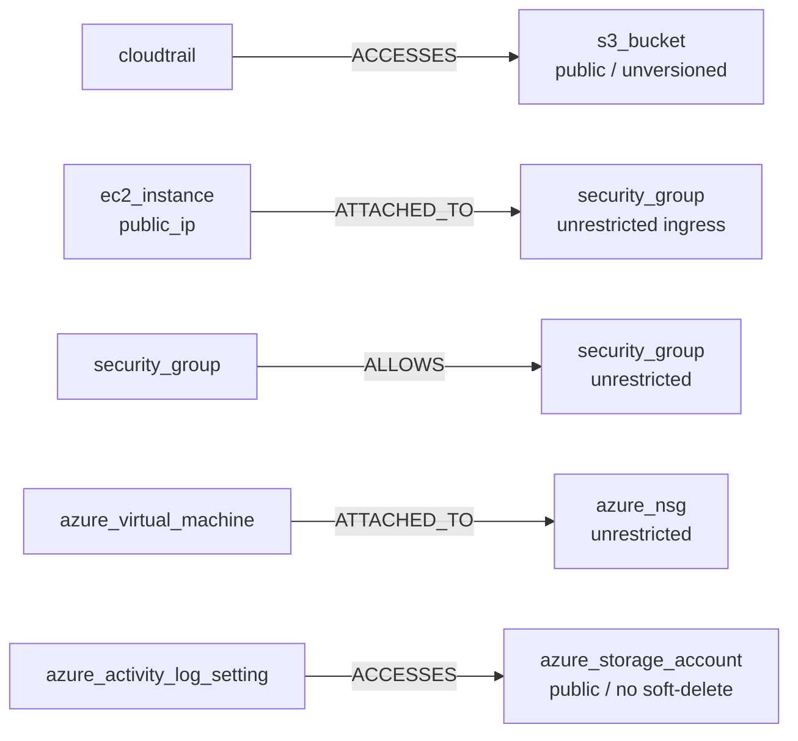

# Phase 5 — The CSPM Rule Catalog

**Level 2.** Estimated 1.5 hours.

---

## A. What problem does this solve?

The engine (Phase 4) is a mechanism. The **catalog** is the product: 68
concrete security checks grounded in real AWS/Azure behaviour.

## B. Why does it matter?

A CSPM's value is the quality of its rules, not the cleverness of its
evaluator. Two constraints shape everything here:

- **No fake coverage.** A rule targeting an attribute no collector
  produces would sit at `INDETERMINATE` forever, inflating the rule count
  while detecting nothing.
- **No fabricated compliance mappings.** An unverified control mapping is
  the fastest way to lose credibility with an auditor.

---

## C. Catalog layout

```
rules/aws/                        rules/azure/
├── cloudtrail.yaml    6          ├── compute.yaml     3
├── ec2.yaml           5          ├── keyvault.yaml    5
├── iam.yaml          10          ├── monitor.yaml     5
├── kms.yaml           4          ├── network.yaml     7
├── s3.yaml            8          └── storage.yaml     7
└── security_group.yaml 8
                      ──                             ──
                      41                             27
```

**68 rules total.** Loaded by
`infrastructure/rules/yaml_rule_catalog.py` (`YamlRuleCatalog`), which
takes a directory and globs `*.yaml` / `*.yml`.

### Distribution — verified by parsing the catalog

| Severity | Count | | Domain | Count |
|---|---|---|---|---|
| `critical` | 21 | | `network` | 23 |
| `high` | 23 | | `iam` | 13 |
| `medium` | 14 | | `storage` | 13 |
| `low` | 10 | | `logging` | 10 |
| | | | `encryption` | 9 |

---

## D. A real rule, field by field

From `rules/aws/s3.yaml` — this is the actual file content, not an
illustration:

```yaml
id: s3-bucket-public
applies_to_resource_type: s3_bucket
framework: iso_27001
control_id: A.8.24
domain: storage
severity: critical
confidence: high
service: s3
version: 1.1.0
title: S3 bucket ACL grants access to the public
description: >
  The bucket's ACL grants read or write access to the well-known AllUsers
  or AuthenticatedUsers groups...
rationale: >
  Publicly readable/writable S3 buckets are one of the most common causes
  of real-world cloud data breaches...
condition:
  field: public
  operator: equals
  value: true
evidence_template: Bucket {resource_id} has an ACL grant to a public group (region {region}).
tags: [s3, exposure, data-protection]
references:
  - https://docs.aws.amazon.com/AmazonS3/latest/userguide/access-control-block-public-access.html
framework_mappings:
  - framework: cis_aws
    control: "2.1.5"
    status: verified
  - framework: nist_800_53
    control: AC-3
remediation:
  summary: Remove the public ACL grant and enable S3 Block Public Access.
  why_it_matters: Anyone on the internet can currently read (or write) this bucket's contents.
  how_to_fix: >
    Remove the AllUsers/AuthenticatedUsers grant from the bucket ACL, then
    enable S3 Block Public Access...
  automation_example: |
    aws s3api put-public-access-block --bucket <bucket> \
      --public-access-block-configuration BlockPublicAcls=true,...
```

| Field | Role |
|---|---|
| `id` | Stable identity; part of `logical_finding_id` |
| `applies_to_resource_type` | **Scoping.** Without it, a Key Vault rule fired against storage accounts |
| `framework` / `control_id` | Primary attribution — every rule has exactly one |
| `severity` | Static seriousness. Distinct from contextual `risk` |
| `confidence` | How reliable the *rule's own logic* is (catalog metadata; no evaluator consumes it) |
| `version` | Recorded on the finding as `rule_version` |
| `condition` | The Phase 4 condition tree |
| `evidence_template` | Rendered into the finding's narrative |
| `framework_mappings` | Secondary mappings; `status` defaults to `unresolved` |
| `remediation` | Structured guidance, **never executed** — plain text only |

Note the second mapping: `nist_800_53 / AC-3` has **no `status`**, so it
defaults to `"unresolved"`. That default is the anti-fabrication
mechanism, not an oversight — see Phase 10.

---

## E. The seven cross-resource rules

These traverse the graph. Verified by walking every condition tree for a
`relationship` node:

| Rule | File |
|---|---|
| `cloudtrail-logs-to-non-versioned-bucket` | `rules/aws/cloudtrail.yaml` |
| `cloudtrail-logs-to-public-bucket` | `rules/aws/cloudtrail.yaml` |
| `ec2-instance-attached-to-open-security-group` | `rules/aws/ec2.yaml` |
| `security-group-allows-another-open-security-group` | `rules/aws/security_group.yaml` |
| `azure-vm-attached-to-open-network-security-group` | `rules/azure/compute.yaml` |
| `azure-activity-log-exports-to-publicly-exposed-storage` | `rules/azure/monitor.yaml` |
| `azure-activity-log-exports-to-storage-without-soft-delete` | `rules/azure/monitor.yaml` |



Each uses exactly the five relationship types the collectors emit — which
is why they work.

> **A correction worth knowing about.** An earlier report in this
> repository stated *"Cross-resource rules: 0"*. That was wrong: it was
> inferred from "no rule *I* wrote uses the relationship node" instead of
> querying the catalog. There are seven, and the graph blocker described
> in Phase 3.2 was breaking **all of them** whenever an IAM role was in
> scope. The error is recorded in
> `docs/architecture/cspm-expansion-report.md` §10 rather than silently
> edited.

---

## F. Rules by domain

**IAM (13)** — root MFA, access key age, unused credentials, wildcard
policies, admin access, privilege escalation, publicly assumable roles.
These consume the semantic analysis from Phase 1.

**Storage (13)** — S3 public ACLs, bucket policy wildcards, Block Public
Access, encryption, versioning, logging; Azure storage public access,
HTTPS-only, soft delete.

**Network (23)** — the largest domain. Unrestricted ingress on sensitive
ports, world-open security groups, SG-to-SG chains, public IPs, NSG rules.

**Logging (10)** — CloudTrail enabled, multi-region, log file validation,
delivery to a safe bucket; Azure activity log export.

**Encryption (9)** — KMS rotation, EBS encryption, S3 encryption, Key
Vault settings.

---

## G. Data in / out

| | |
|---|---|
| **In** | YAML files on disk |
| **Out** | `tuple[Rule, ...]` |
| **Called by** | `ScanCloudAccount` via the `LoadRuleCatalog` port |

`CompositeRuleCatalog` combines several directories — that is how a scan
covers AWS and Azure at once.

## H. Failure modes

| Failure | Behaviour |
|---|---|
| Directory missing | `RuleCatalogError` |
| Malformed YAML | Load error — surfaces at startup, not mid-scan |
| Invalid condition shape | `InvalidRuleCondition` at construction |
| Rule doesn't apply to a resource | No finding at all |
| Attribute missing/`UNKNOWN` | `INDETERMINATE` |

## I. Tests

| File | Guards |
|---|---|
| `tests/unit/infrastructure/test_yaml_rule_catalog.py` | Loading and validation |
| `tests/conformance/test_rule_catalog_conformance.py` | Rules fire on the intended resources |
| `tests/unit/domain/test_rule_metadata.py` | Metadata invariants |
| `tests/unit/application/conformance/*` | The conformance comparator |

The **conformance framework** is worth understanding: it runs rules
against known-compliant and known-non-compliant Terraform scenarios and
classifies results, including `UNEXPECTED_FINDING` — which is how the
"Key Vault rule fires on storage accounts" defect was found.

## J. Limitations

1. **68 rules over 12 of 26 target services.** Whole services have no
   rules because they have no collector.
2. **16 of 27 framework mappings are unresolved** (Phase 10).
3. **7 ISO controls for 68 rules**, with 41 rules on just two controls.
4. **No rule uses `no_relationship`.**
5. Rules cannot call the Phase 7 query primitives.

---

## What I should know now

1. State the catalog size and its AWS/Azure split.
2. Name the seven cross-resource rules and the edges they use.
3. Explain every field of a real rule.
4. Explain why `applies_to_resource_type` exists.
5. Explain why `framework_mappings.status` defaults to `unresolved`.
6. Explain why remediation is text and never executed.
7. Explain what the conformance framework catches that unit tests don't.

---

## Self-test

1. Write the condition for "CloudTrail delivers logs to a bucket that is
   public". Which relationship type, which direction?
2. `s3-bucket-public` has `severity: critical` and `confidence: high`.
   What does each mean, and which of them can a *finding* override?
3. Why is `remediation.automation_example` never executed by ComplianceIQ?
4. You want a rule for RDS public accessibility. Why can't you ship it
   today, and what makes shipping it anyway harmful?
5. `network` has 23 rules, `encryption` has 9. Is that a problem?
6. A rule's `framework_mappings` entry omits `status`. What is the value,
   and why is that the right default?
7. How would the conformance framework catch a rule that fires on the
   wrong resource type, when its unit test passes?

Answers: [answers.md](answers.md)
