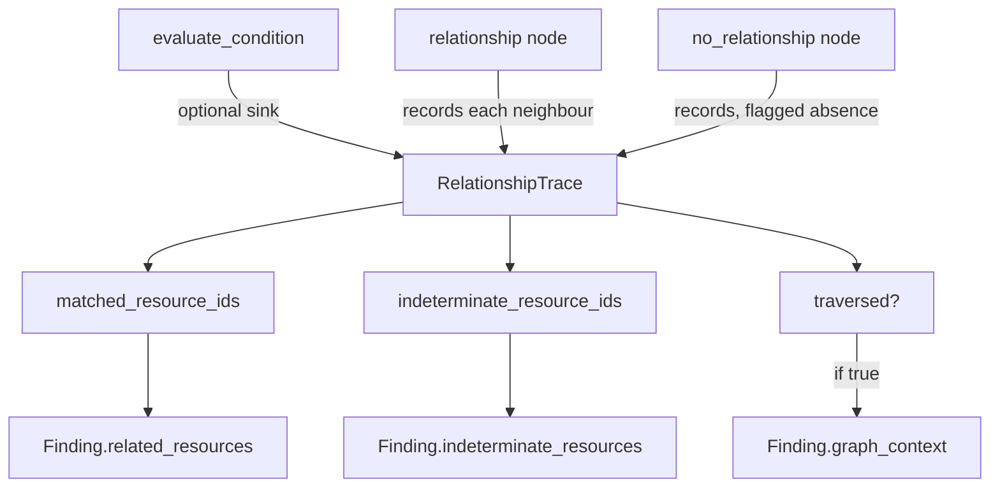

# Phase 6 — Findings

**Level 2–3.** Estimated 1.5 hours.

---

## A. What problem does this solve?

Turning a rule verdict into a **durable, identifiable, explainable
record** that survives across scans and can be tracked, diffed and acted
on.

## B. Why does ComplianceIQ need it?

An evaluation result is `MATCHED`. A *finding* has to answer more:

- Which resource, in which account, in which tenant?
- Is this the same issue as yesterday's, or a new one?
- What evidence supports it?
- **Which other resources are involved?**

That last question is what separates a graph-aware CSPM from a checklist.

---

## C. Files

```
domain/findings/models.py              Finding, Evidence, FindingStatus
domain/rules/trace.py                  RelationshipTrace, RelationshipObservation
application/rules/evaluate_rules.py    _to_finding — where findings are built
application/rules/evidence.py          template rendering
infrastructure/persistence/postgres/   mappers + finding_snapshots table
```

---

## D. The `Finding` model

Split by intent, not mechanism:

**Core (11 fields)** — meaningful outside the codebase:
`id`, `tenant_id`, `resource_id`, `rule_id`, `framework`, `control_id`,
`domain`, `status`, `severity`, `evidence`, `detected_at`

**Internal bookkeeping** — no external integration may assume its shape:
`scan_id`, `rule_version`, `region`, `environment`, `version`,
`superseded_by`, `related_attack_path_ids`, `related_drift_event_ids`,
`risk`, `confidence`, `account_id`, `logical_finding_id`

**Graph contextualization** (added by the graph expansion):
`related_resources`, `indeterminate_resources`, `graph_context`

### `FindingStatus` mirrors the three-valued verdict

| Rule result | Finding status |
|---|---|
| `MATCHED` | `FAIL` |
| `NOT_MATCHED` | `PASS` |
| `INDETERMINATE` | `INDETERMINATE` |

The third status is not decoration. It is how "we could not check" reaches
the operator as an actionable signal instead of being laundered into a
pass.

---

## E. Two identities, and why

```python
logical_finding_id = f"{tenant}:{account}:{resource_id}:{rule_id}"
finding_id         = f"{logical_finding_id}:{scan_id}"
```

| Identity | Answers |
|---|---|
| **Logical** | "Is this the same issue as last week?" — stable across scans |
| **Physical** (`id`) | "Which scan observed it?" — unique per run |

This is what makes first-seen / last-seen tracking and
resolution/regression detection possible.

### A real defect worth studying

The account component was originally `{resource.account_id!s}`, which
renders a missing account as the literal string `"None"`. So **two
different accounts** whose id could not be resolved produced the **same**
`logical_finding_id` — merging two accounts' security history onto one
lifecycle row.

Fixed with an explicit sentinel:

```python
account = account_key(resource.account_id)   # → "unknown-account"
```

The sentinel does not make the two accounts distinguishable — nothing here
can — but it is **honest about being unknown** instead of masquerading as
a real value. Phase 4 persistence stores the identity *components* as
columns and keys the lifecycle on those, so it is never exposed to the
ambiguity.

---

## F. Evidence

```python
@dataclass(frozen=True, slots=True)
class Evidence:
    data: Mapping[str, Any]     # frozen into MappingProxyType
```

Built in `_to_finding` from the resource's attributes plus a rendered
narrative:

```python
evidence_data = dict(resource.attributes)
narrative = render_evidence(rule.evidence_template, resource)
if narrative:
    evidence_data = {**evidence_data, "narrative": narrative}
```

The template `Bucket {resource_id} has an ACL grant to a public group
(region {region}).` becomes a concrete sentence.

Evidence is **deterministic collected fact**, explicitly distinguished
from an AI-generated explanation (a later phase). It is also routed
through `redact()` before persistence — because "this payload cannot
contain a secret" is an assumption a future collector change can silently
invalidate.

---

## G. Graph contextualization

The problem it fixes:

> A cross-resource finding said *"EC2 instance attached to an open
> security group"* — **without naming which security group.** The rule
> traversed the edge, decided, and threw the traversal away.

### How the trace works



`RelationshipTrace` is an **optional sink** the evaluator writes to. A
test asserts the return value is identical with and without a trace — it
observes, it does not influence.

### Four decisions worth defending

**A sink, not a richer return type.** `evaluate_condition` recurses from a
dozen places; threading a `(result, trace)` pair through every branch
would touch every node type to serve two of them.

**Only what the rule traversed** — never the whole neighbourhood. A
finding that names resources it did not consider is *worse* than one that
names none, because someone will go investigate them.

**Indeterminate stays a separate field.** A neighbour we could not read is
not a confirmed relationship. Collapsing the columns would undo, at the
reporting layer, the three-valued discipline the evaluator maintains.

**Absence observations are excluded** from `related_resources`. Under
`no_relationship`, a satisfying neighbour is evidence the control was
**met** — listing it beside a violation would name a resource as
implicated in a finding it in fact *prevented*.

### Sorted-and-deduplicated is a model invariant

```python
if list(value) != sorted(set(value)):
    raise InvalidFinding(f"{name} must be sorted and free of duplicates")
```

A finding whose related list reorders between two scans of unchanged
infrastructure cannot be diffed — and diffing is the whole point of
naming those resources.

### Persisted, not derived

Migration `0003` adds all three columns to `finding_snapshots`. The graph
is rebuilt per scan and never stored, so a finding fetched tomorrow cannot
recompute which security group it matched. **Context that lives only in
the process that produced the finding is the same as no context.**

Array columns are `NOT NULL DEFAULT '[]'` — existing rows backfill to
"related to nothing", which is truthful for every finding written before
traversal was recorded. The defaults stay rather than being dropped
because during a rolling deploy an older process still inserts rows that
never mention these columns.

---

## H. Severity vs Risk vs Confidence

Three scores, three questions, **never collapse them**:

| Score | Question | Where |
|---|---|---|
| `Severity` | "How serious is this violation *in the abstract*?" | Static, on the rule |
| `RiskScore` | "How risky is it *in this actual context*?" | 0–100, CRSF-1.1 |
| `ConfidenceScore` | "How much can we trust the data?" | Property of collection |

`Severity` has four values: `critical`, `high`, `medium`, `low`. **No
`INFO`** — the vocabulary is fixed by the Core↔AI Service integration
contract.

---

## I. Data in / out / callers

| | |
|---|---|
| **In** | `Rule`, `NormalizedResource`, `tenant_id`, `detected_at`, graph, trace |
| **Out** | `Finding` |
| **Called by** | `EvaluateRules._to_finding` |
| **Consumed by** | `EnrichFindingsWithRisk`, persistence, `ComplianceScore`, the API, the AI contract |

## J. Failure modes

`Finding.__post_init__` validates aggressively and raises `InvalidFinding`
for: non-`FindingId` id, blank framework/control/domain, naive
`detected_at`, out-of-range `risk`/`confidence`, self-supersession,
unsorted `related_resources`.

Findings are **immutable** — enrichment uses `dataclasses.replace`.

## K. Tests

| File | Guards |
|---|---|
| `tests/unit/domain/test_findings.py` | Model invariants |
| `tests/unit/domain/test_finding_lifecycle.py` | Logical identity, supersession |
| `tests/unit/application/test_finding_context.py` | Trace → context; what is *not* named |
| `tests/integration/persistence/test_persistence.py` | Real-DB round trip incl. context columns |

## L. Limitations

1. `environment` is **never populated** by any collector — which forces
   the risk model to default it (Phase 8).
2. `related_drift_event_ids` exists and is never populated.
3. `relationship_path` is deliberately **not** a field — `find_paths`
   exists but no rule produces a path, so a path column would have no
   writer.
4. The API does not expose `related_resources` or `graph_context`.
5. `ConfidenceScore` (0–100) is defined but not populated on findings.

---

## What I should know now

1. Distinguish logical from physical finding identity.
2. Explain the `"None"` account defect and the sentinel that fixed it.
3. Explain how `FindingStatus.INDETERMINATE` reaches the operator.
4. Explain what `related_resources` contains and what it deliberately
   excludes.
5. Explain why sorted-and-deduplicated is enforced as an invariant.
6. Explain why context is stored rather than derived on read.
7. Distinguish Severity, Risk and Confidence.

---

## Self-test

1. Two scans, unchanged infrastructure. Which finding field is identical
   and which differs? Why do you need both?
2. Two AWS accounts, neither resolvable. Under the old code, what went
   wrong, and does the sentinel actually fix it?
3. A rule traverses to `sg-open` (matched) and `sg-closed` (not matched).
   What is in `related_resources`? Why not both?
4. `no_relationship` finds a private endpoint that satisfies its `where`.
   Should that endpoint appear in `related_resources`? Why?
5. Why is `graph_context` attached only when the rule traversed?
6. Migration 0003's array columns are `NOT NULL DEFAULT '[]'`. Why not
   nullable, and why keep the default after backfill?
7. Why is `relationship_path` deliberately absent?
8. A finding has `status=INDETERMINATE`. What should the operator do —
   and is it a compliance problem?

Answers: [answers.md](answers.md)
