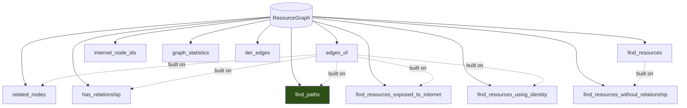
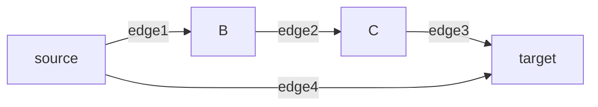

# Phase 7 — Graph Queries

**Level 3.** Estimated 2 hours.

---

## A. What problem does this solve?

Before this layer, `ResourceGraph` exposed five methods:

```
nodes · edges · has_node · get_node · neighbors
```

`neighbors()` is **one hop, one exact relationship type, one direction**.
Every other question had to be answered by scanning `graph.edges`
linearly — **O(R × N × E)** for R relationship rules over N resources.

And one whole class of question was **inexpressible**: absence.

## B. Why does ComplianceIQ need it?

Attack path analysis (Phase 8) is built entirely on these primitives. It
adds no traversal engine of its own.

---

## C. Files

```
domain/graph/queries.py        ★ the 11 primitives
domain/graph/models.py         the indexes + public readers
scripts/benchmark_graph.py     the performance measurement
```

---

## D. The 11 primitives



| Function | Returns | Question |
|---|---|---|
| `edges_of` | `tuple[GraphEdge, ...]` | What is this connected to at all? |
| `related_nodes` | `tuple[GraphNode, ...]` | What is one hop away? |
| `find_resources` | `tuple[GraphNode, ...]` | Every resource of a type |
| `has_relationship` | `bool` | Does this one edge exist? |
| `find_paths` | `tuple[tuple[GraphEdge, ...], ...]` | How can A reach B within N hops? |
| `find_resources_exposed_to_internet` | `tuple[GraphNode, ...]` | Directly reachable from outside |
| `find_resources_using_identity` | `tuple[GraphNode, ...]` | Which workloads run as this role? |
| `find_resources_without_relationship` | `tuple[GraphNode, ...]` | What is **missing** a relationship? |
| `internet_node_ids` | `tuple[ResourceId, ...]` | Which nodes stand for the internet? |
| `graph_statistics` | `dict` | Did the Azure half collect anything? |
| `iter_edges` | `Iterator[GraphEdge]` | Deterministic iteration |

**Deliberately not a general graph library.** Every function answers a
question a CSPM control actually asks. A general traversal API invites
rules that are slow, non-deterministic, or both.

---

## E. Three guarantees

### Index-backed

Queries read `_out` / `_in` / `_by_type` through the public accessors,
never linear scans. Measured (`scripts/benchmark_graph.py`):

| resources | indexed | linear scan | speedup |
|---:|---:|---:|---:|
| 99 | 0.5 ms | 0.8 ms | 1.5× |
| 499 | 2.6 ms | 20.1 ms | 7.7× |
| 999 | 5.1 ms | 88.5 ms | 17.5× |

The **shape** matters more than the ratio: across 10× growth the scan grew
~110× (quadratic), the indexed path ~10× (linear). And the comparison is
*understated* — the indexed column runs full three-valued rule
evaluation while the scan column only looks up edges.

### Deterministic ordering

Every function that returns a collection sorts it. Insertion order
reflects collector scheduling, which is not a property of the customer's
infrastructure, and a finding whose evidence reorders on every scan is a
finding nobody can diff.

### Absence is expressible

`find_resources_without_relationship` — with a caveat serious enough to
restate in §G.

---

## F. `find_paths` — the one that matters most

```python
find_paths(graph, *, source, target, max_depth=4, include_blocked=False)
    -> tuple[tuple[GraphEdge, ...], ...]
```

Returns **every simple path**, as tuples of edges.



Two paths: `(edge4,)` and `(edge1, edge2, edge3)`. Sorted by
`(length, target ids)` — **shorter paths first**.

### Four properties

**Depth-bounded.** `max_depth=4`. Not a performance knob to raise
casually: path count grows combinatorially, and an unbounded search over a
large tenant's graph is a **denial of service against our own scanner**.

**Cycle-free.** A `visited` frozenset means a simple path visits each node
once. Without it, `a → b → c → a` loops forever.

**Blocked-aware.** `blocked` edges excluded by default — a relationship
prevented in practice is not a step in an attack.

**Deterministic.** Sorted results; identical across runs.

### It returns edges, not nodes

`AttackPath` needs both, so the analyzer derives the node chain:

```python
ids = [start] + [edge.target_id for edge in edges]
```

...returning `None` (rather than raising) if any node is missing, so a
stale reference skips one candidate instead of aborting the sweep.

---

## G. `find_resources_without_relationship` — read the caveat

Unlocks the control class the existence-quantified `relationship` node
cannot express: *critical resource with **no** private endpoint*.

> **Absence in the graph means "not observed", which is not the same as
> "does not exist".**

If a collector lacked permission to enumerate private endpoints, every
resource looks like it has none — and this query would report the **entire
estate** as non-compliant. A mass false positive.

The function reports **graph structure**; it cannot know *why* an edge is
missing. A rule built on it must gate on evidence that the relevant
collector actually ran — which is exactly what `no_relationship`'s
`requires_collected` does (Phase 4).

---

## H. `find_resources_using_identity` — a caller contract

A test asking about an unused identity revealed that this function cannot
distinguish an identity from a data resource:

- `ASSUMES` is only ever emitted toward an identity.
- **`ACCESSES` serves double duty** — a VM using a managed identity and a
  role reading a bucket are the same edge type.

So passing a *bucket* returns its readers: true about the graph,
misleading as an answer to "who uses this identity".

The domain deliberately does **not** hardcode a list of identity resource
types: only `iam_role` and `iam_user` exist today, so such a list would
invent a vocabulary ahead of the Entra ID collectors that would produce
it, and would silently exclude every identity added later.

Instead an optional `identity_types` argument lets a caller that knows the
vocabulary **opt into** the guard. The hazard is pinned by a test that
asserts the unguarded behaviour deliberately.

---

## I. Multi-hop vs one-hop

```
neighbors(id, ATTACHED_TO, "outgoing")   one hop, exact type
edges_of(id)                             one hop, any type
find_paths(source, target, max_depth=4)  MULTI-HOP
```

Why the difference matters for attack paths:

```
A → B          "cloudtrail writes to this bucket"        — a fact
A → B → C      "cloudtrail writes to a public bucket"    — a composite claim
```

Only the second is an attack path. One-hop queries can never express it.

---

## J. Index/scan agreement — the named regression risk

The audit identified exactly one risk for this layer: **silent divergence
between index and edge list**. A stale index does not raise; it makes a
cross-resource rule quietly stop firing.

So the tests assert each index against an **independent linear scan**
rather than hand-written expectations:

```python
def test_outgoing_index_matches_a_linear_scan_for_every_node(self, exposure_graph):
    for n in exposure_graph.nodes:
        scanned = sorted((e for e in exposure_graph.edges if e.source_id == n.resource_id), key=...)
        assert list(edges_of(exposure_graph, n.resource_id)) == scanned
```

## K. Data in / out / callers

| | |
|---|---|
| **In** | `ResourceGraph` + query parameters |
| **Out** | Sorted tuples |
| **Called by** | `AnalyzeAttackPaths` (uses `edges_of`, `find_paths`, `internet_node_ids`) |

⚠️ **No rule can call these.** Only `no_relationship` reached YAML;
`find_paths`, the exposure query and the identity query have **no DSL
surface**.

## L. Tests

`tests/unit/domain/test_graph_queries.py` — **62 tests**, including
index/scan agreement, determinism, depth bounding, blocked exclusion,
absence semantics, and `TestNeighborsStillBehavesTheSame`.

## M. Limitations

1. **No DSL surface** for most primitives.
2. `find_paths` exists and **nothing in production calls it** except the
   attack path analyzer.
3. `find_resources_exposed_to_internet` finds almost nothing today —
   only IAM roles get internet edges.
4. `find_resources_using_identity` needs a caller-supplied guard.
5. No path-cost or weighting model.

---

## What I should know now

1. Name the 11 primitives and what each returns.
2. Explain the three guarantees.
3. Explain `find_paths`' four properties and why `max_depth` is a safety
   bound.
4. Explain why absence queries are dangerous and what mitigates it.
5. Explain the `ACCESSES` double-duty hazard.
6. Explain index/scan agreement testing and what it catches.
7. Explain why multi-hop is required for attack paths.

---

## Self-test

1. Why is `max_depth` a safety bound rather than a tuning knob? What
   specifically goes wrong at `max_depth=20`?
2. `find_paths` excludes blocked edges by default. Given no collector sets
   `blocked=True`, is that code dead? Justify keeping it.
3. Why do the tests compare indexes against a linear scan instead of
   expected values?
4. A graph has 500 buckets and no `private_endpoint` nodes at all.
   `find_resources_without_relationship(..., CONNECTS_TO)` returns 500.
   Is that right? What must a caller do?
5. `find_resources_using_identity(graph, "bucket-data")` returns a role.
   Bug or contract? What is the guard?
6. `internet_node_ids` checks two things. What, and why not just one?
7. Which primitives does the attack path analyzer actually use? Which does
   it not, and why?

Answers: [answers.md](answers.md)
