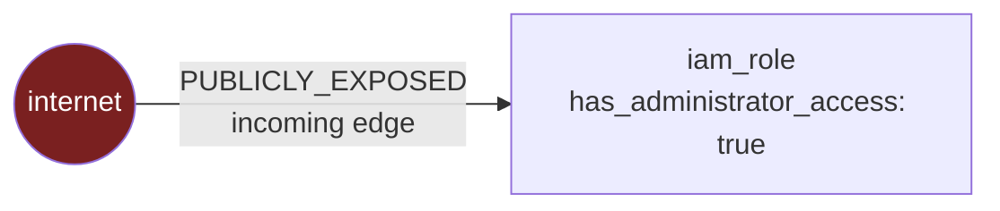
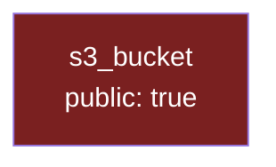
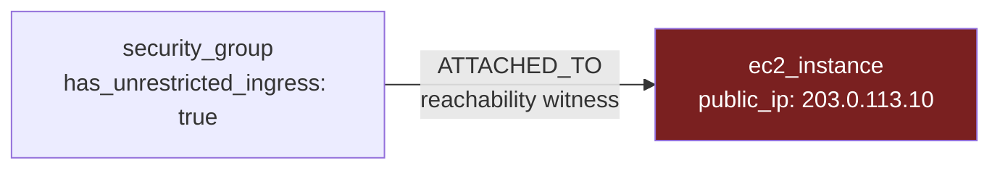
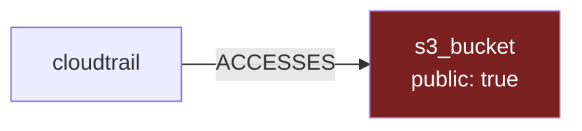
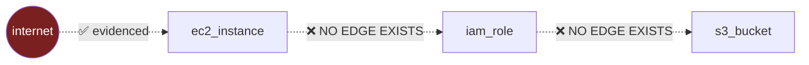

# Phase 8.1 — The Four Scenarios in Detail

Each follows the same shape:

```
Scenario → Required nodes → Required edges → Query → Path → Score → Severity
```

---

## Scenario 1 — `public_identity_with_privilege`

**The best-evidenced scenario in the current graph.**



| | |
|---|---|
| **Required nodes** | An `internet` external node; a node with `ResourceRole.IDENTITY` |
| **Required edges** | `identity --PUBLICLY_EXPOSED--> internet` (real, emitted) |
| **Query** | `internet_node_ids()` then `edges_of(direction="incoming")` |
| **Attributes used** | `is_publicly_assumable`, `has_administrator_access`, `has_privilege_escalation_path`, `has_pass_role_escalation`, `has_wildcard_action` |
| **Producer** | `IamRoleCollector` + `policy_analysis.py` |

**Why it works:** this is the one place a collector emits a genuine
internet edge. `IamRoleCollector` parses the trust policy, detects an
**unconditional** wildcard principal, and emits
`PUBLICLY_EXPOSED → internet`. The same collector's semantic policy
analysis reports whether the role carries administrator access.

**Note the direction.** The graph edge points role → internet ("this role
is exposed to the internet"). The *attack* goes internet → role. So the
path's nodes are `(internet, identity)` while the edge is stored as
emitted. `AttackPath` only requires that edge endpoints appear in
`nodes` — node order is the narrative, not the edge direction.

**Real scored output:**

```
80.0  critical  medium  public_identity_with_privilege
      internet -> role/admin
        internet_reachable_via_graph_edge:            +40.0
        privileged_identity(has_administrator_access): +30.0
        sensitive_target(identity):                    +20.0
        confidence_penalty(medium):                    -10.0
```

**Guard:** `if edge.blocked or not graph.has_node(edge.source_id)` and
`role_of(identity) is ResourceRole.IDENTITY` — a non-identity with an
internet edge is not this scenario.

---

## Scenario 2 — `internet_to_sensitive_data`



| | |
|---|---|
| **Required nodes** | One **data-bearing** node (STORAGE / SECRETS / AUDIT_LOG) |
| **Required edges** | **None** |
| **Query** | None — iterates `graph.nodes` |
| **Attributes used** | `public`, `bucket_policy_allows_public_access`, `allows_public_network_access`, `public_network_access_enabled` |

**Why there are no edges.** `normalizers/s3.py` sets `relationships=()`.
No collector emits a storage→internet edge, so there is nothing to
traverse. Exposure is read from the resource's **own attributes**.

This is why the path has **one node and zero edges** — a legitimate
`AttackPath` (the aggregate requires ≥1 node; edges are optional).

**Why data-bearing, not merely sensitive.** This is the scenario that
produced the false positive: `IDENTITY` is sensitive but does not *store*
data, so a publicly assumable role was reported here claiming it "holds
sensitive data". Now gated on `is_data_bearing()`.

```
55.0  high  high  internet_to_sensitive_data
      bucket-public
        publicly_exposed_by_attribute(public): +35.0
        sensitive_target(storage):             +20.0
```

Note **+35 not +40**: attribute evidence is one collector's reading, an
edge is a modelled relationship.

**Critical guard:** `public_exposure_evidence()` uses `_definitely_true()`,
which returns `True` **only** for a literal boolean `True`. `UNKNOWN`
returns `False`. A denied `GetBucketAcl` can never manufacture a critical
path. Tested: `test_unknown_exposure_never_becomes_a_path`.

---

## Scenario 3 — `internet_to_exposed_workload`



| | |
|---|---|
| **Required nodes** | A `WORKLOAD` and a `NETWORK_CONTROL` |
| **Required edges** | `workload --ATTACHED_TO--> control` |
| **Query** | `edges_of(relationship_type=ATTACHED_TO)` |
| **Attributes used** | `public_ip` on the workload; `has_unrestricted_ingress` / `unrestricted_ingress_ports` on the control |

**Both halves are required, and that is the whole point.**

- A public IP behind a **closed** security group is not reachable.
- An open security group protecting **nothing public** is not an entry
  point.

Reporting either alone is the classic CSPM false positive. Two negative
tests enforce it:
`test_public_ip_without_open_ingress_is_not_a_path` and
`test_open_ingress_without_a_public_address_is_not_a_path`.

**`ATTACHED_TO` as a witness, not a step.** The edge appears in the path
because it names *which* group is at fault — actionable information. It
is **not** a traversal step, and `is_traversable(ATTACHED_TO)` remains
`False` everywhere else.

**A subtle guard** in the code:

```python
public_address = attrs.get("public_ip")
if not public_address or public_address is True:
    continue
```

`public_ip is True` is rejected because a *boolean* in a field expected to
hold an address string is a collector bug, not evidence of an address.

```
50.0  high  high  internet_to_exposed_workload
      sg-open -> i-web
        publicly_exposed_by_attribute(public_ip,has_unrestricted_ingress): +35.0
        network_control_allows_unrestricted_ingress:                       +15.0
```

⚠️ **Honest limitation.** A public IP plus an open SG is *strong evidence*
of reachability, not proof. Real reachability also depends on route
tables, NACLs and the internet gateway — none of which have collectors.
This is the strongest claim the available evidence supports.

---

## Scenario 4 — `sensitive_data_flow_to_exposed_store`

**The genuinely composite one, and the only user of `find_paths`.**



| | |
|---|---|
| **Required nodes** | A source node; a data-bearing node with exposure attributes |
| **Required edges** | A chain of **traversable** edges into the store |
| **Query** | **`find_paths(..., max_depth=4)`** |

**Why this one matters:** *"CloudTrail delivers audit logs to a publicly
readable bucket"* is not a fact about either resource. Neither the trail
rule nor the bucket rule states it. It is a property of the **path**.

Concretely: an attacker reading that bucket learns your detection
coverage — which API calls you log, which regions, which accounts — before
they act. That is a materially different risk from a merely public bucket.

**The post-filter that matters:**

```python
for path in find_paths(graph, source=..., target=..., max_depth=MAX_DEPTH):
    if not all(is_traversable(edge) for edge in path):
        continue
```

`find_paths` walks **all** edges — it has no relationship filter. Without
this post-filter, a path could route through an `ATTACHED_TO` edge and
configuration would silently become movement.

```
60.0  high  high  sensitive_data_flow_to_exposed_store
      trail-1 -> bucket-public
        publicly_exposed_by_attribute(public):  +35.0
        sensitive_target(storage):              +20.0
        traverses_accesses_relationship:         +5.0
```

Works identically for
`azure_activity_log_setting --ACCESSES--> azure_storage_account`.

---

## What is NOT implemented, and why

### ❌ internet → workload → identity → data

**The textbook cloud attack chain. Not built.**



Two missing edges:

**workload → identity.** `normalizers/ec2.py` captures
`instance_profile_arn` as an **attribute**. No edge is emitted. Worse, an
instance profile ARN is *not* a role ARN — the profile *contains* a role,
and resolving which requires `iam:GetInstanceProfile`, a call no collector
makes. Names often match by convention; **a convention is not a fact**.

**identity → data.** No collector emits an edge from an identity to the
data its policies let it reach. Extracting that would mean parsing every
policy's resource ARNs and matching them to collected resources.

Enforced by `test_no_workload_to_identity_path_is_invented`, which builds
an estate containing **all four** resources and asserts no path connects
the workload to the role.

### ❌ Overprivileged identity → sensitive resource

Scenario C's second half. Same missing identity→data edge. What *does*
ship is the publicly-assumable-identity case (scenario 1).

---

## The reverse guard

The suite also guards against the **opposite** failure — a scenario nobody
can reach:

```python
@pytest.mark.parametrize("scenario", [ ...all four... ])
def test_every_shipped_scenario_is_reachable_with_real_collector_output(self, scenario):
```

Each estate uses **only** attributes and relationship types the audited
collectors genuinely produce. A scenario that could never fire would be
dead code presented as capability — the mirror of a fabricated path.
