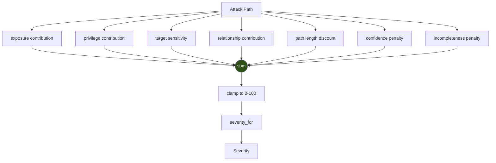

# Phase 8.2 — Scoring and Severity

`domain/attack_paths/scoring.py` · model version **`apsm-1.0`**

---

## The honesty statement — read this first

> **This is an explainable product risk score, not a mathematically
> authoritative one.**

The weights are a documented **product judgement**. They are not derived
from incident data, not calibrated against any published model, and
nothing here should be presented to a customer as objective truth.

What they *are*: deterministic, inspectable, and changeable in one place.

That honesty is the **design constraint**, not a disclaimer bolted on
afterwards. A CSPM that hands out a confident 87.4 it cannot explain
teaches its users to ignore the number — and once they ignore the score,
they ignore the ranking, and the product's core value proposition is
gone.

---

## The shape



```
risk = exposure + privilege + sensitivity + relationship
       − length discount − confidence penalty − incompleteness penalty
```

Additive and clamped to `[0, 100]`. Deliberately **not** machine
learning, and deliberately **not** a single opaque formula.

---

## Every weight

### Exposure — "can someone outside reach it at all?"

| Constant | Points |
|---|---|
| `EXPOSURE_DIRECT_INTERNET_EDGE` | **+40** |
| `EXPOSURE_ATTRIBUTE_EVIDENCE` | **+35** |
| `EXPOSURE_UNRESTRICTED_INGRESS` | **+15** |

The largest single contribution, because internet reachability is what
separates a misconfiguration from an incident.

**Edge and attribute evidence are alternatives, not cumulative** — an
`elif` in the code. They are two ways of learning the *same fact*; adding
both would double-count. The edge scores higher because it is a modelled
relationship, while an attribute is one collector's reading.

### Privilege — "how much can they do once there?"

| Constant | Points |
|---|---|
| `PRIVILEGE_ADMINISTRATOR` | +30 |
| `PRIVILEGE_ESCALATION_PATH` | +20 |
| `PRIVILEGE_WILDCARD_ACTION` | +10 |
| **`PRIVILEGE_CAP`** | **30** |

**Capped**, because two routes to total control is still total control.
Admin + escalation + wildcard sums to 60 and caps at 30 — otherwise a role
with several overlapping over-permissions would outrank genuinely distinct
risks for no added real danger.

### Target sensitivity — "is what they reach worth anything?"

| Role | Points |
|---|---|
| `SENSITIVITY_SECRETS` | +25 |
| `SENSITIVITY_STORAGE` | +20 |
| `SENSITIVITY_IDENTITY` | +20 |
| `SENSITIVITY_AUDIT_LOG` | +15 |

Secrets rank highest: key compromise is worse than data loss, because it
compromises everything the key protects, including data not yet created.

### Relationship — "is the relationship itself dangerous?"

| Constant | Points |
|---|---|
| `RELATIONSHIP_ASSUMES` | +10 |
| `RELATIONSHIP_ACCESSES` | +5 |

`ASSUMES` means **taking on an identity**, qualitatively worse than
reading through one. An `elif` — they do not stack.

### Length discount

| Constant | Value |
|---|---|
| `LENGTH_DISCOUNT_PER_HOP` | −5 |
| `LENGTH_DISCOUNT_MAX` | −15 |

Longer chains need more to go right for the attacker. Floored so a long
path never becomes free.

### Penalties

| Confidence | Penalty |
|---|---|
| `high` | 0 |
| `medium` | −10 |
| `low` | −25 |
| `unknown` | −40 |

| | |
|---|---|
| `INCOMPLETENESS_PENALTY` | **−20** |

The incompleteness penalty is the **numeric expression of the UNKNOWN
discipline**: a path resting on undetermined evidence scores materially
lower than one resting on observed evidence.

Penalties rather than multipliers, so the breakdown stays additive and
readable.

### The blocked short-circuit

```python
if blocked:
    return ScoreBreakdown(value=0.0, severity=Severity.LOW,
                          factors={"blocked_edge_on_path": 0.0})
```

**Not a scoring choice.** It is the `AttackPath` aggregate's own
invariant (*a blocked path must have `risk_score == 0`*), enforced here so
the two can never disagree.

---

## Severity mapping

```python
SEVERITY_THRESHOLDS = (
    (70.0, Severity.CRITICAL),
    (40.0, Severity.HIGH),
    (20.0, Severity.MEDIUM),
    (0.0,  Severity.LOW),
)
```

| Score | Severity |
|---|---|
| 70–100 | `CRITICAL` |
| 40–69 | `HIGH` |
| 20–39 | `MEDIUM` |
| 0–19 | `LOW` |

Uses the project's **existing four-value** `Severity` — no fifth value, no
parallel enum. No prior attack-path threshold existed anywhere in the
repository, so there was **no contract to preserve**; these are new and
documented as such.

Every boundary is tested (`test_severity_thresholds`): 19.9→LOW, 20→MEDIUM,
39.9→MEDIUM, 40→HIGH, 69.9→HIGH, 70→CRITICAL.

---

## Real output — the whole estate

Produced by running the analyzer, not composed by hand:

```
 80.0  critical  medium  public_identity_with_privilege
       internet -> role/admin
       this identity's trust policy admits a principal outside the account,
       so it can be assumed from the internet
         internet_reachable_via_graph_edge:             +40.0
         privileged_identity(has_administrator_access):  +30.0
         sensitive_target(identity):                     +20.0
         confidence_penalty(medium):                     -10.0

 60.0  high      high    sensitive_data_flow_to_exposed_store
       trail-1 -> bucket-public
         publicly_exposed_by_attribute(public):  +35.0
         sensitive_target(storage):              +20.0
         traverses_accesses_relationship:         +5.0

 55.0  high      high    internet_to_sensitive_data
       bucket-public
         publicly_exposed_by_attribute(public):  +35.0
         sensitive_target(storage):              +20.0

 50.0  high      high    internet_to_exposed_workload
       sg-open -> i-web
         publicly_exposed_by_attribute(public_ip,has_unrestricted_ingress): +35.0
         network_control_allows_unrestricted_ingress:                       +15.0
```

Worth noticing:

- The publicly assumable admin role ranks first **despite** a −10
  confidence penalty — correct, it is the worst problem here.
- The composite CloudTrail path (60.0) outranks the bare public bucket
  (55.0) by exactly the `traverses_accesses_relationship` +5. The
  composition *is* the extra risk.
- Nothing scores 100. The model does not need headroom it cannot justify.

---

## `ScoreBreakdown.explain()`

```python
def explain(self) -> tuple[str, ...]:
    return tuple(
        f"{name}: {contribution:+.1f}"
        for name, contribution in sorted(
            self.factors.items(), key=lambda kv: (-abs(kv[1]), kv[0])
        )
    )
```

Sorted by **absolute magnitude**, largest first — so the biggest driver of
a score is the first line a human reads, whether it is a contribution or a
penalty.

This is what lets you defend a number line by line when a customer asks
*"why is this 80?"*

---

## Two model versions, deliberately separate

| Version | Owns |
|---|---|
| `ALGORITHM_VERSION = "apa-1.0"` | How paths are **discovered** |
| `SCORING_MODEL_VERSION = "apsm-1.0"` | How paths are **scored** |

A path can be rediscovered the same way and scored differently, or vice
versa. Conflating the two versions would make historical comparison
meaningless — you could not tell whether last month's different score came
from new discovery logic or new weights.

Same reasoning as `RiskScore.model_version = "crsf-1.1"`.
