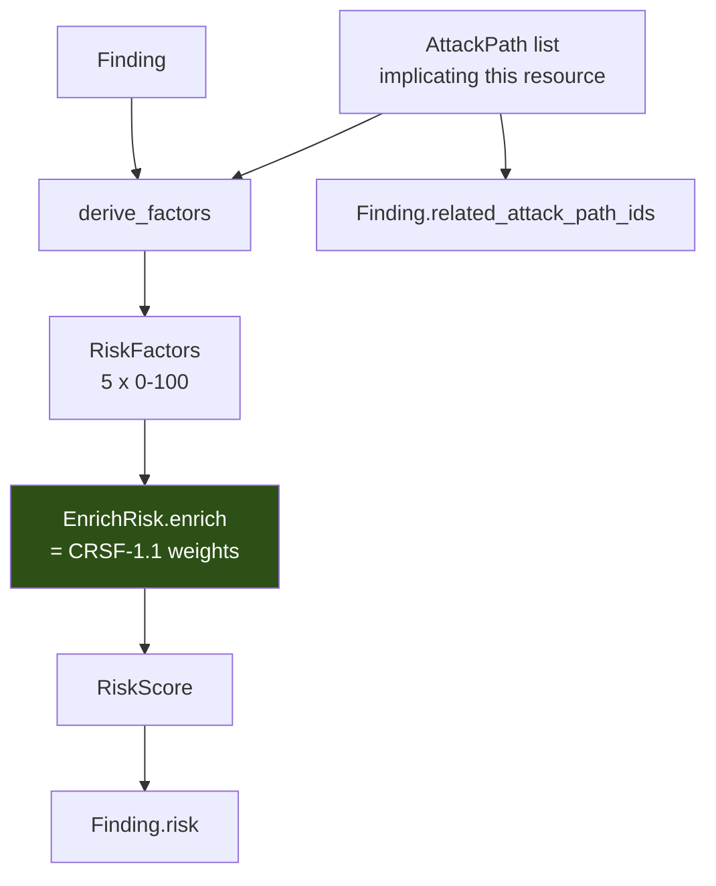

# Phase 8.3 — Risk Enrichment

How an attack path's risk reaches a Finding.

---

## Why `EnrichRisk` was never called

Not an oversight — a **structural blocker**.

`RiskScore.calculate` needs five 0–100 factors. The blueprint specifies
the **weights** (CRSF-1.1, §13) and never specifies how a raw signal
becomes a factor:

```
severity 40% + exposure 25% + environment 10%
+ confidence 10% + attack_path_involvement 15%
```

Phases 1 and 2 refused to invent that mapping and left `EnrichRisk`
uncalled. Defensible — and underneath it was a hard blocker:

> **`attack_path_involvement` was underivable by construction, because the
> analyzer that would supply it returned `()`.**

Implementing the analyzer removed the blocker for that factor.
`application/risk/factors.py` supplies the rest.

---

## The flow



`EnrichFindingsWithRisk` **reuses** `EnrichRisk` rather than
reimplementing the formula. That component was correct all along; it
simply had no caller.

---

## The five factors

`application/risk/factors.py`, model version **`rfd-1.0`** — versioned
*separately* from `crsf-1.1`, because the weights are the blueprint's and
these derivations are ours. Conflating them would make it impossible to
tell which one changed a historical score.

### 1. Severity

```python
CRITICAL: 100.0 · HIGH: 75.0 · MEDIUM: 45.0 · LOW: 20.0
```

Spread across the range rather than clustered, so the 40% severity weight
stays meaningful.

### 2. Exposure

```python
if not paths: return 0.0
return max(path.risk_score for path in paths)
```

Derived from the **paths' own scores** rather than re-deriving exposure
from the graph. The analyzer already did that work, with evidence, and a
second independent derivation could disagree with the first.

### 3. Environment — the assumption made visible

```python
UNKNOWN_ENVIRONMENT_FACTOR = 50.0
ENVIRONMENT_FACTOR = {
    "production": 100.0, "prod": 100.0,
    "staging": 60.0,
    "development": 30.0, "dev": 30.0,
    "sandbox": 15.0, "test": 15.0,
}
```

**`Finding.environment` is optional and no collector populates it** — no
mapping from cloud tags to an environment taxonomy exists.

A factor cannot be omitted, so unknown resolves to a deliberately
mid-scale 50 — and `derive_factors` returns `(factors, was_defaulted)`.
The flag is not decoration:

> Scoring every finding as production inflates the whole estate; scoring
> them as sandbox hides real risk. **Neither is honest, so the assumption
> is made visible instead of hidden.**

Every enriched finding records `risk_environment_defaulted: true`, so a
reader can tell an assumed score from a measured one.

### 4. Confidence

```python
high: 100.0 · medium: 65.0 · low: 35.0 · unknown: 20.0
```

**Note the direction.** High confidence → *high* factor, because CRSF-1.1
**adds** the confidence factor rather than discounting by it. A finding we
are sure about is riskier than one we are guessing at.

With paths: the **weakest** path confidence. Without: the finding's own
evidence quality — a finding carrying `indeterminate_resources` was built
on data we could not fully read, so it scores `low`.

### 5. Attack path involvement — the one that needed the analyzer

```python
worst = max(path.risk_score for path in paths)
multiplicity_bonus = min(len(paths) - 1, 3) * 10.0
return min(100.0, worst + multiplicity_bonus)
```

Scales with **how many** paths implicate the resource — three paths is
genuinely worse than one — and **saturates** at three extra, because past
a handful "this is badly exposed" is already fully expressed.

No paths → `0.0`.

---

## Joining findings to paths

```python
for path in attack_paths:
    for node in path.nodes:
        if node.is_external:
            continue
        paths_by_resource.setdefault(node.resource_id, []).append(path)
```

**Every resource *along* a path is implicated**, not just the target. An
instance mid-chain is genuinely part of the attack, and a responder who
only sees the endpoint cannot break the chain anywhere else.

**External nodes are excluded** — the internet is on every such path by
construction, and nobody can remediate it.

---

## Zero schema change

Writes to two fields that **already existed**:

| Field | Declared | Column | Ever populated before? |
|---|---|---|---|
| `Finding.risk` | Phase 1 | ✅ `0001` | ❌ Never |
| `Finding.related_attack_path_ids` | Phase 1 | ✅ `0001` | ❌ Never |

So attack-path risk reaches the database with **no migration**. The
storage was built for exactly this and left empty.

**Paths are referenced by id, never embedded.** A `Finding` carrying full
`AttackPath` copies would duplicate the graph's nodes and edges into every
row that touches them.

---

## Backward compatibility

A finding on **no** attack path still receives a risk score — from
severity, environment and confidence, with a zero attack-path
contribution.

That is the honest reading of CRSF-1.1: attack-path involvement is **one
of five factors**, not a precondition for having risk at all.

```python
def test_a_finding_without_a_path_still_gets_a_risk_score(self):
    assert enriched.risk is not None and enriched.risk > 0
    assert enriched.related_attack_path_ids == ()
    assert enriched.evidence.data["attack_path_count"] == 0
```

---

## Provenance in the evidence

Enrichment annotates `Evidence.data` — not a new field, because
`Evidence.data` is already where a finding keeps the facts behind it, and
a parallel structure would split one answer across two places:

```python
"risk_model_version":         "crsf-1.1"
"risk_factor_model_version":  "rfd-1.0"
"attack_path_count":          2
"risk_environment_defaulted": True
```

---

## The result, end to end

```python
def test_exposure_context_raises_risk_above_an_identical_isolated_finding(self, estate):
    public  = ...  # bucket-public
    private = ...  # bucket-private

    assert public.severity is private.severity   # SAME rule, SAME severity
    assert public.risk > private.risk            # different CONTEXT
```

Same rule, same severity, same control ID. The only difference is that one
sits on an attack path.

**That is contextual risk, and it is the entire point of Phases 7–8.**

---

## Ordering is load bearing

```
evaluate rules → findings
      ↓
analyze attack paths          ← MUST be before risk
      ↓
enrich risk                   ← reads the paths above
```

If risk ran first, `attack_path_involvement_factor` would be `0.0` for
every finding — 15% of the CRSF weight lost, and a finding on a critical
path would score **identically** to an isolated one.

The blueprint's prose lists "calculate risk" before "discover attack
paths"; its own architectural note overrides that (*"Attack Path avant
Risk final"*), and the pipeline follows the note.

---

## Limitations

1. `environment` is never populated → **every** finding is scored with a
   defaulted environment factor.
2. `ConfidenceScore` (0–100) is defined but not populated on findings; the
   confidence factor derives from path confidence instead.
3. Attack paths are **not persisted** — the finding's `risk` and
   `related_attack_path_ids` survive, the path **detail** does not.
4. No API surface exposes attack paths.
5. `exposure_factor` reuses path risk scores, so it inherits `apsm-1.0`'s
   product-judgement weights — the two models are coupled in practice
   even though they are versioned separately.
