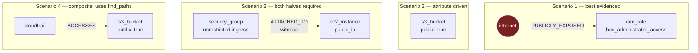
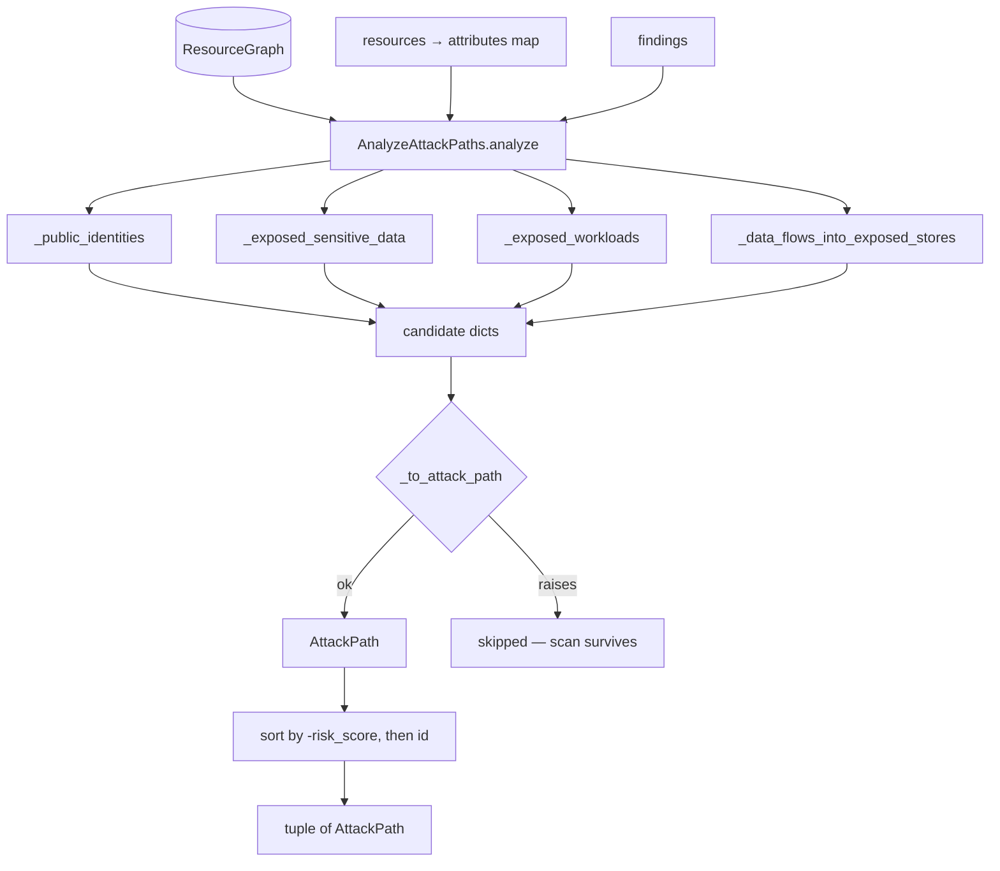

# Phase 8 — Attack Paths ★

**Level 3–5.** Estimated 3.5 hours. **The most important phase.**

Deep dives:
[01-scenarios.md](01-scenarios.md) ·
[02-scoring-and-severity.md](02-scoring-and-severity.md) ·
[03-risk-enrichment.md](03-risk-enrichment.md)

---

## 8.1 The core distinction

> A **Finding** answers: *"What configuration is wrong?"*
>
> An **Attack Path** answers: *"How could an attacker move through this
> environment, because of the combination of exposures and
> relationships?"*

A public bucket holding nothing is a housekeeping item. A public bucket
that CloudTrail delivers audit logs into is an attacker reading your
detection coverage before they act.

**Same bucket. Same rule. Same severity. Completely different urgency.**

That gap is what this phase closes.

---

## 8.2 Files

```
domain/attack_paths/models.py          AttackPath, AttackTechnique
domain/attack_paths/classification.py  ★ ResourceRole, traversability
domain/attack_paths/scoring.py         ★ the weights, severity mapping
application/attack_paths/analyze_attack_paths.py   ★ AnalyzeAttackPaths
application/risk/factors.py            CRSF factor derivation
application/risk/enrich_findings.py    EnrichFindingsWithRisk
```

---

## 8.3 What changed, and what did not

`AnalyzeAttackPaths.analyze()` was a **documented placeholder returning
`()`**. It is now implemented **in place** — there is no second analyzer.

The audit's most useful finding **inverted the expected problem**:

> `ScanCloudAccount` already called `analyze()` at line 100 and already
> routed its result into `ScanResult.attack_paths`. **The pipeline was
> never the gap.** The analyzer itself was the placeholder.

So implementing it lit up the whole chain with no pipeline surgery. Only
one additive parameter changed: `resources`, because graph nodes carry no
attributes.

---

## 8.4 The governing constraint

> **Only what the graph evidences.**

Four scenarios ship, each grounded in edges and attributes collectors
genuinely produce. Deliberately absent is the textbook chain
*internet → workload → IAM role → data*: **no collector emits a
workload-to-identity edge**, so building it would mean inventing the
relationship.

> **A fabricated attack path is worse than a missing one.** It sends a
> security team to investigate something that does not exist, and it does
> so with a confident severity attached.

A test asserts that path is **not** produced even when all four resources
are present:
`test_no_workload_to_identity_path_is_invented`.

---

## 8.5 The four scenarios

Full detail in [01-scenarios.md](01-scenarios.md).

| Scenario | Chain | Evidence source |
|---|---|---|
| `public_identity_with_privilege` | `internet → identity` | Real `PUBLICLY_EXPOSED` edge + IAM privilege attributes |
| `internet_to_sensitive_data` | `store` | The store's **own** public-access attributes |
| `internet_to_exposed_workload` | `network control → workload` | Public address **and** unrestricted ingress |
| `sensitive_data_flow_to_exposed_store` | `source → … → store` | Traversable edges into a publicly readable store |



---

## 8.6 The decision the design turns on

> **Connectivity is not reachability.**

| Relationship | Traversable | Why |
|---|---|---|
| `ASSUMES` | ✅ | Taking on an identity *is* movement |
| `ACCESSES` | ✅ | Reading through a principal is movement |
| `PUBLICLY_EXPOSED` | ✅ | The entry point |
| `CONNECTS_TO` | ✅ | Network reachability |
| `ATTACHED_TO` | ❌ | **Configuration.** An attacker does not travel *into* a security group |
| `ALLOWS` | ❌ | A policy statement, not a step |
| `CONTAINS` | ❌ | Topology |
| `PROTECTS` | ❌ | A control, not a route |

Treating every edge as a step is **exactly how a graph becomes a
false-positive generator**.

The informational set is written out explicitly rather than defined as
"everything else", so adding a relationship type **forces a decision**
instead of silently defaulting to traversable.

`ATTACHED_TO` does appear in scenario 3 — as a **reachability witness**,
naming *which* group is at fault. It is evidence, not a traversal step,
and remains non-traversable everywhere else.

---

## 8.7 Resource roles — normalized, not provider-branched

```python
class ResourceRole(Enum):
    EXTERNAL · IDENTITY · WORKLOAD · STORAGE
    SECRETS · NETWORK_CONTROL · AUDIT_LOG · OTHER
```

| Role | AWS | Azure |
|---|---|---|
| `WORKLOAD` | `ec2_instance` | `azure_virtual_machine` |
| `STORAGE` | `s3_bucket` | `azure_storage_account` |
| `SECRETS` | `kms_key` | `azure_key_vault` |
| `IDENTITY` | `iam_role`, `iam_user` | — |
| `NETWORK_CONTROL` | `security_group` | `azure_network_security_group` |
| `AUDIT_LOG` | `cloudtrail` | `azure_activity_log_setting` |
| `EXTERNAL` | `internet`, `aws_account`, `aws_service` | `azure_tenant` |

**No `if aws: ... elif azure:` anywhere.** Adding a provider means adding
table rows. Verified by
`test_azure_produces_paths_through_the_same_code`.

Unknown types → `OTHER`, never guessed. `OTHER` is never a target and
never an entry point.

### Two overlapping subsets — and the false positive that forced them

- **Sensitive** = STORAGE, SECRETS, IDENTITY, AUDIT_LOG (worth reaching)
- **Data-bearing** = STORAGE, SECRETS, AUDIT_LOG (actually *stores*
  something)

An IAM role is a valuable target but holds no data. Collapsing the two
produced a real false positive, **found by running the code, not by
review**:

```
85.0 critical  internet_to_sensitive_data      "holds sensitive data..."   ← WRONG
80.0 critical  public_identity_with_privilege  "trust policy admits..."    ← right
```

The bogus entry scored **higher** and ranked **above** the correct one.

> **A true risk stated in a false sentence is still a false positive.**
> The role genuinely was critical — but a responder reading "holds
> sensitive data" goes hunting for data that is not there, and stops
> trusting the next finding.

Regression-tested: `test_an_identity_is_not_described_as_holding_data`.

---

## 8.8 The discovery flow



Each scenario builder yields plain dicts; `_to_attack_path` owns scoring
and construction in **exactly one place**.

**Per-candidate isolation** — one malformed candidate is dropped, the
other paths and the rest of the scan survive. The aggregate's own
invariants are the authority on what is constructible.

---

## 8.9 Evidence — every path explains itself

```python
evidence = {
    "chain": "internet -> role/admin",
    "entry_point": "internet",
    "target": "role/admin",
    "target_role": "identity",
    "why_risky": "this identity's trust policy admits a principal outside the account...",
    "exposure_evidence": ["is_publicly_assumable"],
    "privilege_evidence": ["has_administrator_access"],
    "relationships": ["publicly_exposed"],
    "confidence": "medium",
    "evidence_incomplete": False,
    "scoring_model": "apsm-1.0",
    "score_factors": ["internet_reachable_via_graph_edge: +40.0", ...],
}
```

Real output from the pipeline (see
[02-scoring-and-severity.md](02-scoring-and-severity.md) for the full
run).

---

## 8.10 Confidence — reused, not reinvented

Uses the **graph** vocabulary: `high` / `medium` / `low` / `unknown`.

Three confidence concepts already existed in this codebase (graph strings,
the `Confidence` rule enum, `ConfidenceScore` 0–100). **A fourth would
have been the mistake.**

Path confidence is the **weakest link** across every node and edge.
Averaging would let two confident edges launder one guess.

A consequence worth internalising: `internet` is an external node with
`medium` confidence, so **every internet-origin path is capped at
`medium`** and takes a −10 penalty. That is correct, not a defect — we
never enumerated the internet.

---

## 8.11 Status of every capability

This table is the one to memorise.

| Capability | Status |
|---|---|
| 4 scenarios discovered and scored | ✅ **IMPLEMENTED** |
| Deterministic ordering and ids | ✅ **IMPLEMENTED** |
| Severity mapping | ✅ **IMPLEMENTED** |
| Risk enrichment into findings | ✅ **IMPLEMENTED** |
| Pipeline integration | ✅ **IMPLEMENTED** |
| `blocked` edge handling | ⚙️ **SUPPORTED BY GRAPH** — no collector sets it |
| `find_paths` multi-hop | ⚙️ **SUPPORTED** — only scenario 4 uses it |
| internet → workload → identity → data | ❌ **NOT CURRENTLY EVIDENCED** — no workload→identity edge |
| Overprivileged identity → sensitive resource | ❌ **NOT EVIDENCED** — no identity→data edge |
| Attack path persistence | ❌ **FUTURE WORK** — no table; `PersistScanResult` drops them |
| API surface | ❌ **FUTURE WORK** |
| MITRE technique mapping | ❌ **FUTURE WORK** — `AttackTechnique` always empty |

---

## 8.12 Data in / out / callers

| | |
|---|---|
| **In** | `tenant_id`, `ResourceGraph`, `findings`, `resources` (optional) |
| **Out** | `tuple[AttackPath, ...]`, sorted by `(-risk_score, id)` |
| **Called by** | `ScanCloudAccount.run()` |
| **Feeds** | `EnrichFindingsWithRisk` → `Finding.risk`, `related_attack_path_ids` |

`resources` is optional so every existing caller keeps working. Without it
the two attribute-driven scenarios find nothing — **a smaller result,
never a wrong one**.

## 8.13 Failure modes

| Failure | Behaviour |
|---|---|
| Empty graph | `()` |
| Malformed candidate | Skipped; scan survives |
| Cycle | `find_paths` visits each node once |
| Missing node mid-path | Candidate skipped (`_nodes_along` returns `None`) |
| `resources` not supplied | Fewer paths, never wrong ones |
| Blocked edge | Excluded; score 0 if present |
| `UNKNOWN` attribute | Never read as `True` |

## 8.14 Tests

| File | Tests | Guards |
|---|---|---|
| `tests/unit/application/test_attack_path_analysis.py` | 40 | Scenarios, negatives, safety, determinism |
| `tests/unit/application/test_attack_path_pipeline_integration.py` | 12 | The real pipeline |
| `tests/unit/domain/test_attack_paths.py` | 14 | Aggregate invariants |
| `tests/unit/application/test_analyze_attack_paths.py` | 3 | Pre-existing; pass unchanged |

**19 of the 40 analysis tests assert what is _not_ reported.**

---

## What I should know now

1. Distinguish a Finding from an Attack Path in one sentence.
2. Name the four scenarios and their evidence sources.
3. Explain "connectivity is not reachability" with `ATTACHED_TO`.
4. Explain why the workload→identity chain is not implemented.
5. Explain the identity/data-bearing false positive and its lesson.
6. Explain weakest-link confidence and why internet paths cap at `medium`.
7. Recite the scoring factors and severity thresholds (§02).
8. Explain how risk reaches a finding with no schema change (§03).
9. State what is implemented vs supported vs not evidenced vs future.

---

## Self-test

1. Why is a fabricated attack path worse than a missing one? Give a
   concrete operational consequence.
2. `ATTACHED_TO` is non-traversable — yet scenario 3 uses it. Contradiction?
3. All four resources of the textbook chain are present. Why does the
   analyzer report no path, and which test enforces that?
4. A publicly assumable admin role scored 80.0 `critical` at `medium`
   confidence. Where did the −10 come from and why is it right?
5. The identity/data-bearing bug: what was wrong, and why is "the risk was
   real" not a defence?
6. Two ways to learn a resource is internet-facing. Why are they scored
   differently, and why not additive?
7. `analyze()` is called without `resources`. Which scenarios still work?
   Why is failing quietly acceptable here?
8. Why is privilege capped at 30 when admin + escalation + wildcard sum to
   60?
9. Design an extension: you get `iam:GetInstanceProfile`. What edge, what
   scenario, what must you *not* infer?

Answers: [answers.md](answers.md)
