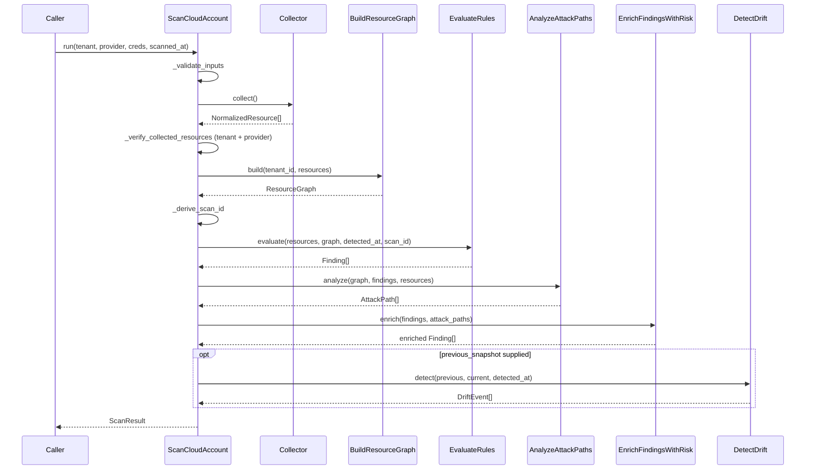

# Phase 9 — The Scan Pipeline

**Level 3.** Estimated 1.5 hours.

---

## A. What problem does this solve?

Orchestrating every previous phase into one deterministic, tenant-scoped
run — **without becoming a second domain**.

`ScanCloudAccount` calls domain code; it never reimplements a domain
invariant. Tenant isolation, graph integrity, three-valued logic and
bounded scores are all decided by the code it calls.

---

## B. The entry point

**`application/scanning/scan_cloud_account.py` → `ScanCloudAccount.run()`**

This is the *real* pipeline, reached from three places:

```
SubmitScan (API → job runner) ─┐
scripts/dev_scan_aws.py         ├─▶ ScanCloudAccount.run()
tests/integration/{aws,azure}/ ─┘
```

---

## C. The stages



---

## D. Stage by stage

### 1. Validate

`credentials_reference` must be a non-blank string; `scanned_at` must be
**timezone-aware**. A naive datetime is rejected — a scan timestamped in
an ambiguous zone cannot be ordered against another.

### 2. Collect

```python
try:
    return self._collector.collect()
except Exception as exc:
    raise ResourceCollectionError(f"resource collection failed: {exc}") from exc
```

Depends on the **port** (`BaseCollector`), not on `AwsCollector`. That is
why the same pipeline serves both clouds and why tests substitute a static
collector.

### 3. Verify

Two checks, both fail-fast:

- `ensure_same_tenant` on every resource — a foreign-tenant resource is a
  **security** failure, not a data quality one.
- Provider match — a collector returning an Azure resource during an AWS
  scan means something is badly wrong.

### 4. Build the graph

### 5. Derive the scan id

```python
f"{tenant_id}:{provider.value}:{account}:{scanned_at.isoformat()}"
```

**The account component is what makes this unique.** Without it, two scans
of two different accounts in the same tenant at the same instant produced
a byte-identical `scan_id` — making it unusable as a persistence key.

The account is read from the collected resources (so no caller signature
changed): one account → that account; several → `"mixed"`; none →
`"unknown-account"`.

### 6. Evaluate rules

```python
findings = self._evaluate_rules.evaluate(..., graph=graph)
```

> **`graph` MUST be threaded through.** A `relationship` condition
> evaluated without a graph **raises**. Omitting it made every scan whose
> catalog contains a cross-resource rule fail — which is every real scan
> since 7 of them shipped.

That is a real defect, fixed and regression-tested in
`tests/unit/application/test_scan_pipeline_regressions.py`.

### 7. Analyze attack paths

```python
attack_paths = self._analyze_attack_paths.analyze(
    tenant_id=tenant_id, graph=graph, findings=findings, resources=resources
)
```

> **`resources` MUST be threaded through.** Graph nodes carry no
> attributes, so without it the two attribute-driven scenarios silently
> find nothing — a *smaller* result rather than an error, which is the
> harder defect to notice.

Pinned by `test_resources_reach_the_analyzer`.

### 8. Enrich risk

**After** attack paths, by design — CRSF-1.1 takes attack-path
involvement as one of its five factors.

### 9. Detect drift (optional)

Only when a `previous_snapshot` is supplied.

### 10. Return `ScanResult`

```python
ScanResult(scan_id, tenant_id, provider, scanned_at,
           resources, graph, findings, attack_paths, drift_events)
```

---

## E. The two seam defects — a pattern

| Defect | Symptom | Why tests missed it |
|---|---|---|
| Graph built, never passed to `EvaluateRules` | Every cross-resource rule silently `NOT_MATCHED` | Tests used a fake catalog with no cross-resource rules |
| Collector edges to non-nodes | **Every** scan with an IAM role crashed | 21 collector tests asserted on `relationships`, none built a graph |

**Both components were correct. Their seam was not.** This is the single
most valuable lesson in the repository — see Phase 11.

---

## F. Data in / out

| | |
|---|---|
| **In** | `tenant_id`, `provider`, `credentials_reference`, `ScanConfiguration`, `scanned_at`, optional `previous_snapshot` |
| **Out** | `ScanResult` |

## G. Failure modes

| Failure | Behaviour |
|---|---|
| Blank credentials ref / naive datetime | `ValueError` |
| Collector raises | `ResourceCollectionError` |
| Foreign-tenant resource | `TenantIsolationViolation` |
| Wrong provider | `ResourceCollectionError` |
| Edge to uncollected target | External node materialized |
| Rule needs graph, none supplied | **Raises** (wiring bug) |
| One malformed attack path candidate | Skipped |

## H. Tests

| File | Guards |
|---|---|
| `test_scan_cloud_account.py` | Pipeline outputs; determinism; validation |
| `test_scan_pipeline_regressions.py` | The seam defects, with the **real** catalog |
| `test_attack_path_pipeline_integration.py` | Attack paths + risk end to end |
| `tests/integration/{aws,azure}/` | Real cloud (opt-in; **60 skipped**) |

## I. Limitations

1. **`ScanResult.attack_paths` is dropped by `PersistScanResult`** —
   there is no table. Finding `risk` and `related_attack_path_ids`
   survive; path detail does not.
2. Drift requires a caller-supplied snapshot; nothing wires it.
3. `ScanConfiguration.rule_ids` filters rules but nothing filters
   collectors — you always pay full collection cost.
4. No partial-failure mode: a collector exception aborts the whole scan.
5. No parallelism.

---

## What I should know now

1. Name the file and method of the real entry point.
2. List the nine stages in order.
3. Explain why `graph` and `resources` must both be threaded through.
4. Explain the scan-id account component defect.
5. Explain why risk runs after attack paths.
6. Name the two seam defects and why unit tests missed them.
7. State what the pipeline produces and what persistence drops.

---

## Self-test

1. `ScanCloudAccount` depends on `BaseCollector`, not `AwsCollector`.
   Name two concrete things that enables.
2. Two accounts, same tenant, same instant. What was the old `scan_id`
   collision, and what fixed it?
3. Someone removes `graph=graph` from the `evaluate` call. What happens,
   and would the unit tests catch it?
4. Someone removes `resources=resources` from the `analyze` call. Same
   two questions — and why is this one more dangerous?
5. Why does a foreign-tenant resource abort rather than being filtered?
6. Order the stages so that removing one *silently* degrades output
   rather than raising. Which are they?
7. Draw the pipeline and mark where `UNKNOWN` can enter and where it
   surfaces.

Answers: [answers.md](answers.md)
