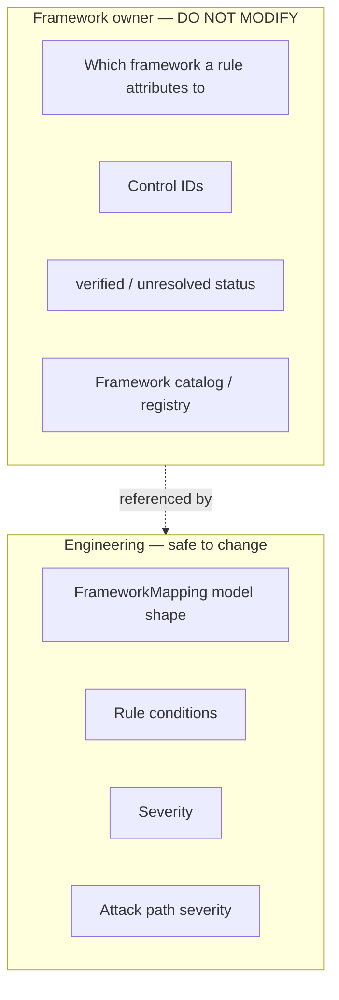

# Phase 10 — Compliance Frameworks

**Level 2.** Estimated 45 minutes.

> **This phase is largely someone else's area.** Read it once to
> understand the boundary and to avoid stepping on it. Full audit:
> [`docs/architecture/framework-integration-status.md`](../../architecture/framework-integration-status.md)
>
> **No framework reference, control ID or mapping was invented or changed
> while writing this guide.**

---

## A. What problem does this solve?

Answering *"which compliance control does this finding relate to?"* —
without fabricating the answer.

## B. Why it is delicate

An unverified control mapping is the **fastest way to lose credibility
with an auditor**. If ComplianceIQ claims a rule satisfies CIS AWS 2.1.5
and it does not, everything else the tool says becomes suspect.

The codebase's answer is a default that fails safe.

---

## C. Two mechanisms — and a third that is orphaned

### 1. Primary attribution — every rule has exactly one

```yaml
framework: iso_27001
control_id: A.8.24
```

Required by `Rule`. Present on **all 68 rules**.

### 2. Secondary mappings — optional, many per rule

```python
FrameworkMapping(framework: str, control: str, status: str = "unresolved")
```

`status` ∈ {`verified`, `unresolved`}, **defaulting to `unresolved`**.

The model's own docstring states why: *fabricating an unverified control
mapping is the single fastest way to lose credibility with an actual
auditor.* Defaulting to unresolved makes the **safe state the lazy
state** — you must deliberately open the benchmark to claim `verified`.

### 3. `ComplianceFramework` — defined and unused

`domain/compliance/models.py` defines `ComplianceFramework`,
`ControlMapping` and `ComplianceAssessment`. **Nothing outside that module
and its own tests references them.** The rule catalog uses plain strings.

That is a real structural gap — and it belongs to the framework owner.

---

## D. What actually exists — verified by parsing the catalog

| Framework | Role | Rules |
|---|---|---|
| `iso_27001` | **Primary on all 68** | 68 |
| `cis_aws` | Secondary | 17 |
| `cis_azure` | Secondary | 9 |
| `nist_800_53` | Secondary | 1 |

**There is no framework registry.** These four identifiers are
conventions carried in YAML strings, with nothing validating them. A typo
(`iso27001`) would load without complaint.

### ISO controls — 7 distinct, across 68 rules

| Control | Rules |
|---|---|
| `A.8.20` | 23 |
| `A.8.24` | 18 |
| `A.5.17` | 8 |
| `A.8.13` | 7 |
| `A.8.15` | 7 |
| `A.5.15` | 4 |
| `A.8.5` | 1 |

**Two controls carry 60% of the catalog.** Whether that reflects ISO's
actual structure or an under-differentiated mapping is a framework
question this audit cannot answer.

### Mapping status — 27 mappings, 11 verified

| Framework | verified | unresolved (defaulted) |
|---|---|---|
| `cis_aws` | 11 | 6 |
| `cis_azure` | **0** | 9 |
| `nist_800_53` | 0 | 1 |
| **Total** | **11** | **16** |

**All 16 unresolved mappings omit `status` entirely** and inherit the
default. None was explicitly marked unresolved — the system is behaving
exactly as designed.

⚠️ **Every `cis_azure` mapping is unverified.** Azure framework
attribution currently rests on no checked source.

---

## E. Ownership boundary



| Area | Owner | You |
|---|---|---|
| Framework a rule attributes to | Framework owner | Do not touch |
| Control IDs | Framework owner | Do not invent, rename or reassign |
| `status` → `verified` | Framework owner | Do not promote |
| `FrameworkMapping` shape | Domain | Unchanged |
| Attack path severity | **Engineering** | Uses `Severity`, not controls |

### Attack paths deliberately carry no framework mapping

An attack path is a **composite graph observation**, not a control
assessment. Attributing one to an ISO control would be inventing a mapping
— precisely what the `"unresolved"` default exists to prevent.

If a framework owner later decides attack paths map to a control, that is
their call to make **with published text in hand**.

---

## F. Classification of the current state

```
✅ ALREADY IMPLEMENTED
   - Primary attribution on all 68 rules
   - FrameworkMapping with anti-fabrication default
   - 11 verified cis_aws mappings
   - ComplianceScore, independent of this catalog

⚠️ PARTIALLY IMPLEMENTED
   - Secondary mappings: 11 of 27 verified
   - ISO coverage: 7 controls, heavily concentrated

❌ MISSING
   - Framework registry / validation of identifiers
   - Use of ComplianceFramework / ControlMapping types
   - Any cis_azure verification
   - Framework-level coverage reporting

👤 OWNED BY ANOTHER COMPONENT/PERSON
   - Control ID selection and verification
   - Benchmark text reconciliation
```

## G. If you became responsible for the catalog

1. **Build a registry** — a typed enum or manifest of valid framework
   identifiers, validated at rule load. Today a typo silently creates a
   new framework.
2. **Adopt `ComplianceFramework`/`ControlMapping`** in the catalog instead
   of bare strings.
3. **Resolve the 16 unresolved mappings** against published benchmark
   text — starting with all 9 `cis_azure`.
4. **Review the ISO concentration** — 41 rules on two controls.
5. **Add framework coverage reporting** — "which CIS AWS controls does
   ComplianceIQ actually assess?" is a question a buyer will ask.

**None of that is safe to do casually**, because changing a control ID
changes what a customer's audit report claims.

## H. `ComplianceScore` is independent

`domain/compliance/scoring.py` computes posture from findings, keyed by
framework **string**. Two properties worth knowing:

- It **excludes INDETERMINATE** from the score and reports `coverage`
  separately — so "we could not check" never inflates or deflates a
  compliance percentage.
- It returns `None` when nothing determinate exists, rather than 0% or
  100%.

An unresolved mapping does **not** corrupt it.

## I. Tests

`tests/unit/domain/test_compliance.py`,
`tests/unit/domain/test_rule_metadata.py` — including that an omitted
`status` defaults to `unresolved`.

---

## What I should know now

1. Name the four framework identifiers and their roles.
2. State the verified/unresolved split (11/27) and why the default is
   right.
3. Explain why `ComplianceFramework` being unused is a gap, not a bug.
4. Explain why attack paths carry no framework mapping.
5. State what you must not change.
6. Explain why `ComplianceScore` excludes INDETERMINATE.

---

## Self-test

1. A rule adds `framework: iso27001` (typo). What happens at load, at
   evaluation, and in the report?
2. Why default to `unresolved` rather than `verified`?
3. Should an attack path get an ISO control ID? Argue both sides, then
   decide.
4. All 9 `cis_azure` mappings are unverified. What is the customer-visible
   risk, and what would resolving them require?
5. `ComplianceScore` excludes INDETERMINATE from the numerator *and*
   denominator. Why not count them as failures?
6. Two ISO controls carry 41 of 68 rules. When is that a problem?

Answers: [answers.md](answers.md)
