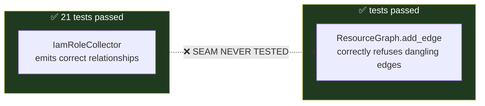

# Phase 11 — Testing

**Level 4 — Debug.** Estimated 2 hours.

> The most valuable lesson in this repository is here. If you read one
> section, read §C.

---

## A. What problem does this solve?

Proving the platform is correct — and, more importantly, learning **which
kinds of proof actually work**.

## B. The suite, in numbers

Verified by execution:

```
1408 collected · 1348 passed · 60 skipped · 0 failed
```

The 60 skipped are the AWS/Azure integration suites — opt-in, requiring
real cloud credentials. **No collector has been run against a live API.**

```
tests/
├── unit/domain/          ~19 files   invariants, three-valued logic, graph, scoring
├── unit/application/     ~16 files   use cases, pipeline, attack paths
├── unit/infrastructure/  ~23 files   collectors, resilience, policy analysis, persistence security
├── unit/contracts/                   the AI Service boundary
├── api/                  3 files     contracts, security, ARCHITECTURE
├── conformance/                      rule catalog against declared scenarios
└── integration/
    ├── persistence/      3 files     REAL PostgreSQL (74 tests)
    ├── aws/                          opt-in, real AWS (skipped)
    └── azure/                        opt-in, real Azure (skipped)
```

---

## C. The seam problem — the lesson

> **A component can pass every one of its unit tests and still be broken
> when integrated.**

This repository has **three** documented instances. They are not
hypothetical.

### Incident 1 — the IAM role graph blocker



Every collector test asserted on `resource.relationships` directly. **None
built a graph.** Both components were correct. Their interaction aborted
every scan containing an IAM role — which is every real scan.

### Incident 2 — the graph never reached the rule engine

`ScanCloudAccount` built the graph and did not pass it to
`EvaluateRules`. Every cross-resource rule silently returned
`NOT_MATCHED`.

Why tests missed it: the tests exercising `ScanCloudAccount` used a **fake
catalog with no cross-resource rules**, and the tests using the real
catalog **bypassed `ScanCloudAccount` entirely**. Neither combination hit
the path.

### Incident 3 — the Key Vault rule fired on storage accounts

Attribute names are not globally unique. The rule's own unit test passed —
it tested the *condition logic*, which was correct. Only the conformance
framework, running the whole catalog against declared scenarios, produced
an `UNEXPECTED_FINDING`.

### The pattern

| Incident | Both parts correct? | What was missing |
|---|---|---|
| Graph blocker | ✅ | A test that built a graph from collector output |
| Graph not threaded | ✅ | A test using the real pipeline **and** the real catalog |
| Wrong resource type | ✅ | A test running the whole catalog against a known estate |

**Unit tests prove components. Only integration proves systems.**

---

## D. How to read the tests

### Test names are documentation

```python
def test_unknown_exposure_never_becomes_a_path(self) -> None:
def test_a_completely_private_estate_produces_nothing(self) -> None:
def test_no_workload_to_identity_path_is_invented(self) -> None:
```

Read the names in a file first. They tell you what the code *promises*.

### Docstrings carry the reasoning

Many tests explain **why** they exist, including which defect they pin:

```python
def test_an_identity_is_not_described_as_holding_data(self) -> None:
    """Regression: a real false positive, found by running the code.
    ...
    A true risk stated in a false sentence is still a false positive.
    """
```

### Negative tests outnumber positive ones — deliberately

In `test_attack_path_analysis.py`: **19 of 40** assert what is *not*
reported.

> A missed low-confidence path costs a customer one backlog item. A
> fabricated path sends a security team after something that does not
> exist, with a confident severity attached, and teaches them to distrust
> every other finding.

---

## E. The important test files

### Domain

| File | Tests | Guards |
|---|---|---|
| `test_graph_queries.py` | 62 | **Index/scan agreement**, determinism, depth bounds |
| `test_rules_dsl_v2.py` | 53 | Operators, quantifiers, temporal, relationships |
| `test_rules_absence.py` | 30 | `no_relationship` + the coverage guard |
| `test_graph_expansion.py` | 28 | Provenance, external nodes, fingerprint |
| `test_rules.py` | 27 | The original evaluator |
| `test_graph.py` | 20 | Core graph invariants |
| `test_attack_paths.py` | 14 | Aggregate invariants |
| `test_unknown.py` | — | The sentinel raises on `bool()` |

### Application

| File | Tests | Guards |
|---|---|---|
| `test_attack_path_analysis.py` | 40 | Scenarios, negatives, safety, determinism |
| `test_attack_path_pipeline_integration.py` | 12 | **The real pipeline** |
| `test_scan_pipeline_regressions.py` | — | **The seam defects** |
| `test_finding_context.py` | 17 | Trace → context; what is *not* named |

### Architecture

`tests/api/test_architecture.py` — **enforces the dependency rule by AST
inspection**. `domain/` importing `boto3` fails here, not in review.

### Persistence

`tests/integration/persistence/` — **74 tests against real PostgreSQL**.
Includes the schema-parity test that compares Alembic migrations to the
ORM models via `compare_metadata`. That test caught migration `0003`
declaring a `server_default` the model did not.

---

## F. Test categories, and what each can prove

| Category | Proves | Cannot prove |
|---|---|---|
| **Unit (domain)** | Invariants, logic, determinism | That anything calls it |
| **Unit (collector)** | Normalization shape | That output builds a graph |
| **Use case** | Orchestration | That the real catalog works |
| **Pipeline integration** | Stages connect | That real cloud APIs behave as modelled |
| **Conformance** | Rules fire on intended resources | Real-world coverage |
| **Real-DB** | Round trips, migrations, constraints | Performance at scale |
| **Cloud integration** | Real API shapes | *(skipped — never run)* |

---

## G. Three techniques worth stealing

### 1. Assert against an independent derivation, not a hardcoded value

```python
def test_outgoing_index_matches_a_linear_scan_for_every_node(self, exposure_graph):
    for n in exposure_graph.nodes:
        scanned = sorted((e for e in exposure_graph.edges if e.source_id == n.resource_id), key=...)
        assert list(edges_of(exposure_graph, n.resource_id)) == scanned
```

Tests the **invariant** (index agrees with the authoritative collection),
not the test author's model. Survives fixture changes.

### 2. Reverse the input to catch order-dependence

```python
def test_resource_input_order_does_not_change_the_result(self):
    forward  = [(str(p.id), p.risk_score) for p in analyze(estate())]
    backward = [(str(p.id), p.risk_score) for p in analyze(list(reversed(estate())))]
    assert forward == backward
```

Cheap, brutal, catches accidental `set`/`dict` iteration leakage.

### 3. Pin the hazard you chose not to fix

```python
def test_a_data_resource_returns_its_readers_which_is_the_caller_hazard(self):
    """Pins the documented caller contract, deliberately."""
```

When a limitation is a deliberate decision, test it. Otherwise someone
"fixes" it later and breaks the reasoning.

---

## H. One test was changed in the attack path work

`test_returns_a_scan_result_with_all_pipeline_outputs_populated` asserted
`result.attack_paths == ()`.

That encoded the **placeholder**, not any intended behaviour — its fixture
is a `public: True` bucket, a genuinely internet-readable store. It now
asserts real discovery plus risk enrichment. **One assertion became four,
with an inline comment explaining why.**

That is the distinction to be able to defend: **strengthened, not
weakened.** No test was deleted; none was softened to make code pass.

---

## I. Running them

```bash
pytest                       # everything
pytest tests/unit -q         # fast, no external deps
pytest tests/integration/persistence -q      # needs PostgreSQL
ruff check .
mypy domain application infrastructure presentation contracts
```

The persistence suite **skips cleanly** when PostgreSQL is unreachable —
it does not fail. Watch the skip count: 60 is the expected baseline
(AWS + Azure). If you see 131, PostgreSQL is not running.

---

## J. Limitations

1. **No live cloud validation.** All collector tests use fakes modelled on
   documented response shapes.
2. **No load testing** beyond the synthetic in-process graph benchmark.
3. **No mutation testing** — nothing measures whether the tests would
   *catch* an introduced bug.
4. **No property-based testing.** The three-valued evaluator is an obvious
   candidate.
5. ⚠️ **No test asserts that every `RelationshipType` appears in exactly
   one of the traversable/informational sets.** Forgetting one means
   attack paths silently never route through it.

---

## What I should know now

1. State the suite size and what the 60 skips mean.
2. Explain the seam problem and name all three incidents.
3. Explain why negative tests outnumber positive ones in attack paths.
4. Explain index/scan agreement testing.
5. Explain what `test_architecture.py` enforces and how.
6. Explain the one changed test and why it is strengthened.
7. Name three things the suite cannot prove.

---

## Self-test

1. A collector test passes and the scan crashes. What kind of test was
   missing, and write its name.
2. Why do 19 of 40 attack path tests assert absence?
3. Why compare an index to a linear scan rather than an expected list?
4. Someone adds `routes_to` to `RelationshipType`. Which test *should*
   fail, and does it exist today?
5. `pytest` reports 131 skipped instead of 60. Diagnose it.
6. Write a test that would have caught the "graph never reached
   `EvaluateRules`" defect. What must it *not* use?
7. When is changing an existing test legitimate, and how would you defend
   it in review?
8. The suite is green. Name three defect classes it would still miss.

Answers: [answers.md](answers.md)
