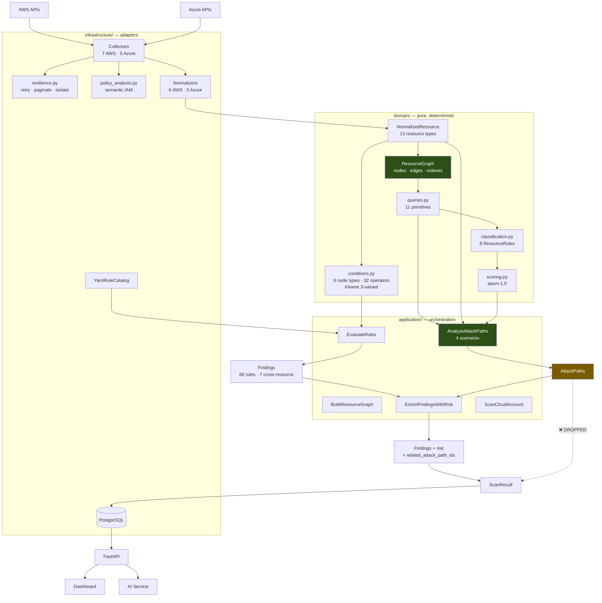
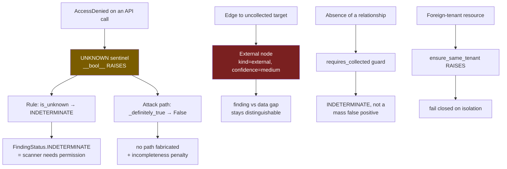
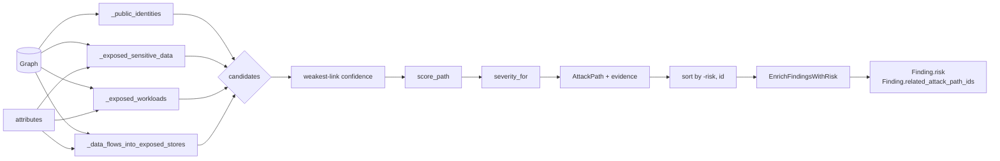

# Phase 12 — The Complete Architecture

**Level 5 — Design.** Estimated 1 hour.

Everything, in one place.

---

## 1. The complete system



Note the dotted line: **`AttackPath` objects do not reach PostgreSQL.**
Their *risk* does, via the findings.

---

## 2. Data flow — one resource, end to end

Follow a single S3 bucket:

```
1. COLLECT    s3:ListBuckets, GetBucketAcl, GetBucketPolicy, …
              → raw dicts       [infrastructure/cloud/aws/resource_collectors/s3.py]

2. NORMALIZE  normalize_s3_bucket(...)
              → NormalizedResource(resource_type="s3_bucket",
                                   attributes={"public": True, ...},
                                   relationships=())        ← no edges!

3. GRAPH      BuildResourceGraph
              → GraphNode(kind="collected", confidence="high")
                (CloudTrail's ACCESSES edge arrives from the trail's side)

4. RULES      s3-bucket-public: {field: public, operator: equals, value: true}
              → MATCHED

5. FINDING    Finding(status=FAIL, severity=CRITICAL,
                      logical_finding_id="acme:111…:acme-reports:s3-bucket-public")

6. QUERIES    edges_of, find_paths                          [domain/graph/queries.py]

7. PATHS      internet_to_sensitive_data          (55.0, HIGH)
              sensitive_data_flow_to_exposed_store (60.0, HIGH)

8. RISK       derive_factors → EnrichRisk (CRSF-1.1)
              → Finding.risk, Finding.related_attack_path_ids

9. PERSIST    finding_snapshots row (risk + path ids survive;
              the AttackPath objects do not)

10. API       GET /findings
```

---

## 3. Security flow — where correctness is defended



**The unifying principle:** *loud failure beats quiet wrong answers.*

| Kind of problem | Response |
|---|---|
| Data gap | `INDETERMINATE` / reduced confidence |
| Wiring bug | **Raise** |
| Rule-authoring bug | **Raise** |
| Security isolation breach | **Raise** |
| Malformed single item | Skip, isolated |

The one place this is knowingly relaxed: attack path analysis without
`resources` under-reports silently. That is backward compatibility, and it
is covered by a test that asserts the wiring is present.

---

## 4. Attack path flow



---

## 5. Component responsibilities

| Component | Owns | Must never |
|---|---|---|
| **Collectors** | Cloud API calls, `UNKNOWN` on denial | Decide what is a violation |
| **Normalizers** | Raw → `NormalizedResource` | Interpret security policy |
| **`ResourceGraph`** | Tenant isolation, referential integrity, indexes | Carry attributes |
| **`BuildResourceGraph`** | Assembly, external nodes, rejection reporting | Duplicate domain invariants |
| **`conditions.py`** | Three-valued evaluation | Read a clock; do I/O |
| **Rule catalog** | The 68 checks | Reference uncollected attributes |
| **`EvaluateRules`** | Rule → Finding | Reimplement evaluation |
| **`queries.py`** | Index-backed, sorted traversal | Become a general graph library |
| **`classification.py`** | Security semantics of nodes/edges | Branch on provider |
| **`scoring.py`** | The weights | Claim authority |
| **`AnalyzeAttackPaths`** | Discovery | Invent an edge |
| **`EnrichFindingsWithRisk`** | Joining findings to paths | Reimplement CRSF-1.1 |
| **`ScanCloudAccount`** | Orchestration | Become a second domain |

---

## 6. The honest state

### Works, end to end

```
✅ Collect (12 of 26 services) → normalize → graph → 68 rules → findings
✅ 7 cross-resource rules traversing the graph
✅ Three-valued logic, source to report
✅ 11 index-backed graph queries; measured linear scaling
✅ 4 attack path scenarios, scored, severity-mapped, explained
✅ Risk enrichment into findings — zero schema change
✅ Real pipeline integration, deterministic end to end
✅ PostgreSQL persistence, 3 migrations, schema-parity tested
✅ REST API with JWT/JWKS
✅ 1348 tests · ruff clean · mypy clean (175 files)
```

### Does not work, or does not exist

```
❌ 14 of 26 target services have no collector
❌ 3 of 8 relationship types never emitted (the network topology ones)
❌ No workload→identity edge → the textbook attack chain is unevidenced
❌ No identity→data edge → Scenario C's second half unevidenced
❌ Attack paths are NOT persisted and have NO API surface
❌ blocked is never set True by any collector
❌ AttackTechnique is always empty
❌ 11 of 12 collectors lack the resilience layer
❌ 16 of 27 framework mappings unresolved (100% of cis_azure)
❌ NO collector has ever run against a live cloud API
❌ Finding.environment never populated → every risk score assumes it
```

---

## 7. The five ideas worth carrying to another system

1. **Three-valued logic at every layer.** "We could not check" is not a
   pass and not a violation. Make it a first-class value and make the
   wrong conversion *impossible to write* — `UNKNOWN.__bool__` raises.

2. **Connectivity is not reachability.** In any graph-based analysis,
   classify edges explicitly by whether they can be traversed. Defaulting
   to "traversable" turns a graph into a false-positive generator.

3. **Absence needs a coverage guard.** "No X observed" and "no X exists"
   are different claims. Without a guard, a permissions failure becomes an
   estate-wide violation.

4. **Explainable beats accurate-sounding.** A score you can defend line by
   line is worth more than a confident number you cannot. Version the
   model; carry the breakdown.

5. **Test the seams.** Three separate incidents here had every component
   correct and the composition broken. Unit tests prove components; only
   integration proves systems.

---

## What I should know now

You should now be able to answer the guide's opening question end to end,
and additionally explain:

1. Why each layer exists and what it may not do.
2. Where `UNKNOWN` enters, how it propagates, and how it surfaces.
3. How the graph turns per-resource facts into composite findings.
4. Why attack paths need both the graph and the resources.
5. What the risk score means — and what it does not claim.
6. Which capabilities are implemented, supported, unevidenced, or future.
7. What you would build next and why (see `next-work.md`).

---

## Self-test — the capstone

1. **The full trace.** An S3 bucket with `public: true` that CloudTrail
   delivers logs into. Walk it from `s3:ListBuckets` to the API response,
   naming every file, the findings produced, the attack paths, the scores,
   and the final `Finding.risk`.

2. A customer asks: *"Why is this finding risk 62 when the identical
   finding on another bucket is 41?"* Answer using the actual mechanism.

3. A colleague proposes reporting an attack path from a public EC2
   instance to an S3 bucket, "because the instance has a role and roles
   usually have S3 access." Give three separate reasons to refuse.

4. Design the extension that unlocks the textbook chain. Name the API
   call, the edge, the files, the tests to add, and the test to delete.

5. Explain to a non-engineer why a CSPM must distinguish "compliant" from
   "could not check", using one concrete AWS example.

6. You must add support for GCP. Which layers change and which do not?

7. Attack paths are computed and discarded at persistence. Design the fix:
   table, mapper, migration, API — and say what would break if you
   embedded paths in findings instead of referencing them.

Answers: [answers.md](answers.md)
